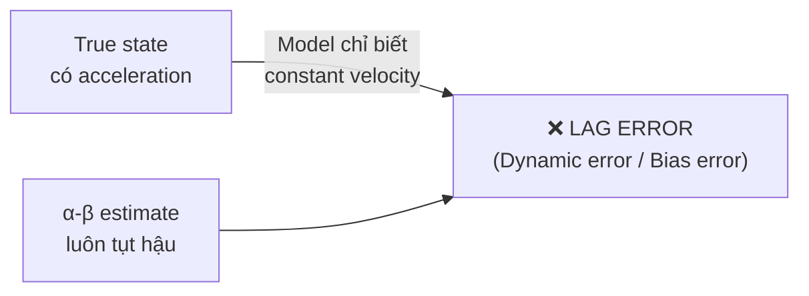

# Kalman Filter — Study Note & Drone Integration Guide
**Project Windify | Group 21 | Author: Hung Vo**  
**Nguồn chính:** [kalmanfilter.net/alphabeta.html](https://kalmanfilter.net/alphabeta.html) · [gregorygundersen.com/blog/2020/04/11/moments/](https://gregorygundersen.com/blog/2020/04/11/moments/)

---

## Icon Legend

| Icon | Ý nghĩa |
|---|---|
| 🕳️ | Missing — chưa có, cần viết mới |
| ⚙️ | Incomplete — có rồi nhưng chưa đủ dùng |
| ❓ | Defense risk — điểm yếu nếu bị hỏi |
| 🐛 | Bug — sai hoặc misleading trong code/comment |
| 📐 | Numerical/Visual — thiếu ví dụ số hoặc diagram |
| 🧩 | Theory↔Code — chưa link lý thuyết vào code thực tế |
| ✅ | Done |

---

## Mục lục

1. [Tại sao cần Kalman Filter?](#1-tại-sao-cần-kalman-filter)
2. [Hai bức tranh: Simple vs Real World](#2-hai-bức-tranh-simple-vs-real-world)
3. [Con đường tiến hóa: từ α đến Kalman](#3-con-đường-tiến-hóa-từ-α-đến-kalman)
4. [Example 1 — Cân vàng (α filter, static system)](#4-example-1--cân-vàng-α-filter-static-system)
5. [Example 2 — Radar constant velocity (α-β filter)](#5-example-2--radar-constant-velocity-α-β-filter)
6. [Example 3 — Radar accelerating (lag error xuất hiện)](#6-example-3--radar-accelerating-lag-error-xuất-hiện)
7. [Example 4 — α-β-γ filter (giải quyết lag error)](#7-example-4--α-β-γ-filter-giải-quyết-lag-error)
8. [KF 1D — Gain tính động (bước nhảy quan trọng nhất)](#8-kf-1d--gain-tính-động-bước-nhảy-quan-trọng-nhất)
9. [KF 1D with Process Noise Q](#9-kf-1d-with-process-noise-q)
10. [Multivariate Kalman Filter](#10-multivariate-kalman-filter)
11. [Limitations & Assumptions](#11-limitations--assumptions)
12. [Drone Integration — Project Windify](#12-drone-integration--project-windify)

---

## 1. Tại sao cần Kalman Filter?

Mọi cảm biến đều có **noise** — kết quả đo không bao giờ là giá trị thật tuyệt đối.  
Mọi model động học đều có **uncertainty** — thế giới thực không tuân theo phương trình đơn giản 100%.

Kalman Filter là thuật toán ước lượng trạng thái (state estimation) giải quyết đồng thời cả hai vấn đề trên bằng cách **kết hợp tối ưu** giữa prediction từ model và measurement từ cảm biến.

> **Analogy từ Statistical Moments** *(gregorygundersen.com)*:  
> Variance (moment bậc 2) đo độ "trải rộng" của phân phối — chính là thứ KF dùng để quyết định nên tin measurement hay prediction nhiều hơn. Sensor có variance nhỏ → tin measurement. Model có variance nhỏ → tin prediction.

---

## 2. Hai bức tranh: Simple vs Real World

![Simple vs Real World KF](data:image/svg+xml;base64,PHN2ZyB3aWR0aD0iNzAwIiBoZWlnaHQ9IjM0MCIgdmlld0JveD0iMCAwIDcwMCAzNDAiIHhtbG5zPSJodHRwOi8vd3d3LnczLm9yZy8yMDAwL3N2ZyIgZm9udC1mYW1pbHk9InVpLXNhbnMtc2VyaWYsIHN5c3RlbS11aSwgc2Fucy1zZXJpZiI+CiAgPGRlZnM+CiAgICA8bWFya2VyIGlkPSJhcnJvdyIgdmlld0JveD0iMCAwIDEwIDEwIiByZWZYPSI4IiByZWZZPSI1IiBtYXJrZXJXaWR0aD0iNiIgbWFya2VySGVpZ2h0PSI2IiBvcmllbnQ9ImF1dG8tc3RhcnQtcmV2ZXJzZSI+CiAgICAgIDxwYXRoIGQ9Ik0yIDFMOCA1TDIgOSIgZmlsbD0ibm9uZSIgc3Ryb2tlPSIjODg4NzgwIiBzdHJva2Utd2lkdGg9IjEuNSIgc3Ryb2tlLWxpbmVjYXA9InJvdW5kIiBzdHJva2UtbGluZWpvaW49InJvdW5kIi8+CiAgICA8L21hcmtlcj4KICA8L2RlZnM+CiAgPHJlY3Qgd2lkdGg9IjcwMCIgaGVpZ2h0PSIzNDAiIGZpbGw9IiNGQUZBRjkiIHJ4PSIxMiIvPgoKICA8IS0tIOKUgOKUgCBTSU1QTEUgTU9ERUwgKHRvcCBoYWxmKSDilIDilIAgLS0+CiAgPHJlY3QgeD0iMjAiIHk9IjE2IiB3aWR0aD0iNjYwIiBoZWlnaHQ9IjEzMCIgcng9IjEwIiBmaWxsPSIjRTZGMUZCIiBzdHJva2U9IiM4NUI3RUIiIHN0cm9rZS13aWR0aD0iMSIgc3Ryb2tlLWRhc2hhcnJheT0iNSAzIi8+CiAgPHRleHQgeD0iMzYiIHk9IjM2IiBmb250LXNpemU9IjEyIiBmb250LXdlaWdodD0iNjAwIiBmaWxsPSIjMTg1RkE1Ij7wn5S1ICBTaW1wbGUgTW9kZWw8L3RleHQ+CgogIDwhLS0gTWVhc3VyZW1lbnQgLS0+CiAgPHJlY3QgeD0iNDAiIHk9IjUwIiB3aWR0aD0iMTMwIiBoZWlnaHQ9IjQwIiByeD0iNiIgZmlsbD0iI0U2RjFGQiIgc3Ryb2tlPSIjMzc4QUREIiBzdHJva2Utd2lkdGg9IjEiLz4KICA8dGV4dCB4PSIxMDUiIHk9Ijc0IiB0ZXh0LWFuY2hvcj0ibWlkZGxlIiBmb250LXNpemU9IjEyIiBmaWxsPSIjMEM0NDdDIj5NZWFzdXJlbWVudDwvdGV4dD4KCiAgPCEtLSBEeW5hbWljIE1vZGVsIC0tPgogIDxyZWN0IHg9IjQwIiB5PSIxMDgiIHdpZHRoPSIxMzAiIGhlaWdodD0iMjgiIHJ4PSI2IiBmaWxsPSIjRTZGMUZCIiBzdHJva2U9IiMzNzhBREQiIHN0cm9rZS13aWR0aD0iMSIvPgogIDx0ZXh0IHg9IjEwNSIgeT0iMTI2IiB0ZXh0LWFuY2hvcj0ibWlkZGxlIiBmb250LXNpemU9IjExIiBmaWxsPSIjMEM0NDdDIj5EeW5hbWljIE1vZGVsPC90ZXh0PgoKICA8IS0tIEFsZ29yaXRobSAtLT4KICA8cmVjdCB4PSIyNjAiIHk9IjYyIiB3aWR0aD0iMTc1IiBoZWlnaHQ9IjU0IiByeD0iNiIgZmlsbD0iI0I1RDRGNCIgc3Ryb2tlPSIjMzc4QUREIiBzdHJva2Utd2lkdGg9IjEiLz4KICA8dGV4dCB4PSIzNDciIHk9Ijg0IiB0ZXh0LWFuY2hvcj0ibWlkZGxlIiBmb250LXNpemU9IjEyIiBmb250LXdlaWdodD0iNjAwIiBmaWxsPSIjMDQyQzUzIj5TdGF0ZSBFc3RpbWF0aW9uPC90ZXh0PgogIDx0ZXh0IHg9IjM0NyIgeT0iMTAyIiB0ZXh0LWFuY2hvcj0ibWlkZGxlIiBmb250LXNpemU9IjEyIiBmb250LXdlaWdodD0iNjAwIiBmaWxsPSIjMDQyQzUzIj5BbGdvcml0aG08L3RleHQ+CgogIDwhLS0gQ3VycmVudCBTdGF0ZSBFc3RpbWF0ZSAtLT4KICA8cmVjdCB4PSI1MzAiIHk9IjUwIiB3aWR0aD0iMTQ1IiBoZWlnaHQ9IjI4IiByeD0iNiIgZmlsbD0iI0U2RjFGQiIgc3Ryb2tlPSIjMzc4QUREIiBzdHJva2Utd2lkdGg9IjEiLz4KICA8dGV4dCB4PSI2MDIiIHk9IjY4IiB0ZXh0LWFuY2hvcj0ibWlkZGxlIiBmb250LXNpemU9IjExIiBmaWxsPSIjMEM0NDdDIj5DdXJyZW50IFN0YXRlIEVzdGltYXRlPC90ZXh0PgoKICA8IS0tIEZ1dHVyZSBTdGF0ZSBQcmVkaWN0aW9uIC0tPgogIDxyZWN0IHg9IjUzMCIgeT0iOTYiIHdpZHRoPSIxNDUiIGhlaWdodD0iMjgiIHJ4PSI2IiBmaWxsPSIjRTZGMUZCIiBzdHJva2U9IiMzNzhBREQiIHN0cm9rZS13aWR0aD0iMSIvPgogIDx0ZXh0IHg9IjYwMiIgeT0iMTE0IiB0ZXh0LWFuY2hvcj0ibWlkZGxlIiBmb250LXNpemU9IjExIiBmaWxsPSIjMEM0NDdDIj5GdXR1cmUgU3RhdGUgUHJlZGljdGlvbjwvdGV4dD4KCiAgPCEtLSBBcnJvd3Mgc2ltcGxlIC0tPgogIDxsaW5lIHgxPSIxNzAiIHkxPSI3MCIgeDI9IjI1OCIgeTI9IjgwIiBzdHJva2U9IiMzNzhBREQiIHN0cm9rZS13aWR0aD0iMS4yIiBtYXJrZXItZW5kPSJ1cmwoI2Fycm93KSIvPgogIDxsaW5lIHgxPSIxNzAiIHkxPSIxMjIiIHgyPSIyNTgiIHkyPSIxMDAiIHN0cm9rZT0iIzM3OEFERCIgc3Ryb2tlLXdpZHRoPSIxLjIiIG1hcmtlci1lbmQ9InVybCgjYXJyb3cpIi8+CiAgPGxpbmUgeDE9IjQzNSIgeTE9Ijc4IiB4Mj0iNTI4IiB5Mj0iNjQiIHN0cm9rZT0iIzM3OEFERCIgc3Ryb2tlLXdpZHRoPSIxLjIiIG1hcmtlci1lbmQ9InVybCgjYXJyb3cpIi8+CiAgPGxpbmUgeDE9IjQzNSIgeTE9Ijk2IiB4Mj0iNTI4IiB5Mj0iMTEwIiBzdHJva2U9IiMzNzhBREQiIHN0cm9rZS13aWR0aD0iMS4yIiBtYXJrZXItZW5kPSJ1cmwoI2Fycm93KSIvPgoKICA8IS0tIOKUgOKUgCBSRUFMIFdPUkxEIChib3R0b20gaGFsZikg4pSA4pSAIC0tPgogIDxyZWN0IHg9IjIwIiB5PSIxNjUiIHdpZHRoPSI2NjAiIGhlaWdodD0iMTYwIiByeD0iMTAiIGZpbGw9IiNGQ0VCRUIiIHN0cm9rZT0iI0YwOTU5NSIgc3Ryb2tlLXdpZHRoPSIxIiBzdHJva2UtZGFzaGFycmF5PSI1IDMiLz4KICA8dGV4dCB4PSIzNiIgeT0iMTg0IiBmb250LXNpemU9IjEyIiBmb250LXdlaWdodD0iNjAwIiBmaWxsPSIjQTMyRDJEIj7wn5S0ICBSZWFsIFdvcmxkIENvbXBsZXg8L3RleHQ+CgogIDwhLS0gQWN0dWFsIFN0YXRlIC0tPgogIDxyZWN0IHg9IjQwIiB5PSIxOTIiIHdpZHRoPSIxMTAiIGhlaWdodD0iMzIiIHJ4PSI2IiBmaWxsPSIjRkNFQkVCIiBzdHJva2U9IiNFMjRCNEEiIHN0cm9rZS13aWR0aD0iMSIvPgogIDx0ZXh0IHg9Ijk1IiB5PSIyMTIiIHRleHQtYW5jaG9yPSJtaWRkbGUiIGZvbnQtc2l6ZT0iMTEiIGZpbGw9IiM3OTFGMUYiPkFjdHVhbCBTdGF0ZTwvdGV4dD4KCiAgPCEtLSBNZWFzdXJlbWVudCBOb2lzZSAtLT4KICA8cmVjdCB4PSI0MCIgeT0iMjQyIiB3aWR0aD0iMTEwIiBoZWlnaHQ9IjMyIiByeD0iNiIgZmlsbD0iI0ZDRUJFQiIgc3Ryb2tlPSIjRTI0QjRBIiBzdHJva2Utd2lkdGg9IjEiLz4KICA8dGV4dCB4PSI5NSIgeT0iMjYyIiB0ZXh0LWFuY2hvcj0ibWlkZGxlIiBmb250LXNpemU9IjExIiBmaWxsPSIjNzkxRjFGIj5NZWFzdXJlbWVudCBOb2lzZTwvdGV4dD4KCiAgPCEtLSArIGNpcmNsZSAtLT4KICA8Y2lyY2xlIGN4PSIyMjAiIGN5PSIyMjUiIHI9IjE0IiBmaWxsPSIjRkNFQkVCIiBzdHJva2U9IiNFMjRCNEEiIHN0cm9rZS13aWR0aD0iMS4yIi8+CiAgPHRleHQgeD0iMjIwIiB5PSIyMzAiIHRleHQtYW5jaG9yPSJtaWRkbGUiIGZvbnQtc2l6ZT0iMTMiIGZvbnQtd2VpZ2h0PSI2MDAiIGZpbGw9IiNBMzJEMkQiPis8L3RleHQ+CgogIDwhLS0gUHJvY2VzcyBOb2lzZSAtLT4KICA8cmVjdCB4PSI0MCIgeT0iMjkwIiB3aWR0aD0iMTEwIiBoZWlnaHQ9IjI4IiByeD0iNiIgZmlsbD0iI0ZDRUJFQiIgc3Ryb2tlPSIjRTI0QjRBIiBzdHJva2Utd2lkdGg9IjEiLz4KICA8dGV4dCB4PSI5NSIgeT0iMzA5IiB0ZXh0LWFuY2hvcj0ibWlkZGxlIiBmb250LXNpemU9IjExIiBmaWxsPSIjNzkxRjFGIj5Qcm9jZXNzIE5vaXNlPC90ZXh0PgoKICA8IS0tIEFsZ29yaXRobSByZWFsIC0tPgogIDxyZWN0IHg9IjI3OCIgeT0iMTk1IiB3aWR0aD0iMTU1IiBoZWlnaHQ9IjEwMCIgcng9IjYiIGZpbGw9IiNGN0MxQzEiIHN0cm9rZT0iI0UyNEI0QSIgc3Ryb2tlLXdpZHRoPSIxIi8+CiAgPHRleHQgeD0iMzU1IiB5PSIyMTgiIHRleHQtYW5jaG9yPSJtaWRkbGUiIGZvbnQtc2l6ZT0iMTIiIGZvbnQtd2VpZ2h0PSI2MDAiIGZpbGw9IiM1MDEzMTMiPlN0YXRlIEVzdGltYXRpb248L3RleHQ+CiAgPHRleHQgeD0iMzU1IiB5PSIyMzUiIHRleHQtYW5jaG9yPSJtaWRkbGUiIGZvbnQtc2l6ZT0iMTIiIGZvbnQtd2VpZ2h0PSI2MDAiIGZpbGw9IiM1MDEzMTMiPkFsZ29yaXRobTwvdGV4dD4KCiAgPCEtLSBPdXRwdXQgYm94ZXMgcmVhbCAtLT4KICA8cmVjdCB4PSI0OTgiIHk9IjE5MiIgd2lkdGg9IjE2MiIgaGVpZ2h0PSIyNCIgcng9IjUiIGZpbGw9IiNGQ0VCRUIiIHN0cm9rZT0iI0UyNEI0QSIgc3Ryb2tlLXdpZHRoPSIxIi8+CiAgPHRleHQgeD0iNTc5IiB5PSIyMDgiIHRleHQtYW5jaG9yPSJtaWRkbGUiIGZvbnQtc2l6ZT0iMTAiIGZpbGw9IiM3OTFGMUYiPkN1cnJlbnQgU3RhdGUgRXN0aW1hdGU8L3RleHQ+CgogIDxyZWN0IHg9IjQ5OCIgeT0iMjI0IiB3aWR0aD0iMTYyIiBoZWlnaHQ9IjI0IiByeD0iNSIgZmlsbD0iI0ZDRUJFQiIgc3Ryb2tlPSIjRTI0QjRBIiBzdHJva2Utd2lkdGg9IjEiLz4KICA8dGV4dCB4PSI1NzkiIHk9IjI0MCIgdGV4dC1hbmNob3I9Im1pZGRsZSIgZm9udC1zaXplPSIxMCIgZmlsbD0iIzc5MUYxRiI+RXN0aW1hdGUgVW5jZXJ0YWludHk8L3RleHQ+CgogIDxyZWN0IHg9IjQ5OCIgeT0iMjU2IiB3aWR0aD0iMTYyIiBoZWlnaHQ9IjI0IiByeD0iNSIgZmlsbD0iI0ZDRUJFQiIgc3Ryb2tlPSIjRTI0QjRBIiBzdHJva2Utd2lkdGg9IjEiLz4KICA8dGV4dCB4PSI1NzkiIHk9IjI3MiIgdGV4dC1hbmNob3I9Im1pZGRsZSIgZm9udC1zaXplPSIxMCIgZmlsbD0iIzc5MUYxRiI+RnV0dXJlIFN0YXRlIFByZWRpY3Rpb248L3RleHQ+CgogIDxyZWN0IHg9IjQ5OCIgeT0iMjg4IiB3aWR0aD0iMTYyIiBoZWlnaHQ9IjI0IiByeD0iNSIgZmlsbD0iI0ZDRUJFQiIgc3Ryb2tlPSIjRTI0QjRBIiBzdHJva2Utd2lkdGg9IjEiLz4KICA8dGV4dCB4PSI1NzkiIHk9IjMwNCIgdGV4dC1hbmNob3I9Im1pZGRsZSIgZm9udC1zaXplPSIxMCIgZmlsbD0iIzc5MUYxRiI+UHJlZGljdGlvbiBVbmNlcnRhaW50eTwvdGV4dD4KCiAgPCEtLSBBcnJvd3MgcmVhbCAtLT4KICA8bGluZSB4MT0iMTUwIiB5MT0iMjA4IiB4Mj0iMjA0IiB5Mj0iMjIwIiBzdHJva2U9IiNFMjRCNEEiIHN0cm9rZS13aWR0aD0iMS4yIiBtYXJrZXItZW5kPSJ1cmwoI2Fycm93KSIvPgogIDxsaW5lIHgxPSIxNTAiIHkxPSIyNTgiIHgyPSIyMDQiIHkyPSIyMzAiIHN0cm9rZT0iI0UyNEI0QSIgc3Ryb2tlLXdpZHRoPSIxLjIiIG1hcmtlci1lbmQ9InVybCgjYXJyb3cpIi8+CiAgPCEtLSArIOKGkiBBbGdvcml0aG0gd2l0aCBsYWJlbCB64oKZID0geCArIG5vaXNlIC0tPgogIDxsaW5lIHgxPSIyMzQiIHkxPSIyMjUiIHgyPSIyNzYiIHkyPSIyMjUiIHN0cm9rZT0iI0UyNEI0QSIgc3Ryb2tlLXdpZHRoPSIxLjIiIG1hcmtlci1lbmQ9InVybCgjYXJyb3cpIi8+CiAgPHRleHQgeD0iMjU0IiB5PSIyMTgiIHRleHQtYW5jaG9yPSJtaWRkbGUiIGZvbnQtc2l6ZT0iMTAiIGZpbGw9IiNBMzJEMkQiIGZvbnQtc3R5bGU9Iml0YWxpYyI+euKCmSA9IHggKyBub2lzZTwvdGV4dD4KICA8IS0tIFByb2Nlc3MgTm9pc2Ug4oaSIEFsZ29yaXRobSAtLT4KICA8cGF0aCBkPSJNMTUwIDMwNCBMMjYwIDMwNCBMMjYwIDI2MCBMMjc2IDI0NSIgZmlsbD0ibm9uZSIgc3Ryb2tlPSIjRTI0QjRBIiBzdHJva2Utd2lkdGg9IjEuMiIgbWFya2VyLWVuZD0idXJsKCNhcnJvdykiLz4KICA8IS0tIEFsZ29yaXRobSDihpIgb3V0cHV0cyAtLT4KICA8bGluZSB4MT0iNDMzIiB5MT0iMjEwIiB4Mj0iNDk2IiB5Mj0iMjA0IiBzdHJva2U9IiNFMjRCNEEiIHN0cm9rZS13aWR0aD0iMS4yIiBtYXJrZXItZW5kPSJ1cmwoI2Fycm93KSIvPgogIDxsaW5lIHgxPSI0MzMiIHkxPSIyMjUiIHgyPSI0OTYiIHkyPSIyMzYiIHN0cm9rZT0iI0UyNEI0QSIgc3Ryb2tlLXdpZHRoPSIxLjIiIG1hcmtlci1lbmQ9InVybCgjYXJyb3cpIi8+CiAgPGxpbmUgeDE9IjQzMyIgeTE9IjI0NSIgeDI9IjQ5NiIgeTI9IjI2OCIgc3Ryb2tlPSIjRTI0QjRBIiBzdHJva2Utd2lkdGg9IjEuMiIgbWFya2VyLWVuZD0idXJsKCNhcnJvdykiLz4KICA8bGluZSB4MT0iNDMzIiB5MT0iMjYwIiB4Mj0iNDk2IiB5Mj0iMzAwIiBzdHJva2U9IiNFMjRCNEEiIHN0cm9rZS13aWR0aD0iMS4yIiBtYXJrZXItZW5kPSJ1cmwoI2Fycm93KSIvPgoKPC9zdmc+Cg==)

**Sự khác biệt cốt lõi:**

| | Simple | Real World |
|---|---|---|
| Input | Measurement sạch | Measurement + Noise |
| Output | Estimate | Estimate **+ Uncertainty** |
| Model | Perfect | Dynamic Model **+ Process Noise** |

---

## 3. Con đường tiến hóa: từ α đến Kalman

![KF Evolution](data:image/svg+xml;base64,PHN2ZyB3aWR0aD0iNzAwIiBoZWlnaHQ9IjU4MCIgdmlld0JveD0iMCAwIDcwMCA1ODAiIHhtbG5zPSJodHRwOi8vd3d3LnczLm9yZy8yMDAwL3N2ZyIgZm9udC1mYW1pbHk9InVpLXNhbnMtc2VyaWYsIHN5c3RlbS11aSwgc2Fucy1zZXJpZiI+CiAgPGRlZnM+CiAgICA8bWFya2VyIGlkPSJhcnJvdyIgdmlld0JveD0iMCAwIDEwIDEwIiByZWZYPSI4IiByZWZZPSI1IiBtYXJrZXJXaWR0aD0iNiIgbWFya2VySGVpZ2h0PSI2IiBvcmllbnQ9ImF1dG8tc3RhcnQtcmV2ZXJzZSI+CiAgICAgIDxwYXRoIGQ9Ik0yIDFMOCA1TDIgOSIgZmlsbD0ibm9uZSIgc3Ryb2tlPSIjODg4NzgwIiBzdHJva2Utd2lkdGg9IjEuNSIgc3Ryb2tlLWxpbmVjYXA9InJvdW5kIiBzdHJva2UtbGluZWpvaW49InJvdW5kIi8+CiAgICA8L21hcmtlcj4KICA8L2RlZnM+CiAgPHJlY3Qgd2lkdGg9IjcwMCIgaGVpZ2h0PSI1ODAiIGZpbGw9IiNGQUZBRjkiIHJ4PSIxMiIvPgoKICA8IS0tIOKRoCDOsSBmaWx0ZXIgLS0+CiAgPHJlY3QgeD0iMjI1IiB5PSIyMCIgd2lkdGg9IjI1MCIgaGVpZ2h0PSI3MiIgcng9IjgiIGZpbGw9IiNGMUVGRTgiIHN0cm9rZT0iI0I0QjJBOSIgc3Ryb2tlLXdpZHRoPSIxIi8+CiAgPHRleHQgeD0iMzUwIiB5PSI0NSIgdGV4dC1hbmNob3I9Im1pZGRsZSIgZm9udC1zaXplPSIxMyIgZm9udC13ZWlnaHQ9IjYwMCIgZmlsbD0iIzJDMkMyQSI+4pGgIM6xIGZpbHRlcjwvdGV4dD4KICA8dGV4dCB4PSIzNTAiIHk9IjYzIiB0ZXh0LWFuY2hvcj0ibWlkZGxlIiBmb250LXNpemU9IjEyIiBmaWxsPSIjNUY1RTVBIj5TdGF0aWMgc3lzdGVtPC90ZXh0PgogIDx0ZXh0IHg9IjM1MCIgeT0iODAiIHRleHQtYW5jaG9yPSJtaWRkbGUiIGZvbnQtc2l6ZT0iMTIiIGZpbGw9IiM1RjVFNUEiPkdhaW4gPSAxL248L3RleHQ+CgogIDwhLS0gYXJyb3cgKyBsYWJlbCAtLT4KICA8bGluZSB4MT0iMzUwIiB5MT0iOTIiIHgyPSIzNTAiIHkyPSIxMTgiIHN0cm9rZT0iIzg4ODc4MCIgc3Ryb2tlLXdpZHRoPSIxLjIiIG1hcmtlci1lbmQ9InVybCgjYXJyb3cpIi8+CiAgPHJlY3QgeD0iMjUyIiB5PSIxMDAiIHdpZHRoPSIxOTYiIGhlaWdodD0iMjIiIHJ4PSI0IiBmaWxsPSIjRDNEMUM3Ii8+CiAgPHRleHQgeD0iMzUwIiB5PSIxMTUiIHRleHQtYW5jaG9yPSJtaWRkbGUiIGZvbnQtc2l6ZT0iMTEiIGZpbGw9IiMyQzJDMkEiPisgdGjDqm0gdmVsb2NpdHk8L3RleHQ+CgogIDwhLS0g4pGhIM6xLc6yIGZpbHRlciAtLT4KICA8cmVjdCB4PSIyMjUiIHk9IjEyMCIgd2lkdGg9IjI1MCIgaGVpZ2h0PSI3MiIgcng9IjgiIGZpbGw9IiNGMUVGRTgiIHN0cm9rZT0iI0I0QjJBOSIgc3Ryb2tlLXdpZHRoPSIxIi8+CiAgPHRleHQgeD0iMzUwIiB5PSIxNDUiIHRleHQtYW5jaG9yPSJtaWRkbGUiIGZvbnQtc2l6ZT0iMTMiIGZvbnQtd2VpZ2h0PSI2MDAiIGZpbGw9IiMyQzJDMkEiPuKRoSDOsS3OsiBmaWx0ZXI8L3RleHQ+CiAgPHRleHQgeD0iMzUwIiB5PSIxNjMiIHRleHQtYW5jaG9yPSJtaWRkbGUiIGZvbnQtc2l6ZT0iMTIiIGZpbGw9IiM1RjVFNUEiPkNvbnN0YW50IHZlbG9jaXR5PC90ZXh0PgogIDx0ZXh0IHg9IjM1MCIgeT0iMTgwIiB0ZXh0LWFuY2hvcj0ibWlkZGxlIiBmb250LXNpemU9IjEyIiBmaWxsPSIjNUY1RTVBIj5HYWluIGPhu5EgxJHhu4tuaCDOsSwgzrI8L3RleHQ+CgogIDxsaW5lIHgxPSIzNTAiIHkxPSIxOTIiIHgyPSIzNTAiIHkyPSIyMTgiIHN0cm9rZT0iIzg4ODc4MCIgc3Ryb2tlLXdpZHRoPSIxLjIiIG1hcmtlci1lbmQ9InVybCgjYXJyb3cpIi8+CiAgPHJlY3QgeD0iMjQwIiB5PSIyMDAiIHdpZHRoPSIyMjAiIGhlaWdodD0iMjIiIHJ4PSI0IiBmaWxsPSIjRDNEMUM3Ii8+CiAgPHRleHQgeD0iMzUwIiB5PSIyMTUiIHRleHQtYW5jaG9yPSJtaWRkbGUiIGZvbnQtc2l6ZT0iMTEiIGZpbGw9IiMyQzJDMkEiPisgdGjDqm0gYWNjZWxlcmF0aW9uPC90ZXh0PgoKICA8IS0tIOKRoiDOsS3Osi3OsyBmaWx0ZXIgLS0+CiAgPHJlY3QgeD0iMjI1IiB5PSIyMjAiIHdpZHRoPSIyNTAiIGhlaWdodD0iNzIiIHJ4PSI4IiBmaWxsPSIjRjFFRkU4IiBzdHJva2U9IiNCNEIyQTkiIHN0cm9rZS13aWR0aD0iMSIvPgogIDx0ZXh0IHg9IjM1MCIgeT0iMjQ1IiB0ZXh0LWFuY2hvcj0ibWlkZGxlIiBmb250LXNpemU9IjEzIiBmb250LXdlaWdodD0iNjAwIiBmaWxsPSIjMkMyQzJBIj7ikaIgzrEtzrItzrMgZmlsdGVyPC90ZXh0PgogIDx0ZXh0IHg9IjM1MCIgeT0iMjYzIiB0ZXh0LWFuY2hvcj0ibWlkZGxlIiBmb250LXNpemU9IjEyIiBmaWxsPSIjNUY1RTVBIj5Db25zdGFudCBhY2NlbDwvdGV4dD4KICA8dGV4dCB4PSIzNTAiIHk9IjI4MCIgdGV4dC1hbmNob3I9Im1pZGRsZSIgZm9udC1zaXplPSIxMiIgZmlsbD0iIzVGNUU1QSI+R2FpbiBj4buRIMSR4buLbmggzrEsIM6yLCDOszwvdGV4dD4KCiAgPGxpbmUgeDE9IjM1MCIgeTE9IjI5MiIgeDI9IjM1MCIgeTI9IjMxOCIgc3Ryb2tlPSIjODg4NzgwIiBzdHJva2Utd2lkdGg9IjEuMiIgbWFya2VyLWVuZD0idXJsKCNhcnJvdykiLz4KICA8cmVjdCB4PSIxOTAiIHk9IjI5OCIgd2lkdGg9IjMyMCIgaGVpZ2h0PSIyNCIgcng9IjQiIGZpbGw9IiM0NDQ0NDEiLz4KICA8dGV4dCB4PSIzNTAiIHk9IjMxNCIgdGV4dC1hbmNob3I9Im1pZGRsZSIgZm9udC1zaXplPSIxMSIgZm9udC13ZWlnaHQ9IjYwMCIgZmlsbD0iI0ZBQzc3NSI+8J+UkSBCxq/hu5pDIE5I4bqiWSBM4buaTiDigJQgR2FpbiDihpIgdMOtbmggxJHhu5luZyB04burIHZhcmlhbmNlPC90ZXh0PgoKICA8IS0tIOKRoyBLRiAxRCBubyBRIC0tPgogIDxyZWN0IHg9IjIyNSIgeT0iMzIyIiB3aWR0aD0iMjUwIiBoZWlnaHQ9IjgwIiByeD0iOCIgZmlsbD0iI0VBRjNERSIgc3Ryb2tlPSIjNjM5OTIyIiBzdHJva2Utd2lkdGg9IjEuNSIvPgogIDx0ZXh0IHg9IjM1MCIgeT0iMzQ3IiB0ZXh0LWFuY2hvcj0ibWlkZGxlIiBmb250LXNpemU9IjEzIiBmb250LXdlaWdodD0iNjAwIiBmaWxsPSIjMjc1MDBBIj7ikaMgS0YgMUQg4oCUIG5vIFE8L3RleHQ+CiAgPHRleHQgeD0iMzUwIiB5PSIzNjUiIHRleHQtYW5jaG9yPSJtaWRkbGUiIGZvbnQtc2l6ZT0iMTIiIGZpbGw9IiMzQjZEMTEiPkdhaW4gPHRzcGFuIGZvbnQtc3R5bGU9Iml0YWxpYyI+SzwvdHNwYW4+4oKZIHTDrW5oIHThu6sgPHRzcGFuIGZvbnQtc3R5bGU9Iml0YWxpYyI+cDwvdHNwYW4+IHbDoCA8dHNwYW4gZm9udC1zdHlsZT0iaXRhbGljIj5yPC90c3Bhbj48L3RleHQ+CiAgPHRleHQgeD0iMzUwIiB5PSIzODMiIHRleHQtYW5jaG9yPSJtaWRkbGUiIGZvbnQtc2l6ZT0iMTIiIGZpbGw9IiMzQjZEMTEiPlRyYWNrIHVuY2VydGFpbnR5IDx0c3BhbiBmb250LXN0eWxlPSJpdGFsaWMiPnA8L3RzcGFuPjwvdGV4dD4KCiAgPGxpbmUgeDE9IjM1MCIgeTE9IjQwMiIgeDI9IjM1MCIgeTI9IjQyOCIgc3Ryb2tlPSIjODg4NzgwIiBzdHJva2Utd2lkdGg9IjEuMiIgbWFya2VyLWVuZD0idXJsKCNhcnJvdykiLz4KICA8cmVjdCB4PSIyMzIiIHk9IjQxMCIgd2lkdGg9IjIzNiIgaGVpZ2h0PSIyMiIgcng9IjQiIGZpbGw9IiNEM0QxQzciLz4KICA8dGV4dCB4PSIzNTAiIHk9IjQyNSIgdGV4dC1hbmNob3I9Im1pZGRsZSIgZm9udC1zaXplPSIxMSIgZmlsbD0iIzJDMkMyQSI+KyB0aMOqbSBwcm9jZXNzIG5vaXNlIFE8L3RleHQ+CgogIDwhLS0g4pGkIEtGIDFEIHdpdGggUSAtLT4KICA8cmVjdCB4PSIyMjUiIHk9IjQzMCIgd2lkdGg9IjI1MCIgaGVpZ2h0PSI4MCIgcng9IjgiIGZpbGw9IiNFQUYzREUiIHN0cm9rZT0iIzYzOTkyMiIgc3Ryb2tlLXdpZHRoPSIxLjUiLz4KICA8dGV4dCB4PSIzNTAiIHk9IjQ1NSIgdGV4dC1hbmNob3I9Im1pZGRsZSIgZm9udC1zaXplPSIxMyIgZm9udC13ZWlnaHQ9IjYwMCIgZmlsbD0iIzI3NTAwQSI+4pGkIEtGIDFEIOKAlCB3aXRoIFE8L3RleHQ+CiAgPHRleHQgeD0iMzUwIiB5PSI0NzMiIHRleHQtYW5jaG9yPSJtaWRkbGUiIGZvbnQtc2l6ZT0iMTIiIGZpbGw9IiMzQjZEMTEiPjx0c3BhbiBmb250LXN0eWxlPSJpdGFsaWMiPnA8L3RzcGFuPiArPSBRIG3hu5dpIHByZWRpY3Qgc3RlcDwvdGV4dD4KICA8dGV4dCB4PSIzNTAiIHk9IjQ5MSIgdGV4dC1hbmNob3I9Im1pZGRsZSIgZm9udC1zaXplPSIxMiIgZmlsbD0iIzNCNkQxMSI+NSBlcXVhdGlvbnMgxJHhuqd5IMSR4bunPC90ZXh0PgoKICA8bGluZSB4MT0iMzUwIiB5MT0iNTEwIiB4Mj0iMzUwIiB5Mj0iNTM2IiBzdHJva2U9IiM4ODg3ODAiIHN0cm9rZS13aWR0aD0iMS4yIiBtYXJrZXItZW5kPSJ1cmwoI2Fycm93KSIvPgogIDxyZWN0IHg9IjI0NiIgeT0iNTE4IiB3aWR0aD0iMjA4IiBoZWlnaHQ9IjIyIiByeD0iNCIgZmlsbD0iI0QzRDFDNyIvPgogIDx0ZXh0IHg9IjM1MCIgeT0iNTMzIiB0ZXh0LWFuY2hvcj0ibWlkZGxlIiBmb250LXNpemU9IjExIiBmaWxsPSIjMkMyQzJBIj4rIG1hdHJpeCBub3RhdGlvbjwvdGV4dD4KCiAgPCEtLSDikaUgTXVsdGl2YXJpYXRlIEtGIC0tPgogIDxyZWN0IHg9IjIyNSIgeT0iNTM4IiB3aWR0aD0iMjUwIiBoZWlnaHQ9IjMwIiByeD0iOCIgZmlsbD0iI0U2RTZGQiIgc3Ryb2tlPSIjN0Y3N0REIiBzdHJva2Utd2lkdGg9IjEuNSIvPgogIDx0ZXh0IHg9IjM1MCIgeT0iNTU4IiB0ZXh0LWFuY2hvcj0ibWlkZGxlIiBmb250LXNpemU9IjEyIiBmb250LXdlaWdodD0iNjAwIiBmaWxsPSIjMjYyMTVDIj7ikaUgTXVsdGl2YXJpYXRlIEtGIOKAlCBGLCBILCBRLCBSLCBQPC90ZXh0PgoKPC9zdmc+Cg==)

| Model | State | Gain | Lag Error | Uncertainty |
|---|---|---|---|---|
| α filter | Position | 1/n | Có | Không |
| α-β filter | Pos + Vel | Cố định α,β | Có | Không |
| α-β-γ filter | Pos + Vel + Accel | Cố định α,β,γ | Không | Không |
| KF 1D (no Q) | Scalar bất kỳ | **Tính động $K_n$** | Tuỳ model | Có (p) |
| KF 1D (with Q) | Scalar bất kỳ | **Tính động $K_n$** | Tuỳ model | Có (p, Q) |
| **Multivariate KF** | **Vector bất kỳ** | **Tính động $K_n$** | Không | **Có (P, Q, R matrices)** |

---

## 4. Example 1 — Cân vàng (α filter, static system)

### Bối cảnh

Ước lượng khối lượng một thỏi vàng bằng cách cân nhiều lần. Cân có noise ngẫu nhiên (không có systematic error). Trọng lượng không đổi → **static system**.

### State Update Equation

Trung bình đơn giản n measurements:

$$\hat{x}_{n,n} = \frac{1}{n}\sum_{i=1}^{n}z_i$$

Vấn đề: phải lưu toàn bộ lịch sử. Không thực tế cho embedded system.

**Biến đổi thành dạng recursive** (chỉ cần giá trị trước đó):

$$\hat{x}_{n,n} = \hat{x}_{n,n-1} + \frac{1}{n}(z_n - \hat{x}_{n,n-1})$$

Đặt $\alpha_n = \frac{1}{n}$ → **State Update Equation tổng quát:**

$$\boxed{\hat{x}_{n,n} = \hat{x}_{n,n-1} + \alpha_n(z_n - \hat{x}_{n,n-1})}$$

Trong đó:
- $\hat{x}_{n,n}$ — estimate hiện tại (sau khi đo lần n)
- $\hat{x}_{n,n-1}$ — predicted state (từ bước trước)
- $z_n$ — measurement lần n
- $(z_n - \hat{x}_{n,n-1})$ — **innovation** / **residual** (thông tin mới)
- $\alpha_n$ — **Kalman Gain** (sau này sẽ được tính động thay vì = 1/n)

### Estimation Algorithm

![Alpha Filter Algorithm - Words](data:image/svg+xml;base64,PHN2ZyB3aWR0aD0iOTAwIiBoZWlnaHQ9IjMxMCIgdmlld0JveD0iMCAwIDkwMCAzMTAiIHhtbG5zPSJodHRwOi8vd3d3LnczLm9yZy8yMDAwL3N2ZyIgZm9udC1mYW1pbHk9IkFyaWFsLCBIZWx2ZXRpY2EsIHNhbnMtc2VyaWYiPgogIDxkZWZzPgogICAgPG1hcmtlciBpZD0iYSIgIHZpZXdCb3g9IjAgMCAxMCAxMCIgcmVmWD0iOSIgcmVmWT0iNSIgbWFya2VyV2lkdGg9IjciIG1hcmtlckhlaWdodD0iNyIgb3JpZW50PSJhdXRvLXN0YXJ0LXJldmVyc2UiPjxwYXRoIGQ9Ik0xIDJMOCA1TDEgOCIgZmlsbD0ibm9uZSIgc3Ryb2tlPSIjNTU1IiAgICBzdHJva2Utd2lkdGg9IjEuOCIgc3Ryb2tlLWxpbmVjYXA9InJvdW5kIi8+PC9tYXJrZXI+CiAgICA8bWFya2VyIGlkPSJhciIgdmlld0JveD0iMCAwIDEwIDEwIiByZWZYPSI5IiByZWZZPSI1IiBtYXJrZXJXaWR0aD0iNyIgbWFya2VySGVpZ2h0PSI3IiBvcmllbnQ9ImF1dG8tc3RhcnQtcmV2ZXJzZSI+PHBhdGggZD0iTTEgMkw4IDVMMSA4IiBmaWxsPSJub25lIiBzdHJva2U9IiNDMDUwNEQiIHN0cm9rZS13aWR0aD0iMS44IiBzdHJva2UtbGluZWNhcD0icm91bmQiLz48L21hcmtlcj4KICAgIDxtYXJrZXIgaWQ9ImFiIiB2aWV3Qm94PSIwIDAgMTAgMTAiIHJlZlg9IjkiIHJlZlk9IjUiIG1hcmtlcldpZHRoPSI3IiBtYXJrZXJIZWlnaHQ9IjciIG9yaWVudD0iYXV0by1zdGFydC1yZXZlcnNlIj48cGF0aCBkPSJNMSAyTDggNUwxIDgiIGZpbGw9Im5vbmUiIHN0cm9rZT0iIzQ0NzJDNCIgc3Ryb2tlLXdpZHRoPSIxLjgiIHN0cm9rZS1saW5lY2FwPSJyb3VuZCIvPjwvbWFya2VyPgogICAgPG1hcmtlciBpZD0iYW8iIHZpZXdCb3g9IjAgMCAxMCAxMCIgcmVmWD0iOSIgcmVmWT0iNSIgbWFya2VyV2lkdGg9IjciIG1hcmtlckhlaWdodD0iNyIgb3JpZW50PSJhdXRvLXN0YXJ0LXJldmVyc2UiPjxwYXRoIGQ9Ik0xIDJMOCA1TDEgOCIgZmlsbD0ibm9uZSIgc3Ryb2tlPSIjRTI2QjBBIiBzdHJva2Utd2lkdGg9IjEuOCIgc3Ryb2tlLWxpbmVjYXA9InJvdW5kIi8+PC9tYXJrZXI+CiAgICA8bWFya2VyIGlkPSJhZyIgdmlld0JveD0iMCAwIDEwIDEwIiByZWZYPSI5IiByZWZZPSI1IiBtYXJrZXJXaWR0aD0iNyIgbWFya2VySGVpZ2h0PSI3IiBvcmllbnQ9ImF1dG8tc3RhcnQtcmV2ZXJzZSI+PHBhdGggZD0iTTEgMkw4IDVMMSA4IiBmaWxsPSJub25lIiBzdHJva2U9IiM0QTlBNEEiIHN0cm9rZS13aWR0aD0iMS44IiBzdHJva2UtbGluZWNhcD0icm91bmQiLz48L21hcmtlcj4KICAgIDxtYXJrZXIgaWQ9ImF2IiB2aWV3Qm94PSIwIDAgMTAgMTAiIHJlZlg9IjkiIHJlZlk9IjUiIG1hcmtlcldpZHRoPSI3IiBtYXJrZXJIZWlnaHQ9IjciIG9yaWVudD0iYXV0by1zdGFydC1yZXZlcnNlIj48cGF0aCBkPSJNMSAyTDggNUwxIDgiIGZpbGw9Im5vbmUiIHN0cm9rZT0iIzdCNTJBQiIgc3Ryb2tlLXdpZHRoPSIxLjgiIHN0cm9rZS1saW5lY2FwPSJyb3VuZCIvPjwvbWFya2VyPgogIDwvZGVmcz4KICA8cmVjdCB3aWR0aD0iOTAwIiBoZWlnaHQ9IjMxMCIgZmlsbD0id2hpdGUiLz4KCiAgPCEtLSBNRUFTVVJFICh0b3AtbGVmdCwgZ3JlZW4pIC0tPgogIDx0ZXh0IHg9IjE0OCIgeT0iMTgiIHRleHQtYW5jaG9yPSJtaWRkbGUiIGZvbnQtc2l6ZT0iMTIiIGZvbnQtd2VpZ2h0PSI3MDAiIGZpbGw9IiMzNzU2MjMiPk1FQVNVUkU8L3RleHQ+CiAgPGVsbGlwc2UgY3g9IjIzMCIgY3k9IjE4IiByeD0iMzQiIHJ5PSIxNCIgZmlsbD0iIzMzMyIvPgogIDx0ZXh0IHg9IjIzMCIgeT0iMjMiIHRleHQtYW5jaG9yPSJtaWRkbGUiIGZvbnQtc2l6ZT0iMTEiIGZvbnQtd2VpZ2h0PSI3MDAiIGZpbGw9IndoaXRlIj5TdGVwIDE8L3RleHQ+CiAgPHJlY3QgeD0iNTAiIHk9IjI4IiB3aWR0aD0iMTk2IiBoZWlnaHQ9IjgwIiByeD0iMTQiIGZpbGw9IiNEOEU0QkMiIHN0cm9rZT0iIzc2OTIzQyIgc3Ryb2tlLXdpZHRoPSIyIi8+CiAgPHRleHQgeD0iMTQ4IiB5PSI1NCIgdGV4dC1hbmNob3I9Im1pZGRsZSIgZm9udC1zaXplPSIxMiIgZm9udC13ZWlnaHQ9IjcwMCIgZmlsbD0iIzM3NTYyMyI+SW5wdXQ6PC90ZXh0PgogIDx0ZXh0IHg9IjE0OCIgeT0iNzIiIHRleHQtYW5jaG9yPSJtaWRkbGUiIGZvbnQtc2l6ZT0iMTEiIGZpbGw9IiMzNzU2MjMiPk1lYXN1cmVkIFZhbHVlPC90ZXh0PgoKICA8IS0tIE91dHB1dCAoY2VudGVyLXRvcCwgcHVycGxlKSAtLT4KICA8cmVjdCB4PSIzMTAiIHk9IjI4IiB3aWR0aD0iMjAwIiBoZWlnaHQ9IjgwIiByeD0iMTQiIGZpbGw9IiNFOEQ4RjgiIHN0cm9rZT0iIzdCNTJBQiIgc3Ryb2tlLXdpZHRoPSIyIi8+CiAgPHRleHQgeD0iNDEwIiB5PSI1MiIgdGV4dC1hbmNob3I9Im1pZGRsZSIgZm9udC1zaXplPSIxMSIgZmlsbD0iIzRBMkQ3QSI+T3V0cHV0OiBTeXN0ZW08L3RleHQ+CiAgPHRleHQgeD0iNDEwIiB5PSI2OCIgdGV4dC1hbmNob3I9Im1pZGRsZSIgZm9udC1zaXplPSIxMSIgZmlsbD0iIzRBMkQ3QSI+U3RhdGUgRXN0aW1hdGU8L3RleHQ+CiAgPHRleHQgeD0iNDEwIiB5PSI4NiIgdGV4dC1hbmNob3I9Im1pZGRsZSIgZm9udC1zaXplPSIxMSIgZmlsbD0iIzRBMkQ3QSIgZm9udC1zdHlsZT0iaXRhbGljIj54KG4sbik8L3RleHQ+CgogIDwhLS0gSU5JVElBTElaRSAodG9wLXJpZ2h0LCByZWQpIC0tPgogIDx0ZXh0IHg9IjcxMCIgeT0iMTgiIHRleHQtYW5jaG9yPSJtaWRkbGUiIGZvbnQtc2l6ZT0iMTIiIGZvbnQtd2VpZ2h0PSI3MDAiIGZpbGw9IiNDMDUwNEQiPklOSVRJQUxJWkU8L3RleHQ+CiAgPGVsbGlwc2UgY3g9IjgwMCIgY3k9IjE4IiByeD0iMzQiIHJ5PSIxNCIgZmlsbD0iIzMzMyIvPgogIDx0ZXh0IHg9IjgwMCIgeT0iMjMiIHRleHQtYW5jaG9yPSJtaWRkbGUiIGZvbnQtc2l6ZT0iMTEiIGZvbnQtd2VpZ2h0PSI3MDAiIGZpbGw9IndoaXRlIj5TdGVwIDA8L3RleHQ+CiAgPHJlY3QgeD0iNjEwIiB5PSIyOCIgd2lkdGg9IjE5NiIgaGVpZ2h0PSI4MCIgcng9IjE0IiBmaWxsPSIjRjJEQ0RCIiBzdHJva2U9IiNDMDUwNEQiIHN0cm9rZS13aWR0aD0iMiIvPgogIDx0ZXh0IHg9IjcwOCIgeT0iNTIiIHRleHQtYW5jaG9yPSJtaWRkbGUiIGZvbnQtc2l6ZT0iMTIiIGZvbnQtd2VpZ2h0PSI3MDAiIGZpbGw9IiNDMDUwNEQiPklucHV0OjwvdGV4dD4KICA8dGV4dCB4PSI3MDgiIHk9IjY4IiB0ZXh0LWFuY2hvcj0ibWlkZGxlIiBmb250LXNpemU9IjExIiBmaWxsPSIjN0YzMTMxIj5TeXN0ZW0gU3RhdGU8L3RleHQ+CiAgPHRleHQgeD0iNzA4IiB5PSI4NCIgdGV4dC1hbmNob3I9Im1pZGRsZSIgZm9udC1zaXplPSIxMSIgZmlsbD0iIzdGMzEzMSI+SW5pdGlhbCBHdWVzczwvdGV4dD4KCiAgPCEtLSBVUERBVEUgKGxlZnQsIGJsdWUpIC0tPgogIDxyZWN0IHg9IjE4IiB5PSIxNTAiIHdpZHRoPSIyNDAiIGhlaWdodD0iMTEwIiByeD0iMTQiIGZpbGw9IiNDNUQ5RjEiIHN0cm9rZT0iIzQ0NzJDNCIgc3Ryb2tlLXdpZHRoPSIyIi8+CiAgPHRleHQgeD0iNTAiIHk9IjE3NCIgZm9udC1zaXplPSIxMSIgZm9udC13ZWlnaHQ9IjcwMCIgZmlsbD0iIzE3Mzc1RSI+VVBEQVRFPC90ZXh0PgogIDxlbGxpcHNlIGN4PSIxMzAiIGN5PSIxNTIiIHJ4PSIzNCIgcnk9IjE0IiBmaWxsPSIjMzMzIi8+CiAgPHRleHQgeD0iMTMwIiB5PSIxNTciIHRleHQtYW5jaG9yPSJtaWRkbGUiIGZvbnQtc2l6ZT0iMTEiIGZvbnQtd2VpZ2h0PSI3MDAiIGZpbGw9IndoaXRlIj5TdGVwIDI8L3RleHQ+CiAgPCEtLSBJbm5lciBib3ggLS0+CiAgPHJlY3QgeD0iMzAiIHk9IjE2NCIgd2lkdGg9IjIxOCIgaGVpZ2h0PSI4NiIgcng9IjEwIiBmaWxsPSIjNDQ3MkM0Ii8+CiAgPHRleHQgeD0iMTM5IiB5PSIxODYiIHRleHQtYW5jaG9yPSJtaWRkbGUiIGZvbnQtc2l6ZT0iMTAiIGZpbGw9IndoaXRlIj5Fc3RpbWF0ZSB0aGUgY3VycmVudDwvdGV4dD4KICA8dGV4dCB4PSIxMzkiIHk9IjIwMCIgdGV4dC1hbmNob3I9Im1pZGRsZSIgZm9udC1zaXplPSIxMCIgZmlsbD0id2hpdGUiPnN0YXRlIHVzaW5nIHRoZTwvdGV4dD4KICA8dGV4dCB4PSIxMzkiIHk9IjIxNCIgdGV4dC1hbmNob3I9Im1pZGRsZSIgZm9udC1zaXplPSIxMCIgZmlsbD0id2hpdGUiPlN0YXRlIFVwZGF0ZSBFcXVhdGlvbjwvdGV4dD4KCiAgPCEtLSBQUkVESUNUIChyaWdodC1jZW50ZXIsIG9yYW5nZSkgLS0+CiAgPHJlY3QgeD0iNDkwIiB5PSIxNTAiIHdpZHRoPSIyNjAiIGhlaWdodD0iMTEwIiByeD0iMTQiIGZpbGw9IiNGREU5RDkiIHN0cm9rZT0iI0UyNkIwQSIgc3Ryb2tlLXdpZHRoPSIyIi8+CiAgPHRleHQgeD0iNTE0IiB5PSIxNzQiIGZvbnQtc2l6ZT0iMTEiIGZvbnQtd2VpZ2h0PSI3MDAiIGZpbGw9IiM5NzQ3MDYiPlBSRURJQ1Q8L3RleHQ+CiAgPGVsbGlwc2UgY3g9IjY4MCIgY3k9IjE1MiIgcng9IjM0IiByeT0iMTQiIGZpbGw9IiMzMzMiLz4KICA8dGV4dCB4PSI2ODAiIHk9IjE1NyIgdGV4dC1hbmNob3I9Im1pZGRsZSIgZm9udC1zaXplPSIxMSIgZm9udC13ZWlnaHQ9IjcwMCIgZmlsbD0id2hpdGUiPlN0ZXAgMzwvdGV4dD4KICA8IS0tIElubmVyIGJveCAtLT4KICA8cmVjdCB4PSI1MDIiIHk9IjE2NCIgd2lkdGg9IjIzNiIgaGVpZ2h0PSI4NiIgcng9IjEwIiBmaWxsPSIjRTI2QjBBIi8+CiAgPHRleHQgeD0iNjIwIiB5PSIxODYiIHRleHQtYW5jaG9yPSJtaWRkbGUiIGZvbnQtc2l6ZT0iMTAiIGZpbGw9IndoaXRlIj5DYWxjdWxhdGUgdGhlIHByZWRpY3RlZDwvdGV4dD4KICA8dGV4dCB4PSI2MjAiIHk9IjIwMCIgdGV4dC1hbmNob3I9Im1pZGRsZSIgZm9udC1zaXplPSIxMCIgZmlsbD0id2hpdGUiPnN0YXRlIGZvciB0aGUgbmV4dCBpdGVyYXRpb248L3RleHQ+CiAgPHRleHQgeD0iNjIwIiB5PSIyMTQiIHRleHQtYW5jaG9yPSJtaWRkbGUiIGZvbnQtc2l6ZT0iMTAiIGZpbGw9IndoaXRlIj51c2luZyBzeXN0ZW0nczwvdGV4dD4KICA8dGV4dCB4PSI2MjAiIHk9IjIyOCIgdGV4dC1hbmNob3I9Im1pZGRsZSIgZm9udC1zaXplPSIxMCIgZmlsbD0id2hpdGUiPkR5bmFtaWMgTW9kZWw8L3RleHQ+CgogIDwhLS0gVW5pdCBEZWxheSAoZmFyIHJpZ2h0KSAtLT4KICA8cmVjdCB4PSI4MDAiIHk9IjE2NSIgd2lkdGg9IjgyIiBoZWlnaHQ9IjgwIiByeD0iOCIgZmlsbD0iI0YyRjJGMiIgc3Ryb2tlPSIjOTk5IiBzdHJva2Utd2lkdGg9IjEuMiIgc3Ryb2tlLWRhc2hhcnJheT0iNCAyIi8+CiAgPHRleHQgeD0iODQxIiB5PSIxOTYiIHRleHQtYW5jaG9yPSJtaWRkbGUiIGZvbnQtc2l6ZT0iMTAiIGZvbnQtd2VpZ2h0PSI2MDAiIGZpbGw9IiM1NTUiPlVuaXQgRGVsYXk8L3RleHQ+CiAgPHRleHQgeD0iODQxIiB5PSIyMTIiIHRleHQtYW5jaG9yPSJtaWRkbGUiIGZvbnQtc2l6ZT0iMTAiIGZpbGw9IiM2NjYiPihuIOKGkiBuLTEpPC90ZXh0PgoKICA8IS0tIHgobixuLTEpIGxhYmVsIGJvdHRvbSAtLT4KICA8dGV4dCB4PSI0NTAiIHk9IjI5NiIgdGV4dC1hbmNob3I9Im1pZGRsZSIgZm9udC1zaXplPSIxMSIgZmlsbD0iIzU1NSIgZm9udC1zdHlsZT0iaXRhbGljIj54KG4sbi0xKTwvdGV4dD4KCiAgPCEtLSA9PT0gQVJST1dTID09PSAtLT4KICA8IS0tIE1FQVNVUkUgZG93biDihpIgVVBEQVRFICh6X24pIC0tPgogIDxsaW5lIHgxPSIxNDgiIHkxPSIxMDgiIHgyPSIxMTUiIHkyPSIxNDgiIHN0cm9rZT0iIzRBOUE0QSIgc3Ryb2tlLXdpZHRoPSIxLjgiIG1hcmtlci1lbmQ9InVybCgjYWcpIi8+CiAgPHRleHQgeD0iMTA4IiB5PSIxMzUiIHRleHQtYW5jaG9yPSJlbmQiIGZvbnQtc2l6ZT0iMTEiIGZpbGw9IiMzNzU2MjMiIGZvbnQtc3R5bGU9Iml0YWxpYyI+eihuKTwvdGV4dD4KCiAgPCEtLSBVUERBVEUgcmlnaHQg4oaSIFBSRURJQ1QgKHhfbixuKSAtLT4KICA8bGluZSB4MT0iMjU4IiB5MT0iMjA3IiB4Mj0iNDg4IiB5Mj0iMjA3IiBzdHJva2U9IiM0NDcyQzQiIHN0cm9rZS13aWR0aD0iMS44IiBtYXJrZXItZW5kPSJ1cmwoI2FiKSIvPgogIDx0ZXh0IHg9IjM3MyIgeT0iMjAwIiB0ZXh0LWFuY2hvcj0ibWlkZGxlIiBmb250LXNpemU9IjExIiBmaWxsPSIjMTczNzVFIiBmb250LXN0eWxlPSJpdGFsaWMiPngobixuKTwvdGV4dD4KCiAgPCEtLSBPdXRwdXQg4oaRIGZyb20gY2VudGVyIHRvcCAtLT4KICA8bGluZSB4MT0iNDEwIiB5MT0iMTA4IiB4Mj0iNDEwIiB5Mj0iMjgiIHN0cm9rZT0iIzdCNTJBQiIgc3Ryb2tlLXdpZHRoPSIxLjgiIG1hcmtlci1lbmQ9InVybCgjYXYpIi8+CgogIDwhLS0gSU5JVElBTElaRSBkYXNoZWQgZG93biDihpIgUFJFRElDVCAoeF8wLDApIC0tPgogIDxsaW5lIHgxPSI3MDgiIHkxPSIxMDgiIHgyPSI2ODAiIHkyPSIxNDgiIHN0cm9rZT0iI0MwNTA0RCIgc3Ryb2tlLXdpZHRoPSIxLjgiIHN0cm9rZS1kYXNoYXJyYXk9IjUgMyIgbWFya2VyLWVuZD0idXJsKCNhcikiLz4KICA8dGV4dCB4PSI3MTIiIHk9IjEzNSIgZm9udC1zaXplPSIxMSIgZmlsbD0iI0MwNTA0RCIgZm9udC1zdHlsZT0iaXRhbGljIj54KDAsMCk8L3RleHQ+CgogIDwhLS0gUFJFRElDVCByaWdodCDihpIgVW5pdCBEZWxheSAtLT4KICA8bGluZSB4MT0iNzUwIiB5MT0iMjA3IiB4Mj0iNzk4IiB5Mj0iMjA3IiBzdHJva2U9IiNFMjZCMEEiIHN0cm9rZS13aWR0aD0iMS44IiBtYXJrZXItZW5kPSJ1cmwoI2FvKSIvPgogIDx0ZXh0IHg9Ijc3NCIgeT0iMjAwIiB0ZXh0LWFuY2hvcj0ibWlkZGxlIiBmb250LXNpemU9IjEwIiBmaWxsPSIjOTc0NzA2IiBmb250LXN0eWxlPSJpdGFsaWMiPngobisxLG4pPC90ZXh0PgoKICA8IS0tIFVuaXQgRGVsYXkg4oaSIGJvdHRvbSBhcmMg4oaSIFVQREFURSAtLT4KICA8cGF0aCBkPSJNODQxIDI0NSBMODQxIDI4NSBMMTM5IDI4NSBMMTM5IDI2MiIgZmlsbD0ibm9uZSIgc3Ryb2tlPSIjNTU1IiBzdHJva2Utd2lkdGg9IjEuNSIgbWFya2VyLWVuZD0idXJsKCNhKSIvPgoKPC9zdmc+Cg==)

*Diagram 1a — Estimation algorithm dùng lời: MEASURE (Step 1) → UPDATE (Step 2) → PREDICT (Step 3) → Unit Delay → lặp lại. INITIALIZE (Step 0) chỉ chạy một lần duy nhất lúc đầu.*

![Alpha Filter Algorithm - Symbols](data:image/svg+xml;base64,PHN2ZyB3aWR0aD0iOTAwIiBoZWlnaHQ9IjMxMCIgdmlld0JveD0iMCAwIDkwMCAzMTAiIHhtbG5zPSJodHRwOi8vd3d3LnczLm9yZy8yMDAwL3N2ZyIgZm9udC1mYW1pbHk9IkFyaWFsLCBIZWx2ZXRpY2EsIHNhbnMtc2VyaWYiPgogIDxkZWZzPgogICAgPG1hcmtlciBpZD0iYSIgIHZpZXdCb3g9IjAgMCAxMCAxMCIgcmVmWD0iOSIgcmVmWT0iNSIgbWFya2VyV2lkdGg9IjciIG1hcmtlckhlaWdodD0iNyIgb3JpZW50PSJhdXRvLXN0YXJ0LXJldmVyc2UiPjxwYXRoIGQ9Ik0xIDJMOCA1TDEgOCIgZmlsbD0ibm9uZSIgc3Ryb2tlPSIjNTU1IiAgICBzdHJva2Utd2lkdGg9IjEuOCIgc3Ryb2tlLWxpbmVjYXA9InJvdW5kIi8+PC9tYXJrZXI+CiAgICA8bWFya2VyIGlkPSJhciIgdmlld0JveD0iMCAwIDEwIDEwIiByZWZYPSI5IiByZWZZPSI1IiBtYXJrZXJXaWR0aD0iNyIgbWFya2VySGVpZ2h0PSI3IiBvcmllbnQ9ImF1dG8tc3RhcnQtcmV2ZXJzZSI+PHBhdGggZD0iTTEgMkw4IDVMMSA4IiBmaWxsPSJub25lIiBzdHJva2U9IiNDMDUwNEQiIHN0cm9rZS13aWR0aD0iMS44IiBzdHJva2UtbGluZWNhcD0icm91bmQiLz48L21hcmtlcj4KICAgIDxtYXJrZXIgaWQ9ImFiIiB2aWV3Qm94PSIwIDAgMTAgMTAiIHJlZlg9IjkiIHJlZlk9IjUiIG1hcmtlcldpZHRoPSI3IiBtYXJrZXJIZWlnaHQ9IjciIG9yaWVudD0iYXV0by1zdGFydC1yZXZlcnNlIj48cGF0aCBkPSJNMSAyTDggNUwxIDgiIGZpbGw9Im5vbmUiIHN0cm9rZT0iIzQ0NzJDNCIgc3Ryb2tlLXdpZHRoPSIxLjgiIHN0cm9rZS1saW5lY2FwPSJyb3VuZCIvPjwvbWFya2VyPgogICAgPG1hcmtlciBpZD0iYW8iIHZpZXdCb3g9IjAgMCAxMCAxMCIgcmVmWD0iOSIgcmVmWT0iNSIgbWFya2VyV2lkdGg9IjciIG1hcmtlckhlaWdodD0iNyIgb3JpZW50PSJhdXRvLXN0YXJ0LXJldmVyc2UiPjxwYXRoIGQ9Ik0xIDJMOCA1TDEgOCIgZmlsbD0ibm9uZSIgc3Ryb2tlPSIjRTI2QjBBIiBzdHJva2Utd2lkdGg9IjEuOCIgc3Ryb2tlLWxpbmVjYXA9InJvdW5kIi8+PC9tYXJrZXI+CiAgICA8bWFya2VyIGlkPSJhZyIgdmlld0JveD0iMCAwIDEwIDEwIiByZWZYPSI5IiByZWZZPSI1IiBtYXJrZXJXaWR0aD0iNyIgbWFya2VySGVpZ2h0PSI3IiBvcmllbnQ9ImF1dG8tc3RhcnQtcmV2ZXJzZSI+PHBhdGggZD0iTTEgMkw4IDVMMSA4IiBmaWxsPSJub25lIiBzdHJva2U9IiM0QTlBNEEiIHN0cm9rZS13aWR0aD0iMS44IiBzdHJva2UtbGluZWNhcD0icm91bmQiLz48L21hcmtlcj4KICAgIDxtYXJrZXIgaWQ9ImF2IiB2aWV3Qm94PSIwIDAgMTAgMTAiIHJlZlg9IjkiIHJlZlk9IjUiIG1hcmtlcldpZHRoPSI3IiBtYXJrZXJIZWlnaHQ9IjciIG9yaWVudD0iYXV0by1zdGFydC1yZXZlcnNlIj48cGF0aCBkPSJNMSAyTDggNUwxIDgiIGZpbGw9Im5vbmUiIHN0cm9rZT0iIzdCNTJBQiIgc3Ryb2tlLXdpZHRoPSIxLjgiIHN0cm9rZS1saW5lY2FwPSJyb3VuZCIvPjwvbWFya2VyPgogIDwvZGVmcz4KICA8cmVjdCB3aWR0aD0iOTAwIiBoZWlnaHQ9IjMxMCIgZmlsbD0id2hpdGUiLz4KCiAgPCEtLSBNRUFTVVJFICh0b3AtbGVmdCwgZ3JlZW4pIC0tPgogIDx0ZXh0IHg9IjE0OCIgeT0iMTgiIHRleHQtYW5jaG9yPSJtaWRkbGUiIGZvbnQtc2l6ZT0iMTIiIGZvbnQtd2VpZ2h0PSI3MDAiIGZpbGw9IiMzNzU2MjMiPk1FQVNVUkU8L3RleHQ+CiAgPGVsbGlwc2UgY3g9IjIzMCIgY3k9IjE4IiByeD0iMzQiIHJ5PSIxNCIgZmlsbD0iIzMzMyIvPgogIDx0ZXh0IHg9IjIzMCIgeT0iMjMiIHRleHQtYW5jaG9yPSJtaWRkbGUiIGZvbnQtc2l6ZT0iMTEiIGZvbnQtd2VpZ2h0PSI3MDAiIGZpbGw9IndoaXRlIj5TdGVwIDE8L3RleHQ+CiAgPHJlY3QgeD0iNTAiIHk9IjI4IiB3aWR0aD0iMTk2IiBoZWlnaHQ9IjgwIiByeD0iMTQiIGZpbGw9IiNEOEU0QkMiIHN0cm9rZT0iIzc2OTIzQyIgc3Ryb2tlLXdpZHRoPSIyIi8+CiAgPHRleHQgeD0iMTQ4IiB5PSI1NCIgdGV4dC1hbmNob3I9Im1pZGRsZSIgZm9udC1zaXplPSIxMiIgZm9udC13ZWlnaHQ9IjcwMCIgZmlsbD0iIzM3NTYyMyI+SW5wdXQ6PC90ZXh0PgogIDx0ZXh0IHg9IjE0OCIgeT0iNzIiIHRleHQtYW5jaG9yPSJtaWRkbGUiIGZvbnQtc2l6ZT0iMTEiIGZpbGw9IiMzNzU2MjMiPk1lYXN1cmVkIFZhbHVlPC90ZXh0PgoKICA8IS0tIE91dHB1dCAoY2VudGVyLXRvcCwgcHVycGxlKSAtLT4KICA8cmVjdCB4PSIzMTAiIHk9IjI4IiB3aWR0aD0iMjAwIiBoZWlnaHQ9IjgwIiByeD0iMTQiIGZpbGw9IiNFOEQ4RjgiIHN0cm9rZT0iIzdCNTJBQiIgc3Ryb2tlLXdpZHRoPSIyIi8+CiAgPHRleHQgeD0iNDEwIiB5PSI1MiIgdGV4dC1hbmNob3I9Im1pZGRsZSIgZm9udC1zaXplPSIxMSIgZmlsbD0iIzRBMkQ3QSI+T3V0cHV0OiBTeXN0ZW08L3RleHQ+CiAgPHRleHQgeD0iNDEwIiB5PSI2OCIgdGV4dC1hbmNob3I9Im1pZGRsZSIgZm9udC1zaXplPSIxMSIgZmlsbD0iIzRBMkQ3QSI+U3RhdGUgRXN0aW1hdGU8L3RleHQ+CiAgPHRleHQgeD0iNDEwIiB5PSI4NiIgdGV4dC1hbmNob3I9Im1pZGRsZSIgZm9udC1zaXplPSIxMSIgZmlsbD0iIzRBMkQ3QSIgZm9udC1zdHlsZT0iaXRhbGljIj54KG4sbik8L3RleHQ+CgogIDwhLS0gSU5JVElBTElaRSAodG9wLXJpZ2h0LCByZWQpIC0tPgogIDx0ZXh0IHg9IjcxMCIgeT0iMTgiIHRleHQtYW5jaG9yPSJtaWRkbGUiIGZvbnQtc2l6ZT0iMTIiIGZvbnQtd2VpZ2h0PSI3MDAiIGZpbGw9IiNDMDUwNEQiPklOSVRJQUxJWkU8L3RleHQ+CiAgPGVsbGlwc2UgY3g9IjgwMCIgY3k9IjE4IiByeD0iMzQiIHJ5PSIxNCIgZmlsbD0iIzMzMyIvPgogIDx0ZXh0IHg9IjgwMCIgeT0iMjMiIHRleHQtYW5jaG9yPSJtaWRkbGUiIGZvbnQtc2l6ZT0iMTEiIGZvbnQtd2VpZ2h0PSI3MDAiIGZpbGw9IndoaXRlIj5TdGVwIDA8L3RleHQ+CiAgPHJlY3QgeD0iNjEwIiB5PSIyOCIgd2lkdGg9IjE5NiIgaGVpZ2h0PSI4MCIgcng9IjE0IiBmaWxsPSIjRjJEQ0RCIiBzdHJva2U9IiNDMDUwNEQiIHN0cm9rZS13aWR0aD0iMiIvPgogIDx0ZXh0IHg9IjcwOCIgeT0iNTIiIHRleHQtYW5jaG9yPSJtaWRkbGUiIGZvbnQtc2l6ZT0iMTIiIGZvbnQtd2VpZ2h0PSI3MDAiIGZpbGw9IiNDMDUwNEQiPklucHV0OjwvdGV4dD4KICA8dGV4dCB4PSI3MDgiIHk9IjY4IiB0ZXh0LWFuY2hvcj0ibWlkZGxlIiBmb250LXNpemU9IjExIiBmaWxsPSIjN0YzMTMxIj5TeXN0ZW0gU3RhdGU8L3RleHQ+CiAgPHRleHQgeD0iNzA4IiB5PSI4NCIgdGV4dC1hbmNob3I9Im1pZGRsZSIgZm9udC1zaXplPSIxMSIgZmlsbD0iIzdGMzEzMSI+SW5pdGlhbCBHdWVzczwvdGV4dD4KCiAgPCEtLSBVUERBVEUgKGxlZnQsIGJsdWUpIC0tPgogIDxyZWN0IHg9IjE4IiB5PSIxNTAiIHdpZHRoPSIyNDAiIGhlaWdodD0iMTEwIiByeD0iMTQiIGZpbGw9IiNDNUQ5RjEiIHN0cm9rZT0iIzQ0NzJDNCIgc3Ryb2tlLXdpZHRoPSIyIi8+CiAgPHRleHQgeD0iNTAiIHk9IjE3NCIgZm9udC1zaXplPSIxMSIgZm9udC13ZWlnaHQ9IjcwMCIgZmlsbD0iIzE3Mzc1RSI+VVBEQVRFPC90ZXh0PgogIDxlbGxpcHNlIGN4PSIxMzAiIGN5PSIxNTIiIHJ4PSIzNCIgcnk9IjE0IiBmaWxsPSIjMzMzIi8+CiAgPHRleHQgeD0iMTMwIiB5PSIxNTciIHRleHQtYW5jaG9yPSJtaWRkbGUiIGZvbnQtc2l6ZT0iMTEiIGZvbnQtd2VpZ2h0PSI3MDAiIGZpbGw9IndoaXRlIj5TdGVwIDI8L3RleHQ+CiAgPCEtLSBJbm5lciBib3ggLS0+CiAgPHJlY3QgeD0iMzAiIHk9IjE2NCIgd2lkdGg9IjIxOCIgaGVpZ2h0PSI4NiIgcng9IjEwIiBmaWxsPSIjNDQ3MkM0Ii8+CiAgPHRleHQgeD0iODAiIHk9IjE4NCIgZm9udC1zaXplPSIxMCIgZmlsbD0id2hpdGUiPmFscGhhLCBiZXRhPC90ZXh0PgogIDxyZWN0IHg9IjkwIiB5PSIxNjIiIHdpZHRoPSIxNDAiIGhlaWdodD0iOTAiIHJ4PSI4IiBmaWxsPSIjNDQ3MkM0IiBzdHJva2U9IndoaXRlIiBzdHJva2Utd2lkdGg9IjEuMiIvPgogIDx0ZXh0IHg9IjE2MCIgeT0iMTg1IiB0ZXh0LWFuY2hvcj0ibWlkZGxlIiBmb250LXNpemU9IjEwIiBmaWxsPSJ3aGl0ZSI+eChuLG4pID0geChuLG4tMSk8L3RleHQ+CiAgPHRleHQgeD0iMTYwIiB5PSIyMDAiIHRleHQtYW5jaG9yPSJtaWRkbGUiIGZvbnQtc2l6ZT0iMTAiIGZpbGw9IndoaXRlIj4rIGEqKHoobikteChuLG4tMSkpPC90ZXh0PgogIDx0ZXh0IHg9IjE2MCIgeT0iMjE4IiB0ZXh0LWFuY2hvcj0ibWlkZGxlIiBmb250LXNpemU9IjEwIiBmaWxsPSJ3aGl0ZSI+eGQobixuKSA9IHhkKG4sbi0xKTwvdGV4dD4KICA8dGV4dCB4PSIxNjAiIHk9IjIzMyIgdGV4dC1hbmNob3I9Im1pZGRsZSIgZm9udC1zaXplPSIxMCIgZmlsbD0id2hpdGUiPisgYiooeihuKS14KG4sbi0xKSkvZHQ8L3RleHQ+CgogIDwhLS0gUFJFRElDVCAocmlnaHQtY2VudGVyLCBvcmFuZ2UpIC0tPgogIDxyZWN0IHg9IjQ5MCIgeT0iMTUwIiB3aWR0aD0iMjYwIiBoZWlnaHQ9IjExMCIgcng9IjE0IiBmaWxsPSIjRkRFOUQ5IiBzdHJva2U9IiNFMjZCMEEiIHN0cm9rZS13aWR0aD0iMiIvPgogIDx0ZXh0IHg9IjUxNCIgeT0iMTc0IiBmb250LXNpemU9IjExIiBmb250LXdlaWdodD0iNzAwIiBmaWxsPSIjOTc0NzA2Ij5QUkVESUNUPC90ZXh0PgogIDxlbGxpcHNlIGN4PSI2ODAiIGN5PSIxNTIiIHJ4PSIzNCIgcnk9IjE0IiBmaWxsPSIjMzMzIi8+CiAgPHRleHQgeD0iNjgwIiB5PSIxNTciIHRleHQtYW5jaG9yPSJtaWRkbGUiIGZvbnQtc2l6ZT0iMTEiIGZvbnQtd2VpZ2h0PSI3MDAiIGZpbGw9IndoaXRlIj5TdGVwIDM8L3RleHQ+CiAgPCEtLSBJbm5lciBib3ggLS0+CiAgPHJlY3QgeD0iNTAyIiB5PSIxNjQiIHdpZHRoPSIyMzYiIGhlaWdodD0iODYiIHJ4PSIxMCIgZmlsbD0iI0UyNkIwQSIvPgogIDx0ZXh0IHg9IjYyMCIgeT0iMTg2IiB0ZXh0LWFuY2hvcj0ibWlkZGxlIiBmb250LXNpemU9IjEwIiBmaWxsPSJ3aGl0ZSI+eChuKzEsbikgPSB4KG4sbikgKyBkdCp4ZChuLG4pPC90ZXh0PgogIDx0ZXh0IHg9IjYyMCIgeT0iMjAyIiB0ZXh0LWFuY2hvcj0ibWlkZGxlIiBmb250LXNpemU9IjEwIiBmaWxsPSJ3aGl0ZSI+eGQobisxLG4pID0geGQobixuKTwvdGV4dD4KCiAgPCEtLSBVbml0IERlbGF5IChmYXIgcmlnaHQpIC0tPgogIDxyZWN0IHg9IjgwMCIgeT0iMTY1IiB3aWR0aD0iODIiIGhlaWdodD0iODAiIHJ4PSI4IiBmaWxsPSIjRjJGMkYyIiBzdHJva2U9IiM5OTkiIHN0cm9rZS13aWR0aD0iMS4yIiBzdHJva2UtZGFzaGFycmF5PSI0IDIiLz4KICA8dGV4dCB4PSI4NDEiIHk9IjE5NiIgdGV4dC1hbmNob3I9Im1pZGRsZSIgZm9udC1zaXplPSIxMCIgZm9udC13ZWlnaHQ9IjYwMCIgZmlsbD0iIzU1NSI+VW5pdCBEZWxheTwvdGV4dD4KICA8dGV4dCB4PSI4NDEiIHk9IjIxMiIgdGV4dC1hbmNob3I9Im1pZGRsZSIgZm9udC1zaXplPSIxMCIgZmlsbD0iIzY2NiI+KG4g4oaSIG4tMSk8L3RleHQ+CgogIDwhLS0geChuLG4tMSkgbGFiZWwgYm90dG9tIC0tPgogIDx0ZXh0IHg9IjQ1MCIgeT0iMjk2IiB0ZXh0LWFuY2hvcj0ibWlkZGxlIiBmb250LXNpemU9IjExIiBmaWxsPSIjNTU1IiBmb250LXN0eWxlPSJpdGFsaWMiPngobixuLTEpPC90ZXh0PgoKICA8IS0tID09PSBBUlJPV1MgPT09IC0tPgogIDwhLS0gTUVBU1VSRSBkb3duIOKGkiBVUERBVEUgKHpfbikgLS0+CiAgPGxpbmUgeDE9IjE0OCIgeTE9IjEwOCIgeDI9IjExNSIgeTI9IjE0OCIgc3Ryb2tlPSIjNEE5QTRBIiBzdHJva2Utd2lkdGg9IjEuOCIgbWFya2VyLWVuZD0idXJsKCNhZykiLz4KICA8dGV4dCB4PSIxMDgiIHk9IjEzNSIgdGV4dC1hbmNob3I9ImVuZCIgZm9udC1zaXplPSIxMSIgZmlsbD0iIzM3NTYyMyIgZm9udC1zdHlsZT0iaXRhbGljIj56KG4pPC90ZXh0PgoKICA8IS0tIFVQREFURSByaWdodCDihpIgUFJFRElDVCAoeF9uLG4pIC0tPgogIDxsaW5lIHgxPSIyNTgiIHkxPSIyMDciIHgyPSI0ODgiIHkyPSIyMDciIHN0cm9rZT0iIzQ0NzJDNCIgc3Ryb2tlLXdpZHRoPSIxLjgiIG1hcmtlci1lbmQ9InVybCgjYWIpIi8+CiAgPHRleHQgeD0iMzczIiB5PSIyMDAiIHRleHQtYW5jaG9yPSJtaWRkbGUiIGZvbnQtc2l6ZT0iMTEiIGZpbGw9IiMxNzM3NUUiIGZvbnQtc3R5bGU9Iml0YWxpYyI+eChuLG4pPC90ZXh0PgoKICA8IS0tIE91dHB1dCDihpEgZnJvbSBjZW50ZXIgdG9wIC0tPgogIDxsaW5lIHgxPSI0MTAiIHkxPSIxMDgiIHgyPSI0MTAiIHkyPSIyOCIgc3Ryb2tlPSIjN0I1MkFCIiBzdHJva2Utd2lkdGg9IjEuOCIgbWFya2VyLWVuZD0idXJsKCNhdikiLz4KCiAgPCEtLSBJTklUSUFMSVpFIGRhc2hlZCBkb3duIOKGkiBQUkVESUNUICh4XzAsMCkgLS0+CiAgPGxpbmUgeDE9IjcwOCIgeTE9IjEwOCIgeDI9IjY4MCIgeTI9IjE0OCIgc3Ryb2tlPSIjQzA1MDREIiBzdHJva2Utd2lkdGg9IjEuOCIgc3Ryb2tlLWRhc2hhcnJheT0iNSAzIiBtYXJrZXItZW5kPSJ1cmwoI2FyKSIvPgogIDx0ZXh0IHg9IjcxMiIgeT0iMTM1IiBmb250LXNpemU9IjExIiBmaWxsPSIjQzA1MDREIiBmb250LXN0eWxlPSJpdGFsaWMiPngoMCwwKTwvdGV4dD4KCiAgPCEtLSBQUkVESUNUIHJpZ2h0IOKGkiBVbml0IERlbGF5IC0tPgogIDxsaW5lIHgxPSI3NTAiIHkxPSIyMDciIHgyPSI3OTgiIHkyPSIyMDciIHN0cm9rZT0iI0UyNkIwQSIgc3Ryb2tlLXdpZHRoPSIxLjgiIG1hcmtlci1lbmQ9InVybCgjYW8pIi8+CiAgPHRleHQgeD0iNzc0IiB5PSIyMDAiIHRleHQtYW5jaG9yPSJtaWRkbGUiIGZvbnQtc2l6ZT0iMTAiIGZpbGw9IiM5NzQ3MDYiIGZvbnQtc3R5bGU9Iml0YWxpYyI+eChuKzEsbik8L3RleHQ+CgogIDwhLS0gVW5pdCBEZWxheSDihpIgYm90dG9tIGFyYyDihpIgVVBEQVRFIC0tPgogIDxwYXRoIGQ9Ik04NDEgMjQ1IEw4NDEgMjg1IEwxMzkgMjg1IEwxMzkgMjYyIiBmaWxsPSJub25lIiBzdHJva2U9IiM1NTUiIHN0cm9rZS13aWR0aD0iMS41IiBtYXJrZXItZW5kPSJ1cmwoI2EpIi8+Cgo8L3N2Zz4K)

*Diagram 1b — Cùng layout, thay lời bằng ký hiệu: UPDATE box hiện phương trình x(n,n) và xd(n,n), PREDICT box hiện state extrapolation equations.*

### Kết quả số (True value = 1000g)

| n | $\alpha_n$ | $z_n$ (g) | $\hat{x}_{n,n}$ (g) |
|---|---|---|---|
| 1 | 1 | 996 | 996.00 |
| 2 | 1/2 | 994 | 995.00 |
| 3 | 1/3 | 1021 | 1003.67 |
| 5 | 1/5 | 1002 | 1002.60 |
| 10 | 1/10 | 1023 | 999.30 |

Estimate hội tụ dần về 1000g. α giảm → mỗi measurement mới ảnh hưởng ít hơn.

> **Insight:** Đây chính là cách hoạt động của bất kỳ recursive estimator nào. α = "mình tin measurement bao nhiêu so với prediction".

---

> ### 🚁 Drone Context — Example 1
> **Analogy với MPU6050:** Khi drone đứng yên trên bàn và ta đọc accelerometer nhiều lần, mỗi lần ra một giá trị roll/pitch hơi khác nhau do noise. Hàm `calibrate()` trong `HungVo_IMU.cpp` thực chất đang làm đúng việc này — lấy trung bình 2000 samples:
> ```cpp
> // HungVo_IMU.cpp — calibrate() đang làm α filter với α = 1/n
> for(int i = 0; i < samples; i++) {
>     readBurst();
>     sumAX += (float)_ax / 4096.0;
>     // ... tương đương: sum += z_i
> }
> _offAX = sumAX / samples;  // = x̂_{n,n} = (1/n) * Σ z_i
> ```
> Nếu áp dụng KF thay cho averaging đơn giản, mình có thể track offset ngay cả khi drone đang có rung động nhẹ.

---

## 5. Example 2 — Radar constant velocity (α-β filter)

### Bối cảnh

Track máy bay di chuyển với **vận tốc không đổi** trong 1 chiều. Radar đo khoảng cách (range) mỗi 5 giây. State có **2 biến**: position $x$ và velocity $\dot{x}$.

### Dynamic Model (State Extrapolation Equations)

$$\hat{x}_{n+1,n} = \hat{x}_{n,n} + \Delta t \cdot \hat{\dot{x}}_{n,n}$$

$$\hat{\dot{x}}_{n+1,n} = \hat{\dot{x}}_{n,n}$$

Nghĩa là: vị trí tiếp theo = vị trí hiện tại + vận tốc × thời gian. Vận tốc không đổi.

### α-β State Update Equations

$$\hat{x}_{n,n} = \hat{x}_{n,n-1} + \alpha(z_n - \hat{x}_{n,n-1})$$

$$\hat{\dot{x}}_{n,n} = \hat{\dot{x}}_{n,n-1} + \beta\left(\frac{z_n - \hat{x}_{n,n-1}}{\Delta t}\right)$$

Trong đó:
- $\alpha$ — gain cho **position** (hằng số, không giảm như 1/n)
- $\beta$ — gain cho **velocity**
- $(z_n - \hat{x}_{n,n-1})$ — innovation (sai lệch giữa đo được và dự đoán)
- Innovation / $\Delta t$ → ước lượng thay đổi vận tốc

### Chọn α và β

| Radar precision | α | β | Ý nghĩa |
|---|---|---|---|
| Cao (laser) | Cao (~0.8) | Cao (~0.5) | Tin measurement, phản ứng nhanh với thay đổi |
| Thấp | Thấp (~0.2) | Thấp (~0.1) | Smooth nhiều hơn, phản ứng chậm |

### Estimation Algorithm

![Alpha-Beta Filter Algorithm](data:image/svg+xml;base64,PHN2ZyB3aWR0aD0iNzgwIiBoZWlnaHQ9IjI2OCIgdmlld0JveD0iMCAwIDc4MCAyNjgiIHhtbG5zPSJodHRwOi8vd3d3LnczLm9yZy8yMDAwL3N2ZyIgZm9udC1mYW1pbHk9IkFyaWFsLCBIZWx2ZXRpY2EsIHNhbnMtc2VyaWYiPgogIDxkZWZzPgogICAgPG1hcmtlciBpZD0iYSIgIHZpZXdCb3g9IjAgMCAxMCAxMCIgcmVmWD0iOSIgcmVmWT0iNSIgbWFya2VyV2lkdGg9IjYiIG1hcmtlckhlaWdodD0iNiIgb3JpZW50PSJhdXRvLXN0YXJ0LXJldmVyc2UiPjxwYXRoIGQ9Ik0xIDJMOCA1TDEgOCIgZmlsbD0ibm9uZSIgc3Ryb2tlPSIjNTU1IiAgICBzdHJva2Utd2lkdGg9IjEuOCIgc3Ryb2tlLWxpbmVjYXA9InJvdW5kIi8+PC9tYXJrZXI+CiAgICA8bWFya2VyIGlkPSJhciIgdmlld0JveD0iMCAwIDEwIDEwIiByZWZYPSI5IiByZWZZPSI1IiBtYXJrZXJXaWR0aD0iNiIgbWFya2VySGVpZ2h0PSI2IiBvcmllbnQ9ImF1dG8tc3RhcnQtcmV2ZXJzZSI+PHBhdGggZD0iTTEgMkw4IDVMMSA4IiBmaWxsPSJub25lIiBzdHJva2U9IiNDMDUwNEQiIHN0cm9rZS13aWR0aD0iMS44IiBzdHJva2UtbGluZWNhcD0icm91bmQiLz48L21hcmtlcj4KICAgIDxtYXJrZXIgaWQ9ImFnIiB2aWV3Qm94PSIwIDAgMTAgMTAiIHJlZlg9IjkiIHJlZlk9IjUiIG1hcmtlcldpZHRoPSI2IiBtYXJrZXJIZWlnaHQ9IjYiIG9yaWVudD0iYXV0by1zdGFydC1yZXZlcnNlIj48cGF0aCBkPSJNMSAyTDggNUwxIDgiIGZpbGw9Im5vbmUiIHN0cm9rZT0iIzRBOUE0QSIgc3Ryb2tlLXdpZHRoPSIxLjgiIHN0cm9rZS1saW5lY2FwPSJyb3VuZCIvPjwvbWFya2VyPgogICAgPG1hcmtlciBpZD0iYWIiIHZpZXdCb3g9IjAgMCAxMCAxMCIgcmVmWD0iOSIgcmVmWT0iNSIgbWFya2VyV2lkdGg9IjYiIG1hcmtlckhlaWdodD0iNiIgb3JpZW50PSJhdXRvLXN0YXJ0LXJldmVyc2UiPjxwYXRoIGQ9Ik0xIDJMOCA1TDEgOCIgZmlsbD0ibm9uZSIgc3Ryb2tlPSIjNDQ3MkM0IiBzdHJva2Utd2lkdGg9IjEuOCIgc3Ryb2tlLWxpbmVjYXA9InJvdW5kIi8+PC9tYXJrZXI+CiAgPC9kZWZzPgogIDxyZWN0IHdpZHRoPSI3ODAiIGhlaWdodD0iMjY4IiBmaWxsPSJ3aGl0ZSIvPgoKICA8IS0tIElOSVRJQUxJWkUgU3RlcCAwIC0tPgogIDxlbGxpcHNlIGN4PSI4OCIgY3k9IjQ0IiByeD0iMzgiIHJ5PSIxNSIgZmlsbD0iIzMzMyIvPgogIDx0ZXh0IHg9Ijg4IiB5PSI0OSIgdGV4dC1hbmNob3I9Im1pZGRsZSIgZm9udC1zaXplPSIxMSIgZm9udC13ZWlnaHQ9IjcwMCIgZmlsbD0id2hpdGUiPlN0ZXAgMDwvdGV4dD4KICA8cmVjdCB4PSIxOCIgeT0iNTgiIHdpZHRoPSIxNDAiIGhlaWdodD0iMTIwIiByeD0iMTYiIGZpbGw9IiNGMkRDREIiIHN0cm9rZT0iI0MwNTA0RCIgc3Ryb2tlLXdpZHRoPSIyIi8+CiAgPHRleHQgeD0iODgiIHk9IjgwIiAgdGV4dC1hbmNob3I9Im1pZGRsZSIgZm9udC1zaXplPSIxMiIgZm9udC13ZWlnaHQ9IjcwMCIgZmlsbD0iIzMzMyI+SU5JVElBTElaRTwvdGV4dD4KICA8dGV4dCB4PSI4OCIgeT0iOTgiICB0ZXh0LWFuY2hvcj0ibWlkZGxlIiBmb250LXNpemU9IjEwIiBmaWxsPSIjNDQ0Ij5JbnB1dDo8L3RleHQ+CiAgPHRleHQgeD0iODgiIHk9IjExNCIgdGV4dC1hbmNob3I9Im1pZGRsZSIgZm9udC1zaXplPSIxMCIgZmlsbD0iIzQ0NCI+U3lzdGVtIFN0YXRlPC90ZXh0PgogIDx0ZXh0IHg9Ijg4IiB5PSIxMzAiIHRleHQtYW5jaG9yPSJtaWRkbGUiIGZvbnQtc2l6ZT0iMTAiIGZpbGw9IiM0NDQiPkluaXRpYWwgR3Vlc3M8L3RleHQ+CiAgPHRleHQgeD0iODgiIHk9IjE1MCIgdGV4dC1hbmNob3I9Im1pZGRsZSIgZm9udC1zaXplPSIxMCIgZmlsbD0iIzU1NSIgZm9udC1zdHlsZT0iaXRhbGljIj54KDAsMCkgPSAzMDAwMG08L3RleHQ+CiAgPHRleHQgeD0iODgiIHk9IjE2NiIgdGV4dC1hbmNob3I9Im1pZGRsZSIgZm9udC1zaXplPSIxMCIgZmlsbD0iIzU1NSIgZm9udC1zdHlsZT0iaXRhbGljIj54ZCgwLDApID0gNDBtL3M8L3RleHQ+CgogIDwhLS0gUFJFRElDVCBTdGVwIDMgLS0+CiAgPGVsbGlwc2UgY3g9IjM5MCIgY3k9IjQ0IiByeD0iMzgiIHJ5PSIxNSIgZmlsbD0iIzMzMyIvPgogIDx0ZXh0IHg9IjM5MCIgeT0iNDkiIHRleHQtYW5jaG9yPSJtaWRkbGUiIGZvbnQtc2l6ZT0iMTEiIGZvbnQtd2VpZ2h0PSI3MDAiIGZpbGw9IndoaXRlIj5TdGVwIDM8L3RleHQ+CiAgPHJlY3QgeD0iMjc4IiB5PSI1OCIgd2lkdGg9IjIyNCIgaGVpZ2h0PSIxMjYiIHJ4PSIxNiIgZmlsbD0iI0ZERTlEOSIgc3Ryb2tlPSIjRTI2QjBBIiBzdHJva2Utd2lkdGg9IjIiLz4KICA8dGV4dCB4PSIzOTAiIHk9IjgyIiAgdGV4dC1hbmNob3I9Im1pZGRsZSIgZm9udC1zaXplPSIxMiIgZm9udC13ZWlnaHQ9IjcwMCIgZmlsbD0iIzMzMyI+UFJFRElDVDwvdGV4dD4KICA8dGV4dCB4PSIzOTAiIHk9IjEwMCIgdGV4dC1hbmNob3I9Im1pZGRsZSIgZm9udC1zaXplPSIxMCIgZmlsbD0iIzQ0NCI+Q2FsY3VsYXRlIHByZWRpY3RlZCBzdGF0ZSBmb3I8L3RleHQ+CiAgPHRleHQgeD0iMzkwIiB5PSIxMTYiIHRleHQtYW5jaG9yPSJtaWRkbGUiIGZvbnQtc2l6ZT0iMTAiIGZpbGw9IiM0NDQiPm5leHQgaXRlcmF0aW9uPC90ZXh0PgogIDx0ZXh0IHg9IjM5MCIgeT0iMTM2IiB0ZXh0LWFuY2hvcj0ibWlkZGxlIiBmb250LXNpemU9IjEwIiBmaWxsPSIjMzMzIiBmb250LXN0eWxlPSJpdGFsaWMiPngobisxLG4pID0geChuLG4pICsgZHTCt3hkKG4sbik8L3RleHQ+CiAgPHRleHQgeD0iMzkwIiB5PSIxNTQiIHRleHQtYW5jaG9yPSJtaWRkbGUiIGZvbnQtc2l6ZT0iMTAiIGZpbGw9IiMzMzMiIGZvbnQtc3R5bGU9Iml0YWxpYyI+eGQobisxLG4pID0geGQobixuKTwvdGV4dD4KICA8dGV4dCB4PSIzOTAiIHk9IjE3NCIgdGV4dC1hbmNob3I9Im1pZGRsZSIgZm9udC1zaXplPSIxMCIgZmlsbD0iIzU1NSIgZm9udC1zdHlsZT0iaXRhbGljIj54KDAsMCkgPSBpbml0aWFsIGd1ZXNzPC90ZXh0PgoKICA8IS0tIFVuaXQgRGVsYXkgLS0+CiAgPHJlY3QgeD0iNTY4IiB5PSIxOCIgd2lkdGg9IjEyNiIgaGVpZ2h0PSI0OCIgcng9IjEwIiBmaWxsPSIjRjJGMkYyIiBzdHJva2U9IiNBQUFBQUEiIHN0cm9rZS13aWR0aD0iMS4yIi8+CiAgPHRleHQgeD0iNjMxIiB5PSIzOCIgdGV4dC1hbmNob3I9Im1pZGRsZSIgZm9udC1zaXplPSIxMiIgZm9udC13ZWlnaHQ9IjYwMCIgZmlsbD0iIzQ0NCI+VW5pdCBEZWxheTwvdGV4dD4KICA8dGV4dCB4PSI2MzEiIHk9IjU2IiB0ZXh0LWFuY2hvcj0ibWlkZGxlIiBmb250LXNpemU9IjExIiBmaWxsPSIjNjY2Ij5uICDihpIgIG4tMTwvdGV4dD4KCiAgPCEtLSBNRUFTVVJFIFN0ZXAgMSAtLT4KICA8ZWxsaXBzZSBjeD0iNzI0IiBjeT0iMTY1IiByeD0iMzgiIHJ5PSIxNSIgZmlsbD0iIzMzMyIvPgogIDx0ZXh0IHg9IjcyNCIgeT0iMTcwIiB0ZXh0LWFuY2hvcj0ibWlkZGxlIiBmb250LXNpemU9IjExIiBmb250LXdlaWdodD0iNzAwIiBmaWxsPSJ3aGl0ZSI+U3RlcCAxPC90ZXh0PgogIDxyZWN0IHg9IjU2OCIgeT0iMTcwIiB3aWR0aD0iMTI2IiBoZWlnaHQ9IjU2IiByeD0iMTYiIGZpbGw9IiNEOEU0QkMiIHN0cm9rZT0iIzc2OTIzQyIgc3Ryb2tlLXdpZHRoPSIyIi8+CiAgPHRleHQgeD0iNjMxIiB5PSIxOTIiIHRleHQtYW5jaG9yPSJtaWRkbGUiIGZvbnQtc2l6ZT0iMTIiIGZvbnQtd2VpZ2h0PSI3MDAiIGZpbGw9IiMzNzU2MjMiPk1FQVNVUkU8L3RleHQ+CiAgPHRleHQgeD0iNjMxIiB5PSIyMTAiIHRleHQtYW5jaG9yPSJtaWRkbGUiIGZvbnQtc2l6ZT0iMTAiIGZpbGw9IiMzNzU2MjMiPklucHV0OiB6KG4pPC90ZXh0PgogIDx0ZXh0IHg9IjYzMSIgeT0iMjIyIiB0ZXh0LWFuY2hvcj0ibWlkZGxlIiBmb250LXNpemU9IjEwIiBmaWxsPSIjMzc1NjIzIj4ocmFuZ2UpPC90ZXh0PgoKICA8IS0tIFVQREFURSBTdGVwIDIgLS0+CiAgPGVsbGlwc2UgY3g9IjI4MyIgY3k9IjE5NiIgcng9IjM4IiByeT0iMTUiIGZpbGw9IiMzMzMiLz4KICA8dGV4dCB4PSIyODMiIHk9IjIwMSIgdGV4dC1hbmNob3I9Im1pZGRsZSIgZm9udC1zaXplPSIxMSIgZm9udC13ZWlnaHQ9IjcwMCIgZmlsbD0id2hpdGUiPlN0ZXAgMjwvdGV4dD4KICA8cmVjdCB4PSIyNzgiIHk9IjIwMCIgd2lkdGg9IjIyNCIgaGVpZ2h0PSI1MiIgcng9IjE2IiBmaWxsPSIjQzVEOUYxIiBzdHJva2U9IiM0NDcyQzQiIHN0cm9rZS13aWR0aD0iMiIvPgogIDx0ZXh0IHg9IjM5MCIgeT0iMjE4IiB0ZXh0LWFuY2hvcj0ibWlkZGxlIiBmb250LXNpemU9IjExIiBmb250LXdlaWdodD0iNzAwIiBmaWxsPSIjMTczNzVFIj5VUERBVEU8L3RleHQ+CiAgPHRleHQgeD0iMzkwIiB5PSIyMzIiIHRleHQtYW5jaG9yPSJtaWRkbGUiIGZvbnQtc2l6ZT0iOS41IiBmaWxsPSIjMTczNzVFIiBmb250LXN0eWxlPSJpdGFsaWMiPngobixuKSA9IHgobixuLTEpICsgYcK3aW5ub3Y8L3RleHQ+CiAgPHRleHQgeD0iMzkwIiB5PSIyNDYiIHRleHQtYW5jaG9yPSJtaWRkbGUiIGZvbnQtc2l6ZT0iOS41IiBmaWxsPSIjMTczNzVFIiBmb250LXN0eWxlPSJpdGFsaWMiPnhkKG4sbikgPSB4ZChuLG4tMSkgKyBiwrdpbm5vdi9kdDwvdGV4dD4KCiAgPCEtLSBPdXRwdXQgLS0+CiAgPHJlY3QgeD0iNDAiIHk9IjIxMCIgd2lkdGg9IjE3MCIgaGVpZ2h0PSIzOCIgcng9IjEwIiBmaWxsPSIjRjJGMkYyIiBzdHJva2U9IiNBQUFBQUEiIHN0cm9rZS13aWR0aD0iMSIvPgogIDx0ZXh0IHg9IjEyNSIgeT0iMjI2IiB0ZXh0LWFuY2hvcj0ibWlkZGxlIiBmb250LXNpemU9IjEwIiBmaWxsPSIjMzMzIj5PdXRwdXQ6IHgobixuKTwvdGV4dD4KICA8dGV4dCB4PSIxMjUiIHk9IjI0MCIgdGV4dC1hbmNob3I9Im1pZGRsZSIgZm9udC1zaXplPSIxMCIgZmlsbD0iIzU1NSIgZm9udC1zdHlsZT0iaXRhbGljIj54ZChuLG4pPC90ZXh0PgoKICA8IS0tIEFSUk9XUyAtLT4KICA8bGluZSB4MT0iMTU4IiB5MT0iMTE4IiB4Mj0iMjc2IiB5Mj0iMTE4IiBzdHJva2U9IiNDMDUwNEQiIHN0cm9rZS13aWR0aD0iMS41IiBzdHJva2UtZGFzaGFycmF5PSI1IDMiIG1hcmtlci1lbmQ9InVybCgjYXIpIi8+CiAgPHRleHQgeD0iMjE3IiB5PSIxMTEiIHRleHQtYW5jaG9yPSJtaWRkbGUiIGZvbnQtc2l6ZT0iOSIgZmlsbD0iIzk5OSIgZm9udC1zdHlsZT0iaXRhbGljIj54KDAsMCk8L3RleHQ+CgogIDxwYXRoIGQ9Ik01MDIgMTEwIEw1NDUgMTEwIEw1NDUgNDIgTDU2NiA0MiIgZmlsbD0ibm9uZSIgc3Ryb2tlPSIjNTU1IiBzdHJva2Utd2lkdGg9IjEuNSIgbWFya2VyLWVuZD0idXJsKCNhKSIvPgoKICA8cGF0aCBkPSJNNTY4IDQyIEwyMjAgNDIgTDIyMCAyMTIgTDI3NiAyMTgiIGZpbGw9Im5vbmUiIHN0cm9rZT0iIzU1NSIgc3Ryb2tlLXdpZHRoPSIxLjUiIG1hcmtlci1lbmQ9InVybCgjYSkiLz4KICA8dGV4dCB4PSIxMzAiIHk9IjM0IiB0ZXh0LWFuY2hvcj0ibWlkZGxlIiBmb250LXNpemU9IjkiIGZpbGw9IiM1NTUiIGZvbnQtc3R5bGU9Iml0YWxpYyI+eChuLG4tMSk8L3RleHQ+CgogIDxsaW5lIHgxPSI1NjYiIHkxPSIyMDgiIHgyPSI1MDQiIHkyPSIyMTgiIHN0cm9rZT0iIzRBOUE0QSIgc3Ryb2tlLXdpZHRoPSIxLjUiIG1hcmtlci1lbmQ9InVybCgjYWcpIi8+CiAgPHRleHQgeD0iNTM3IiB5PSIxOTciIHRleHQtYW5jaG9yPSJtaWRkbGUiIGZvbnQtc2l6ZT0iOSIgZmlsbD0iIzRBOUE0QSIgZm9udC1zdHlsZT0iaXRhbGljIj56KG4pPC90ZXh0PgoKICA8bGluZSB4MT0iMjc2IiB5MT0iMjI0IiB4Mj0iMjEyIiB5Mj0iMjI0IiBzdHJva2U9IiM0NDcyQzQiIHN0cm9rZS13aWR0aD0iMS41IiBtYXJrZXItZW5kPSJ1cmwoI2FiKSIvPgoKICA8cGF0aCBkPSJNMzkwIDIwNCBMMzkwIDE4NiIgZmlsbD0ibm9uZSIgc3Ryb2tlPSIjNTU1IiBzdHJva2Utd2lkdGg9IjEuNSIgbWFya2VyLWVuZD0idXJsKCNhKSIvPgogIDx0ZXh0IHg9IjQwNiIgeT0iMTk3IiBmb250LXNpemU9IjkiIGZpbGw9IiM1NTUiIGZvbnQtc3R5bGU9Iml0YWxpYyI+eChuLG4pPC90ZXh0Pgo8L3N2Zz4K)

> ### 🚁 Drone Context — Example 2
> **Analogy với Complementary Filter hiện tại:** α-β filter là "tiền thân" của Complementary Filter đang chạy trong drone. `getAngle()` từ thư viện Kalman library thực chất làm việc tương tự — kết hợp accelerometer angle (= $z_n$) và gyro rate (= $\dot{x}$) với hệ số cố định. Hạn chế: hệ số cố định không tối ưu khi noise thay đổi (ví dụ motor spin up).

---

## 6. Example 3 — Radar accelerating (lag error xuất hiện)

### Bối cảnh

Máy bay di chuyển **constant velocity 50m/s trong 20s đầu**, sau đó **tăng tốc 8 m/s² trong 35s tiếp theo**. Vẫn dùng α-β filter (α=0.2, β=0.1).

### Vấn đề: Lag Error



α-β filter **không có** acceleration trong model → khi target thật sự tăng tốc, estimate bị tụt hậu ngày càng xa. Đây gọi là **lag error** (còn gọi là dynamic error / bias error / truncation error).

**Kết quả:** Velocity estimate tụt hậu ~100 m/s so với thực tế sau 50 giây.

---

## 7. Example 4 — α-β-γ filter (giải quyết lag error)

### Giải pháp: Thêm acceleration vào state

α-β-γ filter mở rộng state vector thêm acceleration $\ddot{x}$:

**State Extrapolation Equations (3 phương trình):**

$$\hat{x}_{n+1,n} = \hat{x}_{n,n} + \Delta t \cdot \hat{\dot{x}}_{n,n} + \frac{\Delta t^2}{2} \cdot \hat{\ddot{x}}_{n,n}$$

$$\hat{\dot{x}}_{n+1,n} = \hat{\dot{x}}_{n,n} + \Delta t \cdot \hat{\ddot{x}}_{n,n}$$

$$\hat{\ddot{x}}_{n+1,n} = \hat{\ddot{x}}_{n,n}$$

**State Update Equations (3 phương trình):**

$$\hat{x}_{n,n} = \hat{x}_{n,n-1} + \alpha \cdot (z_n - \hat{x}_{n,n-1})$$

$$\hat{\dot{x}}_{n,n} = \hat{\dot{x}}_{n,n-1} + \beta \cdot \frac{z_n - \hat{x}_{n,n-1}}{\Delta t}$$

$$\hat{\ddot{x}}_{n,n} = \hat{\ddot{x}}_{n,n-1} + \gamma \cdot \frac{z_n - \hat{x}_{n,n-1}}{\Delta t^2 / 2}$$

Trong đó $\gamma$ là gain cho acceleration — tương tự α cho position, β cho velocity.

### Vẫn còn hạn chế

α, β, γ vẫn là **hằng số do người lập trình chọn**. Nếu target maneuvering (đột ngột đổi hướng), hoặc noise thay đổi theo thời gian, filter không tự điều chỉnh được. Đây là lý do cần **Kalman Filter thực sự** — gain tính động.

> ### 🚁 Drone Context — Example 4
> Với MPU6050 trên drone, state vector tương đương là:
> - $x$ → góc roll (hoặc pitch)
> - $\dot{x}$ → gyro rate
> - $\ddot{x}$ → gyro bias (bias thay đổi chậm theo nhiệt độ)
>
> α-β-γ filter có thể ước lượng gyro bias, nhưng với hệ số cố định. Kalman Filter làm điều này tốt hơn bằng cách tự động điều chỉnh dựa trên Q (process noise) và R (measurement noise).

---

## 8. KF 1D — Gain tính động (bước nhảy quan trọng nhất)

### Sự khác biệt triết lý

| α-β-γ filter | Kalman Filter |
|---|---|
| Người lập trình **chọn** α, β, γ | Filter **tự tính** Kalman Gain $K_n$ |
| Gain cố định suốt quá trình | Gain thay đổi mỗi iteration |
| Không biết mình "chắc" bao nhiêu | Track uncertainty (variance p) |

> **Insight từ Statistical Moments** *(gregorygundersen.com)*:  
> Variance (second central moment) = $\mathbb{E}[(X - \mu)^2]$ đo độ bất định.  
> KF dùng tỉ lệ giữa **prediction variance** (p) và **measurement variance** (r) để tính gain tối ưu. Đây là ý nghĩa vật lý của Kalman Gain.

### 5 Phương trình Kalman Filter (1D, không có Q)

**Phương trình 1 — State Extrapolation (Predict x):**

$$\hat{x}_{n+1,n} = \hat{x}_{n,n}$$

(Với static system. Dynamic system thì = $\hat{x}_{n,n} + \Delta t \cdot \hat{\dot{x}}_{n,n}$)

**Phương trình 2 — Covariance Extrapolation (Predict p):**

$$p_{n+1,n} = p_{n,n}$$

(Với static system. Dynamic system thì có thêm thành phần velocity variance)

**Phương trình 3 — Kalman Gain:**

$$\boxed{K_n = \frac{p_{n,n-1}}{p_{n,n-1} + r}}$$

Trong đó:
- $p_{n,n-1}$ — predicted state variance (uncertainty của prediction)
- $r$ — measurement variance (uncertainty của sensor)
- $K_n \in [0, 1]$ — nếu p >> r → K → 1 (tin measurement); nếu r >> p → K → 0 (tin prediction)

**Phương trình 4 — State Update:**

$$\hat{x}_{n,n} = \hat{x}_{n,n-1} + K_n(z_n - \hat{x}_{n,n-1})$$

**Phương trình 5 — Covariance Update:**

$$p_{n,n} = (1 - K_n) \cdot p_{n,n-1}$$

> Sau mỗi update, p giảm → estimate ngày càng chắc hơn. Thêm measurement luôn giảm uncertainty.

### Flow đầy đủ

![KF 1D Loop Diagram](data:image/svg+xml;base64,PHN2ZyB3aWR0aD0iNzgwIiBoZWlnaHQ9IjI2OCIgdmlld0JveD0iMCAwIDc4MCAyNjgiIHhtbG5zPSJodHRwOi8vd3d3LnczLm9yZy8yMDAwL3N2ZyIgZm9udC1mYW1pbHk9IkFyaWFsLCBIZWx2ZXRpY2EsIHNhbnMtc2VyaWYiPgogIDxkZWZzPgogICAgPG1hcmtlciBpZD0iYSIgIHZpZXdCb3g9IjAgMCAxMCAxMCIgcmVmWD0iOSIgcmVmWT0iNSIgbWFya2VyV2lkdGg9IjYiIG1hcmtlckhlaWdodD0iNiIgb3JpZW50PSJhdXRvLXN0YXJ0LXJldmVyc2UiPjxwYXRoIGQ9Ik0xIDJMOCA1TDEgOCIgZmlsbD0ibm9uZSIgc3Ryb2tlPSIjNTU1IiAgICBzdHJva2Utd2lkdGg9IjEuOCIgc3Ryb2tlLWxpbmVjYXA9InJvdW5kIi8+PC9tYXJrZXI+CiAgICA8bWFya2VyIGlkPSJhciIgdmlld0JveD0iMCAwIDEwIDEwIiByZWZYPSI5IiByZWZZPSI1IiBtYXJrZXJXaWR0aD0iNiIgbWFya2VySGVpZ2h0PSI2IiBvcmllbnQ9ImF1dG8tc3RhcnQtcmV2ZXJzZSI+PHBhdGggZD0iTTEgMkw4IDVMMSA4IiBmaWxsPSJub25lIiBzdHJva2U9IiNDMDUwNEQiIHN0cm9rZS13aWR0aD0iMS44IiBzdHJva2UtbGluZWNhcD0icm91bmQiLz48L21hcmtlcj4KICAgIDxtYXJrZXIgaWQ9ImFnIiB2aWV3Qm94PSIwIDAgMTAgMTAiIHJlZlg9IjkiIHJlZlk9IjUiIG1hcmtlcldpZHRoPSI2IiBtYXJrZXJIZWlnaHQ9IjYiIG9yaWVudD0iYXV0by1zdGFydC1yZXZlcnNlIj48cGF0aCBkPSJNMSAyTDggNUwxIDgiIGZpbGw9Im5vbmUiIHN0cm9rZT0iIzRBOUE0QSIgc3Ryb2tlLXdpZHRoPSIxLjgiIHN0cm9rZS1saW5lY2FwPSJyb3VuZCIvPjwvbWFya2VyPgogICAgPG1hcmtlciBpZD0iYWIiIHZpZXdCb3g9IjAgMCAxMCAxMCIgcmVmWD0iOSIgcmVmWT0iNSIgbWFya2VyV2lkdGg9IjYiIG1hcmtlckhlaWdodD0iNiIgb3JpZW50PSJhdXRvLXN0YXJ0LXJldmVyc2UiPjxwYXRoIGQ9Ik0xIDJMOCA1TDEgOCIgZmlsbD0ibm9uZSIgc3Ryb2tlPSIjNDQ3MkM0IiBzdHJva2Utd2lkdGg9IjEuOCIgc3Ryb2tlLWxpbmVjYXA9InJvdW5kIi8+PC9tYXJrZXI+CiAgPC9kZWZzPgogIDxyZWN0IHdpZHRoPSI3ODAiIGhlaWdodD0iMjY4IiBmaWxsPSJ3aGl0ZSIvPgoKICA8IS0tIElOSVRJQUxJWkUgU3RlcCAwIC0tPgogIDxlbGxpcHNlIGN4PSI4OCIgY3k9IjQ0IiByeD0iMzgiIHJ5PSIxNSIgZmlsbD0iIzMzMyIvPgogIDx0ZXh0IHg9Ijg4IiB5PSI0OSIgdGV4dC1hbmNob3I9Im1pZGRsZSIgZm9udC1zaXplPSIxMSIgZm9udC13ZWlnaHQ9IjcwMCIgZmlsbD0id2hpdGUiPlN0ZXAgMDwvdGV4dD4KICA8cmVjdCB4PSIxOCIgeT0iNTgiIHdpZHRoPSIxNDAiIGhlaWdodD0iMTA4IiByeD0iMTYiIGZpbGw9IiNGMkRDREIiIHN0cm9rZT0iI0MwNTA0RCIgc3Ryb2tlLXdpZHRoPSIyIi8+CiAgPHRleHQgeD0iODgiIHk9IjgwIiAgdGV4dC1hbmNob3I9Im1pZGRsZSIgZm9udC1zaXplPSIxMiIgZm9udC13ZWlnaHQ9IjcwMCIgZmlsbD0iIzMzMyI+SU5JVElBTElaRTwvdGV4dD4KICA8dGV4dCB4PSI4OCIgeT0iMTAwIiB0ZXh0LWFuY2hvcj0ibWlkZGxlIiBmb250LXNpemU9IjEwIiBmaWxsPSIjNDQ0Ij5JbnB1dDo8L3RleHQ+CiAgPHRleHQgeD0iODgiIHk9IjExNiIgdGV4dC1hbmNob3I9Im1pZGRsZSIgZm9udC1zaXplPSIxMCIgZmlsbD0iIzQ0NCI+U3lzdGVtIFN0YXRlPC90ZXh0PgogIDx0ZXh0IHg9Ijg4IiB5PSIxMzIiIHRleHQtYW5jaG9yPSJtaWRkbGUiIGZvbnQtc2l6ZT0iMTAiIGZpbGw9IiM0NDQiPkluaXRpYWwgR3Vlc3M8L3RleHQ+CiAgPHRleHQgeD0iODgiIHk9IjE1MiIgdGV4dC1hbmNob3I9Im1pZGRsZSIgZm9udC1zaXplPSIxMCIgZmlsbD0iIzU1NSIgZm9udC1zdHlsZT0iaXRhbGljIj54KDAsMCksICBwKDAsMCk8L3RleHQ+CgogIDwhLS0gUFJFRElDVCBTdGVwIDMgLS0+CiAgPGVsbGlwc2UgY3g9IjM5MCIgY3k9IjQ0IiByeD0iMzgiIHJ5PSIxNSIgZmlsbD0iIzMzMyIvPgogIDx0ZXh0IHg9IjM5MCIgeT0iNDkiIHRleHQtYW5jaG9yPSJtaWRkbGUiIGZvbnQtc2l6ZT0iMTEiIGZvbnQtd2VpZ2h0PSI3MDAiIGZpbGw9IndoaXRlIj5TdGVwIDM8L3RleHQ+CiAgPHJlY3QgeD0iMjc4IiB5PSI1OCIgd2lkdGg9IjIyNCIgaGVpZ2h0PSIxMjYiIHJ4PSIxNiIgZmlsbD0iI0ZERTlEOSIgc3Ryb2tlPSIjRTI2QjBBIiBzdHJva2Utd2lkdGg9IjIiLz4KICA8dGV4dCB4PSIzOTAiIHk9IjgyIiAgdGV4dC1hbmNob3I9Im1pZGRsZSIgZm9udC1zaXplPSIxMiIgZm9udC13ZWlnaHQ9IjcwMCIgZmlsbD0iIzMzMyI+UFJFRElDVDwvdGV4dD4KICA8dGV4dCB4PSIzOTAiIHk9IjEwMCIgdGV4dC1hbmNob3I9Im1pZGRsZSIgZm9udC1zaXplPSIxMCIgZmlsbD0iIzQ0NCI+U3RhdGUgRXh0cmFwb2xhdGlvbjo8L3RleHQ+CiAgPHRleHQgeD0iMzkwIiB5PSIxMTgiIHRleHQtYW5jaG9yPSJtaWRkbGUiIGZvbnQtc2l6ZT0iMTAiIGZpbGw9IiMzMzMiIGZvbnQtc3R5bGU9Iml0YWxpYyI+eChuKzEsbikgPSB4KG4sbik8L3RleHQ+CiAgPHRleHQgeD0iMzkwIiB5PSIxMzgiIHRleHQtYW5jaG9yPSJtaWRkbGUiIGZvbnQtc2l6ZT0iMTAiIGZpbGw9IiM0NDQiPkNvdmFyaWFuY2UgRXh0cmFwb2xhdGlvbjo8L3RleHQ+CiAgPHRleHQgeD0iMzkwIiB5PSIxNTYiIHRleHQtYW5jaG9yPSJtaWRkbGUiIGZvbnQtc2l6ZT0iMTAiIGZpbGw9IiMzMzMiIGZvbnQtc3R5bGU9Iml0YWxpYyI+cChuKzEsbikgPSBwKG4sbikgKyBRPC90ZXh0PgogIDx0ZXh0IHg9IjM5MCIgeT0iMTc2IiB0ZXh0LWFuY2hvcj0ibWlkZGxlIiBmb250LXNpemU9IjEwIiBmaWxsPSIjNTU1IiBmb250LXN0eWxlPSJpdGFsaWMiPngoMCwwKSwgcCgwLDApID0gaW5pdDwvdGV4dD4KCiAgPCEtLSBVbml0IERlbGF5IC0tPgogIDxyZWN0IHg9IjU2OCIgeT0iMTgiIHdpZHRoPSIxMjYiIGhlaWdodD0iNDgiIHJ4PSIxMCIgZmlsbD0iI0YyRjJGMiIgc3Ryb2tlPSIjQUFBQUFBIiBzdHJva2Utd2lkdGg9IjEuMiIvPgogIDx0ZXh0IHg9IjYzMSIgeT0iMzgiIHRleHQtYW5jaG9yPSJtaWRkbGUiIGZvbnQtc2l6ZT0iMTIiIGZvbnQtd2VpZ2h0PSI2MDAiIGZpbGw9IiM0NDQiPlVuaXQgRGVsYXk8L3RleHQ+CiAgPHRleHQgeD0iNjMxIiB5PSI1NiIgdGV4dC1hbmNob3I9Im1pZGRsZSIgZm9udC1zaXplPSIxMSIgZmlsbD0iIzY2NiI+biAg4oaSICBuLTE8L3RleHQ+CgogIDwhLS0gTUVBU1VSRSBTdGVwIDEgLS0+CiAgPGVsbGlwc2UgY3g9IjcyNCIgY3k9IjE2NSIgcng9IjM4IiByeT0iMTUiIGZpbGw9IiMzMzMiLz4KICA8dGV4dCB4PSI3MjQiIHk9IjE3MCIgdGV4dC1hbmNob3I9Im1pZGRsZSIgZm9udC1zaXplPSIxMSIgZm9udC13ZWlnaHQ9IjcwMCIgZmlsbD0id2hpdGUiPlN0ZXAgMTwvdGV4dD4KICA8cmVjdCB4PSI1NjgiIHk9IjE3MCIgd2lkdGg9IjEyNiIgaGVpZ2h0PSI1MiIgcng9IjE2IiBmaWxsPSIjRDhFNEJDIiBzdHJva2U9IiM3NjkyM0MiIHN0cm9rZS13aWR0aD0iMiIvPgogIDx0ZXh0IHg9IjYzMSIgeT0iMTkyIiB0ZXh0LWFuY2hvcj0ibWlkZGxlIiBmb250LXNpemU9IjEyIiBmb250LXdlaWdodD0iNzAwIiBmaWxsPSIjMzc1NjIzIj5NRUFTVVJFPC90ZXh0PgogIDx0ZXh0IHg9IjYzMSIgeT0iMjEwIiB0ZXh0LWFuY2hvcj0ibWlkZGxlIiBmb250LXNpemU9IjEwIiBmaWxsPSIjMzc1NjIzIj5JbnB1dDogeihuKTwvdGV4dD4KCiAgPCEtLSBVUERBVEUgU3RlcCAyIC0tPgogIDxlbGxpcHNlIGN4PSIyODMiIGN5PSIxOTYiIHJ4PSIzOCIgcnk9IjE1IiBmaWxsPSIjMzMzIi8+CiAgPHRleHQgeD0iMjgzIiB5PSIyMDEiIHRleHQtYW5jaG9yPSJtaWRkbGUiIGZvbnQtc2l6ZT0iMTEiIGZvbnQtd2VpZ2h0PSI3MDAiIGZpbGw9IndoaXRlIj5TdGVwIDI8L3RleHQ+CiAgPHJlY3QgeD0iMjc4IiB5PSIyMDAiIHdpZHRoPSIyMjQiIGhlaWdodD0iNTQiIHJ4PSIxNiIgZmlsbD0iI0M1RDlGMSIgc3Ryb2tlPSIjNDQ3MkM0IiBzdHJva2Utd2lkdGg9IjIiLz4KICA8dGV4dCB4PSIzOTAiIHk9IjIxNSIgdGV4dC1hbmNob3I9Im1pZGRsZSIgZm9udC1zaXplPSIxMSIgZm9udC13ZWlnaHQ9IjcwMCIgZmlsbD0iIzE3Mzc1RSI+VVBEQVRFPC90ZXh0PgogIDx0ZXh0IHg9IjM5MCIgeT0iMjI4IiB0ZXh0LWFuY2hvcj0ibWlkZGxlIiBmb250LXNpemU9IjkuNSIgZmlsbD0iIzE3Mzc1RSIgZm9udC1zdHlsZT0iaXRhbGljIj5LKG4pID0gcChuLG4tMSkgLyAocChuLG4tMSkgKyByKTwvdGV4dD4KICA8dGV4dCB4PSIzOTAiIHk9IjI0MSIgdGV4dC1hbmNob3I9Im1pZGRsZSIgZm9udC1zaXplPSI5LjUiIGZpbGw9IiMxNzM3NUUiIGZvbnQtc3R5bGU9Iml0YWxpYyI+eChuLG4pID0geChuLG4tMSkgKyBLKG4pwrcoeihuKSAtIHgobixuLTEpKTwvdGV4dD4KICA8dGV4dCB4PSIzOTAiIHk9IjI1MCIgdGV4dC1hbmNob3I9Im1pZGRsZSIgZm9udC1zaXplPSI5LjUiIGZpbGw9IiMxNzM3NUUiIGZvbnQtc3R5bGU9Iml0YWxpYyI+cChuLG4pID0gKDEgLSBLKG4pKcK3cChuLG4tMSk8L3RleHQ+CgogIDwhLS0gT3V0cHV0IC0tPgogIDxyZWN0IHg9IjQwIiB5PSIyMDAiIHdpZHRoPSIxNzAiIGhlaWdodD0iMzYiIHJ4PSIxMCIgZmlsbD0iI0YyRjJGMiIgc3Ryb2tlPSIjQUFBQUFBIiBzdHJva2Utd2lkdGg9IjEiLz4KICA8dGV4dCB4PSIxMjUiIHk9IjIxNSIgdGV4dC1hbmNob3I9Im1pZGRsZSIgZm9udC1zaXplPSIxMCIgZmlsbD0iIzMzMyI+T3V0cHV0OjwvdGV4dD4KICA8dGV4dCB4PSIxMjUiIHk9IjIyOSIgdGV4dC1hbmNob3I9Im1pZGRsZSIgZm9udC1zaXplPSIxMCIgZmlsbD0iIzU1NSIgZm9udC1zdHlsZT0iaXRhbGljIj54KG4sbiksICBwKG4sbik8L3RleHQ+CgogIDwhLS0gQVJST1dTIC0tPgogIDxsaW5lIHgxPSIxNTgiIHkxPSIxMTIiIHgyPSIyNzYiIHkyPSIxMTIiIHN0cm9rZT0iI0MwNTA0RCIgc3Ryb2tlLXdpZHRoPSIxLjUiIHN0cm9rZS1kYXNoYXJyYXk9IjUgMyIgbWFya2VyLWVuZD0idXJsKCNhcikiLz4KICA8dGV4dCB4PSIyMTciIHk9IjEwNSIgdGV4dC1hbmNob3I9Im1pZGRsZSIgZm9udC1zaXplPSI5IiBmaWxsPSIjOTk5IiBmb250LXN0eWxlPSJpdGFsaWMiPngoMCwwKTwvdGV4dD4KCiAgPHBhdGggZD0iTTUwMiAxMDYgTDU0NSAxMDYgTDU0NSA0MiBMNTY2IDQyIiBmaWxsPSJub25lIiBzdHJva2U9IiM1NTUiIHN0cm9rZS13aWR0aD0iMS41IiBtYXJrZXItZW5kPSJ1cmwoI2EpIi8+CgogIDxwYXRoIGQ9Ik01NjggNDIgTDIyMCA0MiBMMjIwIDIwOCBMMjc2IDIwOCIgZmlsbD0ibm9uZSIgc3Ryb2tlPSIjNTU1IiBzdHJva2Utd2lkdGg9IjEuNSIgbWFya2VyLWVuZD0idXJsKCNhKSIvPgogIDx0ZXh0IHg9IjEzMCIgeT0iMzQiIHRleHQtYW5jaG9yPSJtaWRkbGUiIGZvbnQtc2l6ZT0iOSIgZmlsbD0iIzU1NSIgZm9udC1zdHlsZT0iaXRhbGljIj54KG4sbi0xKSwgcChuLG4tMSk8L3RleHQ+CgogIDxsaW5lIHgxPSI1NjYiIHkxPSIxOTgiIHgyPSI1MDQiIHkyPSIyMTEiIHN0cm9rZT0iIzRBOUE0QSIgc3Ryb2tlLXdpZHRoPSIxLjUiIG1hcmtlci1lbmQ9InVybCgjYWcpIi8+CiAgPHRleHQgeD0iNTM3IiB5PSIxOTMiIHRleHQtYW5jaG9yPSJtaWRkbGUiIGZvbnQtc2l6ZT0iOSIgZmlsbD0iIzRBOUE0QSIgZm9udC1zdHlsZT0iaXRhbGljIj56KG4pPC90ZXh0PgoKICA8bGluZSB4MT0iMjc2IiB5MT0iMjE2IiB4Mj0iMjEyIiB5Mj0iMjE2IiBzdHJva2U9IiM0NDcyQzQiIHN0cm9rZS13aWR0aD0iMS41IiBtYXJrZXItZW5kPSJ1cmwoI2FiKSIvPgoKICA8cGF0aCBkPSJNMzkwIDIwMCBMMzkwIDE4NiIgZmlsbD0ibm9uZSIgc3Ryb2tlPSIjNTU1IiBzdHJva2Utd2lkdGg9IjEuNSIgbWFya2VyLWVuZD0idXJsKCNhKSIvPgogIDx0ZXh0IHg9IjQwOCIgeT0iMTk0IiBmb250LXNpemU9IjkiIGZpbGw9IiM1NTUiIGZvbnQtc3R5bGU9Iml0YWxpYyI+eChuLG4pPC90ZXh0Pgo8L3N2Zz4K)

### Tại sao Kalman Gain tối ưu?

Kalman Gain được chọn để **minimize variance của estimate** $p_{n,n}$. Đây là lý do KF được gọi là **optimal filter** (với điều kiện noise là Gaussian và system là linear).

> **Analogy moment bậc 2:** Tối thiểu hóa $p_{n,n} = \mathbb{E}[(\hat{x}_{n,n} - x_{true})^2]$ chính là tối thiểu hóa second central moment của estimation error.

---

## 9. KF 1D with Process Noise Q

### Vấn đề của KF 1D (no Q)

Nếu không có Q, p hội tụ về 0 sau vài chục iterations — filter không còn tin measurement nữa, bất kể measurement có tốt đến đâu.

Trong thực tế, **dynamic model không hoàn hảo** — có những thứ model không biết (gió, turbulence, nhiệt độ thay đổi). Đây là **process noise**.

### Thêm Q vào Covariance Extrapolation

**Phương trình 2 được cập nhật:**

$$p_{n+1,n} = p_{n,n} + Q$$

Trong đó $Q$ (process noise variance) thể hiện mức độ "tin tưởng vào model". Q lớn → model không chắc → p không hội tụ về 0 → filter luôn lắng nghe measurement.

### Chọn Q và R

| Q (Process Noise) | R (Measurement Noise) | Hành vi filter |
|---|---|---|
| Nhỏ | Nhỏ | Smooth, phản ứng chậm |
| Lớn | Nhỏ | Tin measurement nhiều, nhạy với noise |
| Nhỏ | Lớn | Tin model nhiều, phản ứng chậm với thay đổi |
| **Cân bằng** | **Cân bằng** | **Tối ưu cho ứng dụng cụ thể** |

> Việc tuning Q và R là **nghệ thuật + thực nghiệm**, không có công thức tuyệt đối.

---

### 📐 ✅ Numerical Trace — KF 1D with Q (ví dụ tính tay)

> **Bối cảnh:** Đo nhiệt độ cảm biến trên drone đang hover. True value ≈ 25°C.  
> Params: `r = 4.0` (sensor noise variance), `Q = 0.5` (process noise), `p₀ = 10.0`, `x̂₀ = 20.0°C`

| n | $z_n$ (°C) | $p_{n,n-1}$ | $K_n$ | $\hat{x}_{n,n}$ (°C) | $p_{n,n}$ |
|---|---|---|---|---|---|
| 0 | — | — | — | 20.00 | 10.00 |
| 1 | 24.5 | 10.50 | 0.724 | 23.26 | 2.90 |
| 2 | 25.1 | 3.40 | 0.459 | 24.16 | 1.84 |
| 3 | 24.8 | 2.34 | 0.369 | 24.38 | 1.48 |
| 4 | 25.3 | 1.98 | 0.331 | 24.68 | 1.32 |
| 5 | 25.0 | 1.82 | 0.313 | 24.78 | 1.25 |
| 6 | 25.2 | 1.75 | 0.305 | 24.91 | 1.22 |
| 7 | 24.9 | 1.72 | 0.301 | 24.88 | 1.20 |
| 8 | 25.1 | 1.70 | 0.298 | 24.94 | 1.19 |

> $p_{n,n-1} = p_{n-1,n-1} + Q$ — Q=0.5 được cộng mỗi bước predict  
> $K_n = \dfrac{p_{n,n-1}}{p_{n,n-1} + r}$  
> $\hat{x}_{n,n} = \hat{x}_{n,n-1} + K_n \cdot (z_n - \hat{x}_{n,n-1})$  
> $p_{n,n} = (1 - K_n) \cdot p_{n,n-1}$

**Insights từ bảng:**
- **$K_n$ không về 0** — nhờ Q=0.5 bơm lại uncertainty mỗi bước, filter luôn lắng nghe measurement (so sánh: nếu Q=0 thì K_n → 0 sau ~10 iterations)
- **p ổn định ở ~1.19** thay vì tiếp tục giảm — đây là "steady-state" khi Q và r cân bằng nhau
- **x̂ hội tụ về ~25°C** dù initial guess = 20°C — KF tự kéo estimate về đúng hướng chỉ qua measurement

---

## 10. Multivariate Kalman Filter

Phần này mở rộng KF 1D sang **vector và matrix** để xử lý nhiều biến đồng thời (ví dụ: roll + gyro bias cùng lúc).

> **Nguồn đọc:**
> - [kalmanfilter.net/kalmanmulti.html](https://kalmanfilter.net/kalmanmulti.html) — Multivariate KF
> - [kalmanfilter.net/kalman1d.html](https://kalmanfilter.net/kalman1d.html) — KF 1D đầy đủ với derivation

### Tổng quan các matrix cần biết

![KF Matrices Overview](data:image/svg+xml;base64,PHN2ZyB3aWR0aD0iNzAwIiBoZWlnaHQ9IjMyMCIgdmlld0JveD0iMCAwIDcwMCAzMjAiIHhtbG5zPSJodHRwOi8vd3d3LnczLm9yZy8yMDAwL3N2ZyIgZm9udC1mYW1pbHk9InVpLXNhbnMtc2VyaWYsIHN5c3RlbS11aSwgc2Fucy1zZXJpZiI+CiAgPGRlZnM+CiAgICA8bWFya2VyIGlkPSJhcnJvdyIgdmlld0JveD0iMCAwIDEwIDEwIiByZWZYPSI4IiByZWZZPSI1IiBtYXJrZXJXaWR0aD0iNiIgbWFya2VySGVpZ2h0PSI2IiBvcmllbnQ9ImF1dG8tc3RhcnQtcmV2ZXJzZSI+CiAgICAgIDxwYXRoIGQ9Ik0yIDFMOCA1TDIgOSIgZmlsbD0ibm9uZSIgc3Ryb2tlPSIjODg4NzgwIiBzdHJva2Utd2lkdGg9IjEuNSIgc3Ryb2tlLWxpbmVjYXA9InJvdW5kIiBzdHJva2UtbGluZWpvaW49InJvdW5kIi8+CiAgICA8L21hcmtlcj4KICA8L2RlZnM+CiAgPHJlY3Qgd2lkdGg9IjcwMCIgaGVpZ2h0PSIzMjAiIGZpbGw9IiNGQUZBRjkiIHJ4PSIxMiIvPgoKICA8IS0tIFRpdGxlIC0tPgogIDx0ZXh0IHg9IjM1MCIgeT0iMjgiIHRleHQtYW5jaG9yPSJtaWRkbGUiIGZvbnQtc2l6ZT0iMTMiIGZvbnQtd2VpZ2h0PSI2MDAiIGZpbGw9IiMyQzJDMkEiPk1hIHRy4bqtbiB0cm9uZyBNdWx0aXZhcmlhdGUgS0Y8L3RleHQ+CgogIDwhLS0gRiAtLT4KICA8cmVjdCB4PSIzMCIgeT0iNTAiIHdpZHRoPSIxOTAiIGhlaWdodD0iNzAiIHJ4PSI4IiBmaWxsPSIjRTFGNUVFIiBzdHJva2U9IiM1RENBQTUiIHN0cm9rZS13aWR0aD0iMSIvPgogIDx0ZXh0IHg9IjEyNSIgeT0iNzMiICB0ZXh0LWFuY2hvcj0ibWlkZGxlIiBmb250LXNpemU9IjEzIiBmb250LXdlaWdodD0iNjAwIiBmaWxsPSIjMDg1MDQxIj5GIOKAlCBTdGF0ZSBUcmFuc2l0aW9uPC90ZXh0PgogIDx0ZXh0IHg9IjEyNSIgeT0iOTIiICB0ZXh0LWFuY2hvcj0ibWlkZGxlIiBmb250LXNpemU9IjExIiBmaWxsPSIjMEY2RTU2Ij5Nw7QgdOG6oyBzeXN0ZW0gZHluYW1pY3M8L3RleHQ+CiAgPHRleHQgeD0iMTI1IiB5PSIxMDkiIHRleHQtYW5jaG9yPSJtaWRkbGUiIGZvbnQtc2l6ZT0iMTEiIGZpbGw9IiMwRjZFNTYiPnRoYXkgdGjhur8gaOG7hyBz4buRIM6UdCB0cm9uZyAxRDwvdGV4dD4KCiAgPCEtLSBIIC0tPgogIDxyZWN0IHg9IjI1NSIgeT0iNTAiIHdpZHRoPSIxOTAiIGhlaWdodD0iNzAiIHJ4PSI4IiBmaWxsPSIjRkFFRURBIiBzdHJva2U9IiNGQUM3NzUiIHN0cm9rZS13aWR0aD0iMSIvPgogIDx0ZXh0IHg9IjM1MCIgeT0iNzMiICB0ZXh0LWFuY2hvcj0ibWlkZGxlIiBmb250LXNpemU9IjEzIiBmb250LXdlaWdodD0iNjAwIiBmaWxsPSIjNjMzODA2Ij5IIOKAlCBPYnNlcnZhdGlvbjwvdGV4dD4KICA8dGV4dCB4PSIzNTAiIHk9IjkyIiAgdGV4dC1hbmNob3I9Im1pZGRsZSIgZm9udC1zaXplPSIxMSIgZmlsbD0iIzg1NEYwQiI+TWFwIHN0YXRlIOKGkiBtZWFzdXJlbWVudDwvdGV4dD4KICA8dGV4dCB4PSIzNTAiIHk9IjEwOSIgdGV4dC1hbmNob3I9Im1pZGRsZSIgZm9udC1zaXplPSIxMSIgZmlsbD0iIzg1NEYwQiI+eiA9IEjCt3g8L3RleHQ+CgogIDwhLS0gUSAtLT4KICA8cmVjdCB4PSI0ODAiIHk9IjUwIiB3aWR0aD0iMTkwIiBoZWlnaHQ9IjcwIiByeD0iOCIgZmlsbD0iI0UxRjVFRSIgc3Ryb2tlPSIjNURDQUE1IiBzdHJva2Utd2lkdGg9IjEiLz4KICA8dGV4dCB4PSI1NzUiIHk9IjczIiAgdGV4dC1hbmNob3I9Im1pZGRsZSIgZm9udC1zaXplPSIxMyIgZm9udC13ZWlnaHQ9IjYwMCIgZmlsbD0iIzA4NTA0MSI+USDigJQgUHJvY2VzcyBOb2lzZTwvdGV4dD4KICA8dGV4dCB4PSI1NzUiIHk9IjkyIiAgdGV4dC1hbmNob3I9Im1pZGRsZSIgZm9udC1zaXplPSIxMSIgZmlsbD0iIzBGNkU1NiI+VW5jZXJ0YWludHkgY+G7p2EgbW9kZWw8L3RleHQ+CiAgPHRleHQgeD0iNTc1IiB5PSIxMDkiIHRleHQtYW5jaG9yPSJtaWRkbGUiIGZvbnQtc2l6ZT0iMTEiIGZpbGw9IiMwRjZFNTYiPm1hdHJpeCB0aGF5IHbDrCBzY2FsYXIgUTwvdGV4dD4KCiAgPCEtLSBSIC0tPgogIDxyZWN0IHg9IjMwIiB5PSIxNzUiIHdpZHRoPSIxOTAiIGhlaWdodD0iNzAiIHJ4PSI4IiBmaWxsPSIjRkFFRURBIiBzdHJva2U9IiNGQUM3NzUiIHN0cm9rZS13aWR0aD0iMSIvPgogIDx0ZXh0IHg9IjEyNSIgeT0iMTk4IiB0ZXh0LWFuY2hvcj0ibWlkZGxlIiBmb250LXNpemU9IjEzIiBmb250LXdlaWdodD0iNjAwIiBmaWxsPSIjNjMzODA2Ij5SIOKAlCBNZWFzLiBOb2lzZTwvdGV4dD4KICA8dGV4dCB4PSIxMjUiIHk9IjIxNyIgdGV4dC1hbmNob3I9Im1pZGRsZSIgZm9udC1zaXplPSIxMSIgZmlsbD0iIzg1NEYwQiI+VW5jZXJ0YWludHkgY+G7p2Egc2Vuc29yPC90ZXh0PgogIDx0ZXh0IHg9IjEyNSIgeT0iMjM0IiB0ZXh0LWFuY2hvcj0ibWlkZGxlIiBmb250LXNpemU9IjExIiBmaWxsPSIjODU0RjBCIj5tYXRyaXggdGhheSB2w6wgc2NhbGFyIHI8L3RleHQ+CgogIDwhLS0gUCAtLT4KICA8cmVjdCB4PSIyNTUiIHk9IjE3NSIgd2lkdGg9IjE5MCIgaGVpZ2h0PSI3MCIgcng9IjgiIGZpbGw9IiNFRUVERkUiIHN0cm9rZT0iI0FGQTlFQyIgc3Ryb2tlLXdpZHRoPSIxIi8+CiAgPHRleHQgeD0iMzUwIiB5PSIxOTgiIHRleHQtYW5jaG9yPSJtaWRkbGUiIGZvbnQtc2l6ZT0iMTMiIGZvbnQtd2VpZ2h0PSI2MDAiIGZpbGw9IiMzQzM0ODkiPlAg4oCUIFN0YXRlIENvdmFyaWFuY2U8L3RleHQ+CiAgPHRleHQgeD0iMzUwIiB5PSIyMTciIHRleHQtYW5jaG9yPSJtaWRkbGUiIGZvbnQtc2l6ZT0iMTEiIGZpbGw9IiM1MzRBQjciPlVuY2VydGFpbnR5IGPhu6dhIGVzdGltYXRlPC90ZXh0PgogIDx0ZXh0IHg9IjM1MCIgeT0iMjM0IiB0ZXh0LWFuY2hvcj0ibWlkZGxlIiBmb250LXNpemU9IjExIiBmaWxsPSIjNTM0QUI3Ij50aGF5IHRo4bq/IHNjYWxhciBwPC90ZXh0PgoKICA8IS0tIEsgLS0+CiAgPHJlY3QgeD0iNDgwIiB5PSIxNzUiIHdpZHRoPSIxOTAiIGhlaWdodD0iNzAiIHJ4PSI4IiBmaWxsPSIjRUVFREZFIiBzdHJva2U9IiNBRkE5RUMiIHN0cm9rZS13aWR0aD0iMSIvPgogIDx0ZXh0IHg9IjU3NSIgeT0iMTk4IiB0ZXh0LWFuY2hvcj0ibWlkZGxlIiBmb250LXNpemU9IjEzIiBmb250LXdlaWdodD0iNjAwIiBmaWxsPSIjM0MzNDg5Ij5LIOKAlCBLYWxtYW4gR2FpbjwvdGV4dD4KICA8dGV4dCB4PSI1NzUiIHk9IjIxNyIgdGV4dC1hbmNob3I9Im1pZGRsZSIgZm9udC1zaXplPSIxMSIgZmlsbD0iIzUzNEFCNyI+VMOtbmggxJHhu5luZyB04burIFAsIEgsIFI8L3RleHQ+CiAgPHRleHQgeD0iNTc1IiB5PSIyMzQiIHRleHQtYW5jaG9yPSJtaWRkbGUiIGZvbnQtc2l6ZT0iMTEiIGZpbGw9IiM1MzRBQjciPksgPSBQSCDhtYAoSFBIIOG1gCtSKeKBu8K5PC90ZXh0PgoKICA8IS0tIEFuYWxvZ3kgbGFiZWwgcm93IC0tPgogIDxsaW5lIHgxPSIzMCIgeTE9IjI2NSIgeDI9IjY3MCIgeTI9IjI2NSIgc3Ryb2tlPSIjRDNEMUM3IiBzdHJva2Utd2lkdGg9IjAuOCIgc3Ryb2tlLWRhc2hhcnJheT0iNCAzIi8+CiAgPHRleHQgeD0iMzUwIiB5PSIyODIiIHRleHQtYW5jaG9yPSJtaWRkbGUiIGZvbnQtc2l6ZT0iMTEiIGZpbGw9IiM4ODg3ODAiPkFuYWxvZ3kgMUQ6IHjihpJ2ZWN0b3IgIMK3ICBzY2FsYXIozrEszrIp4oaSbWF0cml4KEYsSCkgIMK3ICBzY2FsYXIocCxRLHIp4oaSbWF0cml4KFAsUSxSKTwvdGV4dD4KCjwvc3ZnPgo=)

**5 phương trình tổng quát (matrix form):**

$$\hat{\mathbf{x}}_{n+1,n} = \mathbf{F}\hat{\mathbf{x}}_{n,n} + \mathbf{G}\mathbf{u}_n \quad \text{(State Extrapolation)}$$

$$\mathbf{P}_{n+1,n} = \mathbf{F}\mathbf{P}_{n,n}\mathbf{F}^T + \mathbf{Q} \quad \text{(Covariance Extrapolation)}$$

$$\mathbf{K}_n = \mathbf{P}_{n,n-1}\mathbf{H}^T(\mathbf{H}\mathbf{P}_{n,n-1}\mathbf{H}^T + \mathbf{R})^{-1} \quad \text{(Kalman Gain)}$$

$$\hat{\mathbf{x}}_{n,n} = \hat{\mathbf{x}}_{n,n-1} + \mathbf{K}_n(\mathbf{z}_n - \mathbf{H}\hat{\mathbf{x}}_{n,n-1}) \quad \text{(State Update)}$$

$$\mathbf{P}_{n,n} = (\mathbf{I} - \mathbf{K}_n\mathbf{H})\mathbf{P}_{n,n-1}(\mathbf{I} - \mathbf{K}_n\mathbf{H})^T + \mathbf{K}_n\mathbf{R}\mathbf{K}_n^T \quad \text{(Covariance Update — Joseph form)}$$

**Ý nghĩa từng thành phần (cho người không quen ma trận):**

| Ký hiệu | Là gì | Analogy 1D |
|---|---|---|
| **x** (vector) | Tất cả biến state cùng lúc (roll, pitch, bias) | Scalar x |
| **F** (matrix) | "Công thức dự đoán" cho toàn bộ state | Hệ số $\Delta t$ |
| **H** (matrix) | "Bộ chuyển đổi" từ state sang measurement | = 1 nếu đo trực tiếp |
| **Q** (matrix) | Uncertainty của model (mỗi biến state) | Scalar Q |
| **R** (matrix) | Uncertainty của sensor (mỗi measurement) | Scalar r |
| **P** (matrix) | Uncertainty hiện tại của estimate | Scalar p |
| **K** (matrix) | Kalman Gain (tính động) | Scalar $K_n$ |

---

### 🕳️ ✅ Matrix cụ thể cho drone — State [angle, gyro_bias]

![KF Matrix Diagram](data:image/svg+xml;base64,PHN2ZyB3aWR0aD0iNzAwIiBoZWlnaHQ9IjUyMCIgdmlld0JveD0iMCAwIDcwMCA1MjAiIHhtbG5zPSJodHRwOi8vd3d3LnczLm9yZy8yMDAwL3N2ZyIgZm9udC1mYW1pbHk9InVpLXNhbnMtc2VyaWYsIHN5c3RlbS11aSwgc2Fucy1zZXJpZiI+CgogIDxkZWZzPgogICAgPG1hcmtlciBpZD0iYXJyb3ciIHZpZXdCb3g9IjAgMCAxMCAxMCIgcmVmWD0iOCIgcmVmWT0iNSIgbWFya2VyV2lkdGg9IjYiIG1hcmtlckhlaWdodD0iNiIgb3JpZW50PSJhdXRvLXN0YXJ0LXJldmVyc2UiPgogICAgICA8cGF0aCBkPSJNMiAxTDggNUwyIDkiIGZpbGw9Im5vbmUiIHN0cm9rZT0iIzg4ODc4MCIgc3Ryb2tlLXdpZHRoPSIxLjUiIHN0cm9rZS1saW5lY2FwPSJyb3VuZCIgc3Ryb2tlLWxpbmVqb2luPSJyb3VuZCIvPgogICAgPC9tYXJrZXI+CiAgICA8bWFya2VyIGlkPSJhcnJvdy10ZWFsIiB2aWV3Qm94PSIwIDAgMTAgMTAiIHJlZlg9IjgiIHJlZlk9IjUiIG1hcmtlcldpZHRoPSI2IiBtYXJrZXJIZWlnaHQ9IjYiIG9yaWVudD0iYXV0by1zdGFydC1yZXZlcnNlIj4KICAgICAgPHBhdGggZD0iTTIgMUw4IDVMMiA5IiBmaWxsPSJub25lIiBzdHJva2U9IiMwRjZFNTYiIHN0cm9rZS13aWR0aD0iMS41IiBzdHJva2UtbGluZWNhcD0icm91bmQiIHN0cm9rZS1saW5lam9pbj0icm91bmQiLz4KICAgIDwvbWFya2VyPgogICAgPG1hcmtlciBpZD0iYXJyb3ctYW1iZXIiIHZpZXdCb3g9IjAgMCAxMCAxMCIgcmVmWD0iOCIgcmVmWT0iNSIgbWFya2VyV2lkdGg9IjYiIG1hcmtlckhlaWdodD0iNiIgb3JpZW50PSJhdXRvLXN0YXJ0LXJldmVyc2UiPgogICAgICA8cGF0aCBkPSJNMiAxTDggNUwyIDkiIGZpbGw9Im5vbmUiIHN0cm9rZT0iIzg1NEYwQiIgc3Ryb2tlLXdpZHRoPSIxLjUiIHN0cm9rZS1saW5lY2FwPSJyb3VuZCIgc3Ryb2tlLWxpbmVqb2luPSJyb3VuZCIvPgogICAgPC9tYXJrZXI+CiAgPC9kZWZzPgoKICA8IS0tIEJhY2tncm91bmQgLS0+CiAgPHJlY3Qgd2lkdGg9IjcwMCIgaGVpZ2h0PSI1MjAiIGZpbGw9IiNGQUZBRjkiIHJ4PSIxMiIvPgoKICA8IS0tIOKVkOKVkOKVkCBTVEFURSBWRUNUT1IgKHRvcC1sZWZ0KSDilZDilZDilZAgLS0+CiAgPHJlY3QgeD0iMzAiIHk9IjI4IiB3aWR0aD0iMTc1IiBoZWlnaHQ9IjgwIiByeD0iOCIgZmlsbD0iI0VFRURGRSIgc3Ryb2tlPSIjQUZBOUVDIiBzdHJva2Utd2lkdGg9IjEiLz4KICA8dGV4dCB4PSIxMTciIHk9IjU0IiAgdGV4dC1hbmNob3I9Im1pZGRsZSIgZm9udC1zaXplPSIxMyIgZm9udC13ZWlnaHQ9IjYwMCIgZmlsbD0iIzNDMzQ4OSI+U3RhdGUgdmVjdG9yIHg8L3RleHQ+CiAgPHRleHQgeD0iMTE3IiB5PSI3MyIgIHRleHQtYW5jaG9yPSJtaWRkbGUiIGZvbnQtc2l6ZT0iMTIiIGZpbGw9IiM1MzRBQjciIGZvbnQtZmFtaWx5PSJtb25vc3BhY2UiPlsgzrggICAgICDOuMyHX2JpYXMgXTwvdGV4dD4KICA8dGV4dCB4PSIxMTciIHk9IjkyIiAgdGV4dC1hbmNob3I9Im1pZGRsZSIgZm9udC1zaXplPSIxMSIgZmlsbD0iIzdGNzdERCI+YW5nbGUgICAgICAgZ3lybyBiaWFzPC90ZXh0PgoKICA8IS0tIOKVkOKVkOKVkCBaX04gTUVBU1VSRU1FTlQgKHRvcC1jZW50ZXIpIOKVkOKVkOKVkCAtLT4KICA8cmVjdCB4PSIyNjIiIHk9IjI4IiB3aWR0aD0iMTc2IiBoZWlnaHQ9IjY1IiByeD0iOCIgZmlsbD0iI0ZBRUNFNyIgc3Ryb2tlPSIjRjA5OTdCIiBzdHJva2Utd2lkdGg9IjEiLz4KICA8dGV4dCB4PSIzNTAiIHk9IjUyIiAgdGV4dC1hbmNob3I9Im1pZGRsZSIgZm9udC1zaXplPSIxMyIgZm9udC13ZWlnaHQ9IjYwMCIgZmlsbD0iIzcxMkIxMyI+eiYjeDIwOTk7IG1lYXN1cmVtZW50PC90ZXh0PgogIDx0ZXh0IHg9IjM1MCIgeT0iNzIiICB0ZXh0LWFuY2hvcj0ibWlkZGxlIiBmb250LXNpemU9IjEyIiBmaWxsPSIjOTkzQzFEIiBmb250LWZhbWlseT0ibW9ub3NwYWNlIj5hY2NlbCBhbmdsZSAozrhfYWNjZWwpPC90ZXh0PgoKICA8IS0tIOKVkOKVkOKVkCBGIE1BVFJJWCAobGVmdC1taWQpIOKVkOKVkOKVkCAtLT4KICA8cmVjdCB4PSIzMCIgeT0iMTU1IiB3aWR0aD0iMTc1IiBoZWlnaHQ9IjExNSIgcng9IjgiIGZpbGw9IiNFMUY1RUUiIHN0cm9rZT0iIzVEQ0FBNSIgc3Ryb2tlLXdpZHRoPSIxIi8+CiAgPHRleHQgeD0iMTE3IiB5PSIxNzgiIHRleHQtYW5jaG9yPSJtaWRkbGUiIGZvbnQtc2l6ZT0iMTMiIGZvbnQtd2VpZ2h0PSI2MDAiIGZpbGw9IiMwODUwNDEiPkYg4oCUIHRyYW5zaXRpb248L3RleHQ+CiAgPHRleHQgeD0iNzIiICB5PSIyMDIiIHRleHQtYW5jaG9yPSJzdGFydCIgIGZvbnQtc2l6ZT0iMTMiIGZpbGw9IiMwRjZFNTYiIGZvbnQtZmFtaWx5PSJtb25vc3BhY2UiPlsgMSAgICAmI3gyMjEyO2R0IF08L3RleHQ+CiAgPHRleHQgeD0iNzIiICB5PSIyMjIiIHRleHQtYW5jaG9yPSJzdGFydCIgIGZvbnQtc2l6ZT0iMTMiIGZpbGw9IiMwRjZFNTYiIGZvbnQtZmFtaWx5PSJtb25vc3BhY2UiPlsgMCAgICAgIDEgIF08L3RleHQ+CiAgPHRleHQgeD0iMTE3IiB5PSIyNTQiIHRleHQtYW5jaG9yPSJtaWRkbGUiIGZvbnQtc2l6ZT0iMTEiIGZpbGw9IiMwODUwNDEiPnByZWRpY3RzIG5leHQgc3RhdGU8L3RleHQ+CgogIDwhLS0g4pWQ4pWQ4pWQIEtGIENPUkUgKGNlbnRlcikg4pWQ4pWQ4pWQIC0tPgogIDxyZWN0IHg9IjI2MiIgeT0iMTQ4IiB3aWR0aD0iMTc2IiBoZWlnaHQ9IjIxMCIgcng9IjEwIiBmaWxsPSIjRjFFRkU4IiBzdHJva2U9IiNCNEIyQTkiIHN0cm9rZS13aWR0aD0iMS4yIi8+CiAgPHRleHQgeD0iMzUwIiB5PSIxNzUiIHRleHQtYW5jaG9yPSJtaWRkbGUiIGZvbnQtc2l6ZT0iMTMiIGZvbnQtd2VpZ2h0PSI2MDAiIGZpbGw9IiMyQzJDMkEiPktGIHVwZGF0ZTwvdGV4dD4KICA8bGluZSB4MT0iMjc1IiB5MT0iMTg2IiB4Mj0iNDI1IiB5Mj0iMTg2IiBzdHJva2U9IiNEM0QxQzciIHN0cm9rZS13aWR0aD0iMC44Ii8+CiAgPHRleHQgeD0iMzUwIiB5PSIyMDQiIHRleHQtYW5jaG9yPSJtaWRkbGUiIGZvbnQtc2l6ZT0iMTIiIGZpbGw9IiM1RjVFNUEiPuKRoCBwcmVkaWN0IHjMgjwvdGV4dD4KICA8dGV4dCB4PSIzNTAiIHk9IjIyMiIgdGV4dC1hbmNob3I9Im1pZGRsZSIgZm9udC1zaXplPSIxMiIgZmlsbD0iIzVGNUU1QSI+4pGhIHByZWRpY3QgUDwvdGV4dD4KICA8bGluZSB4MT0iMjc1IiB5MT0iMjM0IiB4Mj0iNDI1IiB5Mj0iMjM0IiBzdHJva2U9IiNEM0QxQzciIHN0cm9rZS13aWR0aD0iMC44Ii8+CiAgPHRleHQgeD0iMzUwIiB5PSIyNTQiIHRleHQtYW5jaG9yPSJtaWRkbGUiIGZvbnQtc2l6ZT0iMTIiIGZpbGw9IiM1RjVFNUEiPuKRoiBLYWxtYW4gZ2FpbiBLPC90ZXh0PgogIDx0ZXh0IHg9IjM1MCIgeT0iMjcyIiB0ZXh0LWFuY2hvcj0ibWlkZGxlIiBmb250LXNpemU9IjEyIiBmaWxsPSIjNUY1RTVBIj7ikaMgdXBkYXRlIHjMgjwvdGV4dD4KICA8dGV4dCB4PSIzNTAiIHk9IjI5MCIgdGV4dC1hbmNob3I9Im1pZGRsZSIgZm9udC1zaXplPSIxMiIgZmlsbD0iIzVGNUU1QSI+4pGkIHVwZGF0ZSBQPC90ZXh0PgogIDxsaW5lIHgxPSIyNzUiIHkxPSIzMDQiIHgyPSI0MjUiIHkyPSIzMDQiIHN0cm9rZT0iI0QzRDFDNyIgc3Ryb2tlLXdpZHRoPSIwLjgiLz4KICA8dGV4dCB4PSIzNTAiIHk9IjMyMiIgdGV4dC1hbmNob3I9Im1pZGRsZSIgZm9udC1zaXplPSIxMSIgZmlsbD0iIzg4ODc4MCI+UCA9IChJIOKIkiBLSClQPC90ZXh0PgogIDx0ZXh0IHg9IjM1MCIgeT0iMzQwIiB0ZXh0LWFuY2hvcj0ibWlkZGxlIiBmb250LXNpemU9IjExIiBmaWxsPSIjODg4NzgwIj5zaW1wbGlmaWVkIGZvcm08L3RleHQ+CgogIDwhLS0g4pWQ4pWQ4pWQIFEgTUFUUklYIChsZWZ0LWJvdHRvbSkg4pWQ4pWQ4pWQIC0tPgogIDxyZWN0IHg9IjMwIiB5PSIzMTgiIHdpZHRoPSIxNzUiIGhlaWdodD0iMTE1IiByeD0iOCIgZmlsbD0iI0UxRjVFRSIgc3Ryb2tlPSIjNURDQUE1IiBzdHJva2Utd2lkdGg9IjEiLz4KICA8dGV4dCB4PSIxMTciIHk9IjM0MSIgdGV4dC1hbmNob3I9Im1pZGRsZSIgZm9udC1zaXplPSIxMyIgZm9udC13ZWlnaHQ9IjYwMCIgZmlsbD0iIzA4NTA0MSI+USDigJQgcHJvY2VzcyBub2lzZTwvdGV4dD4KICA8dGV4dCB4PSI3MiIgIHk9IjM2NSIgdGV4dC1hbmNob3I9InN0YXJ0IiAgZm9udC1zaXplPSIxMyIgZmlsbD0iIzBGNkU1NiIgZm9udC1mYW1pbHk9Im1vbm9zcGFjZSI+WyAwLjAwMyAgICAwICAgXTwvdGV4dD4KICA8dGV4dCB4PSI3MiIgIHk9IjM4NSIgdGV4dC1hbmNob3I9InN0YXJ0IiAgZm9udC1zaXplPSIxMyIgZmlsbD0iIzBGNkU1NiIgZm9udC1mYW1pbHk9Im1vbm9zcGFjZSI+WyAwICAgICAwLjAwMyAgXTwvdGV4dD4KICA8dGV4dCB4PSIxMTciIHk9IjQxNiIgdGV4dC1hbmNob3I9Im1pZGRsZSIgZm9udC1zaXplPSIxMSIgZmlsbD0iIzA4NTA0MSI+c2V0UWFuZ2xlIMK3IHNldFFiaWFzPC90ZXh0PgoKICA8IS0tIOKVkOKVkOKVkCBIIE1BVFJJWCAocmlnaHQtdG9wKSDilZDilZDilZAgLS0+CiAgPHJlY3QgeD0iNDk1IiB5PSIxNDgiIHdpZHRoPSIxNzUiIGhlaWdodD0iMTAwIiByeD0iOCIgZmlsbD0iI0ZBRUVEQSIgc3Ryb2tlPSIjRkFDNzc1IiBzdHJva2Utd2lkdGg9IjEiLz4KICA8dGV4dCB4PSI1ODIiIHk9IjE3MiIgdGV4dC1hbmNob3I9Im1pZGRsZSIgZm9udC1zaXplPSIxMyIgZm9udC13ZWlnaHQ9IjYwMCIgZmlsbD0iIzYzMzgwNiI+SCDigJQgb2JzZXJ2YXRpb248L3RleHQ+CiAgPHRleHQgeD0iNTQwIiB5PSIyMDAiIHRleHQtYW5jaG9yPSJzdGFydCIgIGZvbnQtc2l6ZT0iMTMiIGZpbGw9IiM4NTRGMEIiIGZvbnQtZmFtaWx5PSJtb25vc3BhY2UiPlsgMSAgICAwIF08L3RleHQ+CiAgPHRleHQgeD0iNTgyIiB5PSIyMjQiIHRleHQtYW5jaG9yPSJtaWRkbGUiIGZvbnQtc2l6ZT0iMTEiIGZpbGw9IiM2MzM4MDYiPmNo4buNbiBhbmdsZSB04burIHg8L3RleHQ+CiAgPHRleHQgeD0iNTgyIiB5PSIyNDAiIHRleHQtYW5jaG9yPSJtaWRkbGUiIGZvbnQtc2l6ZT0iMTEiIGZpbGw9IiM2MzM4MDYiPmtow7RuZyDEkW8gYmlhczwvdGV4dD4KCiAgPCEtLSDilZDilZDilZAgUiBTQ0FMQVIgKHJpZ2h0LWJvdHRvbSkg4pWQ4pWQ4pWQIC0tPgogIDxyZWN0IHg9IjQ5NSIgeT0iMjk1IiB3aWR0aD0iMTc1IiBoZWlnaHQ9IjkwIiByeD0iOCIgZmlsbD0iI0ZBRUVEQSIgc3Ryb2tlPSIjRkFDNzc1IiBzdHJva2Utd2lkdGg9IjEiLz4KICA8dGV4dCB4PSI1ODIiIHk9IjMyMCIgdGV4dC1hbmNob3I9Im1pZGRsZSIgZm9udC1zaXplPSIxMyIgZm9udC13ZWlnaHQ9IjYwMCIgZmlsbD0iIzYzMzgwNiI+UiDigJQgbWVhcy4gbm9pc2U8L3RleHQ+CiAgPHRleHQgeD0iNTgyIiB5PSIzNDYiIHRleHQtYW5jaG9yPSJtaWRkbGUiIGZvbnQtc2l6ZT0iMTMiIGZpbGw9IiM4NTRGMEIiIGZvbnQtZmFtaWx5PSJtb25vc3BhY2UiPnIgPSAwLjEzPC90ZXh0PgogIDx0ZXh0IHg9IjU4MiIgeT0iMzY4IiB0ZXh0LWFuY2hvcj0ibWlkZGxlIiBmb250LXNpemU9IjExIiBmaWxsPSIjNjMzODA2Ij5zZXRSbWVhc3VyZSgwLjEzKTwvdGV4dD4KCiAgPCEtLSDilZDilZDilZAgT1VUUFVUIChib3R0b20tY2VudGVyKSDilZDilZDilZAgLS0+CiAgPHJlY3QgeD0iMjYyIiB5PSI0MDgiIHdpZHRoPSIxNzYiIGhlaWdodD0iNjUiIHJ4PSI4IiBmaWxsPSIjRjFFRkU4IiBzdHJva2U9IiNCNEIyQTkiIHN0cm9rZS13aWR0aD0iMSIvPgogIDx0ZXh0IHg9IjM1MCIgeT0iNDMyIiB0ZXh0LWFuY2hvcj0ibWlkZGxlIiBmb250LXNpemU9IjEzIiBmb250LXdlaWdodD0iNjAwIiBmaWxsPSIjMkMyQzJBIj5PdXRwdXQ8L3RleHQ+CiAgPHRleHQgeD0iMzUwIiB5PSI0NTYiIHRleHQtYW5jaG9yPSJtaWRkbGUiIGZvbnQtc2l6ZT0iMTIiIGZpbGw9IiM1RjVFNUEiIGZvbnQtZmFtaWx5PSJtb25vc3BhY2UiPs64zIIg4oaSIFBJRCBjb250cm9sbGVyPC90ZXh0PgoKICA8IS0tIOKVkOKVkOKVkCBBUlJPV1Mg4pWQ4pWQ4pWQIC0tPgoKICA8IS0tIFN0YXRlIHZlY3RvciDihpIgRiAoZG93bikgLS0+CiAgPGxpbmUgeDE9IjExNyIgeTE9IjEwOCIgeDI9IjExNyIgeTI9IjE1MyIgc3Ryb2tlPSIjODg4NzgwIiBzdHJva2Utd2lkdGg9IjEuMiIgbWFya2VyLWVuZD0idXJsKCNhcnJvdykiLz4KCiAgPCEtLSB6X24gbWVhc3VyZW1lbnQg4oaSIEtGIGNvcmUgKGRvd24pIC0tPgogIDxsaW5lIHgxPSIzNTAiIHkxPSI5MyIgeDI9IjM1MCIgeTI9IjE0NiIgc3Ryb2tlPSIjODg4NzgwIiBzdHJva2Utd2lkdGg9IjEuMiIgbWFya2VyLWVuZD0idXJsKCNhcnJvdykiLz4KICA8dGV4dCB4PSIzNTciIHk9IjEyNiIgZm9udC1zaXplPSIxMSIgZmlsbD0iIzg4ODc4MCIgZm9udC1zdHlsZT0iaXRhbGljIj56JiN4MjA5OTs8L3RleHQ+CgogIDwhLS0gRiDihpIgS0YgY29yZSAocmlnaHQsIHdpdGggbGFiZWwpIC0tPgogIDxsaW5lIHgxPSIyMDUiIHkxPSIyMTMiIHgyPSIyNjAiIHkyPSIyMTMiIHN0cm9rZT0iIzBGNkU1NiIgc3Ryb2tlLXdpZHRoPSIxLjIiIG1hcmtlci1lbmQ9InVybCgjYXJyb3ctdGVhbCkiLz4KICA8dGV4dCB4PSIyMjQiIHk9IjIwNyIgZm9udC1zaXplPSIxMSIgZmlsbD0iIzBGNkU1NiIgZm9udC13ZWlnaHQ9IjYwMCIgZm9udC1zdHlsZT0iaXRhbGljIj5GPC90ZXh0PgoKICA8IS0tIFEg4oaSIEtGIGNvcmUgKHJpZ2h0LWRpYWdvbmFsKSAtLT4KICA8bGluZSB4MT0iMjA1IiB5MT0iMzc1IiB4Mj0iMjYxIiB5Mj0iMzAwIiBzdHJva2U9IiMwRjZFNTYiIHN0cm9rZS13aWR0aD0iMS4yIiBtYXJrZXItZW5kPSJ1cmwoI2Fycm93LXRlYWwpIi8+CiAgPHRleHQgeD0iMjE4IiB5PSIzNDYiIGZvbnQtc2l6ZT0iMTEiIGZpbGw9IiMwRjZFNTYiIGZvbnQtd2VpZ2h0PSI2MDAiIGZvbnQtc3R5bGU9Iml0YWxpYyI+UTwvdGV4dD4KCiAgPCEtLSBIIOKGkiBLRiBjb3JlIChsZWZ0KSAtLT4KICA8bGluZSB4MT0iNDk0IiB5MT0iMjEwIiB4Mj0iNDQwIiB5Mj0iMjEwIiBzdHJva2U9IiM4NTRGMEIiIHN0cm9rZS13aWR0aD0iMS4yIiBtYXJrZXItZW5kPSJ1cmwoI2Fycm93LWFtYmVyKSIvPgogIDx0ZXh0IHg9IjQ1OCIgeT0iMjA0IiBmb250LXNpemU9IjExIiBmaWxsPSIjODU0RjBCIiBmb250LXdlaWdodD0iNjAwIiBmb250LXN0eWxlPSJpdGFsaWMiPkg8L3RleHQ+CgogIDwhLS0gUiDihpIgS0YgY29yZSAobGVmdC1kaWFnb25hbCkgLS0+CiAgPGxpbmUgeDE9IjQ5NCIgeTE9IjMzMCIgeDI9IjQ0MCIgeTI9IjI5NSIgc3Ryb2tlPSIjODU0RjBCIiBzdHJva2Utd2lkdGg9IjEuMiIgbWFya2VyLWVuZD0idXJsKCNhcnJvdy1hbWJlcikiLz4KICA8dGV4dCB4PSI0NTgiIHk9IjMyNSIgZm9udC1zaXplPSIxMSIgZmlsbD0iIzg1NEYwQiIgZm9udC13ZWlnaHQ9IjYwMCIgZm9udC1zdHlsZT0iaXRhbGljIj5SPC90ZXh0PgoKICA8IS0tIEtGIGNvcmUg4oaSIE91dHB1dCAoZG93bikgLS0+CiAgPGxpbmUgeDE9IjM1MCIgeTE9IjM1OCIgeDI9IjM1MCIgeTI9IjQwNiIgc3Ryb2tlPSIjODg4NzgwIiBzdHJva2Utd2lkdGg9IjEuMiIgbWFya2VyLWVuZD0idXJsKCNhcnJvdykiLz4KCjwvc3ZnPgo=)

Với state vector $\mathbf{x} = [\theta,\ \dot{\theta}_{bias}]^T$ của MPU6050 trên Project Windify:

**F — State Transition Matrix:**

$$\mathbf{F} = \begin{bmatrix} 1 & -\Delta t \\ 0 & 1 \end{bmatrix}$$

- `F[0][0] = 1` — angle kỳ trước vẫn là angle kỳ này (trước khi cộng gyro)
- `F[0][1] = -dt` — gyro bias được **trừ ra** khỏi angle update (bias làm angle sai, nên bù ngược lại)
- `F[1][0] = 0` — bias không phụ thuộc vào angle
- `F[1][1] = 1` — bias tự duy trì (thay đổi rất chậm → model là "bias không đổi")

> **Tại sao -dt?** State extrapolation cho angle là: $\theta_{n+1} = \theta_n + (\omega_{gyro} - bias) \cdot dt$  
> Viết dưới dạng matrix: $\mathbf{x}_{n+1} = \mathbf{F}\mathbf{x}_n + \mathbf{B}u_n$ với $u_n = \omega_{gyro}$ và $\mathbf{B} = [dt,\ 0]^T$.  
> Phần F chỉ handle bias contribution → `F[0][1] = -dt`.

**H — Observation Matrix:**

$$\mathbf{H} = \begin{bmatrix} 1 & 0 \end{bmatrix}$$

- Ta **chỉ đo angle** từ accelerometer — không đo bias trực tiếp
- H "chọn ra" phần tử đầu tiên của state vector: $z_n = H \cdot \mathbf{x} = \theta$
- `H[0][1] = 0` — bias không quan sát được từ accelerometer

**Q — Process Noise Matrix:**

$$\mathbf{Q} = \begin{bmatrix} Q_{angle} & 0 \\ 0 & Q_{bias} \end{bmatrix} = \begin{bmatrix} 0.003 & 0 \\ 0 & 0.003 \end{bmatrix}$$

- Map thẳng vào `setQangle(0.003)` và `setQbias(0.003)` trong code
- Off-diagonal = 0 → angle noise và bias noise được coi là **độc lập** với nhau
- Q nhỏ → model được tin tưởng nhiều → filter phản ứng chậm với thay đổi đột ngột

**R — Measurement Noise (scalar với 1 sensor):**

$$R = r = 0.13$$

Map thẳng vào `setRmeasure(0.13)` — variance của accelerometer angle (bị ảnh hưởng bởi vibration motor 8520).

---

### 🐛 ✅ Joseph Form vs Simplified Form

Phương trình Covariance Update có **hai dạng**:

**Simplified form** (dùng trong code custom ở Section 12):
$$\mathbf{P}_{n,n} = (\mathbf{I} - \mathbf{K}_n\mathbf{H})\mathbf{P}_{n,n-1}$$

**Joseph form** (dùng trong phương trình tổng quát ở trên):
$$\mathbf{P}_{n,n} = (\mathbf{I} - \mathbf{K}_n\mathbf{H})\mathbf{P}_{n,n-1}(\mathbf{I} - \mathbf{K}_n\mathbf{H})^T + \mathbf{K}_n\mathbf{R}\mathbf{K}_n^T$$

**Khi nào dùng cái nào:**
- **Simplified**: đủ dùng khi K được tính chính xác từ P và R, và P vẫn symmetric. Đơn giản hơn, tốn ít FLOP hơn → phù hợp cho embedded (ESP32).
- **Joseph form**: numerically stable hơn khi P có thể bị mất symmetry do floating-point error tích lũy qua nhiều iterations. Bắt buộc dùng trong Extended KF / Unscented KF.

> Với KF tuyến tính + `float` trên ESP32-S3 chạy 250Hz, simplified form là **đủ tốt**. Nếu nâng lên EKF sau này thì cần Joseph form.

---

## 11. Limitations & Assumptions ❓ ✅

> **Tại sao section này quan trọng:** Giáo sư rất hay hỏi "KF có giới hạn gì?" hoặc "Tại sao không dùng EKF?". Đây là câu trả lời chuẩn bị sẵn.

### Hai giả định cốt lõi của KF

**Giả định 1: Noise phải Gaussian (zero-mean, white noise)**

KF được derive để minimize mean squared error **với giả định** rằng process noise và measurement noise đều có phân phối Gaussian với mean = 0.

- Nếu noise có bias (mean ≠ 0) → estimate bị lệch hệ thống
- Nếu noise không phải white (có correlation theo thời gian) → Kalman Gain không còn tối ưu

**Giả định 2: System phải linear**

KF dùng matrix F để predict state. F là **hằng số** — nghĩa là relationship giữa current state và next state phải tuyến tính.

- Với góc nhỏ (hover, <15°): $\sin\theta \approx \theta$ → linear approximation đủ tốt
- Với góc lớn (>30°, aggressive maneuver): nonlinear → KF bắt đầu sai

### Drone vi phạm giả định khi nào?

| Tình huống | Giả định bị vi phạm | Hậu quả |
|---|---|---|
| Motor spin-up / spin-down | Noise không Gaussian (vibration spike) | Angle output bị giật trong ~0.5s |
| Góc nghiêng > 30° | System nonlinear (sin/cos) | Estimate bị lệch, PID mất ổn định |
| Nhiệt độ thay đổi nhiều | Bias drift nhanh hơn Q_bias model | Gyro bias không được track kịp |
| Va chạm / shock | Impulse noise — không phải Gaussian | Output spike, cần low-pass thêm |

### Tại sao vẫn dùng KF thường (không dùng EKF)?

Trong phạm vi hoạt động bình thường của **indoor drone hover** (góc <15°, tốc độ thấp):

1. **Linear approximation đủ tốt** — sai số do nonlinearity < sai số do sensor noise
2. **KF đơn giản hơn nhiều** — EKF cần tính Jacobian matrix mỗi step → tốn CPU
3. **ESP32-S3 ở 250Hz** — mỗi loop chỉ có ~4ms. KF tuyến tính fit; EKF cần benchmark thêm
4. **Thư viện đã proven** — Kalman library đang dùng đã được test trên nhiều drone project

> **Nếu mở rộng sau này:** EKF (Extended KF) linearize system tại mỗi operating point bằng Jacobian. Unscented KF (UKF) dùng sigma points thay vì Jacobian — accurate hơn nhưng đắt hơn. Cả hai đều phù hợp hơn khi drone bay aggressive maneuver.

---

## 12. Drone Integration — Project Windify

### Mapping lý thuyết → code hiện tại

![KF Theory to Code Mapping](data:image/svg+xml;base64,PHN2ZyB3aWR0aD0iNzAwIiBoZWlnaHQ9IjMxMCIgdmlld0JveD0iMCAwIDcwMCAzMTAiIHhtbG5zPSJodHRwOi8vd3d3LnczLm9yZy8yMDAwL3N2ZyIgZm9udC1mYW1pbHk9InVpLXNhbnMtc2VyaWYsIHN5c3RlbS11aSwgc2Fucy1zZXJpZiI+CiAgPGRlZnM+CiAgICA8bWFya2VyIGlkPSJhcnJvdyIgdmlld0JveD0iMCAwIDEwIDEwIiByZWZYPSI4IiByZWZZPSI1IiBtYXJrZXJXaWR0aD0iNiIgbWFya2VySGVpZ2h0PSI2IiBvcmllbnQ9ImF1dG8tc3RhcnQtcmV2ZXJzZSI+CiAgICAgIDxwYXRoIGQ9Ik0yIDFMOCA1TDIgOSIgZmlsbD0ibm9uZSIgc3Ryb2tlPSIjNTM0QUI3IiBzdHJva2Utd2lkdGg9IjEuNSIgc3Ryb2tlLWxpbmVjYXA9InJvdW5kIiBzdHJva2UtbGluZWpvaW49InJvdW5kIi8+CiAgICA8L21hcmtlcj4KICA8L2RlZnM+CiAgPHJlY3Qgd2lkdGg9IjcwMCIgaGVpZ2h0PSIzMTAiIGZpbGw9IiNGQUZBRjkiIHJ4PSIxMiIvPgoKICA8IS0tIFRoZW9yeSBjb2x1bW4gaGVhZGVyIC0tPgogIDxyZWN0IHg9IjIwIiB5PSIxNiIgd2lkdGg9IjI4NSIgaGVpZ2h0PSIzMiIgcng9IjYiIGZpbGw9IiNFRUVERkUiIHN0cm9rZT0iI0FGQTlFQyIgc3Ryb2tlLXdpZHRoPSIxIi8+CiAgPHRleHQgeD0iMTYyIiB5PSIzNiIgdGV4dC1hbmNob3I9Im1pZGRsZSIgZm9udC1zaXplPSIxMyIgZm9udC13ZWlnaHQ9IjYwMCIgZmlsbD0iIzNDMzQ4OSI+S2FsbWFuIEZpbHRlciBUaGVvcnk8L3RleHQ+CgogIDwhLS0gQ29kZSBjb2x1bW4gaGVhZGVyIC0tPgogIDxyZWN0IHg9IjM5NSIgeT0iMTYiIHdpZHRoPSIyODUiIGhlaWdodD0iMzIiIHJ4PSI2IiBmaWxsPSIjRTFGNUVFIiBzdHJva2U9IiM1RENBQTUiIHN0cm9rZS13aWR0aD0iMSIvPgogIDx0ZXh0IHg9IjUzNyIgeT0iMzYiIHRleHQtYW5jaG9yPSJtaWRkbGUiIGZvbnQtc2l6ZT0iMTMiIGZvbnQtd2VpZ2h0PSI2MDAiIGZpbGw9IiMwODUwNDEiPmRyb25lZmxpZ2h0Y29kZS5pbm88L3RleHQ+CgogIDwhLS0gUm93IDE6IHpuIC0tPgogIDxyZWN0IHg9IjIwIiAgeT0iNjgiIHdpZHRoPSIyODUiIGhlaWdodD0iNDAiIHJ4PSI2IiBmaWxsPSIjRjVGM0ZFIiBzdHJva2U9IiNEM0QxRjAiIHN0cm9rZS13aWR0aD0iMC44Ii8+CiAgPHRleHQgeD0iMTYyIiB5PSI5MyIgdGV4dC1hbmNob3I9Im1pZGRsZSIgZm9udC1zaXplPSIxMiIgZmlsbD0iIzUzNEFCNyIgZm9udC1mYW1pbHk9Im1vbm9zcGFjZSI+euKCmSDigJQgTWVhc3VyZW1lbnQ8L3RleHQ+CiAgPHJlY3QgeD0iMzk1IiB5PSI2OCIgd2lkdGg9IjI4NSIgaGVpZ2h0PSI0MCIgcng9IjYiIGZpbGw9IiNFREZBRjQiIHN0cm9rZT0iI0EwREZDNSIgc3Ryb2tlLXdpZHRoPSIwLjgiLz4KICA8dGV4dCB4PSI1MzciIHk9Ijg2IiB0ZXh0LWFuY2hvcj0ibWlkZGxlIiBmb250LXNpemU9IjExIiBmaWxsPSIjMEY2RTU2IiBmb250LWZhbWlseT0ibW9ub3NwYWNlIj5nZXRSYXdSb2xsQW5nbGUoKTwvdGV4dD4KICA8dGV4dCB4PSI1MzciIHk9IjEwMSIgdGV4dC1hbmNob3I9Im1pZGRsZSIgZm9udC1zaXplPSIxMSIgZmlsbD0iIzBGNkU1NiIgZm9udC1mYW1pbHk9Im1vbm9zcGFjZSI+Z2V0UmF3UGl0Y2hBbmdsZSgpPC90ZXh0PgoKICA8IS0tIFJvdyAyOiByIC0tPgogIDxyZWN0IHg9IjIwIiAgeT0iMTIwIiB3aWR0aD0iMjg1IiBoZWlnaHQ9IjQwIiByeD0iNiIgZmlsbD0iI0Y1RjNGRSIgc3Ryb2tlPSIjRDNEMUYwIiBzdHJva2Utd2lkdGg9IjAuOCIvPgogIDx0ZXh0IHg9IjE2MiIgeT0iMTQ1IiB0ZXh0LWFuY2hvcj0ibWlkZGxlIiBmb250LXNpemU9IjEyIiBmaWxsPSIjNTM0QUI3IiBmb250LWZhbWlseT0ibW9ub3NwYWNlIj5yIOKAlCBNZWFzdXJlbWVudCBub2lzZSB2YXIuPC90ZXh0PgogIDxyZWN0IHg9IjM5NSIgeT0iMTIwIiB3aWR0aD0iMjg1IiBoZWlnaHQ9IjQwIiByeD0iNiIgZmlsbD0iI0VERkFGNCIgc3Ryb2tlPSIjQTBERkM1IiBzdHJva2Utd2lkdGg9IjAuOCIvPgogIDx0ZXh0IHg9IjUzNyIgeT0iMTM4IiB0ZXh0LWFuY2hvcj0ibWlkZGxlIiBmb250LXNpemU9IjExIiBmaWxsPSIjMEY2RTU2IiBmb250LWZhbWlseT0ibW9ub3NwYWNlIj5rYWxtYW5SLnNldFJtZWFzdXJlKDAuMTMpPC90ZXh0PgogIDx0ZXh0IHg9IjUzNyIgeT0iMTUzIiB0ZXh0LWFuY2hvcj0ibWlkZGxlIiBmb250LXNpemU9IjExIiBmaWxsPSIjMEY2RTU2IiBmb250LWZhbWlseT0ibW9ub3NwYWNlIj5rYWxtYW5QLnNldFJtZWFzdXJlKDAuMTMpPC90ZXh0PgoKICA8IS0tIFJvdyAzOiBRIC0tPgogIDxyZWN0IHg9IjIwIiAgeT0iMTcyIiB3aWR0aD0iMjg1IiBoZWlnaHQ9IjQwIiByeD0iNiIgZmlsbD0iI0Y1RjNGRSIgc3Ryb2tlPSIjRDNEMUYwIiBzdHJva2Utd2lkdGg9IjAuOCIvPgogIDx0ZXh0IHg9IjE2MiIgeT0iMTk3IiB0ZXh0LWFuY2hvcj0ibWlkZGxlIiBmb250LXNpemU9IjEyIiBmaWxsPSIjNTM0QUI3IiBmb250LWZhbWlseT0ibW9ub3NwYWNlIj5RIOKAlCBQcm9jZXNzIG5vaXNlIHZhci48L3RleHQ+CiAgPHJlY3QgeD0iMzk1IiB5PSIxNzIiIHdpZHRoPSIyODUiIGhlaWdodD0iNDAiIHJ4PSI2IiBmaWxsPSIjRURGQUY0IiBzdHJva2U9IiNBMERGQzUiIHN0cm9rZS13aWR0aD0iMC44Ii8+CiAgPHRleHQgeD0iNTM3IiB5PSIxOTAiIHRleHQtYW5jaG9yPSJtaWRkbGUiIGZvbnQtc2l6ZT0iMTEiIGZpbGw9IiMwRjZFNTYiIGZvbnQtZmFtaWx5PSJtb25vc3BhY2UiPmthbG1hblIuc2V0UWFuZ2xlKDAuMDAzKTwvdGV4dD4KICA8dGV4dCB4PSI1MzciIHk9IjIwNSIgdGV4dC1hbmNob3I9Im1pZGRsZSIgZm9udC1zaXplPSIxMSIgZmlsbD0iIzBGNkU1NiIgZm9udC1mYW1pbHk9Im1vbm9zcGFjZSI+a2FsbWFuUi5zZXRRYmlhcygwLjAwMyk8L3RleHQ+CgogIDwhLS0gUm93IDQ6IEtuIC0tPgogIDxyZWN0IHg9IjIwIiAgeT0iMjI0IiB3aWR0aD0iMjg1IiBoZWlnaHQ9IjQwIiByeD0iNiIgZmlsbD0iI0Y1RjNGRSIgc3Ryb2tlPSIjRDNEMUYwIiBzdHJva2Utd2lkdGg9IjAuOCIvPgogIDx0ZXh0IHg9IjE2MiIgeT0iMjQ5IiB0ZXh0LWFuY2hvcj0ibWlkZGxlIiBmb250LXNpemU9IjEyIiBmaWxsPSIjNTM0QUI3IiBmb250LWZhbWlseT0ibW9ub3NwYWNlIj5L4oKZIOKAlCBLYWxtYW4gR2FpbiAoZHluYW1pYyk8L3RleHQ+CiAgPHJlY3QgeD0iMzk1IiB5PSIyMjQiIHdpZHRoPSIyODUiIGhlaWdodD0iNDAiIHJ4PSI2IiBmaWxsPSIjRURGQUY0IiBzdHJva2U9IiNBMERGQzUiIHN0cm9rZS13aWR0aD0iMC44Ii8+CiAgPHRleHQgeD0iNTM3IiB5PSIyNDIiIHRleHQtYW5jaG9yPSJtaWRkbGUiIGZvbnQtc2l6ZT0iMTEiIGZpbGw9IiMwRjZFNTYiIGZvbnQtZmFtaWx5PSJtb25vc3BhY2UiPmthbG1hblIuZ2V0QW5nbGUoPC90ZXh0PgogIDx0ZXh0IHg9IjUzNyIgeT0iMjU3IiB0ZXh0LWFuY2hvcj0ibWlkZGxlIiBmb250LXNpemU9IjExIiBmaWxsPSIjMEY2RTU2IiBmb250LWZhbWlseT0ibW9ub3NwYWNlIj4gIHJhd1IsIGd5cm9ZLCBkdCk8L3RleHQ+CgogIDwhLS0gQXJyb3dzIHRoZW9yeSDihpIgY29kZSAtLT4KICA8bGluZSB4MT0iMzA3IiB5MT0iODgiICB4Mj0iMzkzIiB5Mj0iODgiICBzdHJva2U9IiM1MzRBQjciIHN0cm9rZS13aWR0aD0iMS4yIiBtYXJrZXItZW5kPSJ1cmwoI2Fycm93KSIvPgogIDxsaW5lIHgxPSIzMDciIHkxPSIxNDAiIHgyPSIzOTMiIHkyPSIxNDAiIHN0cm9rZT0iIzUzNEFCNyIgc3Ryb2tlLXdpZHRoPSIxLjIiIG1hcmtlci1lbmQ9InVybCgjYXJyb3cpIi8+CiAgPGxpbmUgeDE9IjMwNyIgeTE9IjE5MiIgeDI9IjM5MyIgeTI9IjE5MiIgc3Ryb2tlPSIjNTM0QUI3IiBzdHJva2Utd2lkdGg9IjEuMiIgbWFya2VyLWVuZD0idXJsKCNhcnJvdykiLz4KICA8bGluZSB4MT0iMzA3IiB5MT0iMjQ0IiB4Mj0iMzkzIiB5Mj0iMjQ0IiBzdHJva2U9IiM1MzRBQjciIHN0cm9rZS13aWR0aD0iMS4yIiBtYXJrZXItZW5kPSJ1cmwoI2Fycm93KSIvPgoKPC9zdmc+Cg==)

### State vector của drone (Multivariate KF)

Với MPU6050 trên Project Windify, state vector hợp lý là:

$$\mathbf{x} = \begin{bmatrix} \theta \\ \dot{\theta}_{bias} \end{bmatrix} = \begin{bmatrix} \text{góc (roll hoặc pitch)} \\ \text{gyro bias} \end{bmatrix}$$

Measurement vector:

$$\mathbf{z} = \begin{bmatrix} \theta_{accel} \end{bmatrix} = \begin{bmatrix} \text{góc từ accelerometer} \end{bmatrix}$$

### Tuning parameters hiện tại

```cpp
// droneflightcode.ino — setup()
// Tuning cho motor 8520 (rung động mạnh)
kalmanR.setRmeasure(0.13);   // r = 0.13 → measurement noise variance
kalmanP.setRmeasure(0.13);   // (accelerometer bị ảnh hưởng bởi vibration)

kalmanR.setQangle(0.003);    // Q_angle = 0.003 → process noise cho góc
kalmanP.setQangle(0.003);

kalmanR.setQbias(0.003);     // Q_bias = 0.003 → process noise cho gyro bias
kalmanP.setQbias(0.003);
```

**Ý nghĩa tuning (liên hệ lý thuyết):**
- `Rmeasure = 0.13` → R lớn → accelerometer không đáng tin (bị vibration từ motor 8520)
- `Qangle = 0.003` → Q nhỏ → model dynamics khá chắc (gyro tốt trong ngắn hạn)
- `Qbias = 0.003` → bias thay đổi chậm → model bias change nhỏ

---

### ⚙️ ✅ Tuning Decision Tree — Khi nào tăng Q, khi nào tăng R?

> **Đây là câu hỏi thực tế nhất khi defend.** "Làm sao bạn biết chọn 0.13 và 0.003?"

**Bảng triệu chứng → chẩn đoán → hành động:**

| Triệu chứng quan sát được | Chẩn đoán | Hành động |
|---|---|---|
| Angle output dao động mạnh theo vibration motor | R quá nhỏ — đang tin accelerometer quá nhiều | Tăng `Rmeasure` (vd: 0.13 → 0.3) |
| Angle phản ứng chậm, trễ khi drone thật sự nghiêng | R quá lớn hoặc Q quá nhỏ | Giảm `Rmeasure` hoặc tăng `Qangle` |
| Angle drift dần về một phía theo thời gian dù đứng yên | `Qbias` quá nhỏ — bias không được track kịp | Tăng `Qbias` (vd: 0.003 → 0.01) |
| Output mượt nhưng không phản ứng với thay đổi nhanh | Q tổng thể quá nhỏ | Tăng cả `Qangle` và `Qbias` |
| Output nhảy loạn khi arm motor (spin-up) | Impulse noise vượt Gaussian assumption | Giữ R cao trong giai đoạn arm |

**Quy trình tuning 3 bước:**

1. **Bắt đầu từ:** `Rmeasure = 0.1`, `Qangle = 0.001`, `Qbias = 0.003`
2. **Điều chỉnh R trước** — giữ Q cố định, tăng/giảm R đến khi output không bị ảnh hưởng bởi motor vibration nhưng vẫn phản ứng với tilt thật
3. **Điều chỉnh Q sau** — nếu drift còn, tăng `Qbias`; nếu lag còn, tăng `Qangle`

> **Rule of thumb cho motor 8520:** R/Q ratio ≈ 40-50 là vùng hoạt động tốt. Ví dụ: R=0.13, Q=0.003 → ratio ≈ 43.

---

### Code snippet — KF usage trong loop

```cpp
// droneflightcode.ino — loop()
// Input: raw accelerometer angle + gyro rate → Output: filtered angle

// Bước 1: Lấy measurement z_n từ accelerometer
float rawP = (-myIMU.getRawRollAngle()) - pitchOffset;   // z_n cho pitch
float rawR = (myIMU.getRawPitchAngle()) - rollOffset;    // z_n cho roll

// Bước 2: KF update — bên trong getAngle() tự động:
//   - Predict: x̂_{n,n-1} = x̂_{n-1} + gyroRate * dt
//   - Compute Kalman Gain: K = P / (P + R)
//   - Update: x̂_{n,n} = x̂_{n,n-1} + K * (z_n - x̂_{n,n-1})
//   - Update covariance: P = (1 - K) * P  [simplified form — đủ dùng cho linear KF]
float fP_raw = kalmanP.getAngle(rawP, -myIMU.getGyroX(), dt);
float fR_raw = kalmanR.getAngle(rawR,  myIMU.getGyroY(), dt);

// Bước 3: Rotate 45° để align với motor layout
fRoll  = (fR_raw * 0.7071) + (fP_raw * 0.7071);
fPitch = (fP_raw * 0.7071) - (fR_raw * 0.7071);
```

### Code snippet — Custom KF thay thế (concept, chưa compile-ready)

Nếu muốn hiểu rõ hơn bằng cách tự implement KF thay vì dùng thư viện:

```cpp
// Concept: Custom KF cho roll angle — dựa theo KF 1D with process noise
// State: [angle, gyro_bias] — 2 biến
// Measurement: accelerometer angle — 1 biến

struct KalmanState {
    float angle;       // x̂[0] — góc ước lượng (degrees)
    float bias;        // x̂[1] — gyro bias ước lượng (deg/s)
    float P[2][2];     // P — covariance matrix 2x2
};

// Khởi tạo
KalmanState ks = {
    .angle = 0.0f,
    .bias  = 0.0f,
    .P     = {{10.0f, 0.0f},   // P₀,₀ = 10 (uncertainty ban đầu cao)
              {0.0f,  10.0f}}
};

// Mỗi loop (dt = 0.004s):
float kalman_update(KalmanState &ks,
                    float z_accel,   // measurement từ accelerometer (deg)
                    float gyro_rate, // gyro reading (deg/s)
                    float dt) {

    // === PREDICT ===
    // State extrapolation: angle += (gyro - bias) * dt
    // Tương ứng F = [[1, -dt], [0, 1]] nhân với state vector
    float rate = gyro_rate - ks.bias;
    ks.angle += rate * dt;

    // Covariance extrapolation: P = F*P*F^T + Q
    // Expanded với F = [[1,-dt],[0,1]], Q_angle = 0.003, Q_bias = 0.003
    ks.P[0][0] += dt * (dt * ks.P[1][1] - ks.P[0][1] - ks.P[1][0] + 0.003f);
    ks.P[0][1] -= dt * ks.P[1][1];
    ks.P[1][0] -= dt * ks.P[1][1];
    ks.P[1][1] += 0.003f * dt;

    // === KALMAN GAIN ===
    // K = P * H^T * (H * P * H^T + R)^-1
    // H = [1, 0] (chỉ đo angle, không đo bias)
    // → S = P[0][0] + R_measure
    float S = ks.P[0][0] + 0.13f;   // R_measure = 0.13
    float K[2] = {ks.P[0][0] / S,   // K[0] = gain cho angle
                  ks.P[1][0] / S};   // K[1] = gain cho bias

    // === UPDATE ===
    float innovation = z_accel - ks.angle;   // y = z_n - H*x̂
    ks.angle += K[0] * innovation;
    ks.bias  += K[1] * innovation;

    // Covariance update: P = (I - K*H) * P
    // Dùng simplified form — đủ stable cho linear KF trên ESP32
    // Nếu nâng lên EKF: cần Joseph form để giữ P symmetric
    float P00_old = ks.P[0][0];
    float P01_old = ks.P[0][1];
    ks.P[0][0] -= K[0] * P00_old;
    ks.P[0][1] -= K[0] * P01_old;
    ks.P[1][0] -= K[1] * P00_old;
    ks.P[1][1] -= K[1] * P01_old;

    return ks.angle;
}
```

### Sơ đồ luồng tích hợp vào drone

![IMU KF PID Flow](data:image/svg+xml;base64,PHN2ZyB3aWR0aD0iNzAwIiBoZWlnaHQ9IjQzMCIgdmlld0JveD0iMCAwIDcwMCA0MzAiIHhtbG5zPSJodHRwOi8vd3d3LnczLm9yZy8yMDAwL3N2ZyIgZm9udC1mYW1pbHk9InVpLXNhbnMtc2VyaWYsIHN5c3RlbS11aSwgc2Fucy1zZXJpZiI+CiAgPGRlZnM+CiAgICA8bWFya2VyIGlkPSJhcnJvdyIgdmlld0JveD0iMCAwIDEwIDEwIiByZWZYPSI4IiByZWZZPSI1IiBtYXJrZXJXaWR0aD0iNiIgbWFya2VySGVpZ2h0PSI2IiBvcmllbnQ9ImF1dG8tc3RhcnQtcmV2ZXJzZSI+CiAgICAgIDxwYXRoIGQ9Ik0yIDFMOCA1TDIgOSIgZmlsbD0ibm9uZSIgc3Ryb2tlPSIjODg4NzgwIiBzdHJva2Utd2lkdGg9IjEuNSIgc3Ryb2tlLWxpbmVjYXA9InJvdW5kIiBzdHJva2UtbGluZWpvaW49InJvdW5kIi8+CiAgICA8L21hcmtlcj4KICA8L2RlZnM+CiAgPHJlY3Qgd2lkdGg9IjcwMCIgaGVpZ2h0PSI0MzAiIGZpbGw9IiNGQUZBRjkiIHJ4PSIxMiIvPgoKICA8IS0tIElNVSBncm91cCAtLT4KICA8cmVjdCB4PSIyMCIgeT0iMjAiIHdpZHRoPSIyMDAiIGhlaWdodD0iMTc1IiByeD0iMTAiIGZpbGw9IiNGNUYzRkUiIHN0cm9rZT0iI0FGQTlFQyIgc3Ryb2tlLXdpZHRoPSIxIiBzdHJva2UtZGFzaGFycmF5PSI1IDMiLz4KICA8dGV4dCB4PSIxMjAiIHk9IjQyIiB0ZXh0LWFuY2hvcj0ibWlkZGxlIiBmb250LXNpemU9IjEyIiBmb250LXdlaWdodD0iNjAwIiBmaWxsPSIjM0MzNDg5Ij5IdW5nVm9fSU1VLmNwcDwvdGV4dD4KCiAgPHJlY3QgeD0iMzUiIHk9IjU1IiB3aWR0aD0iMTcwIiBoZWlnaHQ9IjQ1IiByeD0iNiIgZmlsbD0iI0VFRURGRSIgc3Ryb2tlPSIjQUZBOUVDIiBzdHJva2Utd2lkdGg9IjAuOCIvPgogIDx0ZXh0IHg9IjEyMCIgeT0iNzQiIHRleHQtYW5jaG9yPSJtaWRkbGUiIGZvbnQtc2l6ZT0iMTEiIGZvbnQtd2VpZ2h0PSI2MDAiIGZpbGw9IiMzQzM0ODkiPnJlYWRCdXJzdCgpPC90ZXh0PgogIDx0ZXh0IHg9IjEyMCIgeT0iOTAiIHRleHQtYW5jaG9yPSJtaWRkbGUiIGZvbnQtc2l6ZT0iMTAiIGZpbGw9IiM1MzRBQjciPmF4LCBheSwgYXosIGd4LCBneSwgZ3o8L3RleHQ+CgogIDxyZWN0IHg9IjM1IiB5PSIxMTIiIHdpZHRoPSIxNzAiIGhlaWdodD0iNDUiIHJ4PSI2IiBmaWxsPSIjRUVFREZFIiBzdHJva2U9IiNBRkE5RUMiIHN0cm9rZS13aWR0aD0iMC44Ii8+CiAgPHRleHQgeD0iMTIwIiB5PSIxMzAiIHRleHQtYW5jaG9yPSJtaWRkbGUiIGZvbnQtc2l6ZT0iMTEiIGZvbnQtd2VpZ2h0PSI2MDAiIGZpbGw9IiMzQzM0ODkiPmdldFJhd1JvbGxBbmdsZSgpPC90ZXh0PgogIDx0ZXh0IHg9IjEyMCIgeT0iMTQ2IiB0ZXh0LWFuY2hvcj0ibWlkZGxlIiBmb250LXNpemU9IjEwIiBmaWxsPSIjNTM0QUI3Ij5nZXRSYXdQaXRjaEFuZ2xlKCkgwrcgYXRhbjI8L3RleHQ+CgogIDxyZWN0IHg9IjM1IiB5PSIxNjkiIHdpZHRoPSIxNzAiIGhlaWdodD0iMTQiIHJ4PSI0IiBmaWxsPSIjRUVFREZFIiBzdHJva2U9IiNBRkE5RUMiIHN0cm9rZS13aWR0aD0iMC44Ii8+CiAgPHRleHQgeD0iMTIwIiB5PSIxODAiIHRleHQtYW5jaG9yPSJtaWRkbGUiIGZvbnQtc2l6ZT0iMTAiIGZpbGw9IiM1MzRBQjciPmdldEd5cm9YKCkgwrcgZ2V0R3lyb1koKSDihpIgZGVnL3M8L3RleHQ+CgogIDwhLS0gS0YgZ3JvdXAgLS0+CiAgPHJlY3QgeD0iMjUwIiB5PSIyMCIgd2lkdGg9IjIwMCIgaGVpZ2h0PSIxNzUiIHJ4PSIxMCIgZmlsbD0iI0VERjlGMyIgc3Ryb2tlPSIjNURDQUE1IiBzdHJva2Utd2lkdGg9IjEiIHN0cm9rZS1kYXNoYXJyYXk9IjUgMyIvPgogIDx0ZXh0IHg9IjM1MCIgeT0iNDIiIHRleHQtYW5jaG9yPSJtaWRkbGUiIGZvbnQtc2l6ZT0iMTIiIGZvbnQtd2VpZ2h0PSI2MDAiIGZpbGw9IiMwODUwNDEiPkthbG1hbiBGaWx0ZXI8L3RleHQ+CgogIDxyZWN0IHg9IjI2NSIgeT0iNTUiIHdpZHRoPSIxNzAiIGhlaWdodD0iNDUiIHJ4PSI2IiBmaWxsPSIjRTFGNUVFIiBzdHJva2U9IiM1RENBQTUiIHN0cm9rZS13aWR0aD0iMC44Ii8+CiAgPHRleHQgeD0iMzUwIiB5PSI3MyIgdGV4dC1hbmNob3I9Im1pZGRsZSIgZm9udC1zaXplPSIxMSIgZm9udC13ZWlnaHQ9IjYwMCIgZmlsbD0iIzA4NTA0MSI+UFJFRElDVDwvdGV4dD4KICA8dGV4dCB4PSIzNTAiIHk9IjkwIiB0ZXh0LWFuY2hvcj0ibWlkZGxlIiBmb250LXNpemU9IjEwIiBmaWxsPSIjMEY2RTU2IiBmb250LWZhbWlseT0ibW9ub3NwYWNlIj5hbmdsZSArPSAoZ3lyb+KIkmJpYXMpwrdkdDwvdGV4dD4KCiAgPHJlY3QgeD0iMjY1IiB5PSIxMTIiIHdpZHRoPSIxNzAiIGhlaWdodD0iMzAiIHJ4PSI2IiBmaWxsPSIjRTFGNUVFIiBzdHJva2U9IiM1RENBQTUiIHN0cm9rZS13aWR0aD0iMC44Ii8+CiAgPHRleHQgeD0iMzUwIiB5PSIxMjQiIHRleHQtYW5jaG9yPSJtaWRkbGUiIGZvbnQtc2l6ZT0iMTEiIGZvbnQtd2VpZ2h0PSI2MDAiIGZpbGw9IiMwODUwNDEiPktBTE1BTiBHQUlOPC90ZXh0PgogIDx0ZXh0IHg9IjM1MCIgeT0iMTM4IiB0ZXh0LWFuY2hvcj0ibWlkZGxlIiBmb250LXNpemU9IjEwIiBmaWxsPSIjMEY2RTU2IiBmb250LWZhbWlseT0ibW9ub3NwYWNlIj5LID0gUEgg4bWAKEhQSCDhtYArUinigbvCuTwvdGV4dD4KCiAgPHJlY3QgeD0iMjY1IiB5PSIxNTQiIHdpZHRoPSIxNzAiIGhlaWdodD0iMzAiIHJ4PSI2IiBmaWxsPSIjRTFGNUVFIiBzdHJva2U9IiM1RENBQTUiIHN0cm9rZS13aWR0aD0iMC44Ii8+CiAgPHRleHQgeD0iMzUwIiB5PSIxNjYiIHRleHQtYW5jaG9yPSJtaWRkbGUiIGZvbnQtc2l6ZT0iMTEiIGZvbnQtd2VpZ2h0PSI2MDAiIGZpbGw9IiMwODUwNDEiPlVQREFURTwvdGV4dD4KICA8dGV4dCB4PSIzNTAiIHk9IjE4MSIgdGV4dC1hbmNob3I9Im1pZGRsZSIgZm9udC1zaXplPSIxMCIgZmlsbD0iIzBGNkU1NiIgZm9udC1mYW1pbHk9Im1vbm9zcGFjZSI+YW5nbGUgKz0gS8K3KHrigpniiJJhbmdsZSk8L3RleHQ+CgogIDwhLS0gUElEIGdyb3VwIC0tPgogIDxyZWN0IHg9IjQ4MCIgeT0iMjAiIHdpZHRoPSIyMDAiIGhlaWdodD0iMTc1IiByeD0iMTAiIGZpbGw9IiNGRkZCRjAiIHN0cm9rZT0iI0ZBQzc3NSIgc3Ryb2tlLXdpZHRoPSIxIiBzdHJva2UtZGFzaGFycmF5PSI1IDMiLz4KICA8dGV4dCB4PSI1ODAiIHk9IjQyIiB0ZXh0LWFuY2hvcj0ibWlkZGxlIiBmb250LXNpemU9IjEyIiBmb250LXdlaWdodD0iNjAwIiBmaWxsPSIjNjMzODA2Ij5QSUQgQ29udHJvbGxlcjwvdGV4dD4KCiAgPHJlY3QgeD0iNDk1IiB5PSI1NSIgd2lkdGg9IjE3MCIgaGVpZ2h0PSI0NSIgcng9IjYiIGZpbGw9IiNGQUVFREEiIHN0cm9rZT0iI0ZBQzc3NSIgc3Ryb2tlLXdpZHRoPSIwLjgiLz4KICA8dGV4dCB4PSI1ODAiIHk9Ijc0IiB0ZXh0LWFuY2hvcj0ibWlkZGxlIiBmb250LXNpemU9IjExIiBmb250LXdlaWdodD0iNjAwIiBmaWxsPSIjNjMzODA2Ij5Sb2xsIFBJRDwvdGV4dD4KICA8dGV4dCB4PSI1ODAiIHk9IjkwIiB0ZXh0LWFuY2hvcj0ibWlkZGxlIiBmb250LXNpemU9IjEwIiBmaWxsPSIjODU0RjBCIj5lcnJvciA9IHRhcmdldCDiiJIgZlJvbGw8L3RleHQ+CgogIDxyZWN0IHg9IjQ5NSIgeT0iMTEyIiB3aWR0aD0iMTcwIiBoZWlnaHQ9IjQ1IiByeD0iNiIgZmlsbD0iI0ZBRUVEQSIgc3Ryb2tlPSIjRkFDNzc1IiBzdHJva2Utd2lkdGg9IjAuOCIvPgogIDx0ZXh0IHg9IjU4MCIgeT0iMTMwIiB0ZXh0LWFuY2hvcj0ibWlkZGxlIiBmb250LXNpemU9IjExIiBmb250LXdlaWdodD0iNjAwIiBmaWxsPSIjNjMzODA2Ij5QaXRjaCBQSUQ8L3RleHQ+CiAgPHRleHQgeD0iNTgwIiB5PSIxNDYiIHRleHQtYW5jaG9yPSJtaWRkbGUiIGZvbnQtc2l6ZT0iMTAiIGZpbGw9IiM4NTRGMEIiPmVycm9yID0gdGFyZ2V0IOKIkiBmUGl0Y2g8L3RleHQ+CgogIDwhLS0gTW90b3IgTWl4ZXIgLS0+CiAgPHJlY3QgeD0iMjUwIiB5PSIzMDAiIHdpZHRoPSIyMDAiIGhlaWdodD0iNTUiIHJ4PSI4IiBmaWxsPSIjRkFFQ0U3IiBzdHJva2U9IiNGMDk5N0IiIHN0cm9rZS13aWR0aD0iMSIvPgogIDx0ZXh0IHg9IjM1MCIgeT0iMzI0IiB0ZXh0LWFuY2hvcj0ibWlkZGxlIiBmb250LXNpemU9IjEzIiBmb250LXdlaWdodD0iNjAwIiBmaWxsPSIjNzEyQjEzIj5Nb3RvciBNaXhlcjwvdGV4dD4KICA8dGV4dCB4PSIzNTAiIHk9IjM0NCIgdGV4dC1hbmNob3I9Im1pZGRsZSIgZm9udC1zaXplPSIxMSIgZmlsbD0iIzk5M0MxRCIgZm9udC1mYW1pbHk9Im1vbm9zcGFjZSI+RkwgwrcgRlIgwrcgUkwgwrcgUlI8L3RleHQ+CgogIDwhLS0gQXJyb3dzIC0tPgogIDwhLS0gcmVhZEJ1cnN0IOKGkiBnZXRSYXcgLS0+CiAgPGxpbmUgeDE9IjEyMCIgeTE9IjEwMCIgeDI9IjEyMCIgeTI9IjExMCIgc3Ryb2tlPSIjODg4NzgwIiBzdHJva2Utd2lkdGg9IjEiIG1hcmtlci1lbmQ9InVybCgjYXJyb3cpIi8+CiAgPCEtLSByZWFkQnVyc3Qg4oaSIGdldEd5cm8gLS0+CiAgPHBhdGggZD0iTTEyMCAxMDAgTDEyMCAxNjkiIGZpbGw9Im5vbmUiIHN0cm9rZT0iIzg4ODc4MCIgc3Ryb2tlLXdpZHRoPSIxIiBtYXJrZXItZW5kPSJ1cmwoI2Fycm93KSIgc3Ryb2tlLWRhc2hhcnJheT0iMyAyIi8+CgogIDwhLS0gSU1VIGFjY2VsIOKGkiBLRiBHQUlOICh6X24pIC0tPgogIDxsaW5lIHgxPSIyMDciIHkxPSIxMzQiIHgyPSIyNjMiIHkyPSIxMzQiIHN0cm9rZT0iIzg4ODc4MCIgc3Ryb2tlLXdpZHRoPSIxLjIiIG1hcmtlci1lbmQ9InVybCgjYXJyb3cpIi8+CiAgPHRleHQgeD0iMjM0IiB5PSIxMjgiIHRleHQtYW5jaG9yPSJtaWRkbGUiIGZvbnQtc2l6ZT0iMTAiIGZpbGw9IiM4ODg3ODAiIGZvbnQtc3R5bGU9Iml0YWxpYyI+euKCmTwvdGV4dD4KCiAgPCEtLSBJTVUgZ3lybyDihpIgS0YgUFJFRElDVCAtLT4KICA8cGF0aCBkPSJNMjA3IDE3NiBMMjM1IDE3NiBMMjM1IDc3IEwyNjMgNzciIGZpbGw9Im5vbmUiIHN0cm9rZT0iIzg4ODc4MCIgc3Ryb2tlLXdpZHRoPSIxLjIiIG1hcmtlci1lbmQ9InVybCgjYXJyb3cpIi8+CiAgPHRleHQgeD0iMjM1IiB5PSIxMjAiIHRleHQtYW5jaG9yPSJtaWRkbGUiIGZvbnQtc2l6ZT0iMTAiIGZpbGw9IiM4ODg3ODAiIGZvbnQtc3R5bGU9Iml0YWxpYyI+Z3lybzwvdGV4dD4KCiAgPCEtLSBLRiBQUkVESUNUIOKGkiBHQUlOIC0tPgogIDxsaW5lIHgxPSIzNTAiIHkxPSIxMDAiIHgyPSIzNTAiIHkyPSIxMTAiIHN0cm9rZT0iIzg4ODc4MCIgc3Ryb2tlLXdpZHRoPSIxIiBtYXJrZXItZW5kPSJ1cmwoI2Fycm93KSIvPgogIDwhLS0gS0YgR0FJTiDihpIgVVBEQVRFIC0tPgogIDxsaW5lIHgxPSIzNTAiIHkxPSIxNDIiIHgyPSIzNTAiIHkyPSIxNTIiIHN0cm9rZT0iIzg4ODc4MCIgc3Ryb2tlLXdpZHRoPSIxIiBtYXJrZXItZW5kPSJ1cmwoI2Fycm93KSIvPgoKICA8IS0tIEtGIFVQREFURSDihpIgUm9sbCBQSUQgLS0+CiAgPHBhdGggZD0iTTQzNyAxNjcgTDQ2MCAxNjcgTDQ2MCA3NyBMNDkzIDc3IiBmaWxsPSJub25lIiBzdHJva2U9IiM4ODg3ODAiIHN0cm9rZS13aWR0aD0iMS4yIiBtYXJrZXItZW5kPSJ1cmwoI2Fycm93KSIvPgogIDx0ZXh0IHg9IjQ2MiIgeT0iMTE4IiB0ZXh0LWFuY2hvcj0ibWlkZGxlIiBmb250LXNpemU9IjEwIiBmaWxsPSIjODg4NzgwIiBmb250LXN0eWxlPSJpdGFsaWMiPmZSb2xsPC90ZXh0PgoKICA8IS0tIEtGIFVQREFURSDihpIgUGl0Y2ggUElEIC0tPgogIDxsaW5lIHgxPSI0MzciIHkxPSIxNjciIHgyPSI0OTMiIHkyPSIxMzQiIHN0cm9rZT0iIzg4ODc4MCIgc3Ryb2tlLXdpZHRoPSIxLjIiIG1hcmtlci1lbmQ9InVybCgjYXJyb3cpIi8+CiAgPHRleHQgeD0iNDc1IiB5PSIxNDUiIHRleHQtYW5jaG9yPSJtaWRkbGUiIGZvbnQtc2l6ZT0iMTAiIGZpbGw9IiM4ODg3ODAiIGZvbnQtc3R5bGU9Iml0YWxpYyI+ZlBpdGNoPC90ZXh0PgoKICA8IS0tIFJvbGwgUElEIOKGkiBNaXhlciAtLT4KICA8cGF0aCBkPSJNNTgwIDEwMCBMNTgwIDI2MCBMMzUwIDI2MCBMMzUwIDI5OCIgZmlsbD0ibm9uZSIgc3Ryb2tlPSIjODg4NzgwIiBzdHJva2Utd2lkdGg9IjEuMiIgbWFya2VyLWVuZD0idXJsKCNhcnJvdykiLz4KCiAgPCEtLSBQaXRjaCBQSUQg4oaSIE1peGVyIC0tPgogIDxsaW5lIHgxPSI1ODAiIHkxPSIxNTciIHgyPSI1ODAiIHkyPSIyNjAiIHN0cm9rZT0ibm9uZSIvPgogIDxwYXRoIGQ9Ik00OTUgMTM0IEw0NjAgMTM0IEw0NjAgMjYwIEwzNTIgMjYwIiBmaWxsPSJub25lIiBzdHJva2U9IiM4ODg3ODAiIHN0cm9rZS13aWR0aD0iMSIgc3Ryb2tlLWRhc2hhcnJheT0iMyAyIi8+Cgo8L3N2Zz4K)

---

## Tóm tắt nhanh để đọc code

| Khi thấy trong code | Tương ứng KF | Ý nghĩa |
|---|---|---|
| `setRmeasure(0.13)` | $r$ (measurement noise) | Accel noise variance — tuning theo vibration |
| `setQangle(0.003)` | $Q_{angle}$ (process noise) | Gyro drift noise — tuning theo độ chính xác gyro |
| `setQbias(0.003)` | $Q_{bias}$ (process noise) | Bias change rate — bias thay đổi chậm |
| `getAngle(raw, gyro, dt)` | Full KF update step | Predict + Gain + Update trong 1 call |
| `calibrate()` | Initialization ($\hat{x}_{0,0}$) | Lấy initial state estimate |
| `dt = 0.004` | $\Delta t$ | Timestep — loop chạy 250Hz |

---

## Changelog

| Version | Thay đổi |
|---|---|
| v1 | Initial draft |
| v2 | Thêm Drone Context boxes cho mỗi example |
| v3 | 📐 Numerical trace KF 1D with Q (Section 9) · 🕳️ Matrix F/H/Q cụ thể cho drone (Section 10) · 🐛 Joseph form note trong code và Section 10 · ❓ Limitations & Assumptions section mới (Section 11) · ⚙️ Tuning decision tree (Section 12) · ⚙️ Updated PREDICT comment trong custom code |

---

*Cập nhật lần cuối: Hung Vo — Project Windify Group 21*  
*Tham khảo thêm: [kalmanfilter.net/kalman1d.html](https://kalmanfilter.net/kalman1d.html) | [kalmanfilter.net/kalmanmulti.html](https://kalmanfilter.net/kalmanmulti.html)*