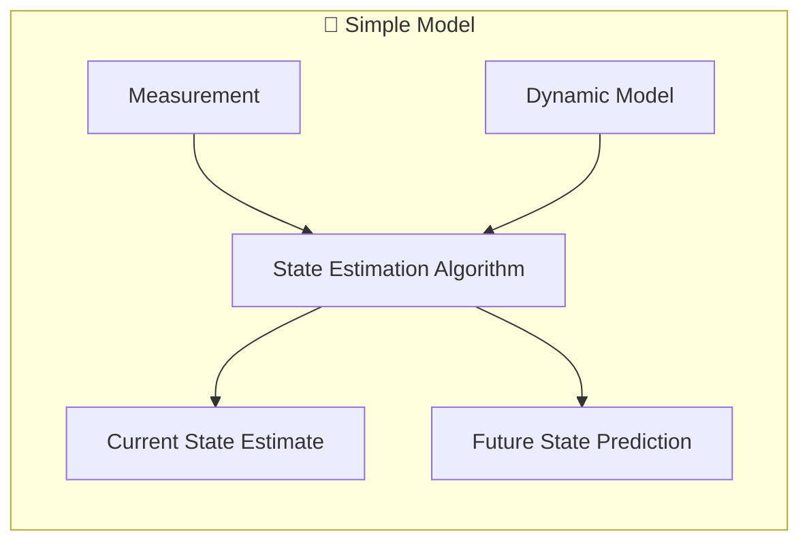
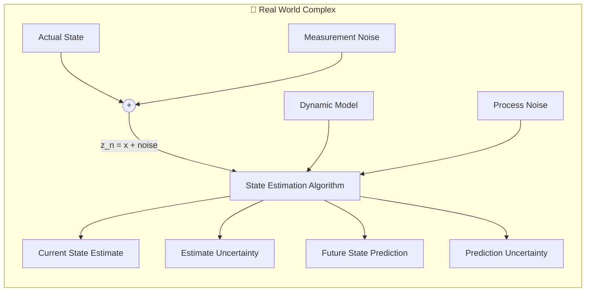
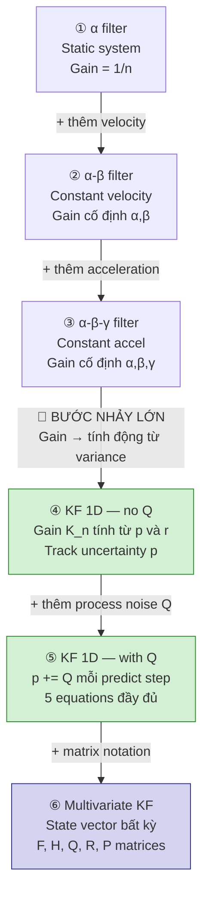
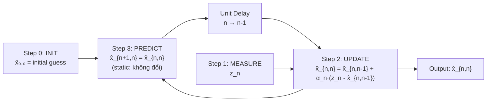
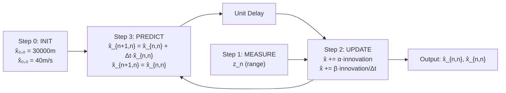
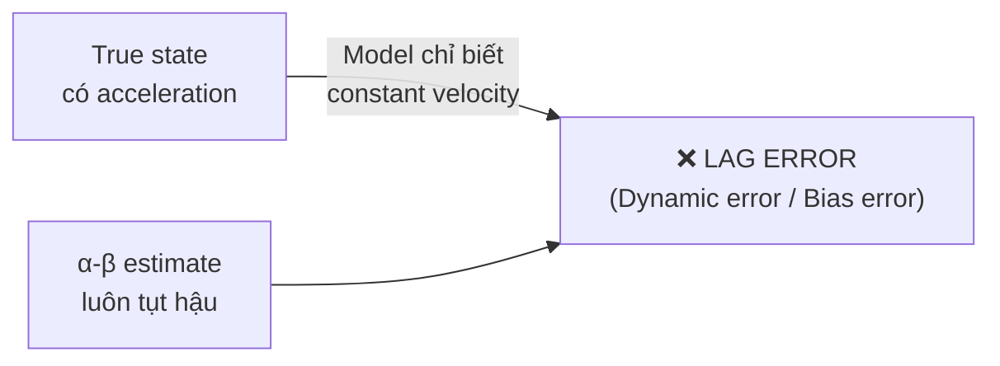
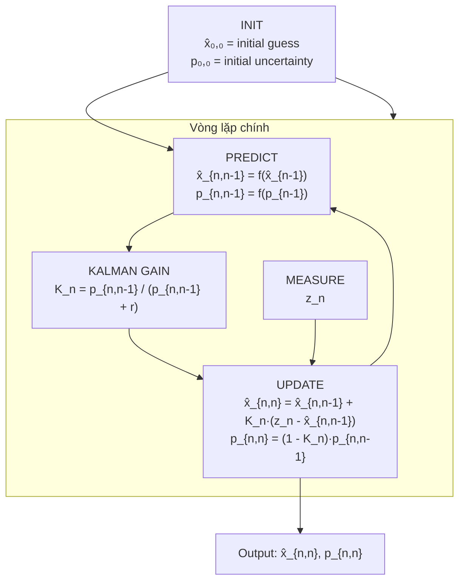
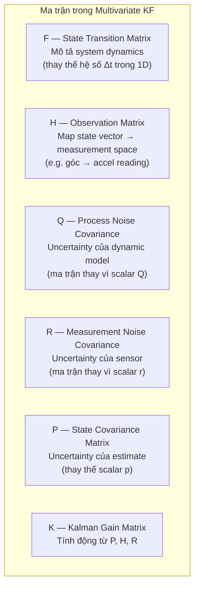
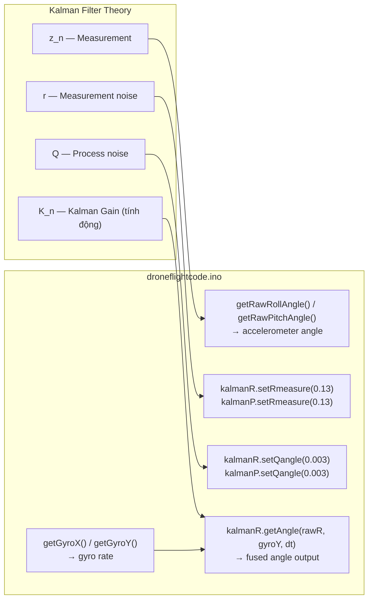
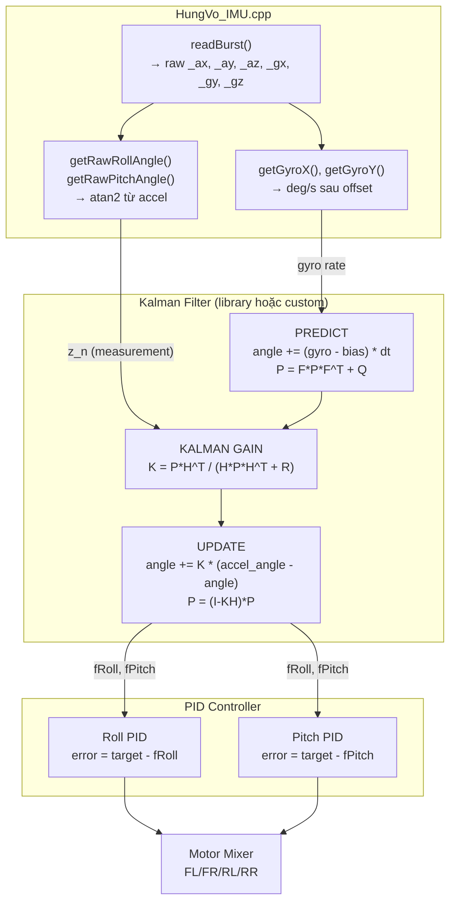

# Kalman Filter — Study Note & Drone Integration Guide
**Project Windify | Group 21 | Author: Hung Vo**  
**Nguồn chính:** [kalmanfilter.net/alphabeta.html](https://kalmanfilter.net/alphabeta.html) · [gregorygundersen.com/blog/2020/04/11/moments/](https://gregorygundersen.com/blog/2020/04/11/moments/)

---

## Icon Legend

| Icon | Ý nghĩa |
|---|---|
| 🕳️ | Missing — chưa có, cần viết mới |
| ⚙️ | Incomplete — có rồi nhưng chưa đủ dùng |
| ❓ | Defense risk — điểm yếu nếu bị hỏi |
| 🐛 | Bug — sai hoặc misleading trong code/comment |
| 📐 | Numerical/Visual — thiếu ví dụ số hoặc diagram |
| 🧩 | Theory↔Code — chưa link lý thuyết vào code thực tế |
| ✅ | Done |

---

## Mục lục

1. [Tại sao cần Kalman Filter?](#1-tại-sao-cần-kalman-filter)
2. [Hai bức tranh: Simple vs Real World](#2-hai-bức-tranh-simple-vs-real-world)
3. [Con đường tiến hóa: từ α đến Kalman](#3-con-đường-tiến-hóa-từ-α-đến-kalman)
4. [Example 1 — Cân vàng (α filter, static system)](#4-example-1--cân-vàng-α-filter-static-system)
5. [Example 2 — Radar constant velocity (α-β filter)](#5-example-2--radar-constant-velocity-α-β-filter)
6. [Example 3 — Radar accelerating (lag error xuất hiện)](#6-example-3--radar-accelerating-lag-error-xuất-hiện)
7. [Example 4 — α-β-γ filter (giải quyết lag error)](#7-example-4--α-β-γ-filter-giải-quyết-lag-error)
8. [KF 1D — Gain tính động (bước nhảy quan trọng nhất)](#8-kf-1d--gain-tính-động-bước-nhảy-quan-trọng-nhất)
9. [KF 1D with Process Noise Q](#9-kf-1d-with-process-noise-q)
10. [Multivariate Kalman Filter](#10-multivariate-kalman-filter)
11. [Limitations & Assumptions](#11-limitations--assumptions)
12. [Drone Integration — Project Windify](#12-drone-integration--project-windify)

---

## 1. Tại sao cần Kalman Filter?

Mọi cảm biến đều có **noise** — kết quả đo không bao giờ là giá trị thật tuyệt đối.  
Mọi model động học đều có **uncertainty** — thế giới thực không tuân theo phương trình đơn giản 100%.

Kalman Filter là thuật toán ước lượng trạng thái (state estimation) giải quyết đồng thời cả hai vấn đề trên bằng cách **kết hợp tối ưu** giữa prediction từ model và measurement từ cảm biến.

> **Analogy từ Statistical Moments** *(gregorygundersen.com)*:  
> Variance (moment bậc 2) đo độ "trải rộng" của phân phối — chính là thứ KF dùng để quyết định nên tin measurement hay prediction nhiều hơn. Sensor có variance nhỏ → tin measurement. Model có variance nhỏ → tin prediction.

---

## 2. Hai bức tranh: Simple vs Real World





**Sự khác biệt cốt lõi:**

| | Simple | Real World |
|---|---|---|
| Input | Measurement sạch | Measurement + Noise |
| Output | Estimate | Estimate **+ Uncertainty** |
| Model | Perfect | Dynamic Model **+ Process Noise** |

---

## 3. Con đường tiến hóa: từ α đến Kalman



| Model | State | Gain | Lag Error | Uncertainty |
|---|---|---|---|---|
| α filter | Position | 1/n | Có | Không |
| α-β filter | Pos + Vel | Cố định α,β | Có | Không |
| α-β-γ filter | Pos + Vel + Accel | Cố định α,β,γ | Không | Không |
| KF 1D (no Q) | Scalar bất kỳ | **Tính động K_n** | Tuỳ model | Có (p) |
| KF 1D (with Q) | Scalar bất kỳ | **Tính động K_n** | Tuỳ model | Có (p, Q) |
| **Multivariate KF** | **Vector bất kỳ** | **Tính động K_n** | Không | **Có (P, Q, R matrices)** |

---

## 4. Example 1 — Cân vàng (α filter, static system)

### Bối cảnh

Ước lượng khối lượng một thỏi vàng bằng cách cân nhiều lần. Cân có noise ngẫu nhiên (không có systematic error). Trọng lượng không đổi → **static system**.

### State Update Equation

Trung bình đơn giản n measurements:

$$\hat{x}_{n,n} = \frac{1}{n}\sum_{i=1}^{n}z_i$$

Vấn đề: phải lưu toàn bộ lịch sử. Không thực tế cho embedded system.

**Biến đổi thành dạng recursive** (chỉ cần giá trị trước đó):

$$\hat{x}_{n,n} = \hat{x}_{n,n-1} + \frac{1}{n}(z_n - \hat{x}_{n,n-1})$$

Đặt $\alpha_n = \frac{1}{n}$ → **State Update Equation tổng quát:**

$$\boxed{\hat{x}_{n,n} = \hat{x}_{n,n-1} + \alpha_n(z_n - \hat{x}_{n,n-1})}$$

Trong đó:
- $\hat{x}_{n,n}$ — estimate hiện tại (sau khi đo lần n)
- $\hat{x}_{n,n-1}$ — predicted state (từ bước trước)
- $z_n$ — measurement lần n
- $(z_n - \hat{x}_{n,n-1})$ — **innovation** / **residual** (thông tin mới)
- $\alpha_n$ — **Kalman Gain** (sau này sẽ được tính động thay vì = 1/n)

### Estimation Algorithm



### Kết quả số (True value = 1000g)

| n | α_n | z_n (g) | x̂_{n,n} (g) |
|---|---|---|---|
| 1 | 1 | 996 | 996.00 |
| 2 | 1/2 | 994 | 995.00 |
| 3 | 1/3 | 1021 | 1003.67 |
| 5 | 1/5 | 1002 | 1002.60 |
| 10 | 1/10 | 1023 | 999.30 |

Estimate hội tụ dần về 1000g. α giảm → mỗi measurement mới ảnh hưởng ít hơn.

> **Insight:** Đây chính là cách hoạt động của bất kỳ recursive estimator nào. α = "mình tin measurement bao nhiêu so với prediction".

---

> ### 🚁 Drone Context — Example 1
> **Analogy với MPU6050:** Khi drone đứng yên trên bàn và ta đọc accelerometer nhiều lần, mỗi lần ra một giá trị roll/pitch hơi khác nhau do noise. Hàm `calibrate()` trong `HungVo_IMU.cpp` thực chất đang làm đúng việc này — lấy trung bình 2000 samples:
> ```cpp
> // HungVo_IMU.cpp — calibrate() đang làm α filter với α = 1/n
> for(int i = 0; i < samples; i++) {
>     readBurst();
>     sumAX += (float)_ax / 4096.0;
>     // ... tương đương: sum += z_i
> }
> _offAX = sumAX / samples;  // = x̂_{n,n} = (1/n) * Σ z_i
> ```
> Nếu áp dụng KF thay cho averaging đơn giản, mình có thể track offset ngay cả khi drone đang có rung động nhẹ.

---

## 5. Example 2 — Radar constant velocity (α-β filter)

### Bối cảnh

Track máy bay di chuyển với **vận tốc không đổi** trong 1 chiều. Radar đo khoảng cách (range) mỗi 5 giây. State có **2 biến**: position $x$ và velocity $\dot{x}$.

### Dynamic Model (State Extrapolation Equations)

$$\hat{x}_{n+1,n} = \hat{x}_{n,n} + \Delta t \cdot \hat{\dot{x}}_{n,n}$$

$$\hat{\dot{x}}_{n+1,n} = \hat{\dot{x}}_{n,n}$$

Nghĩa là: vị trí tiếp theo = vị trí hiện tại + vận tốc × thời gian. Vận tốc không đổi.

### α-β State Update Equations

$$\hat{x}_{n,n} = \hat{x}_{n,n-1} + \alpha(z_n - \hat{x}_{n,n-1})$$

$$\hat{\dot{x}}_{n,n} = \hat{\dot{x}}_{n,n-1} + \beta\left(\frac{z_n - \hat{x}_{n,n-1}}{\Delta t}\right)$$

Trong đó:
- $\alpha$ — gain cho **position** (hằng số, không giảm như 1/n)
- $\beta$ — gain cho **velocity**
- $(z_n - \hat{x}_{n,n-1})$ — innovation (sai lệch giữa đo được và dự đoán)
- Innovation / Δt → ước lượng thay đổi vận tốc

### Chọn α và β

| Radar precision | α | β | Ý nghĩa |
|---|---|---|---|
| Cao (laser) | Cao (~0.8) | Cao (~0.5) | Tin measurement, phản ứng nhanh với thay đổi |
| Thấp | Thấp (~0.2) | Thấp (~0.1) | Smooth nhiều hơn, phản ứng chậm |

### Estimation Algorithm



> ### 🚁 Drone Context — Example 2
> **Analogy với Complementary Filter hiện tại:** α-β filter là "tiền thân" của Complementary Filter đang chạy trong drone. `getAngle()` từ thư viện Kalman library thực chất làm việc tương tự — kết hợp accelerometer angle (= z_n) và gyro rate (= ẋ) với hệ số cố định. Hạn chế: hệ số cố định không tối ưu khi noise thay đổi (ví dụ motor spin up).

---

## 6. Example 3 — Radar accelerating (lag error xuất hiện)

### Bối cảnh

Máy bay di chuyển **constant velocity 50m/s trong 20s đầu**, sau đó **tăng tốc 8 m/s² trong 35s tiếp theo**. Vẫn dùng α-β filter (α=0.2, β=0.1).

### Vấn đề: Lag Error



α-β filter **không có** acceleration trong model → khi target thật sự tăng tốc, estimate bị tụt hậu ngày càng xa. Đây gọi là **lag error** (còn gọi là dynamic error / bias error / truncation error).

**Kết quả:** Velocity estimate tụt hậu ~100 m/s so với thực tế sau 50 giây.

---

## 7. Example 4 — α-β-γ filter (giải quyết lag error)

### Giải pháp: Thêm acceleration vào state

α-β-γ filter mở rộng state vector thêm acceleration $\ddot{x}$:

**State Extrapolation Equations (3 phương trình):**

$$\hat{x}_{n+1,n} = \hat{x}_{n,n} + \Delta t \cdot \hat{\dot{x}}_{n,n} + \frac{\Delta t^2}{2} \cdot \hat{\ddot{x}}_{n,n}$$

$$\hat{\dot{x}}_{n+1,n} = \hat{\dot{x}}_{n,n} + \Delta t \cdot \hat{\ddot{x}}_{n,n}$$

$$\hat{\ddot{x}}_{n+1,n} = \hat{\ddot{x}}_{n,n}$$

**State Update Equations (3 phương trình):**

$$\hat{x}_{n,n} = \hat{x}_{n,n-1} + \alpha \cdot (z_n - \hat{x}_{n,n-1})$$

$$\hat{\dot{x}}_{n,n} = \hat{\dot{x}}_{n,n-1} + \beta \cdot \frac{z_n - \hat{x}_{n,n-1}}{\Delta t}$$

$$\hat{\ddot{x}}_{n,n} = \hat{\ddot{x}}_{n,n-1} + \gamma \cdot \frac{z_n - \hat{x}_{n,n-1}}{\Delta t^2 / 2}$$

Trong đó $\gamma$ là gain cho acceleration — tương tự α cho position, β cho velocity.

### Vẫn còn hạn chế

α, β, γ vẫn là **hằng số do người lập trình chọn**. Nếu target maneuvering (đột ngột đổi hướng), hoặc noise thay đổi theo thời gian, filter không tự điều chỉnh được. Đây là lý do cần **Kalman Filter thực sự** — gain tính động.

> ### 🚁 Drone Context — Example 4
> Với MPU6050 trên drone, state vector tương đương là:
> - $x$ → góc roll (hoặc pitch)
> - $\dot{x}$ → gyro rate
> - $\ddot{x}$ → gyro bias (bias thay đổi chậm theo nhiệt độ)
>
> α-β-γ filter có thể ước lượng gyro bias, nhưng với hệ số cố định. Kalman Filter làm điều này tốt hơn bằng cách tự động điều chỉnh dựa trên Q (process noise) và R (measurement noise).

---

## 8. KF 1D — Gain tính động (bước nhảy quan trọng nhất)

### Sự khác biệt triết lý

| α-β-γ filter | Kalman Filter |
|---|---|
| Người lập trình **chọn** α, β, γ | Filter **tự tính** Kalman Gain K_n |
| Gain cố định suốt quá trình | Gain thay đổi mỗi iteration |
| Không biết mình "chắc" bao nhiêu | Track uncertainty (variance p) |

> **Insight từ Statistical Moments** *(gregorygundersen.com)*:  
> Variance (second central moment) = $\mathbb{E}[(X - \mu)^2]$ đo độ bất định.  
> KF dùng tỉ lệ giữa **prediction variance** (p) và **measurement variance** (r) để tính gain tối ưu. Đây là ý nghĩa vật lý của Kalman Gain.

### 5 Phương trình Kalman Filter (1D, không có Q)

**Phương trình 1 — State Extrapolation (Predict x):**

$$\hat{x}_{n+1,n} = \hat{x}_{n,n}$$

(Với static system. Dynamic system thì = $\hat{x}_{n,n} + \Delta t \cdot \hat{\dot{x}}_{n,n}$)

**Phương trình 2 — Covariance Extrapolation (Predict p):**

$$p_{n+1,n} = p_{n,n}$$

(Với static system. Dynamic system thì có thêm thành phần velocity variance)

**Phương trình 3 — Kalman Gain:**

$$\boxed{K_n = \frac{p_{n,n-1}}{p_{n,n-1} + r}}$$

Trong đó:
- $p_{n,n-1}$ — predicted state variance (uncertainty của prediction)
- $r$ — measurement variance (uncertainty của sensor)
- $K_n \in [0, 1]$ — nếu p >> r → K → 1 (tin measurement); nếu r >> p → K → 0 (tin prediction)

**Phương trình 4 — State Update:**

$$\hat{x}_{n,n} = \hat{x}_{n,n-1} + K_n(z_n - \hat{x}_{n,n-1})$$

**Phương trình 5 — Covariance Update:**

$$p_{n,n} = (1 - K_n) \cdot p_{n,n-1}$$

> Sau mỗi update, p giảm → estimate ngày càng chắc hơn. Thêm measurement luôn giảm uncertainty.

### Flow đầy đủ



### Tại sao Kalman Gain tối ưu?

Kalman Gain được chọn để **minimize variance của estimate** $p_{n,n}$. Đây là lý do KF được gọi là **optimal filter** (với điều kiện noise là Gaussian và system là linear).

> **Analogy moment bậc 2:** Tối thiểu hóa $p_{n,n} = \mathbb{E}[(\hat{x}_{n,n} - x_{true})^2]$ chính là tối thiểu hóa second central moment của estimation error.

---

## 9. KF 1D with Process Noise Q

### Vấn đề của KF 1D (no Q)

Nếu không có Q, p hội tụ về 0 sau vài chục iterations — filter không còn tin measurement nữa, bất kể measurement có tốt đến đâu.

Trong thực tế, **dynamic model không hoàn hảo** — có những thứ model không biết (gió, turbulence, nhiệt độ thay đổi). Đây là **process noise**.

### Thêm Q vào Covariance Extrapolation

**Phương trình 2 được cập nhật:**

$$p_{n+1,n} = p_{n,n} + Q$$

Trong đó $Q$ (process noise variance) thể hiện mức độ "tin tưởng vào model". Q lớn → model không chắc → p không hội tụ về 0 → filter luôn lắng nghe measurement.

### Chọn Q và R

| Q (Process Noise) | R (Measurement Noise) | Hành vi filter |
|---|---|---|
| Nhỏ | Nhỏ | Smooth, phản ứng chậm |
| Lớn | Nhỏ | Tin measurement nhiều, nhạy với noise |
| Nhỏ | Lớn | Tin model nhiều, phản ứng chậm với thay đổi |
| **Cân bằng** | **Cân bằng** | **Tối ưu cho ứng dụng cụ thể** |

> Việc tuning Q và R là **nghệ thuật + thực nghiệm**, không có công thức tuyệt đối.

---

### 📐 ✅ Numerical Trace — KF 1D with Q (ví dụ tính tay)

> **Bối cảnh:** Đo nhiệt độ cảm biến trên drone đang hover. True value ≈ 25°C.  
> Params: `r = 4.0` (sensor noise variance), `Q = 0.5` (process noise), `p₀ = 10.0`, `x̂₀ = 20.0°C`

| n | z_n (°C) | p_{n,n-1} | K_n | x̂_{n,n} (°C) | p_{n,n} |
|---|---|---|---|---|---|
| 0 | — | — | — | 20.00 | 10.00 |
| 1 | 24.5 | 10.50 | 0.724 | 23.26 | 2.90 |
| 2 | 25.1 | 3.40 | 0.459 | 24.16 | 1.84 |
| 3 | 24.8 | 2.34 | 0.369 | 24.38 | 1.48 |
| 4 | 25.3 | 1.98 | 0.331 | 24.68 | 1.32 |
| 5 | 25.0 | 1.82 | 0.313 | 24.78 | 1.25 |
| 6 | 25.2 | 1.75 | 0.305 | 24.91 | 1.22 |
| 7 | 24.9 | 1.72 | 0.301 | 24.88 | 1.20 |
| 8 | 25.1 | 1.70 | 0.298 | 24.94 | 1.19 |

> `p_{n,n-1} = p_{n-1,n-1} + Q` (Q=0.5 được cộng mỗi bước predict)  
> `K_n = p_{n,n-1} / (p_{n,n-1} + r)`  
> `x̂_{n,n} = x̂_{n,n-1} + K_n * (z_n - x̂_{n,n-1})`  
> `p_{n,n} = (1 - K_n) * p_{n,n-1}`

**Insights từ bảng:**
- **K_n không về 0** — nhờ Q=0.5 bơm lại uncertainty mỗi bước, filter luôn lắng nghe measurement (so sánh: nếu Q=0 thì K_n → 0 sau ~10 iterations)
- **p ổn định ở ~1.19** thay vì tiếp tục giảm — đây là "steady-state" khi Q và r cân bằng nhau
- **x̂ hội tụ về ~25°C** dù initial guess = 20°C — KF tự kéo estimate về đúng hướng chỉ qua measurement

---

## 10. Multivariate Kalman Filter

Phần này mở rộng KF 1D sang **vector và matrix** để xử lý nhiều biến đồng thời (ví dụ: roll + gyro bias cùng lúc).

> **Nguồn đọc:**
> - [kalmanfilter.net/kalmanmulti.html](https://kalmanfilter.net/kalmanmulti.html) — Multivariate KF
> - [kalmanfilter.net/kalman1d.html](https://kalmanfilter.net/kalman1d.html) — KF 1D đầy đủ với derivation

### Tổng quan các matrix cần biết



**5 phương trình tổng quát (matrix form):**

$$\hat{\mathbf{x}}_{n+1,n} = \mathbf{F}\hat{\mathbf{x}}_{n,n} + \mathbf{G}\mathbf{u}_n \quad \text{(State Extrapolation)}$$

$$\mathbf{P}_{n+1,n} = \mathbf{F}\mathbf{P}_{n,n}\mathbf{F}^T + \mathbf{Q} \quad \text{(Covariance Extrapolation)}$$

$$\mathbf{K}_n = \mathbf{P}_{n,n-1}\mathbf{H}^T(\mathbf{H}\mathbf{P}_{n,n-1}\mathbf{H}^T + \mathbf{R})^{-1} \quad \text{(Kalman Gain)}$$

$$\hat{\mathbf{x}}_{n,n} = \hat{\mathbf{x}}_{n,n-1} + \mathbf{K}_n(\mathbf{z}_n - \mathbf{H}\hat{\mathbf{x}}_{n,n-1}) \quad \text{(State Update)}$$

$$\mathbf{P}_{n,n} = (\mathbf{I} - \mathbf{K}_n\mathbf{H})\mathbf{P}_{n,n-1}(\mathbf{I} - \mathbf{K}_n\mathbf{H})^T + \mathbf{K}_n\mathbf{R}\mathbf{K}_n^T \quad \text{(Covariance Update — Joseph form)}$$

**Ý nghĩa từng thành phần (cho người không quen ma trận):**

| Ký hiệu | Là gì | Analogy 1D |
|---|---|---|
| **x** (vector) | Tất cả biến state cùng lúc (roll, pitch, bias) | Scalar x |
| **F** (matrix) | "Công thức dự đoán" cho toàn bộ state | Hệ số Δt |
| **H** (matrix) | "Bộ chuyển đổi" từ state sang measurement | = 1 nếu đo trực tiếp |
| **Q** (matrix) | Uncertainty của model (mỗi biến state) | Scalar Q |
| **R** (matrix) | Uncertainty của sensor (mỗi measurement) | Scalar r |
| **P** (matrix) | Uncertainty hiện tại của estimate | Scalar p |
| **K** (matrix) | Kalman Gain (tính động) | Scalar K_n |

---

### 🕳️ ✅ Matrix cụ thể cho drone — State [angle, gyro_bias]

![KF Matrix Diagram](data:image/svg+xml;base64,PHN2ZyB3aWR0aD0iNzAwIiBoZWlnaHQ9IjUyMCIgdmlld0JveD0iMCAwIDcwMCA1MjAiIHhtbG5zPSJodHRwOi8vd3d3LnczLm9yZy8yMDAwL3N2ZyIgZm9udC1mYW1pbHk9InVpLXNhbnMtc2VyaWYsIHN5c3RlbS11aSwgc2Fucy1zZXJpZiI+CgogIDxkZWZzPgogICAgPG1hcmtlciBpZD0iYXJyb3ciIHZpZXdCb3g9IjAgMCAxMCAxMCIgcmVmWD0iOCIgcmVmWT0iNSIgbWFya2VyV2lkdGg9IjYiIG1hcmtlckhlaWdodD0iNiIgb3JpZW50PSJhdXRvLXN0YXJ0LXJldmVyc2UiPgogICAgICA8cGF0aCBkPSJNMiAxTDggNUwyIDkiIGZpbGw9Im5vbmUiIHN0cm9rZT0iIzg4ODc4MCIgc3Ryb2tlLXdpZHRoPSIxLjUiIHN0cm9rZS1saW5lY2FwPSJyb3VuZCIgc3Ryb2tlLWxpbmVqb2luPSJyb3VuZCIvPgogICAgPC9tYXJrZXI+CiAgICA8bWFya2VyIGlkPSJhcnJvdy10ZWFsIiB2aWV3Qm94PSIwIDAgMTAgMTAiIHJlZlg9IjgiIHJlZlk9IjUiIG1hcmtlcldpZHRoPSI2IiBtYXJrZXJIZWlnaHQ9IjYiIG9yaWVudD0iYXV0by1zdGFydC1yZXZlcnNlIj4KICAgICAgPHBhdGggZD0iTTIgMUw4IDVMMiA5IiBmaWxsPSJub25lIiBzdHJva2U9IiMwRjZFNTYiIHN0cm9rZS13aWR0aD0iMS41IiBzdHJva2UtbGluZWNhcD0icm91bmQiIHN0cm9rZS1saW5lam9pbj0icm91bmQiLz4KICAgIDwvbWFya2VyPgogICAgPG1hcmtlciBpZD0iYXJyb3ctYW1iZXIiIHZpZXdCb3g9IjAgMCAxMCAxMCIgcmVmWD0iOCIgcmVmWT0iNSIgbWFya2VyV2lkdGg9IjYiIG1hcmtlckhlaWdodD0iNiIgb3JpZW50PSJhdXRvLXN0YXJ0LXJldmVyc2UiPgogICAgICA8cGF0aCBkPSJNMiAxTDggNUwyIDkiIGZpbGw9Im5vbmUiIHN0cm9rZT0iIzg1NEYwQiIgc3Ryb2tlLXdpZHRoPSIxLjUiIHN0cm9rZS1saW5lY2FwPSJyb3VuZCIgc3Ryb2tlLWxpbmVqb2luPSJyb3VuZCIvPgogICAgPC9tYXJrZXI+CiAgPC9kZWZzPgoKICA8IS0tIEJhY2tncm91bmQgLS0+CiAgPHJlY3Qgd2lkdGg9IjcwMCIgaGVpZ2h0PSI1MjAiIGZpbGw9IiNGQUZBRjkiIHJ4PSIxMiIvPgoKICA8IS0tIOKVkOKVkOKVkCBTVEFURSBWRUNUT1IgKHRvcC1sZWZ0KSDilZDilZDilZAgLS0+CiAgPHJlY3QgeD0iMzAiIHk9IjI4IiB3aWR0aD0iMTc1IiBoZWlnaHQ9IjgwIiByeD0iOCIgZmlsbD0iI0VFRURGRSIgc3Ryb2tlPSIjQUZBOUVDIiBzdHJva2Utd2lkdGg9IjEiLz4KICA8dGV4dCB4PSIxMTciIHk9IjU0IiAgdGV4dC1hbmNob3I9Im1pZGRsZSIgZm9udC1zaXplPSIxMyIgZm9udC13ZWlnaHQ9IjYwMCIgZmlsbD0iIzNDMzQ4OSI+U3RhdGUgdmVjdG9yIHg8L3RleHQ+CiAgPHRleHQgeD0iMTE3IiB5PSI3MyIgIHRleHQtYW5jaG9yPSJtaWRkbGUiIGZvbnQtc2l6ZT0iMTIiIGZpbGw9IiM1MzRBQjciIGZvbnQtZmFtaWx5PSJtb25vc3BhY2UiPlsgzrggICAgICDOuMyHX2JpYXMgXTwvdGV4dD4KICA8dGV4dCB4PSIxMTciIHk9IjkyIiAgdGV4dC1hbmNob3I9Im1pZGRsZSIgZm9udC1zaXplPSIxMSIgZmlsbD0iIzdGNzdERCI+YW5nbGUgICAgICAgZ3lybyBiaWFzPC90ZXh0PgoKICA8IS0tIOKVkOKVkOKVkCBaX04gTUVBU1VSRU1FTlQgKHRvcC1jZW50ZXIpIOKVkOKVkOKVkCAtLT4KICA8cmVjdCB4PSIyNjIiIHk9IjI4IiB3aWR0aD0iMTc2IiBoZWlnaHQ9IjY1IiByeD0iOCIgZmlsbD0iI0ZBRUNFNyIgc3Ryb2tlPSIjRjA5OTdCIiBzdHJva2Utd2lkdGg9IjEiLz4KICA8dGV4dCB4PSIzNTAiIHk9IjUyIiAgdGV4dC1hbmNob3I9Im1pZGRsZSIgZm9udC1zaXplPSIxMyIgZm9udC13ZWlnaHQ9IjYwMCIgZmlsbD0iIzcxMkIxMyI+eiYjeDIwOTk7IG1lYXN1cmVtZW50PC90ZXh0PgogIDx0ZXh0IHg9IjM1MCIgeT0iNzIiICB0ZXh0LWFuY2hvcj0ibWlkZGxlIiBmb250LXNpemU9IjEyIiBmaWxsPSIjOTkzQzFEIiBmb250LWZhbWlseT0ibW9ub3NwYWNlIj5hY2NlbCBhbmdsZSAozrhfYWNjZWwpPC90ZXh0PgoKICA8IS0tIOKVkOKVkOKVkCBGIE1BVFJJWCAobGVmdC1taWQpIOKVkOKVkOKVkCAtLT4KICA8cmVjdCB4PSIzMCIgeT0iMTU1IiB3aWR0aD0iMTc1IiBoZWlnaHQ9IjExNSIgcng9IjgiIGZpbGw9IiNFMUY1RUUiIHN0cm9rZT0iIzVEQ0FBNSIgc3Ryb2tlLXdpZHRoPSIxIi8+CiAgPHRleHQgeD0iMTE3IiB5PSIxNzgiIHRleHQtYW5jaG9yPSJtaWRkbGUiIGZvbnQtc2l6ZT0iMTMiIGZvbnQtd2VpZ2h0PSI2MDAiIGZpbGw9IiMwODUwNDEiPkYg4oCUIHRyYW5zaXRpb248L3RleHQ+CiAgPHRleHQgeD0iNzIiICB5PSIyMDIiIHRleHQtYW5jaG9yPSJzdGFydCIgIGZvbnQtc2l6ZT0iMTMiIGZpbGw9IiMwRjZFNTYiIGZvbnQtZmFtaWx5PSJtb25vc3BhY2UiPlsgMSAgICAmI3gyMjEyO2R0IF08L3RleHQ+CiAgPHRleHQgeD0iNzIiICB5PSIyMjIiIHRleHQtYW5jaG9yPSJzdGFydCIgIGZvbnQtc2l6ZT0iMTMiIGZpbGw9IiMwRjZFNTYiIGZvbnQtZmFtaWx5PSJtb25vc3BhY2UiPlsgMCAgICAgIDEgIF08L3RleHQ+CiAgPHRleHQgeD0iMTE3IiB5PSIyNTQiIHRleHQtYW5jaG9yPSJtaWRkbGUiIGZvbnQtc2l6ZT0iMTEiIGZpbGw9IiMwODUwNDEiPnByZWRpY3RzIG5leHQgc3RhdGU8L3RleHQ+CgogIDwhLS0g4pWQ4pWQ4pWQIEtGIENPUkUgKGNlbnRlcikg4pWQ4pWQ4pWQIC0tPgogIDxyZWN0IHg9IjI2MiIgeT0iMTQ4IiB3aWR0aD0iMTc2IiBoZWlnaHQ9IjIxMCIgcng9IjEwIiBmaWxsPSIjRjFFRkU4IiBzdHJva2U9IiNCNEIyQTkiIHN0cm9rZS13aWR0aD0iMS4yIi8+CiAgPHRleHQgeD0iMzUwIiB5PSIxNzUiIHRleHQtYW5jaG9yPSJtaWRkbGUiIGZvbnQtc2l6ZT0iMTMiIGZvbnQtd2VpZ2h0PSI2MDAiIGZpbGw9IiMyQzJDMkEiPktGIHVwZGF0ZTwvdGV4dD4KICA8bGluZSB4MT0iMjc1IiB5MT0iMTg2IiB4Mj0iNDI1IiB5Mj0iMTg2IiBzdHJva2U9IiNEM0QxQzciIHN0cm9rZS13aWR0aD0iMC44Ii8+CiAgPHRleHQgeD0iMzUwIiB5PSIyMDQiIHRleHQtYW5jaG9yPSJtaWRkbGUiIGZvbnQtc2l6ZT0iMTIiIGZpbGw9IiM1RjVFNUEiPuKRoCBwcmVkaWN0IHjMgjwvdGV4dD4KICA8dGV4dCB4PSIzNTAiIHk9IjIyMiIgdGV4dC1hbmNob3I9Im1pZGRsZSIgZm9udC1zaXplPSIxMiIgZmlsbD0iIzVGNUU1QSI+4pGhIHByZWRpY3QgUDwvdGV4dD4KICA8bGluZSB4MT0iMjc1IiB5MT0iMjM0IiB4Mj0iNDI1IiB5Mj0iMjM0IiBzdHJva2U9IiNEM0QxQzciIHN0cm9rZS13aWR0aD0iMC44Ii8+CiAgPHRleHQgeD0iMzUwIiB5PSIyNTQiIHRleHQtYW5jaG9yPSJtaWRkbGUiIGZvbnQtc2l6ZT0iMTIiIGZpbGw9IiM1RjVFNUEiPuKRoiBLYWxtYW4gZ2FpbiBLPC90ZXh0PgogIDx0ZXh0IHg9IjM1MCIgeT0iMjcyIiB0ZXh0LWFuY2hvcj0ibWlkZGxlIiBmb250LXNpemU9IjEyIiBmaWxsPSIjNUY1RTVBIj7ikaMgdXBkYXRlIHjMgjwvdGV4dD4KICA8dGV4dCB4PSIzNTAiIHk9IjI5MCIgdGV4dC1hbmNob3I9Im1pZGRsZSIgZm9udC1zaXplPSIxMiIgZmlsbD0iIzVGNUU1QSI+4pGkIHVwZGF0ZSBQPC90ZXh0PgogIDxsaW5lIHgxPSIyNzUiIHkxPSIzMDQiIHgyPSI0MjUiIHkyPSIzMDQiIHN0cm9rZT0iI0QzRDFDNyIgc3Ryb2tlLXdpZHRoPSIwLjgiLz4KICA8dGV4dCB4PSIzNTAiIHk9IjMyMiIgdGV4dC1hbmNob3I9Im1pZGRsZSIgZm9udC1zaXplPSIxMSIgZmlsbD0iIzg4ODc4MCI+UCA9IChJIOKIkiBLSClQPC90ZXh0PgogIDx0ZXh0IHg9IjM1MCIgeT0iMzQwIiB0ZXh0LWFuY2hvcj0ibWlkZGxlIiBmb250LXNpemU9IjExIiBmaWxsPSIjODg4NzgwIj5zaW1wbGlmaWVkIGZvcm08L3RleHQ+CgogIDwhLS0g4pWQ4pWQ4pWQIFEgTUFUUklYIChsZWZ0LWJvdHRvbSkg4pWQ4pWQ4pWQIC0tPgogIDxyZWN0IHg9IjMwIiB5PSIzMTgiIHdpZHRoPSIxNzUiIGhlaWdodD0iMTE1IiByeD0iOCIgZmlsbD0iI0UxRjVFRSIgc3Ryb2tlPSIjNURDQUE1IiBzdHJva2Utd2lkdGg9IjEiLz4KICA8dGV4dCB4PSIxMTciIHk9IjM0MSIgdGV4dC1hbmNob3I9Im1pZGRsZSIgZm9udC1zaXplPSIxMyIgZm9udC13ZWlnaHQ9IjYwMCIgZmlsbD0iIzA4NTA0MSI+USDigJQgcHJvY2VzcyBub2lzZTwvdGV4dD4KICA8dGV4dCB4PSI3MiIgIHk9IjM2NSIgdGV4dC1hbmNob3I9InN0YXJ0IiAgZm9udC1zaXplPSIxMyIgZmlsbD0iIzBGNkU1NiIgZm9udC1mYW1pbHk9Im1vbm9zcGFjZSI+WyAwLjAwMyAgICAwICAgXTwvdGV4dD4KICA8dGV4dCB4PSI3MiIgIHk9IjM4NSIgdGV4dC1hbmNob3I9InN0YXJ0IiAgZm9udC1zaXplPSIxMyIgZmlsbD0iIzBGNkU1NiIgZm9udC1mYW1pbHk9Im1vbm9zcGFjZSI+WyAwICAgICAwLjAwMyAgXTwvdGV4dD4KICA8dGV4dCB4PSIxMTciIHk9IjQxNiIgdGV4dC1hbmNob3I9Im1pZGRsZSIgZm9udC1zaXplPSIxMSIgZmlsbD0iIzA4NTA0MSI+c2V0UWFuZ2xlIMK3IHNldFFiaWFzPC90ZXh0PgoKICA8IS0tIOKVkOKVkOKVkCBIIE1BVFJJWCAocmlnaHQtdG9wKSDilZDilZDilZAgLS0+CiAgPHJlY3QgeD0iNDk1IiB5PSIxNDgiIHdpZHRoPSIxNzUiIGhlaWdodD0iMTAwIiByeD0iOCIgZmlsbD0iI0ZBRUVEQSIgc3Ryb2tlPSIjRkFDNzc1IiBzdHJva2Utd2lkdGg9IjEiLz4KICA8dGV4dCB4PSI1ODIiIHk9IjE3MiIgdGV4dC1hbmNob3I9Im1pZGRsZSIgZm9udC1zaXplPSIxMyIgZm9udC13ZWlnaHQ9IjYwMCIgZmlsbD0iIzYzMzgwNiI+SCDigJQgb2JzZXJ2YXRpb248L3RleHQ+CiAgPHRleHQgeD0iNTQwIiB5PSIyMDAiIHRleHQtYW5jaG9yPSJzdGFydCIgIGZvbnQtc2l6ZT0iMTMiIGZpbGw9IiM4NTRGMEIiIGZvbnQtZmFtaWx5PSJtb25vc3BhY2UiPlsgMSAgICAwIF08L3RleHQ+CiAgPHRleHQgeD0iNTgyIiB5PSIyMjQiIHRleHQtYW5jaG9yPSJtaWRkbGUiIGZvbnQtc2l6ZT0iMTEiIGZpbGw9IiM2MzM4MDYiPmNo4buNbiBhbmdsZSB04burIHg8L3RleHQ+CiAgPHRleHQgeD0iNTgyIiB5PSIyNDAiIHRleHQtYW5jaG9yPSJtaWRkbGUiIGZvbnQtc2l6ZT0iMTEiIGZpbGw9IiM2MzM4MDYiPmtow7RuZyDEkW8gYmlhczwvdGV4dD4KCiAgPCEtLSDilZDilZDilZAgUiBTQ0FMQVIgKHJpZ2h0LWJvdHRvbSkg4pWQ4pWQ4pWQIC0tPgogIDxyZWN0IHg9IjQ5NSIgeT0iMjk1IiB3aWR0aD0iMTc1IiBoZWlnaHQ9IjkwIiByeD0iOCIgZmlsbD0iI0ZBRUVEQSIgc3Ryb2tlPSIjRkFDNzc1IiBzdHJva2Utd2lkdGg9IjEiLz4KICA8dGV4dCB4PSI1ODIiIHk9IjMyMCIgdGV4dC1hbmNob3I9Im1pZGRsZSIgZm9udC1zaXplPSIxMyIgZm9udC13ZWlnaHQ9IjYwMCIgZmlsbD0iIzYzMzgwNiI+UiDigJQgbWVhcy4gbm9pc2U8L3RleHQ+CiAgPHRleHQgeD0iNTgyIiB5PSIzNDYiIHRleHQtYW5jaG9yPSJtaWRkbGUiIGZvbnQtc2l6ZT0iMTMiIGZpbGw9IiM4NTRGMEIiIGZvbnQtZmFtaWx5PSJtb25vc3BhY2UiPnIgPSAwLjEzPC90ZXh0PgogIDx0ZXh0IHg9IjU4MiIgeT0iMzY4IiB0ZXh0LWFuY2hvcj0ibWlkZGxlIiBmb250LXNpemU9IjExIiBmaWxsPSIjNjMzODA2Ij5zZXRSbWVhc3VyZSgwLjEzKTwvdGV4dD4KCiAgPCEtLSDilZDilZDilZAgT1VUUFVUIChib3R0b20tY2VudGVyKSDilZDilZDilZAgLS0+CiAgPHJlY3QgeD0iMjYyIiB5PSI0MDgiIHdpZHRoPSIxNzYiIGhlaWdodD0iNjUiIHJ4PSI4IiBmaWxsPSIjRjFFRkU4IiBzdHJva2U9IiNCNEIyQTkiIHN0cm9rZS13aWR0aD0iMSIvPgogIDx0ZXh0IHg9IjM1MCIgeT0iNDMyIiB0ZXh0LWFuY2hvcj0ibWlkZGxlIiBmb250LXNpemU9IjEzIiBmb250LXdlaWdodD0iNjAwIiBmaWxsPSIjMkMyQzJBIj5PdXRwdXQ8L3RleHQ+CiAgPHRleHQgeD0iMzUwIiB5PSI0NTYiIHRleHQtYW5jaG9yPSJtaWRkbGUiIGZvbnQtc2l6ZT0iMTIiIGZpbGw9IiM1RjVFNUEiIGZvbnQtZmFtaWx5PSJtb25vc3BhY2UiPs64zIIg4oaSIFBJRCBjb250cm9sbGVyPC90ZXh0PgoKICA8IS0tIOKVkOKVkOKVkCBBUlJPV1Mg4pWQ4pWQ4pWQIC0tPgoKICA8IS0tIFN0YXRlIHZlY3RvciDihpIgRiAoZG93bikgLS0+CiAgPGxpbmUgeDE9IjExNyIgeTE9IjEwOCIgeDI9IjExNyIgeTI9IjE1MyIgc3Ryb2tlPSIjODg4NzgwIiBzdHJva2Utd2lkdGg9IjEuMiIgbWFya2VyLWVuZD0idXJsKCNhcnJvdykiLz4KCiAgPCEtLSB6X24gbWVhc3VyZW1lbnQg4oaSIEtGIGNvcmUgKGRvd24pIC0tPgogIDxsaW5lIHgxPSIzNTAiIHkxPSI5MyIgeDI9IjM1MCIgeTI9IjE0NiIgc3Ryb2tlPSIjODg4NzgwIiBzdHJva2Utd2lkdGg9IjEuMiIgbWFya2VyLWVuZD0idXJsKCNhcnJvdykiLz4KICA8dGV4dCB4PSIzNTciIHk9IjEyNiIgZm9udC1zaXplPSIxMSIgZmlsbD0iIzg4ODc4MCIgZm9udC1zdHlsZT0iaXRhbGljIj56JiN4MjA5OTs8L3RleHQ+CgogIDwhLS0gRiDihpIgS0YgY29yZSAocmlnaHQsIHdpdGggbGFiZWwpIC0tPgogIDxsaW5lIHgxPSIyMDUiIHkxPSIyMTMiIHgyPSIyNjAiIHkyPSIyMTMiIHN0cm9rZT0iIzBGNkU1NiIgc3Ryb2tlLXdpZHRoPSIxLjIiIG1hcmtlci1lbmQ9InVybCgjYXJyb3ctdGVhbCkiLz4KICA8dGV4dCB4PSIyMjQiIHk9IjIwNyIgZm9udC1zaXplPSIxMSIgZmlsbD0iIzBGNkU1NiIgZm9udC13ZWlnaHQ9IjYwMCIgZm9udC1zdHlsZT0iaXRhbGljIj5GPC90ZXh0PgoKICA8IS0tIFEg4oaSIEtGIGNvcmUgKHJpZ2h0LWRpYWdvbmFsKSAtLT4KICA8bGluZSB4MT0iMjA1IiB5MT0iMzc1IiB4Mj0iMjYxIiB5Mj0iMzAwIiBzdHJva2U9IiMwRjZFNTYiIHN0cm9rZS13aWR0aD0iMS4yIiBtYXJrZXItZW5kPSJ1cmwoI2Fycm93LXRlYWwpIi8+CiAgPHRleHQgeD0iMjE4IiB5PSIzNDYiIGZvbnQtc2l6ZT0iMTEiIGZpbGw9IiMwRjZFNTYiIGZvbnQtd2VpZ2h0PSI2MDAiIGZvbnQtc3R5bGU9Iml0YWxpYyI+UTwvdGV4dD4KCiAgPCEtLSBIIOKGkiBLRiBjb3JlIChsZWZ0KSAtLT4KICA8bGluZSB4MT0iNDk0IiB5MT0iMjEwIiB4Mj0iNDQwIiB5Mj0iMjEwIiBzdHJva2U9IiM4NTRGMEIiIHN0cm9rZS13aWR0aD0iMS4yIiBtYXJrZXItZW5kPSJ1cmwoI2Fycm93LWFtYmVyKSIvPgogIDx0ZXh0IHg9IjQ1OCIgeT0iMjA0IiBmb250LXNpemU9IjExIiBmaWxsPSIjODU0RjBCIiBmb250LXdlaWdodD0iNjAwIiBmb250LXN0eWxlPSJpdGFsaWMiPkg8L3RleHQ+CgogIDwhLS0gUiDihpIgS0YgY29yZSAobGVmdC1kaWFnb25hbCkgLS0+CiAgPGxpbmUgeDE9IjQ5NCIgeTE9IjMzMCIgeDI9IjQ0MCIgeTI9IjI5NSIgc3Ryb2tlPSIjODU0RjBCIiBzdHJva2Utd2lkdGg9IjEuMiIgbWFya2VyLWVuZD0idXJsKCNhcnJvdy1hbWJlcikiLz4KICA8dGV4dCB4PSI0NTgiIHk9IjMyNSIgZm9udC1zaXplPSIxMSIgZmlsbD0iIzg1NEYwQiIgZm9udC13ZWlnaHQ9IjYwMCIgZm9udC1zdHlsZT0iaXRhbGljIj5SPC90ZXh0PgoKICA8IS0tIEtGIGNvcmUg4oaSIE91dHB1dCAoZG93bikgLS0+CiAgPGxpbmUgeDE9IjM1MCIgeTE9IjM1OCIgeDI9IjM1MCIgeTI9IjQwNiIgc3Ryb2tlPSIjODg4NzgwIiBzdHJva2Utd2lkdGg9IjEuMiIgbWFya2VyLWVuZD0idXJsKCNhcnJvdykiLz4KCjwvc3ZnPgo=)

Với state vector $\mathbf{x} = [\theta,\ \dot{\theta}_{bias}]^T$ của MPU6050 trên Project Windify:

**F — State Transition Matrix:**

$$\mathbf{F} = \begin{bmatrix} 1 & -\Delta t \\ 0 & 1 \end{bmatrix}$$

- `F[0][0] = 1` — angle kỳ trước vẫn là angle kỳ này (trước khi cộng gyro)
- `F[0][1] = -dt` — gyro bias được **trừ ra** khỏi angle update (bias làm angle sai, nên bù ngược lại)
- `F[1][0] = 0` — bias không phụ thuộc vào angle
- `F[1][1] = 1` — bias tự duy trì (thay đổi rất chậm → model là "bias không đổi")

> **Tại sao -dt?** State extrapolation cho angle là: $\theta_{n+1} = \theta_n + (\omega_{gyro} - bias) \cdot dt$  
> Viết dưới dạng matrix: $\mathbf{x}_{n+1} = \mathbf{F}\mathbf{x}_n + \mathbf{B}u_n$ với $u_n = \omega_{gyro}$ và $\mathbf{B} = [dt,\ 0]^T$.  
> Phần F chỉ handle bias contribution → `F[0][1] = -dt`.

**H — Observation Matrix:**

$$\mathbf{H} = \begin{bmatrix} 1 & 0 \end{bmatrix}$$

- Ta **chỉ đo angle** từ accelerometer — không đo bias trực tiếp
- H "chọn ra" phần tử đầu tiên của state vector: $z_n = H \cdot \mathbf{x} = \theta$
- `H[0][1] = 0` — bias không quan sát được từ accelerometer

**Q — Process Noise Matrix:**

$$\mathbf{Q} = \begin{bmatrix} Q_{angle} & 0 \\ 0 & Q_{bias} \end{bmatrix} = \begin{bmatrix} 0.003 & 0 \\ 0 & 0.003 \end{bmatrix}$$

- Map thẳng vào `setQangle(0.003)` và `setQbias(0.003)` trong code
- Off-diagonal = 0 → angle noise và bias noise được coi là **độc lập** với nhau
- Q nhỏ → model được tin tưởng nhiều → filter phản ứng chậm với thay đổi đột ngột

**R — Measurement Noise (scalar với 1 sensor):**

$$R = r = 0.13$$

Map thẳng vào `setRmeasure(0.13)` — variance của accelerometer angle (bị ảnh hưởng bởi vibration motor 8520).

---

### 🐛 ✅ Joseph Form vs Simplified Form

Phương trình Covariance Update có **hai dạng**:

**Simplified form** (dùng trong code custom ở Section 12):
$$\mathbf{P}_{n,n} = (\mathbf{I} - \mathbf{K}_n\mathbf{H})\mathbf{P}_{n,n-1}$$

**Joseph form** (dùng trong phương trình tổng quát ở trên):
$$\mathbf{P}_{n,n} = (\mathbf{I} - \mathbf{K}_n\mathbf{H})\mathbf{P}_{n,n-1}(\mathbf{I} - \mathbf{K}_n\mathbf{H})^T + \mathbf{K}_n\mathbf{R}\mathbf{K}_n^T$$

**Khi nào dùng cái nào:**
- **Simplified**: đủ dùng khi K được tính chính xác từ P và R, và P vẫn symmetric. Đơn giản hơn, tốn ít FLOP hơn → phù hợp cho embedded (ESP32).
- **Joseph form**: numerically stable hơn khi P có thể bị mất symmetry do floating-point error tích lũy qua nhiều iterations. Bắt buộc dùng trong Extended KF / Unscented KF.

> Với KF tuyến tính + `float` trên ESP32-S3 chạy 250Hz, simplified form là **đủ tốt**. Nếu nâng lên EKF sau này thì cần Joseph form.

---

## 11. Limitations & Assumptions ❓ ✅

> **Tại sao section này quan trọng:** Giáo sư rất hay hỏi "KF có giới hạn gì?" hoặc "Tại sao không dùng EKF?". Đây là câu trả lời chuẩn bị sẵn.

### Hai giả định cốt lõi của KF

**Giả định 1: Noise phải Gaussian (zero-mean, white noise)**

KF được derive để minimize mean squared error **với giả định** rằng process noise và measurement noise đều có phân phối Gaussian với mean = 0.

- Nếu noise có bias (mean ≠ 0) → estimate bị lệch hệ thống
- Nếu noise không phải white (có correlation theo thời gian) → Kalman Gain không còn tối ưu

**Giả định 2: System phải linear**

KF dùng matrix F để predict state. F là **hằng số** — nghĩa là relationship giữa current state và next state phải tuyến tính.

- Với góc nhỏ (hover, <15°): $\sin\theta \approx \theta$ → linear approximation đủ tốt
- Với góc lớn (>30°, aggressive maneuver): nonlinear → KF bắt đầu sai

### Drone vi phạm giả định khi nào?

| Tình huống | Giả định bị vi phạm | Hậu quả |
|---|---|---|
| Motor spin-up / spin-down | Noise không Gaussian (vibration spike) | Angle output bị giật trong ~0.5s |
| Góc nghiêng > 30° | System nonlinear (sin/cos) | Estimate bị lệch, PID mất ổn định |
| Nhiệt độ thay đổi nhiều | Bias drift nhanh hơn Q_bias model | Gyro bias không được track kịp |
| Va chạm / shock | Impulse noise — không phải Gaussian | Output spike, cần low-pass thêm |

### Tại sao vẫn dùng KF thường (không dùng EKF)?

Trong phạm vi hoạt động bình thường của **indoor drone hover** (góc <15°, tốc độ thấp):

1. **Linear approximation đủ tốt** — sai số do nonlinearity < sai số do sensor noise
2. **KF đơn giản hơn nhiều** — EKF cần tính Jacobian matrix mỗi step → tốn CPU
3. **ESP32-S3 ở 250Hz** — mỗi loop chỉ có ~4ms. KF tuyến tính fit; EKF cần benchmark thêm
4. **Thư viện đã proven** — Kalman library đang dùng đã được test trên nhiều drone project

> **Nếu mở rộng sau này:** EKF (Extended KF) linearize system tại mỗi operating point bằng Jacobian. Unscented KF (UKF) dùng sigma points thay vì Jacobian — accurate hơn nhưng đắt hơn. Cả hai đều phù hợp hơn khi drone bay aggressive maneuver.

---

## 12. Drone Integration — Project Windify

### Mapping lý thuyết → code hiện tại



### State vector của drone (Multivariate KF)

Với MPU6050 trên Project Windify, state vector hợp lý là:

$$\mathbf{x} = \begin{bmatrix} \theta \\ \dot{\theta}_{bias} \end{bmatrix} = \begin{bmatrix} \text{góc (roll hoặc pitch)} \\ \text{gyro bias} \end{bmatrix}$$

Measurement vector:

$$\mathbf{z} = \begin{bmatrix} \theta_{accel} \end{bmatrix} = \begin{bmatrix} \text{góc từ accelerometer} \end{bmatrix}$$

### Tuning parameters hiện tại

```cpp
// droneflightcode.ino — setup()
// Tuning cho motor 8520 (rung động mạnh)
kalmanR.setRmeasure(0.13);   // r = 0.13 → measurement noise variance
kalmanP.setRmeasure(0.13);   // (accelerometer bị ảnh hưởng bởi vibration)

kalmanR.setQangle(0.003);    // Q_angle = 0.003 → process noise cho góc
kalmanP.setQangle(0.003);

kalmanR.setQbias(0.003);     // Q_bias = 0.003 → process noise cho gyro bias
kalmanP.setQbias(0.003);
```

**Ý nghĩa tuning (liên hệ lý thuyết):**
- `Rmeasure = 0.13` → R lớn → accelerometer không đáng tin (bị vibration từ motor 8520)
- `Qangle = 0.003` → Q nhỏ → model dynamics khá chắc (gyro tốt trong ngắn hạn)
- `Qbias = 0.003` → bias thay đổi chậm → model bias change nhỏ

---

### ⚙️ ✅ Tuning Decision Tree — Khi nào tăng Q, khi nào tăng R?

> **Đây là câu hỏi thực tế nhất khi defend.** "Làm sao bạn biết chọn 0.13 và 0.003?"

**Bảng triệu chứng → chẩn đoán → hành động:**

| Triệu chứng quan sát được | Chẩn đoán | Hành động |
|---|---|---|
| Angle output dao động mạnh theo vibration motor | R quá nhỏ — đang tin accelerometer quá nhiều | Tăng `Rmeasure` (vd: 0.13 → 0.3) |
| Angle phản ứng chậm, trễ khi drone thật sự nghiêng | R quá lớn hoặc Q quá nhỏ | Giảm `Rmeasure` hoặc tăng `Qangle` |
| Angle drift dần về một phía theo thời gian dù đứng yên | `Qbias` quá nhỏ — bias không được track kịp | Tăng `Qbias` (vd: 0.003 → 0.01) |
| Output mượt nhưng không phản ứng với thay đổi nhanh | Q tổng thể quá nhỏ | Tăng cả `Qangle` và `Qbias` |
| Output nhảy loạn khi arm motor (spin-up) | Impulse noise vượt Gaussian assumption | Giữ R cao trong giai đoạn arm |

**Quy trình tuning 3 bước:**

1. **Bắt đầu từ:** `Rmeasure = 0.1`, `Qangle = 0.001`, `Qbias = 0.003`
2. **Điều chỉnh R trước** — giữ Q cố định, tăng/giảm R đến khi output không bị ảnh hưởng bởi motor vibration nhưng vẫn phản ứng với tilt thật
3. **Điều chỉnh Q sau** — nếu drift còn, tăng `Qbias`; nếu lag còn, tăng `Qangle`

> **Rule of thumb cho motor 8520:** R/Q ratio ≈ 40-50 là vùng hoạt động tốt. Ví dụ: R=0.13, Q=0.003 → ratio ≈ 43.

---

### Code snippet — KF usage trong loop

```cpp
// droneflightcode.ino — loop()
// Input: raw accelerometer angle + gyro rate → Output: filtered angle

// Bước 1: Lấy measurement z_n từ accelerometer
float rawP = (-myIMU.getRawRollAngle()) - pitchOffset;   // z_n cho pitch
float rawR = (myIMU.getRawPitchAngle()) - rollOffset;    // z_n cho roll

// Bước 2: KF update — bên trong getAngle() tự động:
//   - Predict: x̂_{n,n-1} = x̂_{n-1} + gyroRate * dt
//   - Compute Kalman Gain: K = P / (P + R)
//   - Update: x̂_{n,n} = x̂_{n,n-1} + K * (z_n - x̂_{n,n-1})
//   - Update covariance: P = (1 - K) * P  [simplified form — đủ dùng cho linear KF]
float fP_raw = kalmanP.getAngle(rawP, -myIMU.getGyroX(), dt);
float fR_raw = kalmanR.getAngle(rawR,  myIMU.getGyroY(), dt);

// Bước 3: Rotate 45° để align với motor layout
fRoll  = (fR_raw * 0.7071) + (fP_raw * 0.7071);
fPitch = (fP_raw * 0.7071) - (fR_raw * 0.7071);
```

### Code snippet — Custom KF thay thế (concept, chưa compile-ready)

Nếu muốn hiểu rõ hơn bằng cách tự implement KF thay vì dùng thư viện:

```cpp
// Concept: Custom KF cho roll angle — dựa theo KF 1D with process noise
// State: [angle, gyro_bias] — 2 biến
// Measurement: accelerometer angle — 1 biến

struct KalmanState {
    float angle;       // x̂[0] — góc ước lượng (degrees)
    float bias;        // x̂[1] — gyro bias ước lượng (deg/s)
    float P[2][2];     // P — covariance matrix 2x2
};

// Khởi tạo
KalmanState ks = {
    .angle = 0.0f,
    .bias  = 0.0f,
    .P     = {{10.0f, 0.0f},   // P₀,₀ = 10 (uncertainty ban đầu cao)
              {0.0f,  10.0f}}
};

// Mỗi loop (dt = 0.004s):
float kalman_update(KalmanState &ks,
                    float z_accel,   // measurement từ accelerometer (deg)
                    float gyro_rate, // gyro reading (deg/s)
                    float dt) {

    // === PREDICT ===
    // State extrapolation: angle += (gyro - bias) * dt
    // Tương ứng F = [[1, -dt], [0, 1]] nhân với state vector
    float rate = gyro_rate - ks.bias;
    ks.angle += rate * dt;

    // Covariance extrapolation: P = F*P*F^T + Q
    // Expanded với F = [[1,-dt],[0,1]], Q_angle = 0.003, Q_bias = 0.003
    ks.P[0][0] += dt * (dt * ks.P[1][1] - ks.P[0][1] - ks.P[1][0] + 0.003f);
    ks.P[0][1] -= dt * ks.P[1][1];
    ks.P[1][0] -= dt * ks.P[1][1];
    ks.P[1][1] += 0.003f * dt;

    // === KALMAN GAIN ===
    // K = P * H^T * (H * P * H^T + R)^-1
    // H = [1, 0] (chỉ đo angle, không đo bias)
    // → S = P[0][0] + R_measure
    float S = ks.P[0][0] + 0.13f;   // R_measure = 0.13
    float K[2] = {ks.P[0][0] / S,   // K[0] = gain cho angle
                  ks.P[1][0] / S};   // K[1] = gain cho bias

    // === UPDATE ===
    float innovation = z_accel - ks.angle;   // y = z_n - H*x̂
    ks.angle += K[0] * innovation;
    ks.bias  += K[1] * innovation;

    // Covariance update: P = (I - K*H) * P
    // Dùng simplified form — đủ stable cho linear KF trên ESP32
    // Nếu nâng lên EKF: cần Joseph form để giữ P symmetric
    float P00_old = ks.P[0][0];
    float P01_old = ks.P[0][1];
    ks.P[0][0] -= K[0] * P00_old;
    ks.P[0][1] -= K[0] * P01_old;
    ks.P[1][0] -= K[1] * P00_old;
    ks.P[1][1] -= K[1] * P01_old;

    return ks.angle;
}
```

### Sơ đồ luồng tích hợp vào drone



---

## Tóm tắt nhanh để đọc code

| Khi thấy trong code | Tương ứng KF | Ý nghĩa |
|---|---|---|
| `setRmeasure(0.13)` | $r$ (measurement noise) | Accel noise variance — tuning theo vibration |
| `setQangle(0.003)` | $Q_{angle}$ (process noise) | Gyro drift noise — tuning theo độ chính xác gyro |
| `setQbias(0.003)` | $Q_{bias}$ (process noise) | Bias change rate — bias thay đổi chậm |
| `getAngle(raw, gyro, dt)` | Full KF update step | Predict + Gain + Update trong 1 call |
| `calibrate()` | Initialization ($\hat{x}_{0,0}$) | Lấy initial state estimate |
| `dt = 0.004` | $\Delta t$ | Timestep — loop chạy 250Hz |

---

## Changelog

| Version | Thay đổi |
|---|---|
| v1 | Initial draft |
| v2 | Thêm Drone Context boxes cho mỗi example |
| v3 | 📐 Numerical trace KF 1D with Q (Section 9) · 🕳️ Matrix F/H/Q cụ thể cho drone (Section 10) · 🐛 Joseph form note trong code và Section 10 · ❓ Limitations & Assumptions section mới (Section 11) · ⚙️ Tuning decision tree (Section 12) · ⚙️ Updated PREDICT comment trong custom code |

---

*Cập nhật lần cuối: Hung Vo — Project Windify Group 21*  
*Tham khảo thêm: [kalmanfilter.net/kalman1d.html](https://kalmanfilter.net/kalman1d.html) | [kalmanfilter.net/kalmanmulti.html](https://kalmanfilter.net/kalmanmulti.html)*