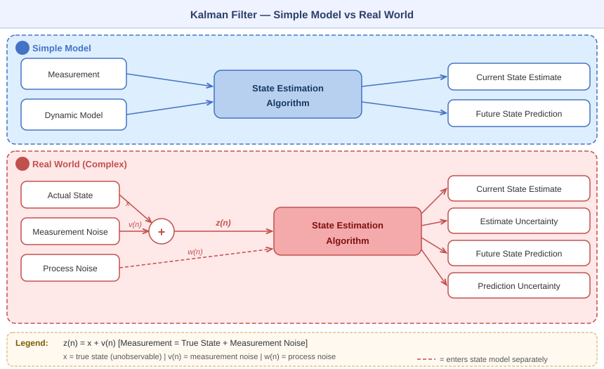
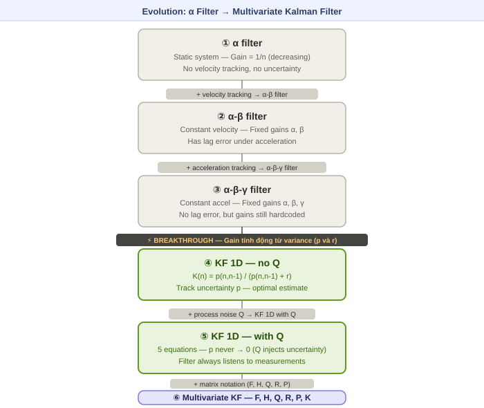
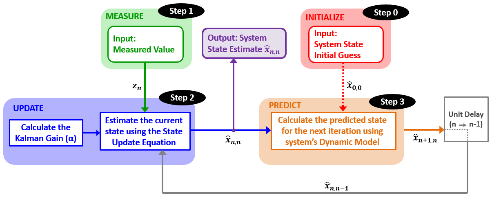
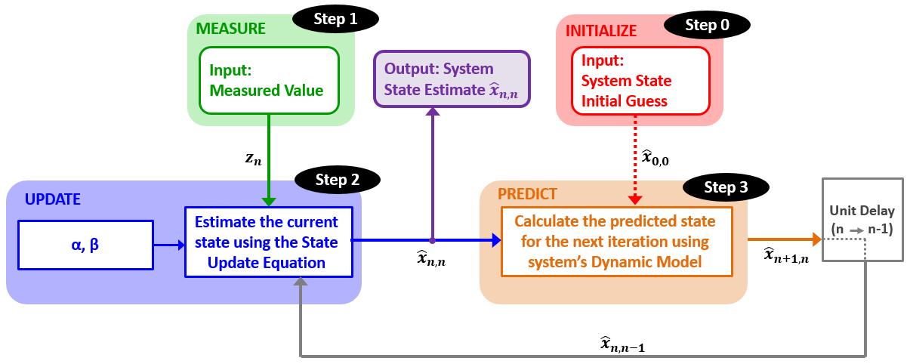
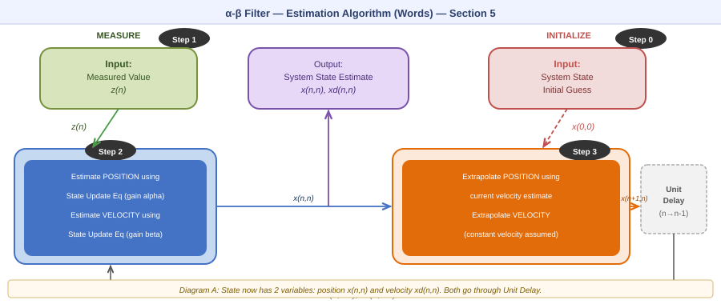
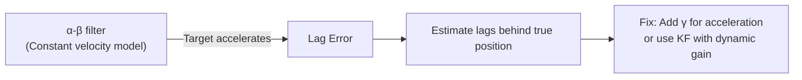
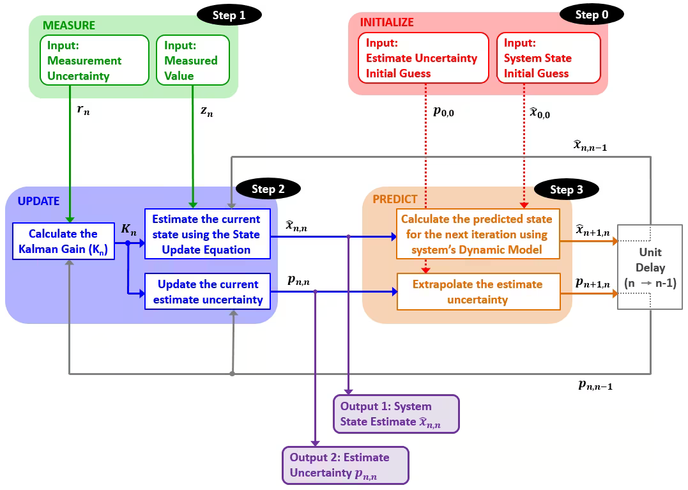
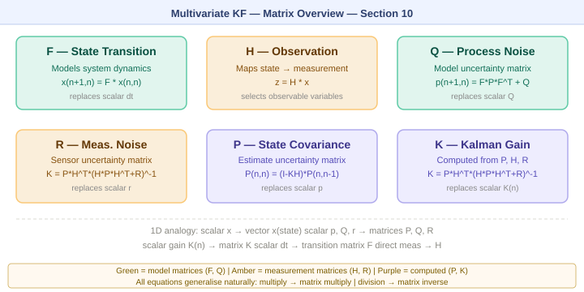
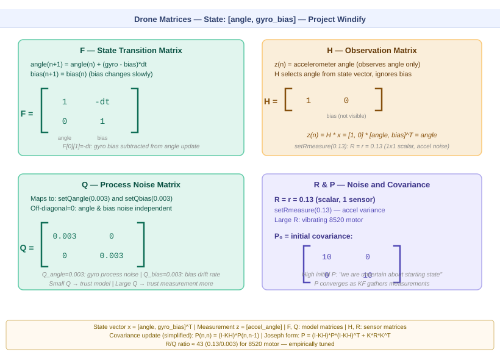
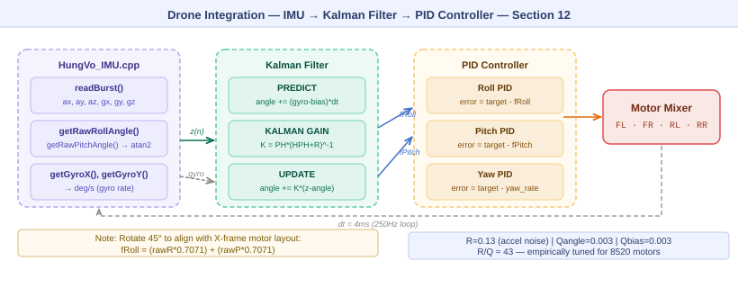

# Kalman Filter — Study Note & Drone Integration Guide
**Project Windify | Group 21 | Author: Hung Vo**  
**Nguồn chính:** [kalmanfilter.net](https://kalmanfilter.net/alphabeta.html) · [gregorygundersen.com](https://gregorygundersen.com/blog/2020/04/11/moments/)

> **Cách dùng ảnh:** Tất cả diagram là file `.svg` trong thư mục `diagrams/`.  
> Dán relative path vào đây: ``

---

## Icon Legend

| Icon | Ý nghĩa |
|---|---|
| 🕳️ | Missing — chưa có |
| ⚙️ | Incomplete |
| ❓ | Defense risk |
| 🐛 | Bug |
| 📐 | Thiếu ví dụ số / diagram |
| 🧩 | Chưa link lý thuyết ↔ code |
| ✅ | Done |

---

## Mục lục

1. [Tại sao cần Kalman Filter?](#1-tại-sao-cần-kalman-filter)
2. [Hai bức tranh: Simple vs Real World](#2-hai-bức-tranh-simple-vs-real-world)
3. [Con đường tiến hóa: từ α đến Kalman](#3-con-đường-tiến-hóa-từ-α-đến-kalman)
4. [Example 1 — Cân vàng (α filter, static system)](#4-example-1--cân-vàng-α-filter-static-system)
5. [Example 2 — Radar constant velocity (α-β filter)](#5-example-2--radar-constant-velocity-α-β-filter)
6. [Example 3 — Radar accelerating (lag error)](#6-example-3--radar-accelerating-lag-error-xuất-hiện)
7. [Example 4 — α-β-γ filter](#7-example-4--α-β-γ-filter-giải-quyết-lag-error)
8. [KF 1D — Gain tính động](#8-kf-1d--gain-tính-động-bước-nhảy-quan-trọng-nhất)
9. [KF 1D with Process Noise Q](#9-kf-1d-with-process-noise-q)
10. [Multivariate Kalman Filter](#10-multivariate-kalman-filter)
11. [Limitations & Assumptions](#11-limitations--assumptions-)
12. [Drone Integration — Project Windify](#12-drone-integration--project-windify)

---

## 1. Tại sao cần Kalman Filter?

M��i cảm biến đều có **noise** — kết quả đo không bao giờ là giá trị thật tuyệt đối.  
M��i model động học đều có **uncertainty** — thế giới thực không tuân theo phương trình đơn giản 100%.

Kalman Filter là thuật toán ước lượng trạng thái (**state estimation**) giải quyết đồng thời cả hai bằng cách **kết hợp tối ưu** giữa prediction từ model và measurement từ cảm biến.

> **Analogy từ Statistical Moments** *(gregorygundersen.com)*:  
> Variance (moment bậc 2) đo độ "trải rộng" của phân phối — chính là thứ KF dùng để quyết định nên tin measurement hay prediction nhiều hơn.  
> Sensor variance nhỏ → tin measurement. Model variance nhỏ → tin prediction.

---

## 2. Hai bức tranh: Simple vs Real World



**Sự khác biệt cốt lõi:**

| | Simple | Real World |
|---|---|---|
| Input | Measurement sạch | Measurement + Noise |
| Output | Estimate | Estimate **+ Uncertainty** |
| Model | Perfect | Dynamic Model **+ Process Noise** |

- `z(n) = x + v(n)` — measurement = true state + measurement noise
- `w(n)` — process noise: những thứ model không biết (gió, turbulence, nhiệt độ)
- KF output **Estimate Uncertainty** là điểm mấu chốt: filter biết nó đang sai bao nhiêu

---

## 3. Con đường tiến hóa: từ α đến Kalman



| Model | State | Gain | Lag Error | Uncertainty |
|---|---|---|---|---|
| α filter | Position | 1/n (giảm dần) | Có | Không |
| α-β filter | Pos + Vel | Cố định α, β | Có | Không |
| α-β-γ filter | Pos + Vel + Accel | Cố định α, β, γ | Không | Không |
| KF 1D (no Q) | Scalar bất kỳ | **Tính động K(n)** | Tuỳ model | Có (p) |
| KF 1D (with Q) | Scalar bất kỳ | **Tính động K(n)** | Tuỳ model | Có (p, Q) |
| **Multivariate KF** | **Vector bất kỳ** | **Tính động K(n)** | Không | **Có (P, Q, R)** |

---

## 4. Example 1 — Cân vàng (α filter, static system)
 
### Bối cảnh

Ước lượng khối lượng một thỏi vàng bằng cách cân nhiều lần. Cân có noise ngẫu nhiên. Trọng lượng không đổi → **static system**.

### State Update Equation

$$\hat{x}_{n,n} = \hat{x}_{n,n-1} + \alpha_n(z_n - \hat{x}_{n,n-1})$$

Trong đó:
- $\hat{x}_{n,n}$ — estimate hiện tại
- $\hat{x}_{n,n-1}$ — predicted state (từ bước trước)
- $z_n$ — measurement lần n
- $(z_n - \hat{x}_{n,n-1})$ — **innovation / residual**
- $\alpha_n = \frac{1}{n}$ — Kalman Gain (giảm dần → measurement mới ít ảnh hưởng hơn)

### Estimation Algorithm


*Diagram A — Dùng lời: MEASURE (Step 1) → UPDATE (Step 2) → PREDICT (Step 3) → Unit Delay → lặp lại. INITIALIZE (Step 0) chỉ chạy một lần.*


*Diagram B — Cùng layout, thay bằng ký hiệu: State Update Equation và α = 1/n.*


### Kết quả số (True value = 1000g)

| n | αₙ | zₙ (g) | x̂(n,n) (g) |
|---|---|---|---|
| 1 | 1 | 996 | 996.00 |
| 2 | 1/2 | 994 | 995.00 |
| 3 | 1/3 | 1021 | 1003.67 |
| 5 | 1/5 | 1002 | 1002.60 |
| 10 | 1/10 | 1023 | 999.30 |

> **Insight:** α = "mình tin measurement bao nhiêu so với prediction". α giảm → estimate ổn định hơn qua thời gian.

---

> ### 🚁 Drone Context — Example 1
> Hàm `calibrate()` trong `HungVo_IMU.cpp` thực chất đang làm α filter với α = 1/n:
> ```cpp
> for(int i = 0; i < samples; i++) {
>     readBurst();
>     sumAX += (float)_ax / 4096.0;
> }
> _offAX = sumAX / samples;  // = x̂(n,n) = (1/n) * Σ z_i
> ```

---

## 5. Example 2 — Radar constant velocity (α-β filter)
*Diagram — General System.*


*Diagram — General System.* 
### Chọn α và β
### Bối cảnh

Track máy bay di chuyển với **vận tốc không đổi**. State có **2 biến**: position x và velocity ẋ.

### Dynamic Model (State Extrapolation)

$$\hat{x}_{n+1,n} = \hat{x}_{n,n} + \Delta t \cdot \hat{\dot{x}}_{n,n}$$

$$\hat{\dot{x}}_{n+1,n} = \hat{\dot{x}}_{n,n}$$

### α-β State Update Equations

$$\hat{x}_{n,n} = \hat{x}_{n,n-1} + \alpha(z_n - \hat{x}_{n,n-1})$$

$$\hat{\dot{x}}_{n,n} = \hat{\dot{x}}_{n,n-1} + \frac{\beta}{\Delta t}(z_n - \hat{x}_{n,n-1})$$

### Estimation Algorithm



*Diagram A — State vector giờ có 2 phần tử. Unit Delay trả về cả x(n,n-1) và xd(n,n-1).*


*Diagram B — Equations: innovation được dùng để update cả position (với α) và velocity (với β/dt).*


| Precision | α | β | Behaviour |
|---|---|---|---|
| Cao (laser) | ~0.8 | ~0.5 | Tin measurement, phản ứng nhanh |
| Thấp | ~0.2 | ~0.1 | Smooth nhiều hơn, lag hơn |

> ### 🚁 Drone Context — Example 2
> Drone tracking: position → góc roll, velocity → gyro rate.  
> α-β filter là bước trung gian trước khi dùng KF thực sự với gain tính động.

---

## 6. Example 3 — Radar accelerating (lag error xuất hiện)



**Vấn đề:** α-β filter dùng model "vận tốc không đổi". Khi target thực sự tăng tốc, estimate bị **lag** phía sau.

**Nguyên nhân toán học:** Model equation `xd(n+1,n) = xd(n,n)` không capture được acceleration. Innovation bị "hấp thụ" nhưng không đủ để update velocity kịp.

> ### 🚁 Drone Context — Lag Error
> Với gyroscope của MPU6050: nếu drone đột ngột lật (step input), filter phản ứng chậm hơn thực tế. Giải pháp: tăng `Qangle` (trust model less, react faster) hoặc giảm `Rmeasure`.

---

## 7. Example 4 — α-β-γ filter (giải quyết lag error)

### State Extrapolation (3 phương trình):

$$\hat{x}_{n+1,n} = \hat{x}_{n,n} + \Delta t \cdot \hat{\dot{x}}_{n,n} + \frac{\Delta t^2}{2}\hat{\ddot{x}}_{n,n}$$

$$\hat{\dot{x}}_{n+1,n} = \hat{\dot{x}}_{n,n} + \Delta t \cdot \hat{\ddot{x}}_{n,n}$$

$$\hat{\ddot{x}}_{n+1,n} = \hat{\ddot{x}}_{n,n}$$

### State Update Equations (3 phương trình):

$$\hat{x}_{n,n} = \hat{x}_{n,n-1} + \alpha \cdot (z_n - \hat{x}_{n,n-1})$$

$$\hat{\dot{x}}_{n,n} = \hat{\dot{x}}_{n,n-1} + \frac{\beta}{\Delta t} \cdot (z_n - \hat{x}_{n,n-1})$$

$$\hat{\ddot{x}}_{n,n} = \hat{\ddot{x}}_{n,n-1} + \frac{2\gamma}{\Delta t^2} \cdot (z_n - \hat{x}_{n,n-1})$$

### Vẫn còn hạn chế

α, β, γ vẫn là **hằng số do người lập trình chọn**. Nếu noise thay đổi theo thời gian, filter không tự điều chỉnh được. → Cần **Kalman Filter** với gain tính động.

> ### 🚁 Drone Context — α-β-γ
> State vector tương đương: angle (x), gyro rate (ẋ), gyro bias (ẍ).  
> KF thực tế làm điều này tốt hơn bằng cách tự động điều chỉnh dựa trên Q và R.

---

## 8. KF 1D — Gain tính động (bước nhảy quan trọng nhất)

### Sự khác biệt triết lý

| α-β-γ filter | Kalman Filter |
|---|---|
| Người lập trình **chọn** α, β, γ | Filter **tự tính** Kalman Gain K(n) |
| Gain cố định suốt quá trình | Gain thay đổi mỗi iteration |
| Không biết mình "chắc" bao nhiêu | Track uncertainty (variance p) |

> **Insight từ Statistical Moments** *(gregorygundersen.com)*:  
> KF dùng tỉ lệ giữa **prediction variance** (p) và **measurement variance** (r) để tính gain tối ưu:  
> Variance = $\mathbb{E}[(X - \mu)^2]$ — đây chính là second central moment.

### 5 Phương trình KF 1D (không có Q)

**Eq 1 — State Extrapolation:**
$$\hat{x}_{n+1,n} = \hat{x}_{n,n}$$

**Eq 2 — Covariance Extrapolation:**
$$p_{n+1,n} = p_{n,n}$$

**Eq 3 — Kalman Gain:**
$$\boxed{K_n = \frac{p_{n,n-1}}{p_{n,n-1} + r}}$$

- $p_{n,n-1}$ — predicted state variance
- $r$ — measurement variance
- K ∈ [0,1]: nếu p >> r → K → 1 (tin measurement); nếu r >> p → K → 0 (tin prediction)

**Eq 4 — State Update:**
$$\hat{x}_{n,n} = \hat{x}_{n,n-1} + K_n(z_n - \hat{x}_{n,n-1})$$

**Eq 5 — Covariance Update:**
$$p_{n,n} = (1 - K_n) \cdot p_{n,n-1}$$


### Tại sao Kalman Gain tối ưu?

K được chọn để **minimize variance của estimate** $p_{n,n}$. Đây là lý do KF được gọi là **optimal filter** (với điều kiện noise là Gaussian và system là linear).

---

## 9. KF 1D with Process Noise Q

### Vấn đề của KF 1D (no Q)

Nếu không có Q, p hội tụ về 0 sau vài chục iterations → filter không còn tin measurement nữa. Nhưng trong thực tế **dynamic model không hoàn hảo** — đây là **process noise**.

### Thêm Q vào Covariance Extrapolation

**Eq 2 cập nhật:**
$$p_{n+1,n} = p_{n,n} + Q$$

Q lớn → model không chắc → p không hội tụ về 0 → filter luôn lắng nghe measurement.
### Flow tổng quát(Uncertanty là Q)

### Flow đầy đủ



### Chọn Q và R

| Q (Process Noise) | R (Meas. Noise) | Behaviour |
|---|---|---|
| Nhỏ | Nhỏ | Smooth, phản ứng chậm |
| Lớn | Nhỏ | Tin measurement, nhạy với noise |
| Nhỏ | Lớn | Tin model, phản ứng chậm |
| **Cân bằng** | **Cân bằng** | **Tối ưu cho ứng dụng cụ thể** |

### 📐 ✅ Numerical Trace — KF 1D with Q

> **Bối cảnh:** Đo nhiệt độ drone hover. True value ≈ 25°C.  
> Params: `r = 4.0`, `Q = 0.5`, `p₀ = 10.0`, `x̂₀ = 20.0°C`

| n | z(n) (°C) | p(n,n-1) | K(n) | x̂(n,n) (°C) | p(n,n) |
|---|---|---|---|---|---|
| 0 | — | — | — | 20.00 | 10.00 |
| 1 | 24.5 | 10.50 | 0.724 | 23.26 | 2.90 |
| 2 | 25.1 | 3.40 | 0.459 | 24.16 | 1.84 |
| 3 | 24.8 | 2.34 | 0.369 | 24.38 | 1.48 |
| 4 | 25.3 | 1.98 | 0.331 | 24.68 | 1.32 |
| 5 | 25.0 | 1.82 | 0.313 | 24.78 | 1.25 |
| 8 | 25.1 | 1.70 | 0.298 | 24.94 | 1.19 |

**Insights:**
- **K(n) không về 0** — Q=0.5 bơm lại uncertainty mỗi bước, filter luôn lắng nghe measurement
- **p ổn định ở ~1.19** — steady-state khi Q và r cân bằng nhau
- **x̂ hội tụ về ~25°C** dù initial guess = 20°C

---

## 10. Multivariate Kalman Filter

### Ma trận tổng quan



### 5 Phương trình tổng quát (matrix form)

$$\hat{\mathbf{x}}_{n+1,n} = \mathbf{F}\hat{\mathbf{x}}_{n,n} + \mathbf{G}\mathbf{u}_n \quad \text{(State Extrapolation)}$$

$$\mathbf{P}_{n+1,n} = \mathbf{F}\mathbf{P}_{n,n}\mathbf{F}^T + \mathbf{Q} \quad \text{(Covariance Extrapolation)}$$

$$\mathbf{K}_n = \mathbf{P}_{n,n-1}\mathbf{H}^T(\mathbf{H}\mathbf{P}_{n,n-1}\mathbf{H}^T + \mathbf{R})^{-1} \quad \text{(Kalman Gain)}$$

$$\hat{\mathbf{x}}_{n,n} = \hat{\mathbf{x}}_{n,n-1} + \mathbf{K}_n(\mathbf{z}_n - \mathbf{H}\hat{\mathbf{x}}_{n,n-1}) \quad \text{(State Update)}$$

$$\mathbf{P}_{n,n} = (\mathbf{I} - \mathbf{K}_n\mathbf{H})\mathbf{P}_{n,n-1}(\mathbf{I} - \mathbf{K}_n\mathbf{H})^T + \mathbf{K}_n\mathbf{R}\mathbf{K}_n^T \quad \text{(Covariance Update — Joseph form)}$$

### Ký hiệu → Analogy 1D

| Ký hiệu | Là gì | Analogy 1D |
|---|---|---|
| **x** (vector) | Tất cả biến state | Scalar x |
| **F** (matrix) | "Công thức dự đoán" cho toàn bộ state | Hệ số Δt |
| **H** (matrix) | Chuyển đổi state → measurement | = 1 nếu đo trực tiếp |
| **Q** (matrix) | Uncertainty của model | Scalar Q |
| **R** (matrix) | Uncertainty của sensor | Scalar r |
| **P** (matrix) | Uncertainty estimate hiện tại | Scalar p |
| **K** (matrix) | Kalman Gain | Scalar K(n) |

### 🕳️ ✅ Matrix cụ thể cho drone — State: [angle, gyro_bias]



**F — State Transition Matrix:**

$$\mathbf{F} = \begin{bmatrix} 1 & -\Delta t \\ 0 & 1 \end{bmatrix}$$

- `F[0][1] = -dt`: gyro bias được **trừ ra** khỏi angle update
- `F[1][1] = 1`: bias tự duy trì (thay đổi rất chậm)

**H — Observation Matrix:**

$$\mathbf{H} = \begin{bmatrix} 1 & 0 \end{bmatrix}$$

- Chỉ đo angle từ accelerometer — không đo bias trực tiếp

**Q — Process Noise Matrix:**

$$\mathbf{Q} = \begin{bmatrix} 0.003 & 0 \\ 0 & 0.003 \end{bmatrix}$$

- `setQangle(0.003)`, `setQbias(0.003)`

**R — Measurement Noise (scalar):**

$$R = r = 0.13$$

- `setRmeasure(0.13)` — variance của accelerometer (bị ảnh hưởng bởi vibration motor 8520)

### 🐛 ✅ Joseph Form vs Simplified Form

**Simplified form** (dùng trong code custom):
$$\mathbf{P}_{n,n} = (\mathbf{I} - \mathbf{K}_n\mathbf{H})\mathbf{P}_{n,n-1}$$

**Joseph form** (numerically stable):
$$\mathbf{P}_{n,n} = (\mathbf{I} - \mathbf{K}_n\mathbf{H})\mathbf{P}_{n,n-1}(\mathbf{I} - \mathbf{K}_n\mathbf{H})^T + \mathbf{K}_n\mathbf{R}\mathbf{K}_n^T$$

- Simplified: đủ dùng cho linear KF trên ESP32-S3 với float
- Joseph form: bắt buộc khi nâng lên EKF (P có thể mất symmetry)

---

## 11. Limitations & Assumptions ❓ ✅

> **Tại sao section này quan trọng:** Giáo sư hay hỏi "KF có giới hạn gì?" hoặc "Tại sao không dùng EKF?"

### Hai giả định cốt lõi

**Giả định 1: Noise phải Gaussian (zero-mean, white noise)**

- KF tối ưu **chỉ** khi noise là Gaussian
- Trong thực tế: motor 8520 tạo ra non-Gaussian vibration noise (impulse + harmonic)
- **Hệ quả:** KF vẫn hoạt động tốt với non-Gaussian noise nếu noise gần Gaussian — nhưng không còn là optimal filter

**Giả định 2: System phải linear**

- State transition: `x(n+1) = F*x(n)` — linear
- Measurement: `z = H*x` — linear
- **Hệ quả:** Accelerometer angle = atan2(ay, az) — đây là **nonlinear measurement**!
- Với góc nhỏ (drone hovering), atan2 ≈ linear → KF vẫn hoạt động
- Nếu góc lớn (> 30°): cần **Extended KF (EKF)** với Jacobian

### Tại sao không dùng EKF ngay bây giờ?

| | Linear KF | Extended KF |
|---|---|---|
| Độ phức tạp | Thấp | Cao (Jacobian) |
| RAM trên ESP32-S3 | Ít | Nhiều hơn |
| Stability | Proven | Cần tuning thêm |
| Góc drone hover | ±10° → OK | Cần nếu > 30° |

**Kết luận:** Linear KF đủ tốt cho indoor hover. EKF là future work nếu muốn support acrobatic maneuvers.

### Câu trả lời cho giáo sư

> *"KF của bạn có hạn chế gì?"*

"KF của chúng em giả định noise Gaussian và system linear. Với drone hover ở góc nhỏ (< 15°), cả hai giả định này đều gần đúng. Motor 8520 tạo ra vibration noise gần Gaussian trong dải tần số quan tâm. Nếu chúng em cần support góc lớn hơn, bước tiếp theo sẽ là Extended Kalman Filter với linearization tại điểm hoạt động."

---

## 12. Drone Integration — Project Windify

### State vector và Measurement

$$\mathbf{x} = \begin{bmatrix} \theta \\ \dot{\theta}_{bias} \end{bmatrix} = \begin{bmatrix} \text{góc (angle)} \\ \text{gyro bias} \end{bmatrix}$$

$$\mathbf{z} = \begin{bmatrix} \theta_{accel} \end{bmatrix} = \begin{bmatrix} \text{góc từ accelerometer} \end{bmatrix}$$

### Sơ đồ luồng tích hợp



### Tuning parameters hiện tại

```cpp
// droneflightcode.ino — setup()
kalmanR.setRmeasure(0.13);   // r = 0.13 — measurement noise variance
kalmanP.setRmeasure(0.13);   // (accel bị ảnh hưởng bởi vibration 8520)

kalmanR.setQangle(0.003);    // Q_angle = 0.003 — process noise cho góc
kalmanP.setQangle(0.003);

kalmanR.setQbias(0.003);     // Q_bias = 0.003 — process noise cho gyro bias
kalmanP.setQbias(0.003);
```

**Ý nghĩa tuning:**
- `Rmeasure = 0.13` → R lớn → không tin accelerometer khi motor rung
- `Qangle = 0.003` → Q nhỏ → tin model (gyro tốt trong ngắn hạn)
- `Qbias = 0.003` → bias thay đổi chậm → model bias change nhỏ

### ⚙️ ✅ Tuning Decision Tree

> **Câu hỏi thực tế khi defend:** "Làm sao bạn biết chọn 0.13 và 0.003?"

| Triệu chứng | Chẩn đoán | Hành động |
|---|---|---|
| Angle dao động mạnh theo motor | R quá nhỏ | Tăng `Rmeasure` (0.13 → 0.3) |
| Angle phản ứng chậm khi drone nghiêng | R quá lớn hoặc Q quá nhỏ | Giảm `Rmeasure` hoặc tăng `Qangle` |
| Angle drift về một phía dù đứng yên | `Qbias` quá nhỏ | Tăng `Qbias` (0.003 → 0.01) |
| Output mượt nhưng không phản ứng nhanh | Q tổng thể quá nhỏ | Tăng cả `Qangle` và `Qbias` |
| Output nhảy loạn khi arm motor | Impulse noise (non-Gaussian) | Giữ R cao trong giai đoạn arm |

**Quy trình tuning 3 bước:**
1. Bắt đầu: `Rmeasure = 0.1`, `Qangle = 0.001`, `Qbias = 0.003`
2. Điều chỉnh R trước (cố định Q) đến khi noise motor không ảnh hưởng
3. Điều chỉnh Q sau: tăng `Qbias` nếu còn drift, tăng `Qangle` nếu còn lag

> **Rule of thumb cho motor 8520:** R/Q ratio ≈ 40–50. Ví dụ: R=0.13, Q=0.003 → ratio ≈ 43.

### Code snippet — Custom KF (concept)

```cpp
struct KalmanState {
    float angle;       // x̂[0] — góc ước lượng (degrees)
    float bias;        // x̂[1] — gyro bias ước lượng (deg/s)
    float P[2][2];     // P — covariance matrix 2x2
};

// Khởi tạo
KalmanState ks = {
    .angle = 0.0f,
    .bias  = 0.0f,
    .P     = {{10.0f, 0.0f},   // P₀₀ = 10 (high initial uncertainty)
              {0.0f,  10.0f}}
};

float kalman_update(KalmanState &ks, float z_accel, float gyro_rate, float dt) {
    // === PREDICT ===
    // F = [[1, -dt], [0, 1]] applied to state vector
    float rate = gyro_rate - ks.bias;
    ks.angle += rate * dt;

    // P = F*P*F^T + Q
    ks.P[0][0] += dt * (dt*ks.P[1][1] - ks.P[0][1] - ks.P[1][0] + 0.003f);
    ks.P[0][1] -= dt * ks.P[1][1];
    ks.P[1][0] -= dt * ks.P[1][1];
    ks.P[1][1] += 0.003f * dt;

    // === KALMAN GAIN ===
    // H = [1, 0] → S = H*P*H^T + R = P[0][0] + R
    float S = ks.P[0][0] + 0.13f;
    float K[2] = {ks.P[0][0] / S, ks.P[1][0] / S};

    // === UPDATE ===
    float innovation = z_accel - ks.angle;
    ks.angle += K[0] * innovation;
    ks.bias  += K[1] * innovation;

    // P = (I - K*H) * P  [simplified form — đủ cho linear KF trên ESP32]
    // Nếu nâng lên EKF: dùng Joseph form để giữ P symmetric
    float P00_old = ks.P[0][0];
    float P01_old = ks.P[0][1];
    ks.P[0][0] -= K[0] * P00_old;
    ks.P[0][1] -= K[0] * P01_old;
    ks.P[1][0] -= K[1] * P00_old;
    ks.P[1][1] -= K[1] * P01_old;

    return ks.angle;
}
```

### Tóm tắt nhanh — Code ↔ Theory

| Khi thấy trong code | Tương ứng KF | Ý nghĩa |
|---|---|---|
| `setRmeasure(0.13)` | R (measurement noise) | Accel noise variance |
| `setQangle(0.003)` | Q_angle (process noise) | Gyro drift noise |
| `setQbias(0.003)` | Q_bias (process noise) | Bias change rate |
| `getAngle(raw, gyro, dt)` | Full KF update step | Predict + Gain + Update |
| `calibrate()` | Initialization x̂(0,0) | Initial state estimate |
| `dt = 0.004` | Δt | Timestep — loop 250Hz |

---

## Changelog

| Version | Thay đổi |
|---|---|
| v1 | Initial draft |
| v2 | Thêm Drone Context boxes, numerical traces, matrix drone-specific, Joseph form note, Limitations section |
| v3 | Tách toàn bộ diagram ra file `.svg` riêng (relative path). 10 diagrams. Cairosvg verified. |

---

*Cập nhật lần cuối: Hung Vo — Project Windify Group 21*  
*Tham khảo: [kalmanfilter.net/kalman1d.html](https://kalmanfilter.net/kalman1d.html) | [kalmanfilter.net/kalmanmulti.html](https://kalmanfilter.net/kalmanmulti.html)*