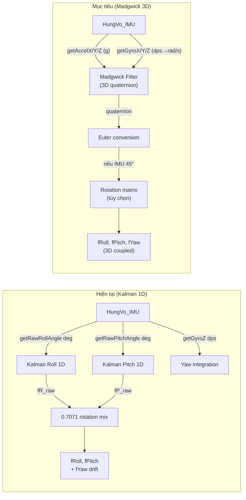
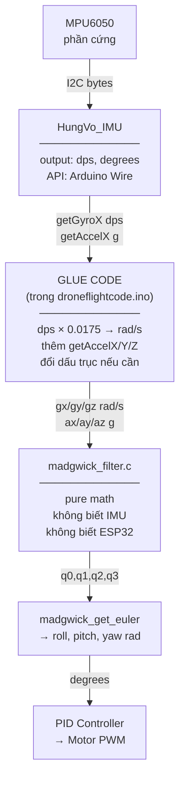
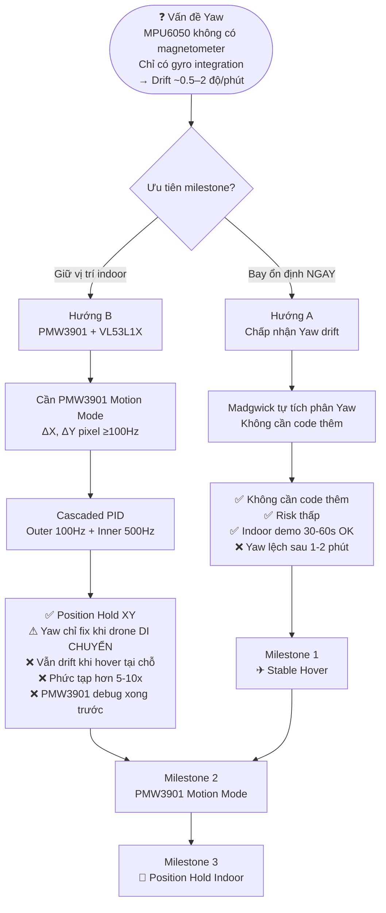
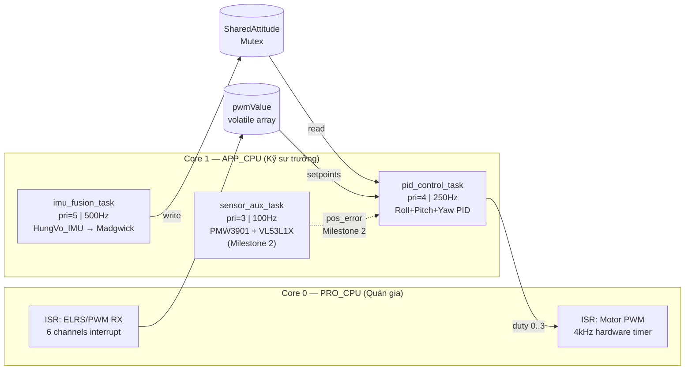

# WINDIFY 6-DOF QUADCOPTER — KIẾN TRÚC & LỘ TRÌNH TÍCH HỢP
**Version:** 2.0 | **Ngày cập nhật:** 2026-05-25  
**Thay đổi so với v1:** Bổ sung giải thích Glue Code (Câu 1), cập nhật Task Map theo ảnh dual-core (Câu 2), viết lại Phần 5 thành 2 phần kỹ thuật + newbie (Câu 3).

---

## MỤC LỤC
1. [Tóm tắt phần cứng](#1-tóm-tắt-phần-cứng)
2. [Phân tích codebase hiện tại](#2-phân-tích-codebase-hiện-tại)
3. [3 File Madgwick là gì — và Glue Code là gì?](#3-3-file-madgwick-là-gì--và-glue-code-là-gì)
4. [Bản đồ kết nối HungVo_IMU → Madgwick](#4-bản-đồ-kết-nối-hungvo_imu--madgwick)
5. [Phân tích 2 hướng Yaw](#5-phân-tích-2-hướng-yaw)
6. [Kiến trúc FreeRTOS Task](#6-kiến-trúc-freertos-task)
7. [Lộ trình migration — Từng Task](#7-lộ-trình-migration)
8. [Mermaid Diagrams cho draw.io](#8-mermaid-diagrams-cho-drawio)
9. [Câu hỏi còn mở](#9-câu-hỏi-còn-mở)

---

## 1. Tóm tắt phần cứng

| Thành phần | Thông số | Ghi chú |
|---|---|---|
| **MCU** | ESP32-S3 Supermini, Dual-core LX7, 240MHz, FPU | Core 0 = PRO_CPU, Core 1 = APP_CPU |
| **IMU** | MPU6050, I2C 400kHz | Driver: `HungVo_IMU` |
| **Motor** | 8520 brushed coreless | Rung cơ học ~200–400Hz |
| **PWM output** | 4kHz (drn_timer_pwm.c) | Hardware timer ISR |
| **RX** | ELRS receiver, CRSF qua UART hoặc PWM multi-ch | Tùy version |
| **Optical Flow** | PMW3901 (SPI) | Đang Frame Grab ~1FPS — cần Motion Mode >100Hz |
| **ToF** | VL53L1X | Altitude hold Z-axis |

---

## 2. Phân tích codebase hiện tại

### 2.1 HungVo_IMU — Cấu hình thanh ghi thực tế

```cpp
writeReg(0x6B, 0x00); // Wake up chip
writeReg(0x1A, 0x05); // DLPF = 5 → Bandwidth 10Hz  ← VẤN ĐỀ
writeReg(0x1B, 0x08); // Gyro  ±500 dps  → Scale: 65.5 LSB/dps
writeReg(0x1C, 0x10); // Accel ±8g       → Scale: 4096 LSB/g
```

**Vấn đề DLPF 10Hz:** Bộ lọc phần cứng 10Hz thêm ~70ms phase delay. Motor 8520 rung ở 200-400Hz — cấu hình này chặn được rung, nhưng làm drone "cảm nhận" chậm về chính mình. Fix: đổi sang `0x03` (44Hz), giảm delay 4 lần, vẫn chặn được rung.

### 2.2 API public của HungVo_IMU

| Hàm có sẵn | Đơn vị | Dùng cho |
|---|---|---|
| `getRawRollAngle()` | độ (°) | z_k trong Kalman cũ |
| `getRawPitchAngle()` | độ (°) | z_k trong Kalman cũ |
| `getGyroX/Y/Z()` | dps (°/s) | ω_k trong Kalman cũ |
| ~~`getAccelX/Y/Z()`~~ | **KHÔNG CÓ** | **Madgwick cần cái này** |

**Thiếu critical:** Madgwick cần vector accel thô (3 giá trị X, Y, Z riêng biệt), không phải góc đã tính. Phải thêm vào HungVo_IMU trước khi migrate.

### 2.3 Bộ lọc Kalman hiện tại — điểm yếu

| # | Điểm yếu | Hệ quả |
|---|---|---|
| 1 | Kalman 1D độc lập cho Roll và Pitch | Bỏ qua cross-coupling 3D |
| 2 | State là Euler angles | Gimbal Lock khi Pitch tiến sát ±90° |
| 3 | Yaw = tích phân thuần túy | Drift ~0.5–2°/giây |
| 4 | Thư viện `<Kalman.h>` | Black box, khó debug |
| 5 | DLPF 10Hz | Phase delay 70ms+ |

---

## 3. 3 File Madgwick là gì — và Glue Code là gì?

### 3.1 Khái niệm Glue Code (code keo dán)

**Glue code** là lớp code trung gian nối hai module không được thiết kế để làm việc chung với nhau.

```
HungVo_IMU                              Madgwick Filter
(nói "ngôn ngữ A")   [GLUE CODE]        (nói "ngôn ngữ B")
─────────────────    ───────────        ────────────────
output: dps          đổi đơn vị         cần: rad/s
output: góc (°)      thêm API mới       cần: accel vector thô
API: Arduino Wire    bridge format      API: pure C struct
```

Không có glue code, hai module này không thể "nói chuyện" — dù cả hai đều đúng về mặt kỹ thuật.

### 3.2 Vai trò từng file — sơ đồ tổng quan

```
┌─────────────────────────────────────────────────────────────────────┐
│                        TOÀN BỘ HỆ THỐNG                            │
│                                                                      │
│  ┌───────────────┐    ┌──────────────────┐   ┌───────────────────┐  │
│  │ HungVo_IMU.h  │    │ madgwick_        │   │ flight_controller │  │
│  │ HungVo_IMU.cpp│    │ filter.h         │   │ _integration.c    │  │
│  │               │    │ madgwick_        │   │                   │  │
│  │  "Tài xế"     │    │ filter.c         │   │  "Phiên dịch"     │  │
│  │  Lái I2C bus  │    │                  │   │  = GLUE CODE      │  │
│  │  Đọc chip     │    │  "Nhà toán học"  │   │                   │  │
│  │  MPU6050      │    │  Tính quaternion │   │  Lấy data từ IMU  │  │
│  │               │    │  thuần toán học  │   │  Đổi đơn vị       │  │
│  │  Output:      │    │                  │   │  Feed vào Madgwick│  │
│  │  dps, degrees │    │  Không biết IMU  │   │  Lấy Euler output │  │
│  │               │    │  tồn tại         │   │  Đưa vào PID      │  │
│  │  Không biết   │    │                  │   │                   │  │
│  │  Madgwick     │    │                  │   │  Biết cả 2 bên    │  │
│  └───────────────┘    └──────────────────┘   └───────────────────┘  │
│        ↑                      ↑                       ↑              │
│   Giữ nguyên             Giữ nguyên              Cần viết lại        │
│   + thêm 3 hàm            100%                  (Arduino API)        │
│   getAccelX/Y/Z                                                      │
└─────────────────────────────────────────────────────────────────────┘
```

### 3.3 Chi tiết từng file

#### `madgwick_filter.h` — Bản hợp đồng (interface)

Chỉ chứa khai báo: struct là gì, hàm nào tồn tại, input/output là gì. Không chứa logic.

```c
typedef struct {
    float q0, q1, q2, q3;  // 4 số quaternion (trạng thái hướng)
    float beta;             // hệ số tin accel (tune được)
    float dt;               // chu kỳ gọi hàm (giây)
} MadgwickFilter_t;

typedef struct {
    float roll, pitch, yaw; // góc đầu ra (radians)
} EulerAngles_t;

// 3 hàm duy nhất cần gọi:
void madgwick_init(MadgwickFilter_t *f, float beta, float dt);
void madgwick_update_imu(MadgwickFilter_t *f,
                         float gx, float gy, float gz,   // rad/s
                         float ax, float ay, float az);   // g
void madgwick_get_euler(const MadgwickFilter_t *f, EulerAngles_t *out);
```

**Trạng thái:** Không cần sửa gì.

#### `madgwick_filter.c` — Bộ não toán học

60 dòng toán thuần túy. Không có một dòng nào đụng phần cứng. Có thể chạy trên ESP32, STM32, Raspberry Pi, hay laptop — đều được.

```c
void madgwick_update_imu(MadgwickFilter_t *f, ...) {
    // Bước 1: Tích phân gyro → quaternion derivative
    // Bước 2: Dùng accel để sửa drift (gradient descent)
    // Bước 3: Normalize quaternion
    // ← Toàn bộ chỉ là float arithmetic
}
```

**Trạng thái:** Không cần sửa gì.

#### `flight_controller_integration.c` — Glue Code (cần viết lại)

Đây CHÍNH LÀ glue code, nhưng file cũ dùng ESP-IDF API không khớp với Arduino Wire API của HungVo_IMU:

```c
// TRONG FILE CŨ — ESP-IDF style (không dùng được):
i2c_master_write_to_device(I2C_NUM_0, MPU6050_ADDR, buf, 2, pdMS_TO_TICKS(10));

// HUNGVO_IMU ĐANG DÙNG — Arduino Wire style:
Wire.beginTransmission(0x68);
Wire.write(reg);
Wire.endTransmission();
```

**Phần concept** (tần số task, mutex, FreeRTOS structure) → **giữ nguyên**.  
**Phần I2C/hardware** → **viết lại** dùng HungVo_IMU API.

### 3.4 Tóm tắt: Fix gì, đạt được gì

| | Kalman cũ | Sau Madgwick |
|---|---|---|
| **Files** | `<Kalman.h>` (black box) | `madgwick_filter.h/.c` + glue code mới |
| **State** | 2 scalar (Roll°, Pitch°) | 4 số quaternion (hướng 3D đầy đủ) |
| **Cross-coupling** | Bỏ qua | Tự xử lý |
| **Gimbal Lock** | Có thể xảy ra | Không bao giờ |
| **Yaw** | Tích phân thô (drift) | Tích phân trong quaternion (vẫn drift, nhưng consistent) |
| **Tune** | setRmeasure + setQangle (2 params) | 1 param: `beta` |
| **Debug** | Khó (không xem được logic) | Dễ (code mở) |

---

## 4. Bản đồ kết nối HungVo_IMU → Madgwick

### 4.1 Thêm API còn thiếu vào HungVo_IMU

```cpp
// HungVo_IMU.h — thêm vào public section:
float getAccelX();
float getAccelY();
float getAccelZ();

// HungVo_IMU.cpp — thêm vào cuối file:
float HungVo_IMU::getAccelX() { return ((float)_ax / 4096.0f) - _offAX; }
float HungVo_IMU::getAccelY() { return ((float)_ay / 4096.0f) - _offAY; }
// _offAZ đã trừ 1g khi calibrate → cộng lại để trả về giá trị vật lý thực
float HungVo_IMU::getAccelZ() { return ((float)_az / 4096.0f) - (_offAZ - 1.0f); }
```

### 4.2 Glue code trong loop() — Snippet cũ vs mới

```cpp
// ============================================================
// CŨ (xóa hoàn toàn):
// ============================================================
// #include <Kalman.h>
// Kalman kalmanR, kalmanP;
// kalmanR.setRmeasure(0.13);
// float fP_raw = kalmanP.getAngle(rawP, -myIMU.getGyroX(), dt);
// float fR_raw = kalmanR.getAngle(rawR,  myIMU.getGyroY(), dt);
// fRoll  = (fR_raw * 0.7071) + (fP_raw * 0.7071);
// fPitch = (fP_raw * 0.7071) - (fR_raw * 0.7071);
// fYaw  -= gz_clean * dt;

// ============================================================
// MỚI (thay thế — GLUE CODE):
// ============================================================
#include "madgwick_filter.h"
MadgwickFilter_t madgwick;

// --- Trong setup() ---
madgwick_init(&madgwick, 0.1f, 0.004f);  // beta=0.1, dt=4ms (250Hz)

// --- Trong loop() ---
myIMU.update();

// Bước 1: Đổi đơn vị gyro dps → rad/s (x 0.0175)
const float D2R = 0.017453293f;
float gx = myIMU.getGyroX() * D2R;
float gy = myIMU.getGyroY() * D2R;
float gz = myIMU.getGyroZ() * D2R;

// Bước 2: Lấy accel vector thô
float ax = myIMU.getAccelX();  // đơn vị g — Madgwick tự normalize
float ay = myIMU.getAccelY();
float az = myIMU.getAccelZ();

// Bước 3: Chạy Madgwick (~15µs trên ESP32-S3 FPU)
madgwick_update_imu(&madgwick, gx, gy, gz, ax, ay, az);

// Bước 4: Lấy Euler angles
EulerAngles_t euler;
madgwick_get_euler(&madgwick, &euler);
fRoll  = rad2deg(euler.roll);
fPitch = rad2deg(euler.pitch);
fYaw   = rad2deg(euler.yaw);

// Bước 5 — nếu IMU gắn vật lý lệch 45°:
// float roll_drone  = fRoll * 0.7071f + fPitch * 0.7071f;
// float pitch_drone = fPitch * 0.7071f - fRoll * 0.7071f;
// fRoll = roll_drone; fPitch = pitch_drone;
```

---

## 5. Phân tích 2 hướng Yaw

---

### Phần A — Dành cho kỹ thuật viên

#### Tại sao Yaw không thể dùng Accelerometer làm mốc?

MPU6050 đo vector trọng lực `g = [0, 0, -9.81] m/s²` trong body frame.

- **Roll/Pitch:** Khi drone nghiêng, vector g lệch khỏi trục Z → Accel thấy thay đổi → dùng làm absolute reference để correct gyro drift ✅
- **Yaw:** Khi drone xoay quanh trục Z, vector g **không thay đổi hướng** (vẫn thẳng xuống đất) → Accel **mù** với Yaw ❌

Hệ quả:

```
fYaw(t) = fYaw(0) + ∫₀ᵗ ωz(τ) dτ

Gyro bias của MPU6050 ≈ 0.005–0.05 °/s (tùy nhiệt độ, cấp chip)
→ Sau 60s:  drift   0.3° – 3°
→ Sau 300s: drift   1.5° – 15°
```

Madgwick xử lý Yaw trong quaternion kinematics — tích phân mượt hơn Euler nhưng **vẫn drift** vì không có từ kế.

#### Hướng A — Yaw drift accepted

**Implement:** Zero effort — Madgwick tự tích phân Yaw.

```cpp
// Không cần code thêm gì
// Madgwick tự xử lý ωz trong phương trình:
// q̇ = 0.5 × q ⊗ [0, ωx, ωy, ωz]
// Output:
fYaw = rad2deg(euler.yaw);  // drift ~0.5–2°/phút
```

**Thông số:**

| | Giá trị |
|---|---|
| Yaw drift | ~0.5–2°/phút |
| Indoor hover ổn định | <60s không cần chỉnh |
| Implement effort | 0 |
| Risk | Thấp |

**Phù hợp:** Milestone 1 (stable hover), STEM demo ngắn.

#### Hướng B — Yaw correction via PMW3901

**Kiến trúc Cascaded PID:**

```
Outer Loop (100Hz):
  Input:  deltaX, deltaY pixels từ PMW3901
          altitude từ VL53L1X
  Process: pixel → velocity (m/s) dùng altitude scale
           velocity → position error
  Output: roll_setpoint, pitch_setpoint

Inner Loop (500Hz):
  Input:  roll_sp, pitch_sp, yaw_sp (từ RC + outer loop)
          fRoll, fPitch, fYaw (từ Madgwick)
  Output: motor_mix[4] → PWM duties
```

**Limitation quan trọng:**

```
heading = atan2(deltaY, deltaX)  // Chỉ valid khi drone đang di chuyển

Khi hover tại chỗ: deltaX ≈ 0, deltaY ≈ 0
  → atan2(0, 0) = undefined
  → Yaw vẫn drift (PMW3901 không thay được magnetometer)
```

**Điều kiện tiên quyết:**
1. PMW3901 phải ở Motion Mode ~100Hz (hiện đang ~1FPS)
2. Stable hover (Hướng A) đạt được trước
3. Cascaded PID tune xong

---

### Phần B — Dành cho người mới (Newbie-friendly)

#### Drone có 3 kiểu chuyển động cần đo

```
        Pitch ↑
           │
           │
Roll ←─────┼─────→ Roll
           │
           ↓ Pitch

Yaw: xoay mũi trái/phải
     (nhìn từ trên xuống: như kim đồng hồ)
```

#### Tại sao Roll và Pitch dễ đo — nhưng Yaw lại khó?

Bên trong MPU6050 có **Gia tốc kế** — thiết bị đo lực trọng trường (g ↓).

```
Khi drone NGHIÊNG Roll:
  Trọng lực bị lệch sang → Gia tốc kế phát hiện → Biết chính xác đang nghiêng bao nhiêu
  Giống: bong bóng nước trên thước thủy ✅

Khi drone XOAY Yaw:
  Trọng lực VẪN thẳng xuống đất → Gia tốc kế KHÔNG thấy gì
  Giống: bong bóng nước không thay đổi khi bạn xoay thước thủy theo chiều đứng ❌
```

#### Hình ảnh "3 người bảo vệ"

```
ROLL và PITCH có 2 người bảo vệ:
  🔵 Gyroscope (con quay): Biết "đang nghiêng NHANH thế nào" (tốt ngắn hạn)
  🟢 Accelerometer (gia tốc kế): Biết "đang ở GÓC bao nhiêu" (tốt dài hạn)
  → Kalman/Madgwick phối hợp 2 người → kết quả tốt ✅

YAW chỉ có 1 người bảo vệ:
  🔵 Gyroscope: Biết "đang xoay NHANH thế nào"
  ❌ Accelerometer: Mù với Yaw — không giúp được
  → Chỉ cộng dồn gyro mãi → sai số tích lũy ❌

Người bảo vệ thứ 3 THỰC SỰ cần là Magnetometer (la bàn điện tử):
  🔴 Magnetometer: Luôn biết đang nhìn về hướng Bắc/Nam/Đông/Tây
  → MPU9250 = MPU6050 + Magnetometer tích hợp sẵn
```

#### PMW3901 + VL53L1X có thay được người bảo vệ thứ 3 không?

```
PMW3901 nhìn xuống sàn và đếm pixel:
  "Drone vừa trôi 5 pixel sang phải" → Biết drone đang trôi ngang ✅
  "Drone vừa xoay 45°" → KHÔNG biết (vì drone không di chuyển, chỉ xoay) ❌

VL53L1X đo độ cao:
  "Drone đang bay ở 50cm" → Giúp tính tốc độ từ pixel PMW3901 ✅
  Không liên quan gì đến hướng xoay ❌

Kết luận:
  PMW3901 giúp GIỮ VỊ TRÍ ngang (không trôi dạt) ✅
  PMW3901 KHÔNG fix được Yaw drift ❌ (trừ khi drone đang bay ngang)
```

#### Lựa chọn thực tế

**Chọn Hướng A nếu:**
- Muốn bay ổn định càng sớm càng tốt
- Drone bay demo <60 giây mỗi lần
- Pilot chấp nhận thỉnh thoảng chỉnh Yaw stick

**Chọn Hướng B nếu:**
- Cần drone tự giữ vị trí (không trôi dạt) trong phòng
- Sẵn sàng debug thêm 2-4 tuần
- PMW3901 đã chạy ổn định Motion Mode

---

## 6. Kiến trúc FreeRTOS Task

Dựa theo bảng phân chia dual-core đã xác nhận:

### Phân chia hiện tại

```
Core 0 — PRO_CPU ("Quản gia"):
  WiFi/Bluetooth stack (ngầm định của OS)
  Task người dùng pinned: đọc RX signal (PWM/SBUS interrupt)
  Task người dùng pinned: đọc sensor phụ

Core 1 — APP_CPU ("Kỹ sư trưởng"):
  setup() và loop() mặc định
  Complementary/Kalman filter → sẽ thay bằng Madgwick
  PID balance loop
  Motor ESC output
```

### Phân chia đề xuất sau migrate

```
Core 0 — PRO_CPU:
  ISR: RX ELRS/PWM (6 channels, interrupt-driven)
  ISR: Motor PWM timer 4kHz (hardware timer)

Core 1 — APP_CPU:
  imu_fusion_task  [priority=5 | 500Hz]
    → HungVo_IMU.update() → Madgwick → write shared attitude
  pid_control_task [priority=4 | 250Hz]
    → read shared attitude → PID → motor duties
  sensor_aux_task  [priority=3 | 100Hz, optional]
    → PMW3901 deltaX/Y + VL53L1X altitude
```

### Shared data structure

```cpp
typedef struct {
    float roll_deg;
    float pitch_deg;
    float yaw_deg;
} SharedAttitude_t;

static volatile SharedAttitude_t g_attitude;
static SemaphoreHandle_t g_attitude_mutex;

// Fusion task ghi (non-blocking):
if (xSemaphoreTake(g_attitude_mutex, 0) == pdTRUE) {
    g_attitude.roll_deg  = fRoll;
    g_attitude.pitch_deg = fPitch;
    g_attitude.yaw_deg   = fYaw;
    xSemaphoreGive(g_attitude_mutex);
}

// PID task đọc:
SharedAttitude_t att;
if (xSemaphoreTake(g_attitude_mutex, pdMS_TO_TICKS(1)) == pdTRUE) {
    att = g_attitude;
    xSemaphoreGive(g_attitude_mutex);
}
float error_roll = setpoint_roll - att.roll_deg;
```

---

## 7. Lộ trình migration

### TASK 0 — Thêm getAccelX/Y/Z (PREREQUISITE — làm trước)
**Effort:** 15 phút | Không làm bước này = không migrate được

```cpp
// HungVo_IMU.h — public section:
float getAccelX();
float getAccelY();
float getAccelZ();

// HungVo_IMU.cpp:
float HungVo_IMU::getAccelX() { return ((float)_ax/4096.0f) - _offAX; }
float HungVo_IMU::getAccelY() { return ((float)_ay/4096.0f) - _offAY; }
float HungVo_IMU::getAccelZ() { return ((float)_az/4096.0f) - (_offAZ-1.0f); }
```

### TASK 1 — DLPF 10Hz → 44Hz
**Effort:** 1 phút

```cpp
writeReg(0x1A, 0x03); // 44Hz (thay vì 0x05 = 10Hz)
```

### TASK 2 — Copy 2 file Madgwick vào project
`madgwick_filter.h` và `madgwick_filter.c` — không sửa gì.

### TASK 3 — Viết glue code
Xem snippet đầy đủ ở Phần 4.2. Thay thế toàn bộ phần Kalman trong `loop()`.

### TASK 4 — Xác nhận rotation 45°
Nhìn vật lý vào board. Nếu IMU gắn 45°, uncommit đoạn rotation ở cuối Task 3.

### TASK 5 — Tune beta
`beta=0.1f` là điểm bắt đầu. Giảm nếu rung nhiễu còn ảnh hưởng, tăng nếu drift còn nhiều.

### TASK 6 — PMW3901 Motion Mode (Milestone 2)
Migrate từ Frame Grab (~1FPS) sang `readMotionCount()` (~100Hz).

### TASK 7 — Cascaded PID (Milestone 3)
Chỉ làm sau khi Task 6 xong và stable hover đạt được.

---

## 8. Mermaid Diagrams cho draw.io

> Cách dùng: draw.io → Extras → Edit Diagram → chọn tab Mermaid → paste code

### 8.1 Data flow cũ vs mới



### 8.2 Vai trò Glue Code



### 8.3 Yaw — Sơ đồ quyết định



### 8.4 FreeRTOS Task Map



### 8.5 Lộ trình Milestone

```mermaid
flowchart LR
    T0["Task 0\nThêm getAccelX/Y/Z\n⏱ 15 phút"] --> T1
    T1["Task 1\nDLPF 10Hz→44Hz\n⏱ 1 phút"] --> T2
    T2["Task 2\nCopy Madgwick files\n⏱ 5 phút"] --> T3
    T3["Task 3\nGlue code\n⏱ 30 phút + test"] --> T4
    T4["Task 4\nRotation 45° nếu cần\n⏱ 15 phút"] --> T5
    T5["Task 5\nTune beta\n⏱ bay test"] --> M1

    M1(["✈ Milestone 1\nStable Hover"]) --> T6

    T6["Task 6\nPMW3901 Motion Mode\n⏱ 1-2 tuần debug"] --> M2

    M2(["📍 Milestone 2\nVelocity sensor OK"]) --> T7

    T7["Task 7\nCascaded PID\n⏱ 2-4 tuần"] --> M3

    M3(["🏠 Milestone 3\nPosition Hold Indoor"])
```



---

## 9. Câu hỏi còn mở

| # | Câu hỏi | Người xác nhận | Ảnh hưởng đến |
|---|---|---|---|
| **A** | IMU gắn 45° vật lý không? | Nhìn board thực tế | Task 4 — có giữ rotation 0.7071 không |
| **B** | File `droneflightcode.ino` đầy đủ? | Cung cấp file | Xác nhận task structure hiện tại |
| **C** | Yaw fix là hard req cho milestone tiếp? | Thống nhất nhóm | Chọn Hướng A hay B |
| **D** | PMW3901 đã qua timing fix chưa? | Bạn confirm | Status Milestone 2 |

---

*v2.0 — Bổ sung: giải thích Glue Code (Câu 1), task map theo ảnh dual-core (Câu 2), Phần 5 viết cho 2 đối tượng với snippet và mermaid (Câu 3)*  
*v3.0 (planned): Bổ sung full droneflightcode.ino analysis khi có file*