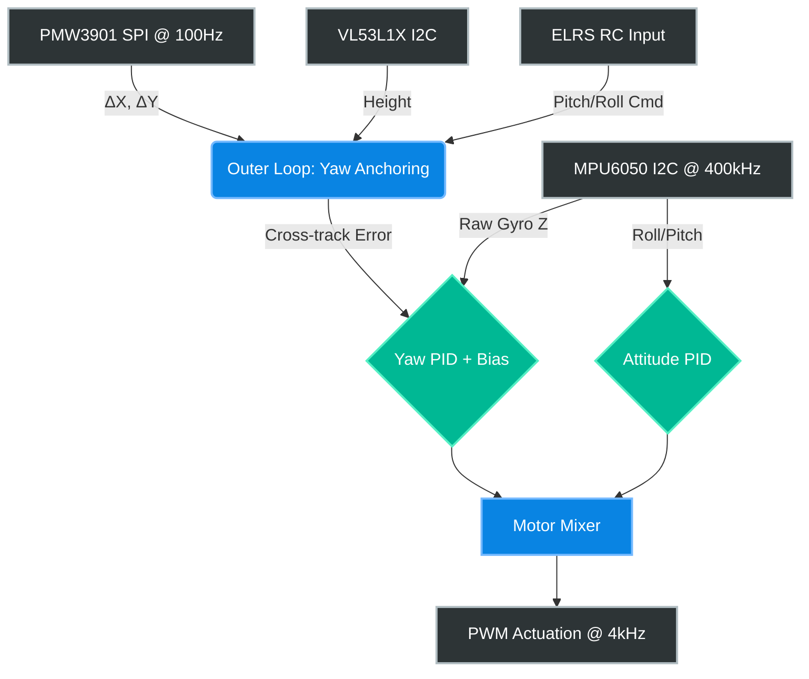

# MISSION CONTEXT: SENSOR FUSION MERGE & YAW ANCHORING
**Role:** Senior Embedded Flight Control Engineer
**Target Platform:** ESP32-S3 Supermini (Dual-core, FPU enabled)
**Actuation:** 8520 Coreless Motors running at 4kHz PWM (via `drn_timer_pwm.c`)

## 1. HARDWARE & ARCHITECTURE STATUS
The flight controller is currently split into two independent modules that need to be merged into a unified Cascaded PID system.

**Module A: Main Flight Controller (File: `flycode_Yaw_ok_thang5.ino`)**
- **Sensors:** MPU6050 (Attitude via I2C at 400kHz) + VL53L1X (Altitude Hold via I2C).
- **Current State:** Achieved stable hover and Altitude Hold. The Yaw axis is stabilized to ~90% using extreme Gyro Bias Calibration (Auto-Zero), an I-term PID, and a Deadband filter.
- **Deficiency:** Lacks absolute heading reference. Macro-drift on the Yaw axis still occurs over time.

**Module B: Optical Flow Subsystem (File/Tab: `Optical Sensor-v5`)**
- **Sensor:** PMW3901 (Optical Flow via SPI).
- **Current State:** Successfully initialized and running in **Motion Mode**. Frame grab bottleneck resolved. The non-blocking `millis()` loop outputs $\Delta X$ and $\Delta Y$ effectively at 100Hz.
- **Deficiency:** Currently isolated. Not yet feeding data to the flight control loop.

## 2. THE OBJECTIVE (YOUR TASK)
I need you (Claude) to merge Module B into Module A to execute **Yaw Anchoring (Cross-track Error Correction)**, fixing the remaining 10-15% Yaw drift. 

Please provide the fully merged `.ino` code fulfilling these specific requirements:
1. **SPI Integration:** Move the PMW3901 SPI initialization and 100Hz non-blocking read logic from the test file into the `setup()` and `loop()` of `flycode_Yaw_ok_thang5.ino`.
2. **Velocity Scaling:** Scale the raw $\Delta X$ and $\Delta Y$ from the PMW3901 using the `filteredHeight` from the VL53L1X to approximate actual planar velocity.
3. **Yaw Anchoring Math:** Implement an Outer Loop calculation: When the RC input commands strictly forward flight (high Pitch, near-zero Roll), use `atan2f(Delta_X, Delta_Y)` to detect the cross-track slip angle.
4. **PID Injection:** Inject this computed slip angle as an error correction term into the existing Yaw PID controller to force the drone to lock its heading to the actual trajectory vector.

## 3. TARGET SYSTEM ARCHITECTURE (VISUALIZED)

**Output Requirement:** Do not explain basic concepts. Output the complete, refactored C++ code ready for flashing.