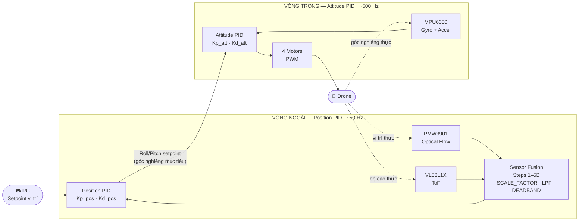
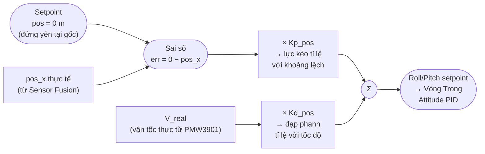

# PMW3901 — Hướng dẫn Calibrate & Tune Thông số

**Phạm vi:** Step 5B (hiệu chuẩn cảm biến) và Step 6 (tune Position PID) trong pipeline Sensor Fusion v3.  
**Liên quan:** `v3.ino`, PMW3901 Optical Flow, VL53L1X ToF, MPU6050.

---

## 1. Kiến trúc điều khiển — "Mắt, Não, và Cơ bắp"

Trước khi đi vào thông số, cần nắm rõ **mỗi cảm biến đóng vai gì** trong hệ thống:

| Vòng | Tên | Cảm biến | Vai trò |
|---|---|---|---|
| Inner Loop | Attitude / Rate PID | MPU6050 | **Tiền đình** — giữ thăng bằng, chống lật |
| Outer Loop | **Position PID** | **PMW3901 + ToF** | **Mắt + Não** — giữ vị trí, chống trôi |

### Sơ đồ Cascade PID — Toàn cảnh hệ thống

Hai vòng không hoạt động độc lập. Chúng nối tầng nhau: **đầu ra của Vòng Ngoài chính là lệnh đầu vào của Vòng Trong.** Đây là trái tim của kiến trúc Cascade PID.



### Sự khác biệt giữa hai vòng

|  | Vòng Trong (Inner Loop) | Vòng Ngoài (Outer Loop) |
|---|---|---|
| **Tốc độ** | Nhanh — ~500 Hz | Chậm hơn — ~50 Hz |
| **Cảm biến** | MPU6050 (Gyro + Accel) | PMW3901 + VL53L1X ToF |
| **Đơn vị xử lý** | Độ (°), rad/s | Mét (m), m/s |
| **Đầu vào** | Góc Roll/Pitch mục tiêu | Tọa độ `pos_x`, `pos_y` |
| **Đầu ra** | PWM → 4 motors trực tiếp | Roll/Pitch setpoint → Vòng Trong |
| **Mục tiêu** | Giữ thăng bằng — chống lật | Giữ vị trí — chống trôi |
| **Tune ở bước nào** | Riêng biệt, ngoài phạm vi tài liệu này | **Step 6** |

> **Cách nhớ nhanh:** Vòng Ngoài *quyết định muốn bay về đâu*, Vòng Trong *thực thi lệnh đó bằng cách nghiêng cánh*. Nếu Vòng Trong không ổn định, Vòng Ngoài cũng vô nghĩa — phải tune Inner trước, Outer sau.

---

> **Ranh giới quan trọng nhất của toàn bộ tài liệu này:**  
> PMW3901 chỉ là **đôi mắt** — nhiệm vụ của nó kết thúc ngay khi nó báo xong tọa độ `pos_x`, `pos_y`. Nó không có cơ bắp, không có PID bên trong. Vòng lặp PID nằm trong **ESP32**, dùng dữ liệu của PMW3901 làm đầu vào.
>
> - **Step 5 = "Khám mắt":** Mắt phải sáng, nhìn 10 cm phải ra đúng 10 cm.  
> - **Step 6 = "Huấn luyện cơ bắp":** Mắt đã sáng rồi — giờ mới chỉnh drone biết phản xạ mạnh hay nhẹ khi bị gió thổi lệch.

---

## 2. Step 5B — Hiệu chuẩn "Thước đo Không gian"

Mục tiêu tối thượng của Step 5B là kiểm định **2 thông số cốt lõi** đảm bảo hệ thống hiểu đúng thế giới vật lý — tức là dịch chính xác từ những pixel quang học vô hình sang hệ Mét mà bộ não PID có thể tính toán được.

---

### 2.1 `SCALE_FACTOR` — Người "Thông dịch viên" Pixel → Mét

PMW3901 là một cái camera. Cả đời nó chỉ biết **đếm pixel trôi qua**. Nó không biết nó đang bay cách mặt đất bao xa, không biết góc ống kính là bao nhiêu. Hệ quả: cùng 100 pixel trôi qua, nhưng nếu bay ở độ cao 10 cm thì = 2 cm di chuyển; nếu bay ở 10 m thì = 2 m di chuyển!

`SCALE_FACTOR` (kết hợp với ToF báo độ cao thực $Z_{true}$) chính là "thông dịch viên" dịch từ ngôn ngữ Pixel sang hệ Mét để bộ não PID hiểu được.

| Tình huống | Triệu chứng | Hành động |
|---|---|---|
| ✅ PASS | Trượt 10 cm → `px` ra `0.090 m` đến `0.110 m` | Không cần chỉnh |
| ❌ Đo hụt | Trượt 10 cm → `px` chỉ ra `~0.060 m` (thước đo đang ngắn) | **Tăng** `SCALE_FACTOR` |
| ❌ Đo lố | Trượt 10 cm → `px` phóng lên `~0.150 m` (thước đo đang giãn) | **Giảm** `SCALE_FACTOR` |

**Công thức chỉnh nhanh:**
```
SCALE_FACTOR_MỚI = SCALE_FACTOR_CŨ × (Khoảng_cách_thực / px_đo_được)
```
*Ví dụ: đo hụt 6 cm → `0.0012 × (0.100 / 0.060) = 0.0020`*

---

### 2.2 `POS_DEADBAND` — Lớp khiên chống "Trôi dạt Tích phân"

Ngay cả khi drone nằm im phăng phắc trên bàn, PMW3901 vẫn rỉ ra nhiễu vận tốc siêu nhỏ, chừng 0.001 m/s. Nghe vô hại, nhưng bộ vi xử lý cộng dồn 250 lần mỗi giây — sau 1 phút đứng im, drone sẽ *tưởng* nó đã trôi đi 6 cm. Sau 10 phút, nó tưởng đã trôi đi 60 cm. Cảm giác drone cứ lặng lẽ trôi lùi dù không có gió khi bay FPV chính là "căn bệnh" này.

`POS_DEADBAND` ra đời để "chặn họng" nhiễu đó: *"Nếu vận tốc dưới ngưỡng này, coi như bằng 0 hết!"* Step 5B kiểm tra thêm một thử thách khắc nghiệt hơn Step 5A: **ngắt nhiễu dội lại sau khi phanh đột ngột**.

| Tình huống | Triệu chứng | Hành động |
|---|---|---|
| ✅ PASS | Sau khi dừng đột ngột, `px` đóng băng ngay lập tức | Không cần chỉnh |
| ❌ FAIL | `px` tiếp tục nhích lên/xuống vài mm sau khi dừng | **Tăng nhẹ** `POS_DEADBAND` (ví dụ: `0.010` → `0.015`) |

> ⚠️ Tăng `POS_DEADBAND` quá cao sẽ làm drone điếc với các chuyển động chậm hợp lệ. Chỉ tăng từng bước nhỏ.

---

## 3. Setup vật lý bắt buộc cho bài test

**Tuyệt đối không cầm board lơ lửng trên tay để test.** Mục tiêu của setup bên dưới là phải *lừa được* con MPU6050 và xuyên thủng được "hố đen" Deadband bằng cách tạo điều kiện vật lý lý tưởng:

```
Bước 1: Đặt drone phẳng lên hộp giấy cao 10–15 cm
Bước 2: Đặt hộp lên tờ báo / tấm thảm vải (bề mặt sần để hộp không trượt tự do)
Bước 3: Nắm vào hộp, đẩy trượt ngang DỨT KHOÁT 10 cm trong ~0.5–1 giây
Bước 4: Giữ chặt hộp đứng im hoàn toàn
```

**Tại sao cách này đảm bảo test hợp lệ:**

- Mặt phẳng hộp giấy → góc nghiêng = 0° tuyệt đối → **Gyro im lặng** (`comp = 0`), toàn bộ `flow` được dịch thành quãng đường, không bị trừ đi
- Độ cao cố định → camera thu đủ **~80 pixel** / 10 cm
- Đẩy dứt khoát → vận tốc tạo ra ~0.1 m/s, dễ dàng **xuyên thủng "hố đen"** `POS_DEADBAND` (ngưỡng 0.010 m/s)

---

## 4. Giải phẫu lỗi Step 5B — Tại sao kéo bằng tay thì `px = 0.000`?

Nếu bạn cầm board lơ lửng trên tay và thấy `px` không nhúc nhích, thuật toán đang hoạt động **đúng như thiết kế** — nó đang chống lại chính đôi tay của bạn qua 3 tầng lọc liên tiếp:

### Tầng 1 — Camera bị "mù" (totX quá nhỏ)

```
[S2] dX=0 dY=0 | totX=6 totY=-25 | flow=0.0000 comp=0.0003
```

Lý thuyết: trượt 10 cm ở độ cao ~74 cm phải thu được **~80 pixel** (`totX ≈ 80`).  
Thực tế log: `totX = 6` — camera bỏ lỡ hơn **90% quãng đường thực tế**.

Nguyên nhân: tay cầm lơ lửng làm độ cao dao động liên tục → camera mất tiêu cự, bỏ lỡ gần như toàn bộ pixel. Đây là lỗi setup vật lý, không phải lỗi code hay lỗi cảm biến.

---

### Tầng 2 — Gyro "đánh nhau" với Camera

```
[S2] flow=0.0012   comp=0.0015
```

Phương trình Step 2: `V_thực = flow − comp`

Tay người dù cố giữ phẳng vẫn luôn bị rung và nghiêng nhẹ. MPU6050 cực kỳ nhạy bén — nó phát hiện ra điều đó và nghĩ: *"drone đang bị nghiêng do gió, không phải đang tịnh tiến thật"*. Nó lấy `flow` trừ thẳng cho `comp`, vô tình triệt tiêu luôn cả quãng đường thực của bạn.

Kết quả: `comp (0.0015) > flow (0.0012)` → `V_thực < 0` → thuật toán xóa sạch vận tốc.

---

### Tầng 3 — "Hố đen" POS_DEADBAND

```
[S3] Vraw_x=0.0002 Vraw_y=0.0002 OK
```

Sau 2 tầng trên, vận tốc còn sót lại chỉ là `0.0002 m/s` (tức 0.2 mm/s — cực kỳ chậm).  
Ngưỡng `POS_DEADBAND = 0.010 m/s` → `0.0002 < 0.010` → ép `Vx = 0.000` → phép tích phân không có gì để cộng dồn → `px` đóng băng ở `0.000 m`.

**Kết luận:** Cả 3 tầng lọc hoạt động chính xác 100% như thiết kế. `px = 0.000` là đúng — drone đang báo cáo trung thực rằng không nhận ra chuyển động hợp lệ nào. Lỗi nằm ở điều kiện test vật lý.

---

## 5. Step 6 — Tune Position PID (Trùm cuối)

**Step 6 là bước tune PID cuối cùng** cho tính năng Position Hold. Không có bước nào sau đó nữa.

Đây là lúc "nguyên liệu sạch" (tọa độ `pos_x`, `pos_y` đã được xác nhận chuẩn ở Step 5) chính thức được bơm vào "bộ não" (phương trình PID) để tự động ghi đè lên lệnh Roll/Pitch. Bạn chuyển `CALIBRATION_MODE = 0`, tắt cáp, cắm pin, bay lơ lửng, nhả cần — và chỉnh 2 chỉ số dưới đây cho đến khi drone dừng lại mượt mà như xe có phanh ABS.

### Điều kiện tiên quyết
- `CALIBRATION_MODE = 0`
- Step 5B đã PASS: `px`, `py` đã xác nhận đúng với thực tế

### Luồng dữ liệu bên trong Vòng Ngoài (Position PID)

Đây là cái "bộ não" mà bạn sẽ tune ở Step 6. Sơ đồ dưới cho thấy từng con số đi qua đâu trước khi ra lệnh cho drone nghiêng:



Khâu **P** kéo drone về, khâu **D** phanh lại đúng lúc để không bị vọt lố. Đây cũng là lý do `V_real` (từ Step 4) quan trọng đến vậy — nó là nhiên liệu đầu vào trực tiếp cho khâu D.

### Hai thông số cần tune tại Step 6

| Thông số | Tên gọi | Nhiệm vụ | Quá nhỏ | Quá lớn |
|---|---|---|---|---|
| `Kp_pos` | Hệ số Kéo (P) | Nhìn vào sai số vị trí → nghiêng drone về điểm gốc | Drone trôi tự do, phục hồi ì ạch | Drone giật mạnh, lảo đảo |
| `Kd_pos` | Hệ số Phanh (D) | Nhìn vào `V_real` → hãm quán tính khi về gốc | Drone bay vọt lố qua vạch đích (overshoot) | Drone phanh quá sớm, rung lắc |

Khi khâu P kéo drone về gốc, quán tính sẽ làm nó bay vọt qua vạch đích. Lúc đó khâu D "đạp phanh" tỉ lệ với tốc độ di chuyển — đây chính là lý do `V_real` ở Step 4 quan trọng đến vậy: nó là dữ liệu đầu vào trực tiếp cho khâu D.

> **Lưu ý:** Thường **không dùng `Ki_pos`** trong Position PID của drone vì dễ gây tích lũy sai số → drone lượn vòng tròn liên tục (toilet bowl effect).

---

## Phụ lục — Tại sao không để PMW3901 "tự lo"?

Không phải vì cảm biến "đo sai" — mà vì **bản chất cảm biến rất "ngốc"**, chỉ nhìn thấy một góc cực kỳ chật hẹp của thực tại. Cái quá trình nhọc nhằn bạn vừa trải qua có một cái tên học thuật: **Sensor Fusion (Dung hợp cảm biến)**.

| # | Vấn đề | Analogy | Giải pháp |
|---|---|---|---|
| 1 | PMW3901 nói tiếng **Pixel**, PID cần tiếng **Mét** | Camera không biết nó đang bay cao hay thấp | `SCALE_FACTOR` + ToF làm "thông dịch viên" |
| 2 | Drone nghiêng → camera thấy mặt đất trôi → tưởng đang bay | Lắc đầu nhìn trái phải → mắt thấy cảnh vật trôi nhưng người đứng im | MPU6050 "tiền đình" trừ đi góc nghiêng (`flow − comp`) |
| 3 | Nhiễu nhỏ tích phân theo thời gian → drift tọa độ | 0.001 m/s × 10 phút = 60 cm drift dù drone đứng im | `POS_DEADBAND` "chặn họng" nhiễu dưới ngưỡng |

DJI, Tesla, SpaceX — tất cả đều làm y hệt: lấy mắt (PMW3901) + tiền đình (MPU6050) + thước đo độ cao (ToF VL53L1X) + bộ lọc toán học (LPF, Deadband, Scale) để tạo ra một "Sự thật duy nhất" đáng tin cậy.

---

*Tổng hợp từ session debug Step 5B — Project Windify, Group 21.*