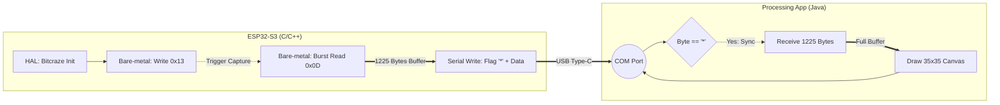

# 📝 Project Log: PMW3901 Optical Flow Sensor Integration
**Platform:** ESP32-S3 Supermini
**Peripheral:** PMW3901 (SPI Interface)
**Status:** In Progress - Pipeline Validation Phase

---

## 🤖 CONTEXT FOR AI AGENTS
**Instruction for LLM/AI Reader:** This document contains the conversational context, technical debate, and implementation strategy for interfacing an ESP32-S3 with a PMW3901 optical flow sensor. The primary objective is to extract raw frame data (35x35 pixels) for visual validation and retrieve motion data (Delta X/Y). When assisting the user based on this document, maintain a highly technical tone, prioritize bare-metal C++ approaches (register manipulation) when HAL is insufficient, and structure outputs with clear Markdown/Mermaid visualizations. 

---

## 1. Yêu cầu ban đầu & Phân tích (Initial Context)
Dự án bắt nguồn từ một cuộc hội thoại yêu cầu giải quyết 2 bài toán với cảm biến quang học (được xác định là **PMW3901**):
1.  **Hiển thị 35 pixel:** Đọc ma trận ảnh thô 35x35 (1225 pixels) từ cảm biến để xem bề mặt.
2.  **Tracking di chuyển:** Nhận diện hướng di chuyển (trái/phải/lên/xuống).
3.  **Tình trạng phần cứng:** Hiện tại đang có ESP32-S3 Supermini và module PMW3901. Tạm thời chưa có màn hình OLED I2C/SPI phần cứng.

---

## 2. Chiến lược giải quyết & Technical Trade-offs

Để đáp ứng yêu cầu trong điều kiện thiếu màn hình vật lý, hệ thống được thiết kế theo mô hình **Client-Server qua USB CDC**:
* **Transmitter (ESP32-S3):** Đọc dữ liệu từ PMW3901 và đẩy qua cổng Serial ảo.
* **Receiver (PC - Processing App):** Lắng nghe cổng COM, dùng State Machine (máy trạng thái) để hứng luồng byte và render bằng Java 2D.

### Vấn đề kỹ thuật cốt lõi (The HAL vs. Bare-metal Trade-off):
Thư viện phổ biến nhất cho PMW3901 (`Bitcraze_PMW3901`) **không cung cấp API** để đọc thanh ghi chứa dữ liệu ảnh thô (Frame Buffer - Register `0x0D`), vì nó chỉ được thiết kế để lấy tọa độ bay (Delta X/Y).

**Giải pháp Hybrid được áp dụng:**
1.  Sử dụng thư viện (`flow.begin()`) như một Hardware Abstraction Layer (HAL) để xử lý toàn bộ chuỗi khởi tạo (Initialization sequence) phức tạp của chip.
2.  **Bypass thư viện (Direct Register Manipulation):** Tự viết hàm thao tác trực tiếp với SPI vật lý để ghi lệnh vào thanh ghi Capture (`0x13`) và thực hiện **SPI Burst Read** để kéo 1225 bytes từ thanh ghi `0x0D`.

---

## 3. System Architecture & Data Flow
Dưới đây là sơ đồ luồng dữ liệu (Data Pipeline) từ khi khởi tạo đến khi render.

---

## 4. Các hướng đi đang bị "mờ" (Pending Clarifications & Edge Cases)

Để hoàn thiện kiến trúc phần mềm, đặc biệt là nếu module này được đưa vào hệ thống điều khiển bay (Quadcopter/Drone), các vấn đề sau cần được xác nhận với người giao task:

### ⚠️ Khúc mắc 1: Giao diện hiển thị cuối cùng (Final Display Medium)
* **Trạng thái hiện tại:** Đang hiển thị ảnh thô qua phần mềm Processing trên máy tính để debug.
* **Câu hỏi xác nhận:** *Dự án có bắt buộc phải tích hợp màn hình OLED (I2C) lên bo mạch vật lý ở giai đoạn sau không, hay tính năng Frame Grab này chỉ dùng một lần để căn chỉnh (calibration) ống kính cảm biến?*
* **Hệ quả:** Nếu cần OLED, vi điều khiển sẽ phải gánh thêm tác vụ render đồ họa (tốn CPU và RAM), cần cân nhắc kiến trúc RTOS hoặc DMA để không block luồng đọc SPI.

### ⚠️ Khúc mắc 2: Mục đích sử dụng dữ liệu Motion (Data Sink)
* **Trạng thái hiện tại:** Đã biết cách lấy Delta X và Delta Y.
* **Câu hỏi xác nhận:** *Tọa độ Delta X/Y sẽ được tiêu thụ (consume) như thế nào? Chỉ hiển thị dưới dạng Vector mũi tên, hay sẽ được đẩy vào bộ lọc (Complementary/Kalman Filter) và vòng lặp PID để thực hiện chức năng Position Hold?*
* **Hệ quả:** Nếu dùng cho PID, tần số đọc (polling rate) của SPI phải cực kỳ nghiêm ngặt và ổn định (ví dụ 100Hz - 500Hz). Hàm đọc Frame Grab (chụp ảnh) tốn nhiều thời gian và sẽ làm trễ (delay) vòng lặp PID, nên có thể phải cấm chụp ảnh khi đang bay.

### ⚠️ Khúc mắc 3: Kiến trúc tích hợp mã nguồn (Source Code Integration)
* **Trạng thái hiện tại:** Đang chạy dưới dạng file script `.ino` độc lập trên ESP32-S3.
* **Câu hỏi xác nhận:** *Code này có cần thiết kế thành các module C/C++ rời rạc (tách file `.h`, `.c/.cpp`) và ném vào thư mục `src/`, `include/` để chuẩn bị hợp nhất với firmware chính của Quadcopter không?*
* **Hệ quả:** Nếu có, cần loại bỏ tư duy viết code trong hàm `loop()` của Arduino và chuyển sang viết các class/struct quản lý driver ngoại vi chuẩn mực hơn.