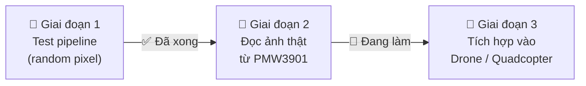
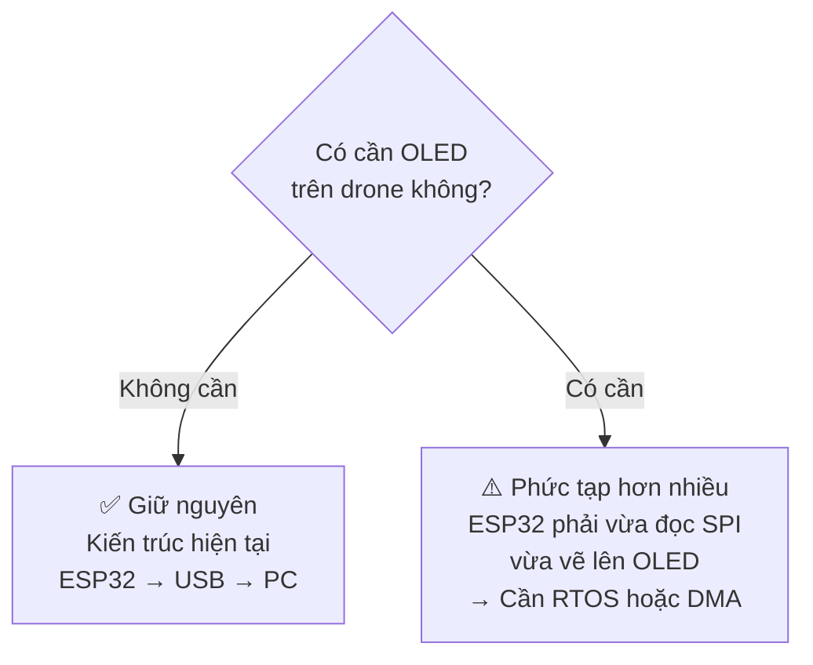
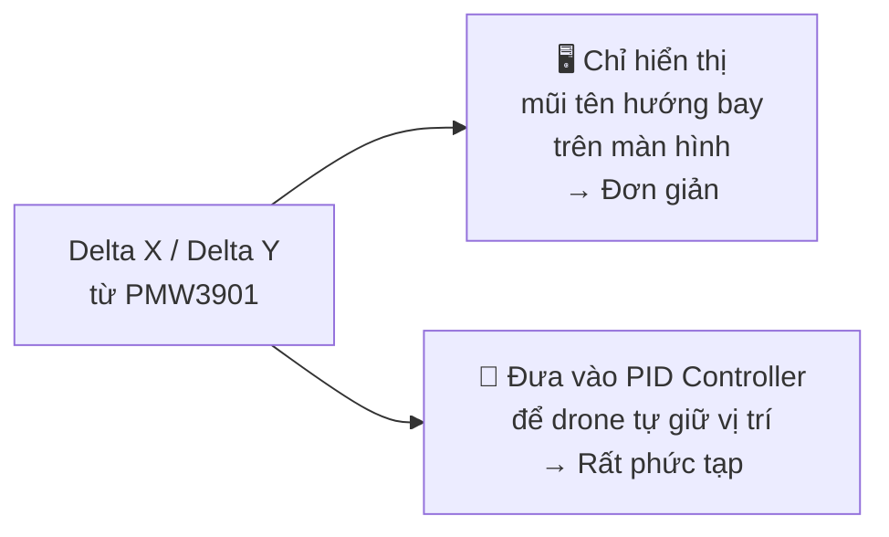
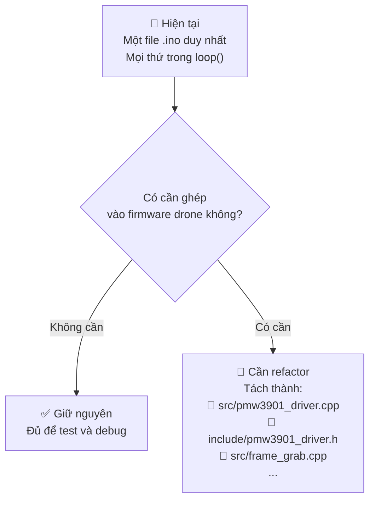
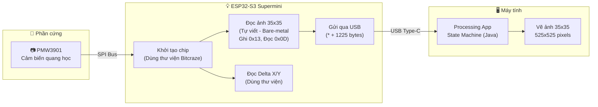

# 🧩 Giải thích dự án PMW3901 cho Newbie
> Tài liệu này giải thích file `PMW3901-debate-question.md` theo ngôn ngữ dễ hiểu,
> dựa trên những gì bạn đã ghi lại trong 3 file nhật ký PDF.

---

## ✅ Bức tranh toàn cảnh: Bạn đang làm gì?

Hãy hình dung bạn đang xây một **con mắt điện tử** cho một chiếc drone nhỏ.
Con mắt đó là chip **PMW3901** — nó nhìn xuống sàn và biết drone đang trôi về hướng nào.

Chuỗi công việc của bạn đang đi theo đúng 3 bước:



**Bạn vừa hoàn thành Giai đoạn 1** — pipeline truyền dữ liệu từ ESP32 → máy tính → vẽ ảnh đã chạy được (ảnh nhiễu trắng ngẫu nhiên đã hiện ra trên Processing).

---

## 📖 File `.md` đang nói về điều gì?

File `PMW3901-debate-question.md` là một **tài liệu hội ý nội bộ** — giống như một tờ giấy ghi chép trước cuộc họp. Nó tóm tắt:

| Phần | Nội dung | Bạn đã hiểu chưa? |
|------|----------|-------------------|
| Section 1 | Yêu cầu ban đầu (đọc ảnh 35x35 + tracking hướng đi) | ✅ Rõ |
| Section 2 | Chiến lược Hybrid (dùng thư viện để init, tự viết để đọc ảnh) | ✅ Ghi trong Quick_Explanation |
| Section 3 | Sơ đồ luồng dữ liệu | ✅ Ghi trong Optical_Sensor-v1 |
| **Section 4** | **3 câu hỏi chưa có đáp án ⬅ Đây là phần "mờ" nhất** | ❓ Chưa rõ |

---

## 🔍 Giải mã Section 4: Ba câu hỏi "ngã ba đường"

Hãy tưởng tượng bạn đang đi trên một con đường, và có **3 ngã ba** quan trọng phía trước. Mỗi hướng rẽ sẽ ảnh hưởng lớn đến cách bạn viết code.

### ⚠️ Ngã ba 1: Màn hình OLED — Có cần không?

```
Hiện tại:  ESP32 --> USB --> Máy tính (Processing vẽ ảnh)
Tương lai?: ESP32 --> OLED mini gắn trên drone (không cần máy tính)
```

**Câu hỏi đơn giản:** *Tính năng "xem ảnh" này chỉ dùng 1 lần để kiểm tra lens cảm biến, hay phải hiển thị liên tục trên drone thật?*



> **RTOS** (Real-Time Operating System): Giống như thuê thêm nhân viên để làm việc song song.
> **DMA** (Direct Memory Access): Bộ chuyển hàng tự động, không cần CPU canh chừng.

**Hệ quả thực tế:** Nếu cần OLED, ESP32 sẽ bị "đa nhiệm" — vừa đọc cảm biến, vừa render ảnh → dễ bị lag. Cần thiết kế lại kiến trúc phần mềm.

---

### ⚠️ Ngã ba 2: Dữ liệu Delta X/Y — Dùng để làm gì?

PMW3901 cho bạn biết **drone đang trôi bao nhiêu pixel** theo chiều ngang và dọc mỗi frame. Gọi là **Delta X** và **Delta Y**.

```
Delta X = +5  →  Drone đang trôi sang phải 5 pixel
Delta Y = -3  →  Drone đang trôi lên trên 3 pixel
```

**Câu hỏi đơn giản:** *Bạn lấy số đó để làm gì tiếp theo?*



**Nếu chỉ hiển thị:** Thoải mái, không áp lực về tốc độ.

**Nếu dùng cho PID:** Đây là vấn đề lớn hơn nhiều.

```
PID Controller = Bộ não tự lái của drone
Nó cần đọc Delta X/Y rất nhanh và đều (100-500 lần/giây)

Vấn đề: Lệnh "chụp ảnh frame" (Frame Grab) mất rất nhiều thời gian
         → Sẽ làm chậm vòng lặp PID
         → Drone có thể bị lắc, mất kiểm soát
```

> **Kết luận thực tế:** Nếu dùng cho drone thật, khi bay thì **tắt tính năng chụp ảnh**, chỉ bật khi debug.

---

### ⚠️ Ngã ba 3: Code viết kiểu "script" hay kiểu "thư viện chuyên nghiệp"?

Hiện tại bạn đang viết code trong một file `.ino` duy nhất. Cách này nhanh, dễ test, nhưng khó ghép vào firmware lớn hơn.



**Giải thích đơn giản:**

| Cách | Giống như | Ưu điểm | Nhược điểm |
|------|-----------|---------|------------|
| File `.ino` đơn | Viết tất cả vào 1 tờ giấy | Nhanh, dễ | Khó chia sẻ, khó ghép vào dự án lớn |
| Module `.h/.cpp` | Viết sách có chương mục | Chuyên nghiệp, dễ tái sử dụng | Cần thêm thời gian setup |

---

## 🗺️ Toàn bộ kiến trúc hệ thống (Nhìn lại từ đầu)



---

## 🎯 Tóm tắt: File `.md` đó đang hỏi gì?

File đó không phải tài liệu kỹ thuật — nó là **danh sách câu hỏi cần trả lời trước khi tiếp tục**. Giống như trước khi xây nhà, bạn cần xác nhận:

```
❓ Ngã ba 1: Bạn có cần màn hình OLED gắn trên drone không?
             → Nếu có: Kiến trúc phức tạp hơn nhiều.

❓ Ngã ba 2: Delta X/Y dùng để hiển thị hay dùng cho PID tự lái?
             → Nếu PID: Phải tối ưu tốc độ đọc, không được chụp ảnh khi bay.

❓ Ngã ba 3: Code cần ghép vào firmware drone lớn hơn không?
             → Nếu có: Phải refactor từ .ino sang module C++ chuyên nghiệp.
```

**Bạn chưa cần trả lời ngay** — nhưng câu trả lời sẽ quyết định bước tiếp theo của bạn là gì.

---

## 🚀 Bước tiếp theo ngay bây giờ (Không phụ thuộc vào 3 câu hỏi trên)

Dù trả lời thế nào, bước tiếp theo trước mắt vẫn là:

```
1. Đấu dây SPI:
   PMW3901 → ESP32-S3 Supermini
   VCC  → 3.3V
   GND  → GND
   SCK  → GPIO 7
   MOSI → GPIO 5
   MISO → GPIO 6
   CS   → GPIO 4

2. Thay đoạn code random() bằng lệnh đọc SPI thật:
```

```cpp
// ❌ XÓA ĐOẠN NÀY (dữ liệu giả)
for(int i = 0; i < TOTAL_PIXELS; i++) {
    frameBuffer[i] = random(0, 256);
}

// ✅ THAY BẰNG ĐOẠN NÀY (dữ liệu thật từ PMW3901)
// Bước 1: Ra lệnh chụp ảnh (gõ cửa phòng 0x13)
writeRegister(0x13, 0x83);
delayMicroseconds(1500); // Chờ chip chụp xong

// Bước 2: Đọc burst 1225 bytes từ frame buffer (phòng 0x0D)
burstReadRegister(0x0D, frameBuffer, TOTAL_PIXELS);
```

> Phần còn lại của pipeline (gửi `*` rồi gửi 1225 bytes, Processing vẽ) **giữ nguyên 100%** — bạn không cần sửa gì cả.

---

*Tài liệu này được tạo dựa trên nhật ký: `Quick_Explanation-v1.pdf`, `Optical_Sensor-v1.pdf`, `Optical_Sensor-v2.pdf`*
