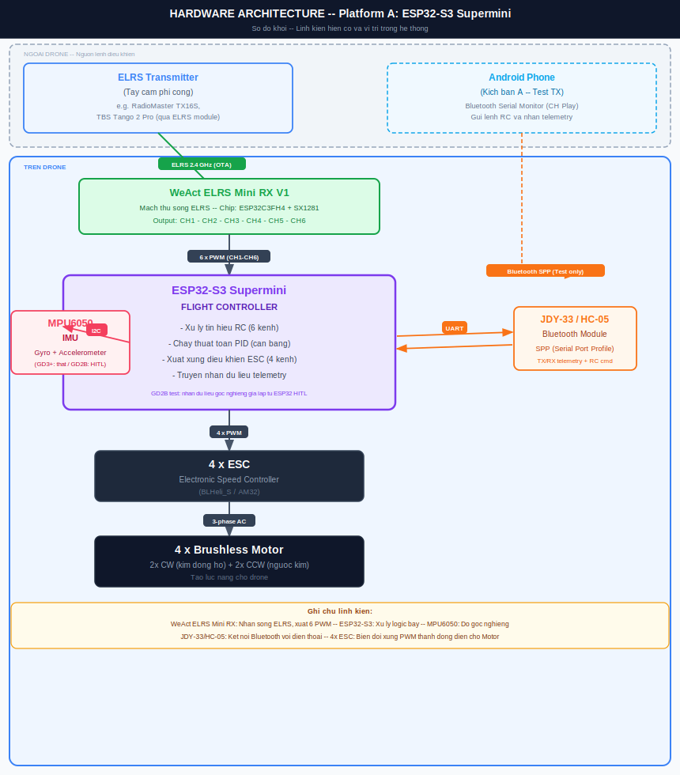
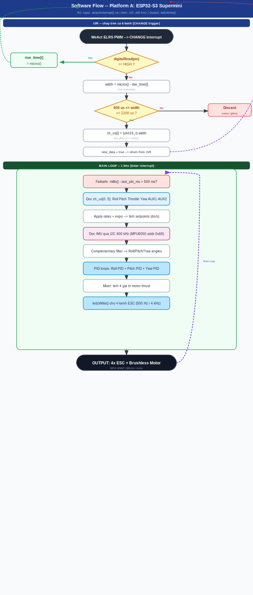
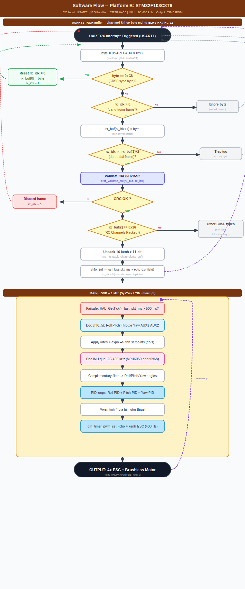
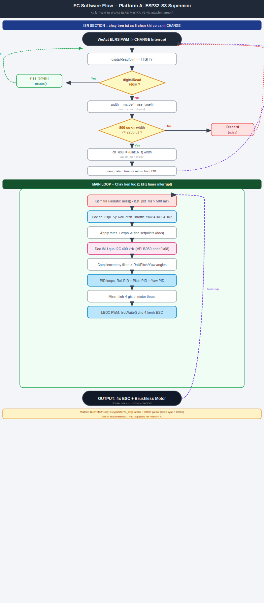
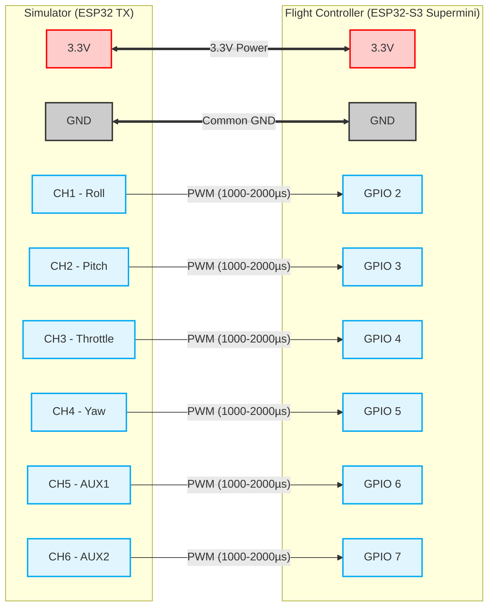

# RC Drone Flight Controller — Nhật Ký Đồ Án

> **Scope:** Kiến trúc hệ thống RC Drone từ RF link đến motor output. Hardware: ESP32-S3 Supermini (Platform A) + STM32F103C8T6 (Platform B).

---

## Mục Lục

**Lý Thuyết Chung**
- [1. System Overview — Tổng Quan Hệ Thống](#1-system-overview--tổng-quan-hệ-thống)
  - [1.1 RC Drone Architecture — Kiến Trúc Hệ Thống](#11-rc-drone-architecture--kiến-trúc-hệ-thống)
  - [1.2 PID Control Loop — Vòng Điều Khiển Bay](#12-pid-control-loop--vòng-điều-khiển-bay)
- [2. Signal Chain — Chuỗi Tín Hiệu Điều Khiển](#2-signal-chain--chuỗi-tín-hiệu-điều-khiển)
  - [2.1 RC Channel — Kênh Điều Khiển](#21-rc-channel--kênh-điều-khiển)
  - [2.2 PWM — Pulse Width Modulation](#22-pwm--pulse-width-modulation)
- [3. Protocol Stack — Phân Tầng Giao Thức](#3-protocol-stack--phân-tầng-giao-thức)
  - [3.1 Layer Map — Air Protocol vs Wire Protocol](#31-layer-map--air-protocol-vs-wire-protocol)
  - [3.2 ELRS vs CRSF — Sóng Trên Trời vs Dây Dưới Đất](#32-elrs-vs-crsf--sóng-trên-trời-vs-dây-dưới-đất)
  - [3.3 CRSF Frame Structure — Cấu Trúc Gói Tin](#33-crsf-frame-structure--cấu-trúc-gói-tin)
- [4. Hardware Reference — TBS Tango 2 Pro TX System](#4-hardware-reference--tbs-tango-2-pro-tx-system)
  - [4.1 Common Misconception — TX vs RX](#41-common-misconception--tx-vs-rx)
  - [4.2 TBS Tango 2 Pro — Internal Block Diagram (TX Side)](#42-tbs-tango-2-pro--internal-block-diagram-tx-side)
  - [4.3 HC-12 Mapping — Vị Trí Tương Đương Trong Hệ Thống TBS](#43-hc-12-mapping--vị-trí-tương-đương-trong-hệ-thống-tbs)
- [5. Comparison Table — RF Link & Protocol](#5-comparison-table--rf-link--protocol)
- [6. Design Discussion — RC Input vs IMU Simulation](#6-design-discussion--rc-input-vs-imu-simulation)
  - [6.1 Problem Statement — Hai Hướng Tiếp Cận](#61-problem-statement--hai-hướng-tiếp-cận)
  - [6.2 Hardware Compatibility Matrix — Ai Đúng Với RX Nào?](#62-hardware-compatibility-matrix--ai-đúng-với-rx-nào)
  - [6.3 PID Loop Dependency — Tại Sao Cần Cả Hai](#63-pid-loop-dependency--tại-sao-cần-cả-hai)

**Sơ Đồ Hệ Thống**
- [7. Block Diagram — Sơ Đồ Kiến Trúc Phần Cứng](#7-block-diagram--sơ-đồ-kiến-trúc-phần-cứng)
- [8. Software Flow — Sơ Đồ Luồng Phần Mềm FC](#8-software-flow--sơ-đồ-luồng-phần-mềm-fc)
  - [8A. Platform A — ESP32-S3 Supermini](#8a-platform-a--esp32-s3-supermini)
  - [8B. Platform B — STM32F103C8T6](#8b-platform-b--stm32f103c8t6)

**Triển Khai Thực Tế**
- [9. Implementation Notes — Ghi Chú Triển Khai](#9-implementation-notes--ghi-chú-triển-khai)
  - [9.1 Bill of Materials (BOM) — Linh Kiện Hiện Có](#91-bill-of-materials-bom--linh-kiện-hiện-có)
  - [9.2 Dual-Platform Architecture — Independent Parallel](#92-dual-platform-architecture--independent-parallel-cách-a)
  - [9.3 Wiring Diagram — WeAct ELRS Mini RX → ESP32-S3](#93-wiring-diagram--weact-elrs-mini-rx--esp32-s3)
  - **Platform A — ESP32-S3 Supermini**
  - [9.4 Phase 1A — BT Serial: Phone → JDY-33 → ESP32-S3](#94-phase-1a--bt-serial-phone--jdy-33--esp32-s3)
  - [9.5 Phase 1B — PWM Input: WeAct ELRS → 6 CH → ESP32-S3](#95-phase-1b--pwm-input-weact-elrs--6-ch--esp32-s3)
  - [9.6 Phase 2A — RC Input Capture: attachInterrupt() x6](#96-phase-2a-hưng-võ--rc-input-capture-attachinterrupt-x6)
  - [9.7 Phase 2B — HITL IMU Simulation: I2C Slave @ 0x68](#97-phase-2b-bạn--hitl-imu-simulation-i2c-slave--0x68)
  - [9.8 Phase 3 — Real IMU: MPU6050 @ 400 kHz + PID Tuning](#98-phase-3--real-imu-mpu6050--400-khz--pid-tuning)
  - **Platform B — STM32F103C8T6**
  - [9.9 Pin Assignment — STM32F103 Conflict-Free Map](#99-pin-assignment--stm32f103-conflict-free-map)
  - [9.10 PWM Output — TIM3 / drn_timer_pwm.c](#910-pwm-output--tim3--drn_timer_pwmc)
  - [9.11 UART Parser — CRSF Protocol (0xC8 Frame)](#911-uart-parser--crsf-protocol-0xc8-frame)
  - [9.12 Development Roadmap — Lộ Trình Triển Khai](#912-development-roadmap--lộ-trình-triển-khai)
  - [9.13 RC Signal Test Procedure — PWM Input Validation](#913-rc-signal-test-procedure--pwm-input-validation)
---

## 1. System Overview — Tổng Quan Hệ Thống 
[⬆️](#-mục-lục)

### 1.1 RC Drone Architecture — Kiến Trúc Hệ Thống 
[⬆️](#-mục-lục)

Hãy nghĩ đơn giản như điều khiển xe đồ chơi, nhưng phức tạp hơn nhiều:

```
[Tay Cầm Phi Công]  ──sóng radio──►  [Mạch Nhận Trên Drone]  ──dây──►  [Não Drone]  ──dây──►  [4 Motor]
  (Transmitter / TX)     OTA              (Receiver / RX)               (Flight Controller)      (ESC + Motor)
```

**Quadcopter cần 2 luồng thông tin song song để bay:**

| Luồng | Câu hỏi | Nguồn dữ liệu | Giao thức |
|-------|---------|---------------|-----------|
| **Setpoint** | *"Phi công muốn máy bay làm gì?"* | Tay cầm → RX → FC | CRSF / PWM |
| **Current State** | *"Máy bay đang ở trạng thái nào?"* | IMU (MPU6050) → FC | I2C / SPI |

> ⚠️ **Thiếu 1 trong 2 → PID không hoạt động → drone không bay được.**

---

### 1.2 PID Control Loop — Vòng Điều Khiển Bay 
[⬆️](#-mục-lục)

PID = **P**roportional + **I**ntegral + **D**erivative — một thuật toán điều khiển.

**Ví dụ thực tế bằng lái xe ô tô:**

```
Bạn muốn đi 60 km/h  ← đây là SETPOINT (từ tay cầm)
Xe đang đi 40 km/h   ← đây là CURRENT STATE (từ IMU/cảm biến)
Sai số = 60 - 40 = 20 km/h

P: "Sai bao nhiêu thì nhấn ga bấy nhiêu"
I: "Sai lâu rồi mà chưa sửa thì nhấn thêm"
D: "Sai đang giảm nhanh thì bớt nhấn lại"

→ Kết quả: Xe tiến dần về 60 km/h, không vọt lên 80 rồi tụt xuống 50
```

**Áp dụng vào Drone:**
```
Phi công gạt cần sang phải 30%  → Setpoint = "Nghiêng phải 15°"
IMU báo drone đang ở            → Current State = "Đang ở 0° (thẳng)"
Error = 15° - 0° = 15°

PID tính → Motor trái quay nhanh hơn, Motor phải quay chậm lại
Drone từ từ nghiêng sang phải 15°
```

---

## 2. Signal Chain — Chuỗi Tín Hiệu Điều Khiển 
[⬆️](#-mục-lục)

### 2.1 RC Channel — Kênh Điều Khiển 
[⬆️](#-mục-lục)

Một "kênh" = một chiều điều khiển:

| Kênh | Tên | Ý nghĩa | Giá trị |
|------|-----|---------|---------|
| CH1 | Roll | Nghiêng trái/phải | 1000–2000 µs |
| CH2 | Pitch | Nghiêng trước/sau | 1000–2000 µs |
| CH3 | Throttle | Ga (lên/xuống) | 1000–2000 µs |
| CH4 | Yaw | Xoay trái/phải | 1000–2000 µs |
| CH5 | AUX1 | Bật/tắt tính năng | 1000/1500/2000 µs |
| CH6 | AUX2 | Bật/tắt tính năng | 1000/1500/2000 µs |

> `1000 µs` = tối thiểu (trái/dưới/tắt) · `1500 µs` = giữa (trung tâm) · `2000 µs` = tối đa (phải/trên/bật)

### 2.2 PWM — Pulse Width Modulation 
[⬆️](#-mục-lục)

**PWM (Pulse Width Modulation)** = truyền thông tin bằng độ rộng xung điện.

```
CH3 = 1000µs (Ga thấp nhất):
 ▔|_____________________________|▔  (1ms cao, 19ms thấp)

CH3 = 1500µs (Ga giữa):
 ▔▔▔▔▔▔▔▔▔▔▔▔▔▔▔▔|______________|▔  (1.5ms cao, 18.5ms thấp)

CH3 = 2000µs (Ga tối đa):
 ▔▔▔▔▔▔▔▔▔▔▔▔▔▔▔▔▔▔▔▔▔▔▔▔▔▔▔▔▔▔|▔  (2ms cao, 18ms thấp)
```

**Vấn đề của PWM truyền thống:** Cần **1 dây vật lý cho 1 kênh** → 6 kênh = 6 dây.

---

## 3. Protocol Stack — Phân Tầng Giao Thức 
[⬆️](#-mục-lục)

### 3.1 Layer Map — Air Protocol vs Wire Protocol 
[⬆️](#-mục-lục)

```
┌────────────────────────────────────────────────────────────────┐
│  TẦNG ỨNG DỤNG (Application Layer)                            │
│  "Phi công muốn Roll = 15°, Throttle = 60%"                   │
├────────────────────────────────────────────────────────────────┤
│  TẦNG GIAO THỨC DÂY (Wire Protocol — giữa RX và FC)           │
│  ► CRSF Protocol: gói tin UART 420k–1M baud                   │
│  ► PWM: 6 dây vật lý riêng lẻ                                 │
│  ► Custom HC-12: protocol tự định nghĩa qua UART               │
├────────────────────────────────────────────────────────────────┤
│  TẦNG GIAO THỨC SÓNG (Air Protocol — bay trong không khí)     │
│  ► ELRS: LoRa 2.4GHz, mã nguồn mở, độ trễ siêu thấp          │
│  ► Crossfire (TBS): 868/915MHz, độ trễ thấp, tầm xa           │
│  ► HC-12: 433MHz FSK, đơn giản, transparent serial            │
│  ► ESP-NOW: 2.4GHz, tận dụng chip Wi-Fi của ESP32             │
│  ► Bluetooth: 2.4GHz FHSS, tiêu chuẩn consumer               │
├────────────────────────────────────────────────────────────────┤
│  TẦNG VẬT LÝ (Physical Layer)                                 │
│  Sóng điện từ RF bay trong không khí                          │
└────────────────────────────────────────────────────────────────┘
```

### 3.2 ELRS vs CRSF — Sóng Trên Trời vs Dây Dưới Đất 
[⬆️](#-mục-lục)

> **Quy tắc nhớ:** ELRS = Sóng trên trời · CRSF = Dây dưới đất

| | CRSF | ELRS |
|-|------|------|
| **Viết tắt** | CrossFire Serial Protocol | ExpressLRS |
| **Bản chất** | Giao thức UART (dây nối) | Giao thức sóng vô tuyến |
| **Nằm ở đâu** | Giữa RX module và FC | Bay trong không khí TX↔RX |
| **Ai tạo ra** | Team BlackSheep (TBS) — đóng | Cộng đồng mã nguồn mở |
| **Phần cứng** | Không cần (chỉ là bytes UART) | SX1276 / SX1280 LoRa chip |
| **Tốc độ** | 420,000 – 1,000,000 baud | Lên đến 1000 Hz packet rate |

**Mối quan hệ giữa chúng:**
```
[ELRS TX module]  ──ELRS sóng──►  [ELRS RX module]  ──CRSF UART──►  [STM32/ESP32 FC]
                   (Air Protocol)                     (Wire Protocol)
```

**Tại sao ELRS lại dùng CRSF để nói chuyện với FC?**

Vì khi ELRS ra đời, tất cả Flight Controller trên thế giới (Betaflight, ArduPilot, iNav) đã hỗ trợ đọc CRSF qua UART. ELRS "vay mượn" ngôn ngữ CRSF để không phải viết lại từ đầu.

> **Kết quả thực tế:** Code C/C++ xử lý UART interrupt trên STM32F103 hoàn toàn giống nhau dù bạn dùng TBS RX hay ELRS RX. Sự khác biệt chỉ nằm ở con sóng vô hình trên không.

### 3.3 CRSF Frame Structure — Cấu Trúc Gói Tin 
[⬆️](#-mục-lục)

```
[ 0xC8 ][ LEN ][ TYPE ][ PAYLOAD ... ][ CRC8 ]
    ↑       ↑      ↑          ↑            ↑
  Sync    Độ dài  Loại    Dữ liệu kênh   Kiểm tra lỗi
  byte    frame   gói     (11 bit/kênh)  (CRC-8/DVB-S2)

TYPE = 0x16 → RC Channels Packed (16 kênh × 11 bit = 22 bytes payload)
```

**Cách unpack 11 bit cho 16 kênh:**
```c
// 16 kênh × 11 bit = 176 bit = 22 byte payload
ch[0]  = (buf[3]       | buf[4]  << 8) & 0x07FF;  // bit 0–10
ch[1]  = (buf[4]  >> 3 | buf[5]  << 5) & 0x07FF;  // bit 11–21
ch[2]  = (buf[5]  >> 6 | buf[6]  << 2 | buf[7] << 10) & 0x07FF;
// ... tiếp tục cho đến ch[15]

// Chuyển sang microseconds
uint16_t us = (uint16_t)(ch[i] / 1.638f + 880.0f);  // ~988–2012 µs
```

---

## 4. Hardware Reference — TBS Tango 2 Pro TX System 
[⬆️](#-mục-lục)

### 4.1 Common Misconception — TX vs RX 
[⬆️](#-mục-lục)

> ❌ **Sai:** "TBS Tango 2 Pro là cái module nhỏ gắn trên drone"
> ✅ **Đúng:** TBS Tango 2 Pro là **cái tay cầm cầm tay của phi công** (giống như tay cầm game PlayStation)

Cái gắn trên drone là **TBS Crossfire Nano RX** — một sản phẩm **bán riêng biệt**.

### 4.2 TBS Tango 2 Pro — Internal Block Diagram (TX Side) 
[⬆️](#-mục-lục)

```
┌──────────────────────────────────────────────────────────┐
│              TBS Tango 2 Pro (Tay Cầm)                   │
│                                                          │
│  [Joystick L]──┐                                         │
│  [Joystick R]──┤                                         │
│  [Switch A]────┤→ [STM32 MCU]──→ [Crossfire TX Module]──→ Anten
│  [Switch B]────┤   (EdgeTX OS)    (RF chip 868/915MHz)   │
│  [Potmeter]────┘                                         │
│  [Display]←──── OLED/LCD                                 │
│  [Battery] 18650 × 2                                     │
└──────────────────────────────────────────────────────────┘
```

| Thành phần | Vai trò |
|-----------|---------|
| Joystick (Gimbal) | Đầu vào vật lý analog |
| MCU + EdgeTX OS | Đọc joystick, mix kênh, encode CRSF |
| Crossfire TX Module | Biến data thành sóng 868/915 MHz |
| Antenna | Phát/nhận sóng |

### 4.3 HC-12 Mapping — Vị Trí Tương Đương Trong Hệ Thống TBS 
[⬆️](#-mục-lục)

```
TBS Tango 2 Pro:
  Joystick → MCU(EdgeTX) → [Crossfire TX Module + Antenna]
                                       ↑
                         HC-12 chỉ tương đương phần này
                         (RF transceiver + MCU nhỏ)

HC-12 THIẾU:
  ✗ Không có Joystick vật lý
  ✗ Không có hệ điều hành xử lý đầu vào
  ✗ Không có thuật toán FHSS/nhảy tần chống nhiễu
  ✗ Không có CRSF encoding/decoding tinh vi
```

---
## 5. Comparison Table — RF Link & Protocol 
[⬆️](#-mục-lục)

| Tiêu chí | HC-12 | ESP-NOW | Bluetooth (JDY-33/HC-05) | ELRS | TBS Crossfire |
|---------|-------|---------|--------------------------|------|---------------|
| **Băng tần** | 433 MHz | 2.4 GHz | 2.4 GHz | 2.4 GHz | 868/915 MHz |
| **Tầm xa** | ~1 km | ~200 m | ~10–30 m | 1–10 km | 1–40 km |
| **Độ trễ** | ~20 ms | ~3–5 ms | ~30–100 ms | 3–10 ms | 5–15 ms |
| **Giao thức dây** | Transparent UART | SPI/UART | SPP UART | CRSF UART | CRSF UART |
| **Số kênh** | Tùy code | Tùy code | Tùy code | 16 kênh | 16 kênh |
| **Phần cứng** | Module rời | Tích hợp ESP32 | Module rời | SX127x/SX1280 | Chip TBS |
| **Độ khó setup** | ⭐ Rất dễ | ⭐⭐ Dễ | ⭐ Rất dễ | ⭐⭐⭐ Trung bình | ⭐⭐⭐ Trung bình |
| **Dùng cho RC drone** | ✅ Được (tầm gần) | ✅ Được (tầm gần) | ⚠️ Hạn chế | ✅ Chuyên dụng | ✅ Chuyên dụng |
| **Giá** | ~30k VNĐ | Miễn phí (có sẵn) | ~20–50k VNĐ | ~200–500k VNĐ | ~500k–2M VNĐ |

> **ESP-NOW là phần mềm, không phải phần cứng.** Nó là protocol tầng Data Link chạy trên RF hardware của ESP32. Bạn không "mua" ESP-NOW — nó đã có sẵn bên trong mọi chip ESP32.

---

## 6. Design Discussion — RC Input vs IMU Simulation 
[⬆️](#-mục-lục)

### 6.1 Problem Statement — Hai Hướng Tiếp Cận 
[⬆️](#-mục-lục)

**Câu hỏi gốc:** *"ESP32 FC đọc lệnh từ phi công bằng cách nào?"*

#### [Hưng Võ] RC Input Capture — Đọc Lệnh Phi Công

```
[WeAct ELRS Mini RX] ──6 dây PWM──► [6 chân GPIO của ESP32-S3]
  CH1 Roll  → GPIO16
  CH2 Pitch → GPIO15
  ...
```

- **Tên kỹ thuật:** Multi-channel PWM Input Capture
- **Mục đích:** Test ESP32-S3 FC có đọc được lệnh từ tay cầm thật không
- **Bản chất:** Test *"Máy bay phản ứng với ý muốn phi công như thế nào?"*

#### [Bạn] HITL IMU Simulation — Giả Lập Cảm Biến

```
[ESP32 + MPU6050 thật] ──I2C──► [ESP32-S3 FC]
       HOẶC
[ESP32 GIẢ LẬP góc nghiêng] ──I2C──► [ESP32-S3 FC]
```

- **Tên kỹ thuật:** Hardware-In-The-Loop (HITL) Simulation
- **Mục đích:** Test thuật toán PID mà không cần drone bay thật
- **Bản chất:** Test *"Máy bay phản ứng với vật lý như thế nào?"*

### 6.2 Hardware Compatibility Matrix — Ai Đúng Với RX Nào? 
[⬆️](#-mục-lục)

| RX Module | Có chân PWM vật lý? | Ý "6 dây PWM" của Hưng đúng? | Giao thức thực tế |
|-----------|---------------------|------------------------------|-------------------|
| WeAct ELRS Mini RX V1 | ✅ Có CH1–CH6 | ✅ Đúng | ELRS air + PWM wire |
| TBS Crossfire Nano RX | ❌ Chỉ có TX/RX | ❌ Sai | Crossfire air + CRSF wire |
| HC-12 | ❌ Chỉ có TX/RX | ❌ Sai | FSK 433MHz + transparent UART |

> **Ý tưởng giả lập IMU của bạn đúng với MỌI loại RX** vì nó đi qua I2C — hoàn toàn độc lập.

### 6.3 PID Loop Dependency — Tại Sao Cần Cả Hai 
[⬆️](#-mục-lục)

```
                    ┌─────────────────────┐
SETPOINT ──────────►│                     │──────► Motor 1
(từ ý Hưng Võ)      │  PID Controller     │──────► Motor 2
                    │  trên ESP32-S3      │──────► Motor 3
CURRENT STATE ─────►│                     │──────► Motor 4
(từ ý bạn)          └─────────────────────┘

Thiếu SETPOINT  → FC không biết phi công muốn gì → không bay được
Thiếu CURRENT STATE → FC không biết drone đang ở đâu → không giữ thăng bằng
```

---

## 7. Block Diagram — Sơ Đồ Kiến Trúc Phần Cứng 
[⬆️](#-mục-lục)

> 📌 **Placeholder — Xem file SVG đính kèm**

```
[block_diagram_esp32_platform_a.svg]

Mô tả: Sơ đồ khối Platform A -- ESP32-S3 Supermini là FC chính.
- TX:        ELRS Transmitter (tay cầm phi công) / Android Phone (test)
- Air Link:  ELRS 2.4 GHz (OTA)
- RX:        WeAct ELRS Mini RX V1 -- output 6 dây PWM vật lý
- FC:        ESP32-S3 Supermini -- PID + ESC control
- IMU:       MPU6050 I2C (GD3+: thật / GD2B: ESP32 HITL)
- BT:        JDY-33 / HC-05 -- telemetry + nhận lệnh test
- Output:    4x PWM → 4x ESC → 4x Brushless Motor
```



---

## 8. Software Flow — Sơ Đồ Luồng Phần Mềm FC 
[⬆️](#-mục-lục)

### 8A. Platform A — ESP32-S3 Supermini

> 📌 **Placeholder — Xem file SVG đính kèm**

```
[8A_esp32s3_flow.svg]

Mô tả: Flowchart xử lý RC trên ESP32-S3 Supermini (Platform A).
ISR:
  - WeAct ELRS PWM --> CHANGE Interrupt
  - digitalRead HIGH: ghi rise_time[i] = micros()
  - digitalRead LOW:  width = micros() - rise_time[i]
  - Validate 800-2200 us --> ch_us[i] | Discard (noise)
  - new_data = true --> return
Main Loop (1 kHz):
  - Failsafe: millis() - last_pkt_ms > 500 ms --> throttle = 1000
  - Doc ch_us[0..5] --> setpoints
  - Doc MPU6050 I2C 400 kHz --> Roll/Pitch/Yaw
  - PID loops x3 --> Mixer --> ledcWrite() 500 Hz / 4 kHz
```



---

### 8B. Platform B — STM32F103C8T6

> 📌 **Placeholder — Xem file SVG đính kèm**

```
[8B_stm32f103_flow.svg]

Mô tả: Flowchart xử lý CRSF trên STM32F103C8T6 (Platform B).
ISR (USART1_IRQHandler):
  - byte = USART1->DR & 0xFF
  - byte == 0xC8 (sync): reset rx_idx, rx_buf[0] = byte
  - rx_idx > 0: tich luy vao rx_buf[]
  - rx_idx >= rx_buf[1]+2 (frame complete): validate CRC8
  - CRC OK + Type 0x16: unpack 16 kenh x 11 bit
  - Discard neu CRC fail hoac type khac
Main Loop (1 kHz):
  - Failsafe: HAL_GetTick() - last_pkt_ms > 500 ms --> throttle = 1000
  - Doc ch[0..5] --> setpoints
  - Doc MPU6050 I2C 400 kHz --> Roll/Pitch/Yaw
  - PID loops x3 --> Mixer --> drn_timer_pwm_set() TIM3 400 Hz
```





---

## 9. Implementation Notes — Ghi Chú Triển Khai 
[⬆️](#-mục-lục)

### 9.1 Bill of Materials (BOM) — Linh Kiện Hiện Có 
[⬆️](#-mục-lục)

```
┌──────────────────────────────────────────────────────────────────────┐
│  PLATFORM A — ESP32-S3 Supermini  (Dự án chính)                     │
│  Vai trò: Flight Controller độc lập — bay được một mình             │
│  Trạng thái: Đang test giai đoạn 2A+2B                              │
├──────────────────────────────────────────────────────────────────────┤
│  PLATFORM B — STM32F103C8T6       (Học hỏi / bare-metal)            │
│  Vai trò: Flight Controller độc lập — bay được một mình             │
│  Trạng thái: Song song, tách biệt hoàn toàn khỏi Platform A         │
├──────────────────────────────────────────────────────────────────────┤
│  WeAct ELRS Mini RX V1  ← Hưng đang cầm trên tay                   │
│  Vai trò: RC Receiver — nhận sóng ELRS, xuất 6 dây PWM              │
├──────────────────────────────────────────────────────────────────────┤
│  HC-12 × 2     → RF Link 433MHz (TX sim → Platform B)               │
│  JDY-33/HC-05  → Bluetooth telemetry + debug                        │
│  MPU6050       → IMU thật (GĐ3+, dùng cho cả 2 platform)           │
└──────────────────────────────────────────────────────────────────────┘
```

### 9.2 Dual-Platform Architecture — Independent Parallel (Cách A) 
[⬆️](#-mục-lục)

> Dự án này chọn **Cách A**: 2 FC hoàn toàn riêng biệt, mỗi cái có thể điều khiển drone một mình. Không phải master/slave, không phải co-processor.

```
                    ┌──────────────────────────────┐
  WeAct ELRS RX ──► │  Platform A: ESP32-S3        │ ──PWM──► ESC → Motor
  (6 dây PWM)       │  Flight Controller chính     │
  MPU6050 ─────────►│  ledcWrite() / MCPWM         │
                    └──────────────────────────────┘
                              (độc lập)
                    ┌──────────────────────────────┐
  HC-12 / ELRS ───► │  Platform B: STM32F103C8T6  │ ──PWM──► ESC → Motor
  (CRSF UART)       │  Flight Controller học hỏi  │
  MPU6050 ─────────►│  drn_timer_pwm.c / TIM3     │
                    └──────────────────────────────┘

Hai platform TEST RIÊNG, ghi nhật ký RIÊNG, code RIÊNG.
Không bao giờ cùng gắn vào 1 drone cùng lúc.
```

### 9.3 Wiring Diagram — WeAct ELRS Mini RX → ESP32-S3 
[⬆️](#-mục-lục)

```text
[WeAct ELRS Mini RX V1]              [ESP32-S3 Supermini — Flight Controller]
                                      
  CH1 (Roll)         ──────────────►  GPIO 16
  CH2 (Pitch)        ──────────────►  GPIO 15
  CH3 (Throttle)     ──────────────►  GPIO 14
  CH4 (Yaw)          ──────────────►  GPIO 39  ⚠️ JTAG MTCK
  CH5 (AUX 1)        ──────────────►  GPIO 40  ⚠️ JTAG MTDO
  CH6 (AUX 2)        ──────────────►  GPIO 41  ⚠️ JTAG MTDI
  VCC / VBAT         ──────────────►  3.3V
  GND                ──────────────►  GND

⚠️ NOTE: GPIO 39/40/41 are assigned to the JTAG debugger by default on ESP32-S3.
   If the reading is always 0 or garbage → JTAG is occupying these 3 pins.
   Quick check: Serial.println(digitalRead(39)) after attachInterrupt().
   If needed, remap to: GPIO 4 / 5 / 6 (no conflict).
```



## Platform A — ESP32-S3 Supermini (FC Chính)

### 9.4 Phase 1A — BT Serial: Phone → JDY-33 → ESP32-S3 
[⬆️](#-mục-lục)

**Mục tiêu:** Bắt đầu nhanh nhất, không cần bạn kia, không cần WeAct.

```
[Điện thoại Android]
  Bluetooth Serial Monitor (CH Play)
  Gõ: $1500,1500,1000,1500,1000,1000
        ↓ BT SPP
[JDY-33 / HC-05] → UART2 (GPIO17 TX / GPIO18 RX của ESP32-S3)
        ↓
[ESP32-S3 FC] → parse → PID → LEDC PWM → ESC
```

**Bảng lệnh test nhanh:**

| Gõ vào app | Ý nghĩa | Kết quả |
|-----------|---------|---------|
| `$1500,1500,1000,1500,1000,1000` | Trung tâm, ga 0 | Motor dừng |
| `$1700,1500,1500,1500,1000,1000` | Roll phải 20% | Motor trái > phải |
| `$1500,1500,1600,1500,1000,1000` | Throttle 60% | Tất cả motor tăng |

**Checklist:**
- [ ] JDY-33: VCC→3.3V, GND→GND, TX→GPIO18(ESP32 RX), RX→GPIO17(ESP32 TX)
- [ ] Pair BT trên điện thoại (PIN: 1234)
- [ ] Gửi lệnh → LED GPIO2 nhấp nháy mỗi khi parse thành công
- [ ] Test failsafe: Tắt BT 1 giây → throttle tự về 1000

---

### 9.5 Phase 1B — PWM Input: WeAct ELRS → 6 CH → ESP32-S3 
[⬆️](#-mục-lục)

**Mục tiêu:** Xác nhận ESP32-S3 đọc đủ 6 kênh từ WeAct, không delay.

> Đây là task hiện tại của **Hưng Võ** — dùng sơ đồ nối dây ở mục 9.3.

**Checklist:**
- [ ] Nối dây theo sơ đồ 9.3
- [ ] Flash code GĐ2A (mục 9.6) lên ESP32-S3
- [ ] Bật tay cầm ELRS + WeAct → Serial Monitor hiển thị 6 giá trị thay đổi
- [ ] Di chuyển từng cần → xác nhận đúng kênh (Roll không bị lẫn Throttle)
- [ ] Kiểm tra failsafe: tắt tay cầm → throttle về 1000 sau 500ms

---

### 9.6 Phase 2A [Hưng Võ] — RC Input Capture: `attachInterrupt()` x6 
[⬆️](#-mục-lục)

**Mục tiêu:** Code C++ đọc chính xác 6 tín hiệu PWM từ WeAct ELRS RX.

```cpp
// Platform A: ESP32-S3 — Đọc 6 kênh PWM từ WeAct ELRS Mini RX V1
// GĐ2A — Phụ trách: Hưng Võ
// File: src/rc_input.cpp

#define CH1_PIN 16  // Roll
#define CH2_PIN 15  // Pitch
#define CH3_PIN 14  // Throttle
#define CH4_PIN 39  // Yaw     ⚠️ JTAG MTCK — đổi GPIO4 nếu không đọc được
#define CH5_PIN 40  // AUX1   ⚠️ JTAG MTDO — đổi GPIO5 nếu không đọc được
#define CH6_PIN 41  // AUX2   ⚠️ JTAG MTDI — đổi GPIO6 nếu không đọc được

volatile uint32_t rise_time[6] = {0};
volatile uint16_t ch_us[6]     = {1500, 1500, 1000, 1500, 1000, 1000};
volatile bool     new_data      = false;
uint32_t          last_pkt_ms   = 0;

// Template ISR — đo độ rộng xung (RISING → FALLING)
void IRAM_ATTR isr_generic(int idx, int pin) {
    if (digitalRead(pin) == HIGH) {
        rise_time[idx] = micros();
    } else {
        uint32_t width = micros() - rise_time[idx];
        // Chấp nhận xung hợp lệ trong khoảng 800–2200µs
        if (width >= 800 && width <= 2200) {
            ch_us[idx]  = (uint16_t)width;
            last_pkt_ms = millis();
            new_data    = true;
        }
    }
}

// Mỗi kênh cần hàm ISR riêng (không thể truyền tham số vào ISR)
void IRAM_ATTR isr_ch1() { isr_generic(0, CH1_PIN); }
void IRAM_ATTR isr_ch2() { isr_generic(1, CH2_PIN); }
void IRAM_ATTR isr_ch3() { isr_generic(2, CH3_PIN); }
void IRAM_ATTR isr_ch4() { isr_generic(3, CH4_PIN); }
void IRAM_ATTR isr_ch5() { isr_generic(4, CH5_PIN); }
void IRAM_ATTR isr_ch6() { isr_generic(5, CH6_PIN); }

void rc_input_init() {
    const int   pins[6] = {CH1_PIN, CH2_PIN, CH3_PIN,
                            CH4_PIN, CH5_PIN, CH6_PIN};
    void (*isrs[6])()   = {isr_ch1, isr_ch2, isr_ch3,
                            isr_ch4, isr_ch5, isr_ch6};
    for (int i = 0; i < 6; i++) {
        pinMode(pins[i], INPUT);
        attachInterrupt(digitalPinToInterrupt(pins[i]), isrs[i], CHANGE);
    }
}

void rc_input_loop() {
    // Failsafe: không nhận gói tin trong 500ms → throttle về min
    if (millis() - last_pkt_ms > 500) {
        ch_us[2] = 1000;  // CH3 Throttle → tối thiểu
    }

    // Debug: in ra Serial Monitor để verify
    Serial.printf("CH: %4d %4d %4d %4d %4d %4d\n",
        ch_us[0], ch_us[1], ch_us[2],
        ch_us[3], ch_us[4], ch_us[5]);
}

// TODO GĐ sau: Nâng cấp lên MCPWM hardware peripheral
// ──────────────────────────────────────────────────────
// Lý do: 6 ISR phần mềm tranh nhau CPU → jitter ~5–50µs/kênh
// Khi PID chạy ở 1kHz, jitter tích lũy có thể gây drone rung (oscillate)
// Giải pháp: ESP-IDF mcpwm_capture_new_channel() — đo bằng hardware,
//            không chiếm CPU, chính xác đến 0.05µs
// Tham khảo: https://docs.espressif.com/projects/esp-idf/en/latest/esp32s3/api-reference/peripherals/mcpwm.html
```

**Cấu trúc thư mục — Platform A:**
```
quadcopter-esp32/
├── assets/           ← Sơ đồ, datasheet, ảnh kết nối
│   ├── wiring/
│   │   └── weact_elrs_to_esp32s3.png
│   └── datasheets/
├── include/          ← Header files
│   ├── rc_input.h    ← Khai báo rc_input_init(), ch_us[]
│   ├── pid.h
│   └── imu.h
└── src/              ← Source files
    ├── main.cpp
    ├── rc_input.cpp  ← Code GĐ2A ở trên
    ├── pid.cpp
    └── imu.cpp
```

---

### 9.7 Phase 2B [Bạn] — HITL IMU Simulation: I2C Slave @ 0x68 
[⬆️](#-mục-lục)

**Mục tiêu:** Test PID mà không cần MPU6050 thật — một ESP32 đóng vai "cảm biến giả".

> Giai đoạn 2A và 2B chạy **độc lập**. 2A test đường vào (RC input). 2B test đường phản hồi (IMU). Kết hợp cả hai → PID loop hoàn chỉnh.

**Kết nối:**
```
[ESP32 HITL Simulator]           [ESP32-S3 FC]
  GPIO8  (SDA) ──────────────►   SDA (GPIO8)
  GPIO9  (SCL) ──────────────►   SCL (GPIO9)
  GND          ──────────────►   GND
```

**Code ESP32 HITL — I2C Slave giả MPU6050:**
```cpp
// File: src/hitl_imu_sim.cpp  (chạy trên ESP32 riêng, KHÔNG phải ESP32-S3 FC)
#include <Wire.h>

float fake_roll  = 0.0f;   // Đơn vị: độ
float fake_pitch = 0.0f;
float fake_yaw   = 0.0f;

void setup() {
    Wire.begin(0x68);           // Giả lập địa chỉ MPU6050
    Wire.onRequest(send_data);
    Serial.begin(115200);
    Serial.println("HITL IMU Sim ready. Commands: R<val> P<val> Y<val>");
}

void send_data() {
    // Gửi 6 bytes: roll(int16) + pitch(int16) + yaw(int16) × 100
    int16_t r = (int16_t)(fake_roll  * 100);
    int16_t p = (int16_t)(fake_pitch * 100);
    int16_t y = (int16_t)(fake_yaw   * 100);
    Wire.write((uint8_t*)&r, 2);
    Wire.write((uint8_t*)&p, 2);
    Wire.write((uint8_t*)&y, 2);
}

void loop() {
    // Nhận lệnh từ Serial: "R15.5" → roll=15.5°, "P-10" → pitch=-10°
    if (Serial.available()) {
        char cmd = Serial.read();
        float val = Serial.parseFloat();
        if      (cmd == 'R') fake_roll  = val;
        else if (cmd == 'P') fake_pitch = val;
        else if (cmd == 'Y') fake_yaw   = val;
        Serial.printf("Set: R=%.1f P=%.1f Y=%.1f\n",
                      fake_roll, fake_pitch, fake_yaw);
    }
}
```

**Checklist:**
- [ ] Flash HITL code lên ESP32 phụ (không phải ESP32-S3 FC)
- [ ] Nối I2C: GPIO8(SDA) và GPIO9(SCL) giữa 2 board
- [ ] ESP32-S3 FC: code đọc I2C địa chỉ 0x68 @ 400kHz
- [ ] Gõ "R15" → Serial Monitor ESP32-S3 hiển thị roll thay đổi
- [ ] Gõ "P-20" → PID output thay đổi → duty cycle LEDC thay đổi

---

### 9.8 Phase 3 — Real IMU: MPU6050 @ 400 kHz + PID Tuning 
[⬆️](#-mục-lục)

**Mục tiêu:** Thay HITL bằng cảm biến thật, tune Kp/Ki/Kd.

```
[MPU6050 thật]
  VCC → 3.3V
  GND → GND
  SDA → GPIO8  (ESP32-S3)    ← I2C bus 400kHz
  SCL → GPIO9  (ESP32-S3)
  AD0 → GND    (địa chỉ 0x68)
  INT → GPIO7  (optional — data ready interrupt)
```

> **Lưu ý cấu hình:** I2C bus được thiết lập ở **400kHz (Fast Mode)** — đảm bảo đọc được gyro ở 1kHz mà không bị bottleneck.

```cpp
// include/imu.h
#define IMU_I2C_FREQ   400000   // 400kHz Fast Mode
#define IMU_I2C_SDA    8
#define IMU_I2C_SCL    9
#define IMU_ADDR       0x68

// src/imu.cpp
void imu_init() {
    Wire.begin(IMU_I2C_SDA, IMU_I2C_SCL, IMU_I2C_FREQ);
    // Wake up MPU6050
    write_register(IMU_ADDR, 0x6B, 0x00);
    // Set gyro range ±500°/s
    write_register(IMU_ADDR, 0x1B, 0x08);
    // Set accel range ±4g
    write_register(IMU_ADDR, 0x1C, 0x08);
    // DLPF 42Hz
    write_register(IMU_ADDR, 0x1A, 0x03);
}
```

**Checklist:**
- [ ] Tháo board HITL, cắm MPU6050 thật vào GPIO8/GPIO9
- [ ] Verify I2C scan tìm thấy 0x68
- [ ] Implement Complementary Filter: `angle = 0.98*(angle+gyro*dt) + 0.02*accel_angle`
- [ ] Tune PID qua BT: gõ "KP1.2", "KI0.05", "KD0.08" từ điện thoại

---

## Platform B — STM32F103C8T6 (Bare-metal / Học Hỏi)

> Platform B hoàn toàn độc lập. Code, pinout, file riêng. Không liên quan đến Platform A trong quá trình test.

### 9.9 Pin Assignment — STM32F103 Conflict-Free Map 
[⬆️](#-mục-lục)

```
⚠️  CẢNH BÁO: PA9 = UART1_TX = TIM1_CH2  →  XUNG ĐỘT!
               PA10 = UART1_RX = TIM1_CH3  →  XUNG ĐỘT!
✅  GIẢI PHÁP: Dùng TIM3 (PA6/PA7/PB0/PB1) cho ESC PWM

┌──────────────────────────────────────────────────────────┐
│  UART1  (HC-12 hoặc ELRS RX):                           │
│    PA9  (UART1_TX) ──► HC-12 RX / WeAct TX              │
│    PA10 (UART1_RX) ◄── HC-12 TX / WeAct RX              │
│                                                          │
│  UART2  (JDY-33/HC-05 Bluetooth telemetry):             │
│    PA2  (UART2_TX) ──► BT RX                            │
│    PA3  (UART2_RX) ◄── BT TX (qua 1kΩ nếu HC-05 5V)   │
│                                                          │
│  I2C1  (MPU6050):                                       │
│    PB6  (I2C1_SCL) ──► MPU6050 SCL    [400kHz]         │
│    PB7  (I2C1_SDA) ──► MPU6050 SDA                     │
│                                                          │
│  TIM3  (4× ESC — KHÔNG xung đột với UART1):            │
│    PA6  (TIM3_CH1) ──► ESC Motor 1 (Front-Left)        │
│    PA7  (TIM3_CH2) ──► ESC Motor 2 (Front-Right)       │
│    PB0  (TIM3_CH3) ──► ESC Motor 3 (Rear-Right)        │
│    PB1  (TIM3_CH4) ──► ESC Motor 4 (Rear-Left)        │
│                                                          │
│  Misc:                                                   │
│    PC13 → LED debug                                     │
│    PA0  → MPU6050 INT (optional)                        │
└──────────────────────────────────────────────────────────┘
```

### 9.10 PWM Output — TIM3 / `drn_timer_pwm.c` 
[⬆️](#-mục-lục)

File `drn_timer_pwm.c` là file C chịu trách nhiệm xuất xung PWM trên **STM32F103C8T6**. ESP32-S3 (Platform A) dùng LEDC peripheral với file và hàm hoàn toàn khác.

```c
// src/drn_timer_pwm.c  — Platform B: STM32F103C8T6
// TIM3: PSC=71, ARR=2499 → f = 72MHz / (72 × 2500) = 400Hz
// Hoặc: PSC=17, ARR=999  → f = 72MHz / (18 × 1000) = 16kHz (DSHOT-like)

#define PWM_FREQ_STANDARD  400   // Hz — 4 cánh quạt tiêu chuẩn
#define PWM_FREQ_FAST      4000  // Hz — phản ứng nhanh hơn

// CCR value: 1000 = 1ms (min), 2000 = 2ms (max)
void drn_timer_pwm_set(uint8_t channel, uint16_t pulse_us) {
    // Clamp
    if (pulse_us < 1000) pulse_us = 1000;
    if (pulse_us > 2000) pulse_us = 2000;

    switch (channel) {
        case 1: TIM3->CCR1 = pulse_us; break;  // PA6 → ESC Motor 1
        case 2: TIM3->CCR2 = pulse_us; break;  // PA7 → ESC Motor 2
        case 3: TIM3->CCR3 = pulse_us; break;  // PB0 → ESC Motor 3
        case 4: TIM3->CCR4 = pulse_us; break;  // PB1 → ESC Motor 4
    }
}
```

**Cấu trúc thư mục — Platform B:**
```
quadcopter-stm32/
├── assets/           ← Sơ đồ, datasheet
│   └── wiring/
│       └── stm32f103_pinout.png
├── include/          ← Header files
│   ├── drn_timer_pwm.h
│   ├── crsf_parser.h
│   └── imu.h
└── src/              ← Source files
    ├── main.c
    ├── drn_timer_pwm.c   ← TIM3 PWM 500Hz/16kHz
    ├── crsf_parser.c     ← Decode CRSF 0xC8 + CRC8 + 11-bit unpack
    └── imu.c             ← MPU6050 I2C @ 400kHz
```

### 9.11 UART Parser — CRSF Protocol (0xC8 Frame) 
[⬆️](#-mục-lục)

```c
// src/crsf_parser.c  — Platform B
// Đọc ELRS RX hoặc TBS Crossfire RX qua UART1 @ 420000 baud

void USART1_IRQHandler(void) {
    uint8_t byte = (uint8_t)(USART1->DR & 0xFF);

    if (byte == 0xC8) {          // Sync byte CRSF
        rx_idx = 0;
        rx_buf[rx_idx++] = byte;
    } else if (rx_idx > 0) {
        rx_buf[rx_idx++] = byte;
        uint8_t expected_len = rx_buf[1] + 2;  // LEN field + 2 header bytes
        if (rx_idx >= expected_len) {
            if (crsf_validate_crc(rx_buf, rx_idx)) {
                if (rx_buf[2] == 0x16) {         // RC Channels Packed
                    crsf_unpack_channels(rx_buf);
                    last_pkt_ms = HAL_GetTick();
                }
            }
            rx_idx = 0;  // Reset cho frame tiếp theo
        }
    }
}
```

---

### 9.12 Development Roadmap — Lộ Trình Triển Khai 
[⬆️](#-mục-lục)

#### Platform A — ESP32-S3 Supermini

| GĐ | Việc cần làm | Kết quả kiểm chứng |
|----|-------------|-------------------|
| **1A** | Phone BT → JDY-33 → UART → parse CSV | 6 kênh thay đổi theo lệnh app |
| **1B** | WeAct ELRS → 6 PWM → attachInterrupt | Serial monitor hiển thị 6 giá trị |
| **2A** *(Hưng)* | Code `rc_input.cpp` đầy đủ, failsafe | Gạt cần → duty cycle LEDC đổi |
| **2B** *(Bạn)* | HITL I2C slave, PID phản ứng góc | Gõ "R30" → motor trái tăng |
| **3** | MPU6050 thật @ 400kHz, tune PID | Frame bench giữ thăng bằng |
| **4** | ESC + Motor + Frame | Bay được ✈️ |

#### Platform B — STM32F103C8T6

| GĐ | Việc cần làm | Kết quả kiểm chứng |
|----|-------------|-------------------|
| **1** | TIM3 init, `drn_timer_pwm.c`, xuất PWM | Oscilloscope: 400Hz đúng duty |
| **2** | UART1 CRSF parser, decode 0xC8 | Serial: 16 kênh unpack đúng |
| **3** | MPU6050 I2C @ 400kHz, filter | Roll/Pitch in ra đúng góc thật |
| **4** | PID + Mixer đầy đủ | Bench test: frame tự cân bằng |

---
### 9.13 RC Signal Test Procedure — PWM Input Validation
[⬆️](#-mục-lục)

Để đảm bảo hệ thống đọc tín hiệu điều khiển không bị trễ (delay) và không bị nhiễu, quy trình test được chia làm 2 giai đoạn độc lập: Test thuật toán mềm và Test phần cứng thật.

#### Step 1 — Software Simulation: ESP32 TX Sim → ESP32-S3 RX
**Mục đích:** Xác nhận thuật toán đọc 6 kênh PWM bằng ngắt phần cứng (Hardware Interrupt) trên FC hoạt động ổn định, đo chính xác độ rộng xung 1000µs - 2000µs mà không bị giật lag trước khi lắp mạch thật.

**Quy trình thực hiện:**
1. Dùng một board ESP32 phụ đóng vai trò là "Cục phát" (Giả lập bộ thu RX). Code con ESP32 này xuất ra 6 đường PWM mô phỏng cần gạt joystick.
2. Dùng ESP32-S3 (Flight Controller) đóng vai trò "Cục nhận".
3. Nối chung chân Mass (GND) giữa 2 board. Cắm 6 sợi dây từ chân phát của ESP32 sang 6 chân ngắt của ESP32-S3 (14, 15, 16, 39, 40, 41).

**Đoạn code cốt lõi mô phỏng phát xung (Trên ESP32 TX):**
```cpp
// Dùng ledcWrite để sinh xung 50Hz (chu kỳ 20ms) - Chuẩn PWM Servo
void setup() {
  // Cấu hình timer: Tần số 50Hz, độ phân giải 16-bit
  ledcSetup(0, 50, 16); 
  ledcAttachPin(12, 0); // Xuất xung ra chân 12 giả lập kênh Throttle
}

void loop() {
  // Bơm xung 1500us (Mức ga trung tâm)
  // Tính toán: (1500us / 20000us) * 65535 = 4915
  ledcWrite(0, 4915); 
  delay(100);
}
```

---

#### Step 2 — Hardware Integration: WeAct ELRS Mini RX → ESP32-S3
**Mục đích:** Đưa hệ thống vào môi trường thực tế, đọc sóng không dây từ tay cầm (Transmitter) đã được giải mã thành tín hiệu PWM.

**Quy trình thực hiện:**
1. Rút bỏ board ESP32 phụ (cục phát giả lập) ra khỏi hệ thống.
2. Cấp nguồn 5V cho mạch WeAct ELRS Mini RX V1.
3. Thay thế 6 sợi dây vừa nãy, cắm từ các chân CH1-CH6 của mạch WeAct sang đúng 6 chân GPIO tương ứng trên ESP32-S3 (Theo sơ đồ mục 9.3).
4. Bật tay cầm điều khiển, gạt các trục Joystick và quan sát dữ liệu in ra trên Serial Monitor của FC.

**Đoạn code cốt lõi bắt xung (Trên ESP32-S3 Flight Controller):**
Đây là linh hồn của hệ thống nhận diện thao tác, sử dụng ngắt cạnh (CHANGE) để tính toán chính xác thời gian xung mức CAO (High-time) bằng microsecond.

```cpp
volatile uint32_t rise_time = 0;
volatile uint16_t ch_throttle_us = 1000;

// Hàm ngắt (Interrupt Service Routine) đọc kênh Throttle (CH3 - GPIO 14)
void IRAM_ATTR isr_ch3() {
    if (digitalRead(14) == HIGH) {
        // Ghi nhận thời điểm xung bắt đầu lên mức cao
        rise_time = micros();
    } else {
        // Tính toán độ rộng xung khi xuống mức thấp
        uint32_t width = micros() - rise_time;
        // Lọc nhiễu: Chỉ nhận xung hợp lệ trong dải RC chuẩn
        if (width >= 800 && width <= 2200) {
            ch_throttle_us = (uint16_t)width;
        }
    }
}

void setup() {
    pinMode(14, INPUT);
    // Kích hoạt ngắt phần cứng mỗi khi có thay đổi trạng thái (Lên/Xuống)
    attachInterrupt(digitalPinToInterrupt(14), isr_ch3, CHANGE);
}
```
*Kết quả Giai đoạn 2 thành công khi dữ liệu `ch_throttle_us` mượt mà, phản hồi ngay lập tức khi đẩy cần ga trên tay cầm và không nhảy số loạn xạ (jitter).*
*Tài liệu cập nhật lần cuối: Tháng 05/2026*
*Platform A: ESP32-S3 Supermini + WeAct ELRS Mini RX V1*
*Platform B: STM32F103C8T6 (bare-metal, học hỏi)*